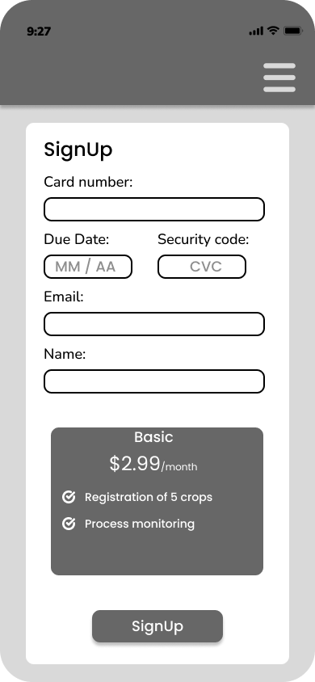
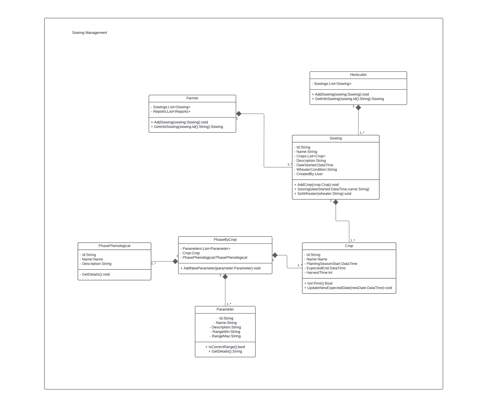
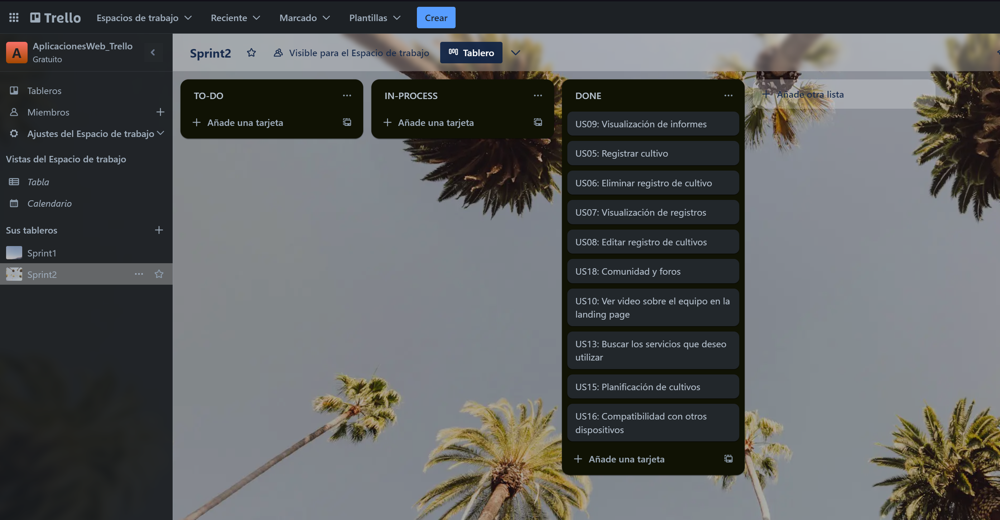
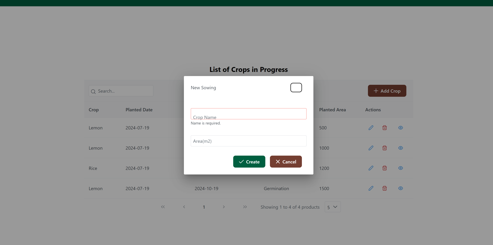
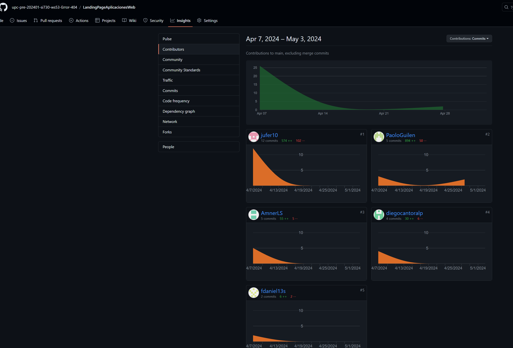
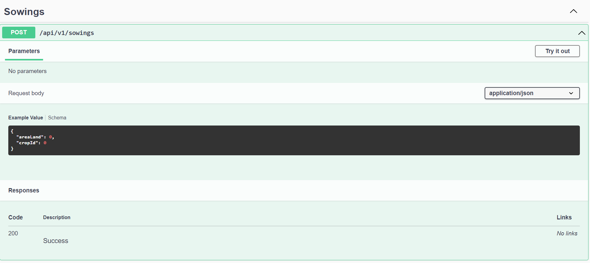
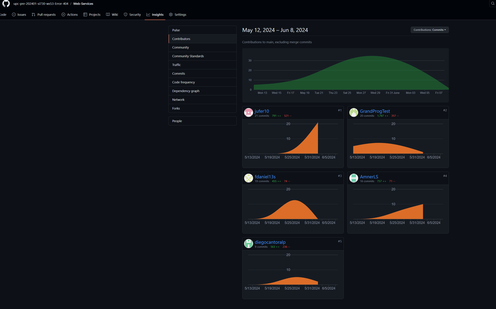
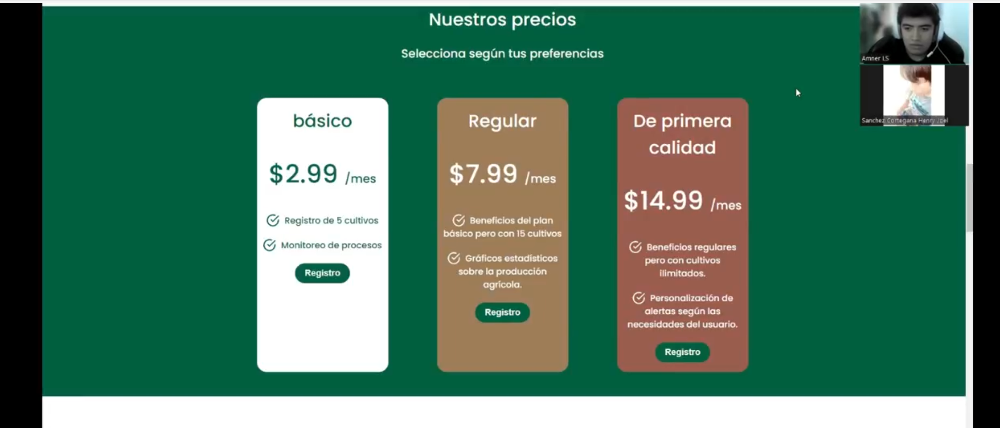
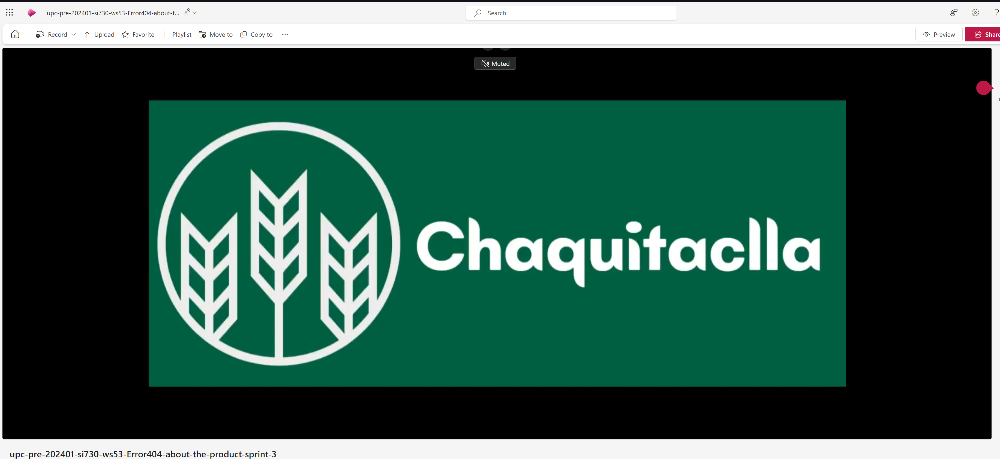

<h1 style="text-align: center;"> Informe del TF  </h1>
<h2 style="text-align: center;"> Universidad Peruana de Ciencias Aplicadas </h2>

<h4 style="text-align: center;"> Ingeniería de Software </h4>
<h4 style="text-align: center;"> Aplicaciones Web </h4>
<h4 style="text-align: center;"> Ciclo 2024-01 </h4>
<h4 style="text-align: center;"> Sección: WS53 </h4>
<h4 style="text-align: center;"> Docente: Angel Augusto Velasquez Nuñez </h4>
<h4 style="text-align: center;"> Startup:  Error 404 </h4>
<h4 style="text-align: center;"> Producto: Chaquitaclla  </h4>

## Team Members
|             Nombre              | Código de alumno |
|:-------------------------------:|:----------------:|
|    Guillen Luna, Paolo César    |    U202124343    |
| Quispe Condori, Fernando Daniel |    U20221C628    |
|   Llamo Sánchez, Amner Levi     |    U20221C376    |
|  Cantoral Paredes, Diego André  |    U20201F568    |
|  Carrasco Godos, Juan Fernando  |    U20211D118    |

## Registro de versiones del informe
|   Fecha    | Versión |      Autor      |                                 Descripción de modificación                                 |
|:----------:|:-------:|:---------------:|:-------------------------------------------------------------------------------------------:|
| 28/03/2024 | 1.0     |  Guillen Paolo  | Creación del documento de trabajo en formato markdown junto al realizamiento de la carátula |
| 31/03/2024 | 1.1     | Quispe Fernando |                            Formulacion Preguntas Entrevistas                                |
| 31/03/2024 | 1.2     | Diego Cantoral  |                             Desarrollo parcial del capítulo 1                               |
| 10/04/2024 | 1.3     | Guillen Paolo, Fernando Quispe, Diego Cantoral , Amner Llamo| Creación del figma para la creación de landing page y creación de los guidelines a seguir, análisis de las entrevistas realizadas y participación en la creación de la landing page en HTML| 
| 12/04/2024 | 1.4     |  Carrasco Juan  |                           Finalización del landing page en html                             |
| 12/04/2024 | 1.5     |  Llamo Amner  |                           Finalización de los wireframes y mock-ups de la aplicacion web      |
| 13/04/2024 | 1.6     | Diego Cantora, Paolo Guillen, Fernando Quispe, Juan Carrasco| Trabajar en los .feature para gherkin y planificación del siguiente sprint| 
|13/04/2024| 1.7| Carrasco Juan, Guillen Paolo, Fernando Quispe, Diego Cantoral , Amner Llamo| Revisión y Ajustes finales|
| 29/04/2024 | 1.8     |  Guillen Paolo  | Correciones de user stories, product backlogs, añadir unhappy paths a los user flow diagrams, asi como rehacer el impact mapping|
| 30/04/2024 | 1.9     |  Llamo Amner  | Correciones del diagrama C4      |
| 30/04/2024 | 2.0     | Diego Cantoral, Paolo Guillen, Fernando Quispe, Juan Carrasco| Trabajar en los .feature para gherkin y corregir los errores de las ramas desarrollados de la frontend-web-application| 
|03/05/2024| 2.1| Carrasco Juan, Guillen Paolo, Fernando Quispe, Diego Cantoral , Amner Llamo| Revisión y ajustes finales del README.md para la entrega del trabajo parcial|
|13/05/2024| 2.2| Paolo Guillen, Fernando Quispe, Juan Carrasco | Planificación de los bounded contexts según el diagrama de clases |
|15/05/2024| 2.3| Paolo Guillen, Fernando Quispe, Juan Carrasco | Designación de los bounded contexts a desarrollar en el backend del proyecto  |
|21/05/2024| 2.4| Diego Cantora, Paolo Guillen, Fernando Quispe, Juan Carrasco | Mejora del frontend para cumplir adecuadamente los User Goals|
|26/05/2024| 2.5| Amner Llamo | Desarrollo del bounded context relacionado con forum, y documentacion de este|
|29/05/2024| 2.6| Paolo Guillen, Fernando Quispe | Desarrollo del bounded context relacionado con crops, especialmente la seccion de sus productos y controles|
|01/06/2024| 2.7| Diego Cantoral, Paolo Guillen | Desarrollo del bounded context relacionado con crops, la seccion de los crops|
|04/06/2024| 2.8| Juan Carrasco | Desarrollo del bounded context relacionado con users, y documentacion|
|08/06/2024| 2.9|Carrasco Juan, Guillen Paolo, Fernando Quispe, Diego Cantoral , Amner Llamo| Revisiones finales y documentación del sprint numero 3|
|09/06/2024|3.0| Carrasco Juan, Guillen Paolo, Fernando Quispe, Diego Cantoral , Amner Llamo| Correccion de errores en la documentacion y añadir technical stories nuevas que se relacionan con el backend|

## Project Report Collaboration Insights

URL del repositorio del proyecto: [https://github.com/upc-pre-202401-si730-ws53-Error-404]

**TB1**

|                       Integrante                       |                                 Tareas Asignadas                                 |
|:------------------------------------------------------:|:--------------------------------------------------------------------------------:|
|               Guillen Luna, Paolo César                |                            Desarrollo de la carátula, participación en juntar los videos                            |
|            Quispe Condori, Fernando Daniel             | Elaboración Preguntas de Entrevitas - Artefactos Capítulo 2 - Diagrama de clases |
|            Cantoral Paredes, Diego André               |        Elaboración Antecedentes y problemáticas y descripción de startup         |
|            Carrasco Godos, Juan Fernando               |              Colaboración y Elaboración del Landing Page html y css              |
|              Llamo Sánchez, Amner Levi                 |          Elaboracion de los wireframes y mock-ups de la aplicacion web           |

***TB1 Github***

Al haber trabajado en github, este presenta cierta información relevante en lo que es la participación de los participantes, como la cantidad de commits realizados por cada uno, en que rama y el contenido añadido en estos. 
Todos los integrantes del grupo "Error 404" tomaron parte en la realización de estos commits, donde se adjuntan las siguiente captura. 


**TP**

|                       Integrante                       |                                 Tareas Asignadas                                 |
|:------------------------------------------------------:|:--------------------------------------------------------------------------------:|
|               Guillen Luna, Paolo César                |     Realizar el feature de visualizar informes/estadísticas de los cultivos en la frontend web application, así como el despliegue de esta                                    |
|            Quispe Condori, Fernando Daniel             |     Realizar el feature relacionado al BC del foro, implementar un crud de preguntas y respuestas adecuado  |
|            Cantoral Paredes, Diego André               |     Implementar el feature de crop-history para que el usuario vea cultivos previamente cultivados            |
|            Carrasco Godos, Juan Fernando               |     Realizar la visualización de información de cultivos cuando un usuario quiera buscar sobre un registro suyo con más precisión y más información|
|              Llamo Sánchez, Amner Levi                 |      Corregir el documento en secciones de diagrama C4, apoyo en el realizamiento de features como forum-management, statistics y registro de cultivos |

***TP Github***

Al haber trabajado en esta organización de github, este presenta cierta información relevante en lo que es la participación de los participantes, como la cantidad de commits realizados por cada uno, en que rama y el contenido añadido en estos. 
Todos los integrantes del grupo "Error 404" tomaron parte en la realización de estos commits, donde se adjuntan las siguiente captura, estos commits son repartidos de acuerdo a los repositorios que más se trabajaron, el de la documentación, Frontend-web-application y LandingPage. 


**TB2**

|                       Integrante                       |                                 Tareas Asignadas                                 |
|:------------------------------------------------------:|:--------------------------------------------------------------------------------:|
|               Guillen Luna, Paolo César                | Mejorar la landing page con los nuevos videos del producto y sobre el equipo, añadir endpoints en relacion a los controles del sowing en backend y desarrollo parcial del frontend, la seccion de perfil de usuario |
|            Quispe Condori, Fernando Daniel             | Desarrollo funcional del backend, la seccion de crear productos y relacionarlos en que sowing se uso, mejorar la interfaz grafica del frontend, la seccion del foro de preguntas|
|            Cantoral Paredes, Diego André               | Desarrollo del backend, dentro del endpoint de crops , que se registren los cultivos que van a estar disponibles para registrar de forma efectiva, asi como crud para las enfermedaes y pestes que estos puedan tener|
|            Carrasco Godos, Juan Fernando               | Desarrollo del frontend, la parte de login y registro, dentro del backend, participación en el desarrollo del bounded context de users con sus respectivos aggregates, entities y value objects|
|              Llamo Sánchez, Amner Levi                 | Desarrollo completo del backend de forum con sus endpoints funcionales, mejora del frontend con correcciones de bugs y realizar documentación de las evaluaciones segun heurísticas|

***TB2 Github***


**TF**

|                       Integrante                       |                                 Tareas Asignadas                                 |
|:------------------------------------------------------:|:--------------------------------------------------------------------------------:|
|               Guillen Luna, Paolo César                |Elaboración de la integración casi completa entre frontend y backend respecto al dominio de negocio|
|            Quispe Condori, Fernando Daniel             |Haber elaborado la relación de productos con sowings, así cmo su integración entre el backend y el frontend de esta|
|            Cantoral Paredes, Diego André               |Elaboré la forma en que los crops se relacionan con enfermedades y pestes en el negocio y como esto es integrado con el frontend|
|            Carrasco Godos, Juan Fernando               |Elaboré la sección de perfiles del trabajo final y su creación de estos desde el frontend|
|              Llamo Sánchez, Amner Levi                 |Elaboración completa de la sección del foro, y su integración garantizando un MVP (Minimum VIable Product) para esa sección del negocio|

***TF Github***


## Contenido 
1. [**Capítulo I: Introducción.**](#1.) <br>
1.1. [***Startup Profile***](#1.1.) <br>
1.1.1. [Descripción del startup](#1.1.1.)<br>
1.1.2.[Perfiles de los integrantes del equipo](#1.1.2.)<br>
1.2. [***Solution Profile***](#1.2.)<br>
1.2.1. [Antecedentes y Problemática](#1.2.1.)<br>
1.2.2. [Lean UX Process](#1.2.2.)<br>
1.2.3. [Lean UX Problem Statements](#1.2.3.)<br>
1.2.4. [Lean UX Assumptions](#1.2.4.)<br>
1.2.5. [Lean UX Hypothesis Statements](#1.2.5.)<br>
1.2.6. [Lean UX Canvas](#1.2.5.)<br>
1.3. [***Segmentos objetivo***](#1.2.6.)<br>
2. [**Capítulo II: Requirements Elicitation & Analysis**](#2.)<br>
2.1. [***Competidores***](#2.1.)<br>
2.1.1. [Análisis competitivo](#2.1.1.)<br>
2.1.2. [Estrategias y tácticas frente a competidores](#2.1.2.)<br>
2.2. [***Entrevistas***](#2.2.)<br>
2.2.1. [Diseño de entrevistas](#2.2.1.)<br>
2.2.2. [Registro de entrevistas](#2.2.2.)<br>
2.2.3. [Análisis de entrevistas](#2.2.3.)<br>
2.3. [***Needfinding***](#2.3.)<br>
2.3.1. [User Personas](#2.3.1.)<br>
2.3.2. [User Task Matrix](#2.3.2.)<br>
2.3.3. [User Journey Mapping](#2.3.3.)<br>
2.3.4. [Empathy Mapping](#2.3.4.)<br>
2.3.5. [As-is Scenario Mapping](#2.3.5.)<br>
2.4. [***Ubiquitous Language***](#2.4.)<br>
3. [**Capítulo III: Requirements Specification**](#3.)<br>
3.1. [***To-Be Scenario Mapping***](#3.1.)<br>
3.2. [***User Stories***](#3.2.)<br>
3.3. [***Impact Mapping***](#3.3.)<br>
3.4. [***Product Backlog***](#3.4.)<br>
4. [**Capítulo IV: Product Design.**](#4.)<br>
4.1. [***Style Guidelines***](#4.1.)<br>
4.1.1. [General Style Guidelines](#4.1.1.)<br>
4.1.2. [Web Style Guidelines](#4.1.2.)<br>
4.2. [***Information Architecture***](#4.2.)<br>
4.2.1. [Organization Systems](#4.2.1.)<br>
4.2.2. [Labeling Systems](#4.2.2.)<br>
4.2.3. [SEO Tags and Meta Tags](#4.2.3.)<br>
4.2.4. [Searching Systems](#4.2.4.)<br>
4.2.5. [Navigation Systems](#4.2.5.)<br>
4.3. [***Landing Page UI Design***](#4.3.)<br>
4.3.1. [Landing Page Wireframe](#4.3.1.)<br>
4.3.2. [Landing Page Mock-up](#4.3.2.)<br>
4.4. [***Web Applications UX/UI Design***](#4.4.)<br>
4.4.1. [Web Applications Wireframes](#4.4.1.)<br>
4.4.2. [Web Applications Wireflow Diagrams](#4.4.2.)<br>
4.4.3. [Web Applications Mock-ups](#4.4.3.)<br>
4.4.4. [Web Applications User Flow Diagrams](#4.4.4.)<br>
4.5. [***Web Applications Prototyping***](#4.5.)<br>
4.6. [***Domain-Driven Software Architecture***](#4.6.)<br>
4.6.1. [Software Architecture Context Diagram](#4.6.1.)<br>
4.6.2. [Software Architecture Container Diagrams](#4.6.2.)<br>
4.6.3. [Software Architecture Components Diagrams](#4.6.3.)<br>
4.7. [***Software Object-Oriented Design***](#4.7.)<br>
4.7.1. [Class Diagrams](#4.7.1.)<br>
4.7.2. [Class Dictionary](#4.7.2.)<br>
4.8. [***Database Design***](#4.8.)<br>
4.8.1. [Database Diagram](#4.8.1.)<br>
5. [**Capítulo V: Product Implementation, Validation & Deployment**](#5.)<br>
5.1. [Software Configuration Management](#5.1.)<br>
5.1.1. [Software Development Environment Configuration](#5.1.1.)<br>
5.1.2. [Source Code Management](#5.1.2.)<br>
5.1.3. [Source Code Style Guide & Conventions](#5.1.3.)<br>
5.1.4. [Software Deployment Configuration](#5.1.4.)<br>
5.2. [Landing Page, Services & Applications Implementation](#5.2.)<br>
5.2.1. [Sprint 1](#5.2.1.)<br>
5.2.1.1. [Sprint Planning 1](#5.2.1.1.)<br>
5.2.1.2. [Sprint Backlog 1](#5.2.1.2.)<br>
5.2.1.3. [Development Evidence for Sprint Review](#5.2.1.3.)<br>
5.2.1.4. [Testing Suite Evidence for Sprint Review](#5.2.1.4.)<br>
5.2.1.5. [Execution Evidence for Sprint Review](#5.2.1.5.)<br>
5.2.1.6. [Services Documentation Evidence for Sprint Review](#5.2.1.6.)<br>
5.2.1.7. [Software Deployment Evidence for Sprint Review](#5.2.1.7.)<br>
5.2.1.8. [Team Collaboration Insights during Sprint](#5.2.1.8.)<br>
5.2.2. [Sprint 2](#5.2.2.)<br>
5.2.2.1.[Sprint Planning 2](#5.2.2.1.)<br>
5.2.2.2.[Sprint Backlog 2](#5.2.2.2.)<br>
5.2.2.3.[Development Evidence for Sprint Review](#5.2.2.3.)<br>
5.2.2.4.[Testing Suite Evidence for Sprint Review](#5.2.2.4.)<br>
5.2.2.5.[Execution Evidence for Sprint Review](#5.2.2.5.)<br>
5.2.2.6.[Services Documentation Evidence for Sprint Review](#5.2.2.6.)<br>
5.2.2.7.[Software Deployment Evidence for Sprint Review](#5.2.2.7.)<br>
5.2.2.8.[Team Collaboration Insights during Sprint](#5.2.2.8.)<br>
5.2.3. [Sprint 3](#5.2.3.)<br>
5.2.3.1.[Sprint Planning 3](#5.2.3.1.)<br>
5.2.3.2.[Sprint Backlog 3](#5.2.3.2.)<br>
5.2.3.3.[Development Evidence for Sprint Review](#5.2.3.3.)<br>
5.2.3.4.[Testing Suite Evidence for Sprint Review](#5.2.3.4.)<br>
5.2.3.5.[Execution Evidence for Sprint Review](#5.2.3.5.)<br>
5.2.3.6.[Services Documentation Evidence for Sprint Review](#5.2.3.6.)<br>
5.2.3.7.[Software Deployment Evidence for Sprint Review](#5.2.3.7.)<br>
5.2.3.8.[Team Collaboration Insights during Sprint](#5.2.3.8.)<br>
5.2.4. [Sprint 4](#5.2.4.)<br>
5.2.4.1. [Sprint Planning 4](#5.2.4.1.)<br>
5.2.4.2. [Sprint Backlog 4](#5.2.4.2.)<br>
5.2.4.3. [Development Evidence for Sprint Review](#5.2.4.3.)<br>
5.2.4.4. [Testing Suite Evidence for Sprint Review](#5.2.4.4.)<br>
5.2.4.5. [Execution Evidence for Sprint Review](#5.2.4.5.)<br>
5.2.4.6. [Services Documentation Evidence for Sprint Review](#5.2.4.6.)<br>
5.2.4.7. [Software Deployment Evidence for Sprint Review](#5.2.4.7.)<br>
5.2.4.8. [Team Collaboration Insights during Sprint](#5.2.4.8.)<br>
5.3. [Validation Interviews](#5.3.)<br>
5.3.1.[Diseño de Entrevistas](#5.3.1.)<br>
5.3.2.[Registro de Entrevistas](#5.3.2.)<br>
5.3.3.[Evaluaciones según Heurísticas](#5.3.3.)<br>
5.4. [Video About-the-Product](#5.4.)<br>
6. [**Conclusiones**](#6.)<br>
7. [**Bibliografía**](#7.)<br>
8. [**Anexos**](#8.)<br>


## Student Outcomes
El curso contribuye al cumplimiento del Student Outcome ABET:
<b>ABET – EAC - Student Outcome 5</b>

**Criterio:** La capacidad de funcionar efectivamente en un equipo cuyos miembros
juntos proporcionan liderazgo, crean un entorno de colaboración e inclusivo,
establecen objetivos, planifican tareas y cumplen objetivos.
En el siguiente cuadro se describe las acciones realizadas y enunciados de
conclusiones por parte del grupo, que permiten sustentar el haber alcanzado el logro
del ABET – EAC - Student Outcome 5.


| Criterio especifico                                                                                                                                  |                                                                                            Acciones realizadas                                                                                            | Conclusiones                                                                                                                                                                                                                                                  |
|------------------------------------------------------------------------------------------------------------------------------------------------------|:---------------------------------------------------------------------------------------------------------------------------------------------------------------------------------------------------------:|---------------------------------------------------------------------------------------------------------------------------------------------------------------------------------------------------------------------------------------------------------------|
| Participa en equipos multidisciplinarios con eficacia, eficiencia y objetividad, en el marco de un proyecto en soluciones de ingeniería de software. |<p> **Guillen Luna, Paolo César:** <br> **TB1:** <br> **TP:** <br> **TB2:**  <br> **TF:**  </p><p> **Quispe Condori, Fernando Daniel:** <br> **TB1:** <br> **TP:** <br> **TB2:**<BR>  **TF:**  </p><p> **Quispe Condori, Fernando Daniel:** <br> **TB1:** <br> **TP:** <br> **TB2:** <br> **TF:**  </p><p> **Cantoral Paredes, Diego André:** <br> **TB1: Para esta entrega tuve que realizar la implementacion de registros de crops en el front end para la implementacion de las logicas que se plantearon. Ademas de eso, complete la mayoria de la documentacion correspondiente a la descripcion y alcance de la aplicacion.** <br> **TP: Para esta entrega realice la implementacion del registro de productos que se planteo en la idea de la aplicacion, con la condicion que tenga un manejo claro y logica adecuada** <br> **TB2:Para esta entrega realice la configuracion de endpoins del back end relacionados con la logica del bounded context de crops, ya que incluye tres (3) distintas tablas que deben tener una relacion logica ** <br> **TF: Para esta entrega realice la conexion entre el bounded context desarrollado en el TB2 y el frontend desarrollado al principio del trabajo. Dicha union tiene una logica consistente y acorde a las funciones que se plantean mostrar en la aplicacion**  </p><p> **Carrasco Godos, Juan Fernando:** <br> **TB1:** <br> **TP:** <br> **TB2:** <br> **TF:**  </p><p> **Llamo Sánchez, Amner Levi:** <br> **TB1:** <br> **TP:** <br> **TB2:** <br> **TF:**  </p>| TB1: Cómo equipo en esta entrega hemos participado en nuestro proyecto de manera eficiente, tal es el caso se puede demostrar una colaboración en nuestra organización de Github donde documentamos todos nuestros avances referentes a esta primera entrega. TP: Para esta entrega de trabajo de parcial, todos los integrantes se apoyaron mutuamente, teniendo como mínimo una participación sin importar el componente en el que hayan trabajdo, todo esto con el fin de presentar un trabajo bien realizado, siguiendo y utilizando lo que es Vue.js, finalmente para el despliegue de proyecto, si bien un miembro fue quien lo hizo, todo el grupo en conjunto participó para la correcta presentación de este. TB2: Como equipo en esta entrega hemos participado en nuestro proyecto eficientemente al implementar los bounded countexts correspondientes a nuestra lógica del proyecto, además de mejorar el aspecto frontend del mismo. Esto se ve identificado en como, con ayuda del control de versiones de github, cada miembro realizo sus partes respectivas |
| Conoce al menos un sector empresarial o dominio de aplicación de soluciones de software.                                                             | <p> **Guillen Luna, Paolo César:** <br> **TB1:** <br> **TP:** <br> **TB2:**  <br> **TF:** </p><p> **Quispe Condori, Fernando Daniel:** <br> **TB1:** <br> **TP:** <br> **TB2:**<BR>  **TF:**  </p><p> **Quispe Condori, Fernando Daniel:** <br> **TB1:** <br> **TP:** <br> **TB2:** <br> **TF:**  </p><p> **Cantoral Paredes, Diego André:** <br> **TB1: Para esta entrega se realizo la documentacion del proyecto relacionado con la investigacion y analisis de compatibilidad con los requisitos del trabajo de desarrollo del curso** <br> **TP: Para esta entrega se realizo la implementacion de registro de crops, el cual necesito la investigacion adecuada de modelos similares de paginas para que cumplan con las caracteristicas establecidas por distintos foros relacionados** <br> **TB2:Para esta entrega se realizo el back end relacionado con el bounded context de crops, el cual requirio una investigacion adecuada sobre las 'pestes'y 'enfermedades' que se presentan en las tierras cosechadas para que la logica implementada sea acorde a lo que pasa en la realidad** <br> **TF:**  </p><p> **Carrasco Godos, Juan Fernando:** <br> **TB1:** <br> **TP:** <br> **TB2:** <br> **TF:**  </p><p> **Llamo Sánchez, Amner Levi:** <br> **TB1:** <br> **TP:** <br> **TB2:** <br> **TF:**  </p>| TB1: Cómo equipo conocemos claramente nuestros segmentos empresariales por una red de contactos, lo que nos permite empaparnos de los conocimientos de dichos sectores. Para obtener los requisitos para nuestro producto de Software. TP: Como conclusión de esta entrega de trabajo parcial, todos los integrantes formaron parte en lo que es aprender más del sector de agricultura, sector el cual nos enfocamos, todo esto para brindar una aplicación web de acorde a las necesidades de nuestros usuario, por lo tanto nuestro entendimiento de este sector a mejorado según lo mencionado en la entrega. TB2: Como conclusión de esta entrega, el equipo se encargó de realizar las funciones de backend asociadas a las necesidades de los usuarios del sector de la agricultura. Y mejorar nuestro producto con la retroalimentación recibida por parte de ambos segmentos objetivos para ver que es lo que más se necesita mejorar para una futura entrega.|


<div id='1.'><h2>Capítulo I: Introducción</h2></div>
<div id='1.1.'><h3> 1.1 Startup Profile</h3></div>
En esta sección se presenta la descripción del startup y los perfiles de los miembros del equipo.

<div id='1.1.1.'><h4> 1.1.1. Descripción del startup</h4></div>
Nuestra startup, Error 404 , tiene como misión ofrecer una solución integral de gestión agrícola. A diferencia de otras plataformas que se enfocan exclusivamente en el sector empresarial, nosotros también tenemos un fuerte enfoque en el público en general. Queremos ser la opción para todos: desde aquellos que se aventuran por primera vez en la agricultura hasta los más experimentados.

Para lograrlo, hemos desarrollado una plataforma que organiza y simplifica la gestión de cultivos para nuestros usuarios. Cada cultivo se sigue a lo largo de su ciclo fenológico, y además, mantenemos registros históricos para determinar las temporadas óptimas de siembra y cosecha de diferentes insumos. Esto permite una trazabilidad efectiva y ayuda a nuestros usuarios a alcanzar sus metas a largo plazo.

En resumen, nuestra misión es brindar una nueva opción en el mundo agrícola, democratizando el acceso a herramientas eficientes y fomentando el éxito de todos los involucrados.

**Misión:** Ofrecer una solución integral de gestión agrícola que trascienda los límites tradicionales y que se encuentre disponible para todo el público.

**Visión:** ChaquiTaclla se direcciona a ser la plataforma mayormente reconocida en lo que respecta a la gestión agrícola en los próximos años por su accesibilidad y facilidad de uso. 
Mientras que como startup, Error 404, busca ser reconocido como un equipo autosustentable y capaz de brindar soluciones innovadoras en el campo de la agricultura moderna.

##### Logotipo de la Startup:

  

##### Logotipo del producto


<div id='1.1.2.'><h4> 1.1.2. Perfiles de los integrantes del equipo</h4></div>

|                                                                                                                                                                                                          Descripción de los perfiles de los integrantes del equipo                                                                                                                                                                                                           |                                                              Foto del integrante                                                              |
|:----------------------------------------------------------------------------------------------------------------------------------------------------------------------------------------------------------------------------------------------------------------------------------------------------------------------------------------------------------------------------------------------------------------------------------------------------------------------------:|:---------------------------------------------------------------------------------------------------------------------------------------------:|
| Mi nombre es **Paolo César Guillen Luna**, estudiante de la carrera de Ingeniería de Software, en la UPC y fanático de los videojuegos. Me considero alguien creativo y con determinación en alcanzar sus metas, dentro del campo del desarrollo de software, me gustaría especializarme en lo que es el testing de este, razón por la cual aparte de seguir la malla curricular de mi carrera también ando aprendiendo herramientas diversas como Playwright, Cypress, etc. |      |
| Mi nombre es Diego André Cantoral Paredes y soy estudiante de la carrera de Ingeniería de Software. Desde siempre me interesaron los temas tecnológicos y sobre todo las computadoras, por lo que desarrollé una afición a los videojuegos y luego a la programación. Me considero una persona responsable, creativa y siempre dispuesto a ayudar a mis compañeros.|      |
|Mi nombre es Fernando Quispe, soy una persona proactiva que puede aportar y liderar la colaboración en equipo con el objetivo de un logro común. Me gusta el desarrollo de software y poder contribuir a la sociedad con lo que me apasiona. Tengo como meta adquirir los conocimientos de una manera clara para poder aplicarlos en los distintos proyectos tal cuál como el proyecto actual. |  |
|Mi nombre es **Amner Levi Llamo Sánchez**, soy estudiante del quinto ciclo de ingeniería de software en la UPC. Me gusta jugar fútbol y videojuegos, por eso estoy constantemente investigando sobre nuevas tecnologías. Soy responsable con los trabajos que se me asignan; además soy tolerante y me adapto a las circunstancias del equipo.||
|Mi nombre es **Juan Fernando Carrasco Godos**, soy estudiante ingeniería de software en la UPC. Dentro de mis fortalezas principales se encuentran el entusiasmo por la lógica y el desarrollo de proyectos. Me encanta aprender y dominar nuevas técnicas que se presten a una mejor organización trabajo y dirección hacia la meta final. Considero que es de suma importancia tener un entendimiento general y profundo de todo proyecto. |  |

<div id='1.2.'><h3> 1.2. Solution Profile</h3></div>
<div id='1.2.1.'><h4> 1.2.1. Antecedentes y Problemática</h4></div>

##### What (Qué)
###### ¿Cuál es el problema?
El problema radica en la ausencia de alguna herramienta que permita gestionar, medir y seguir los cultivos para el público general; puesto que la mayoría de estas herramientas son software empresariales hechos a la medida. A pesar de la diversa información que pueda existir en internet sobre como gestionar adecuadamente un cultivo, buscar dicha información y que la fuente sea confiable es complicado, además que causa una pérdida del tiempo al usuario, puesto que debe indagar estos datos adecuadamente.

##### When (Cuando)
###### ¿Cuándo sucede el problema?
El reto se presenta cuando agricultores, tanto principiantes como profesionales, requieren una herramienta para gestionar sus cultivos de manera eficiente, teniendo en cuenta aspectos como el entorno, los procesos fenológicos de sus cultivos, los cambios climáticos y la temporada propicia para el cultivo. Lamentablemente, gran parte de las herramientas existentes en este campo están diseñadas para empresas y no están al alcance de todos. 

##### Where (Dónde)
###### ¿A dónde se dirige?
Nuestra solución esta dirigida a aquellos individuos ,que sin importar su experiencia en el sector agrícola, quieren incorporar una herramienta de gestión agrícola sencilla y moderna.

###### ¿Dónde surge el problema?
El problema surge durante el proceso de crecimiento de los cultivos, desde la germinación de la semilla hasta la cosecha, al haber una ausencia de gestión, el cultivo puede sufrir diversas consecuencias negativas.

##### Who (Quién)
###### ¿Quiénes están involucrados? ¿Quién lo utilizará?
Los involucrados serían los usuarios del sistema, los cuales se separarían en nuestros segmentos objetivos, profesionales del campo de agricultura y aquellos principiantes o que tienen un pequeño cultivo en su hogar. La solución la utilizará aquel que desee gestionar sus cultivos de una manera más eficaz, siguiendo sus procesos fenológicos y tener un fecha aproximada de cuando estaría listo para la cosecha; esto puedo ser utilizado tanto por profesionales como principiantes del sector agrícola.

##### Why (Por qué)
###### ¿Cuál es la causa del problema?
La principal dificultad de este problema radica en introducir una solución moderna en un campo que normalmente se maneja con herramientas más tradicionales. En el ámbito de la agricultura, aquellos que gestionan sus cultivos de manera personal, como los agricultores que viven en las provincias del Perú con sus “chacras” establecidas, están más familiarizados con las herramientas tradicionales. Implementar una solución moderna, como una aplicación web que reemplace estas herramientas por algo más sencillo, es complicado debido a la desconfianza que algunos todavía tienen hacia la tecnología.

Por otro lado, para nuestro segmento objetivo de principiantes en la agricultura, el desafío consiste en generar confianza en que nuestro producto es superior a las alternativas disponibles en el mercado.

#### 2H
##### How (Cómo)
###### ¿Cómo se utilizará el producto?

El producto será empleado para el registro de cultivos y seguimiento de sus procesos fenológicos. Desde la germinación de la semilla, hasta el momento de la cosecha de este, por esta razón nuestra aplicación estaría brindando consejos según el estado del cultivo para propiciar una cosecha próspera.

###### ¿Cómo se logrará una gestión adecuada de los cultivos dentro de la plataforma?

Los usuarios a partir de su acceso a nuestra aplicación mediante un navegador web, podrán empezar a registrar sus cultivos. Esto al ser un proceso manual, el usuario tendrá que categorizar el tipo de cultivo, en qué proceso fenológico se encuentra y descripción del área de donde se encuentra cultivado este. A partir de este registro manual, la aplicación brindará al usuario consejos y medidas que podría tomar con el fin de mejorar la calidad de este.

##### How much (Cuánto)
###### ¿Cuál es la magnitud del problema?

Según el Ministerio de Agricultura y Desarrollo Rural de Colombia (2022), solo el 15% del sector agro usa tecnología de última generación, este porcentaje presentó resultados positivos en lo que respecta a la mejora de la calidad de sus productos, a comparación del 85% restante. Además que según UNCTAD(Organización de las Naciones Unidas para la Agricultura y la Alimentación), los agricultores familiares al ser comunes en países en desarrollo, estos en su mayoría son pobres, sin embargos entre estos agricultores, aquellos que tuvieron la oportunidad de implementar herramientas digitales para el monitoreo de sus cultivos, se vio una mejora en la calidad de estos.


###### ¿Qué porcentaje de la industria agrícola se vería beneficiada por nuestro producto?

Si consideramos lo mencionado en el punto anterior y suponemos que nuestro producto tiene éxito, podríamos beneficiar al 80% de los agricultores, tanto principiantes como profesionales. Además que según datos proporcionados por un artículo publicado en Science en el año 2020, aquellos agricultores que recibieron asesoramiento para adoptar herramientas digitales lograron cambiar y mejorar sus prácticas lo que supone una mejora en la calidad de los productos que brindan.


<div id='1.2.2.'><h4> 1.2.2. Lean UX Process</h4></div>
<div id='1.2.2.1.'><h5> 1.2.2.1. Lean UX Problem Statements</h5></div>

##### **Problem Statement:** 

Chaquitaclla, nuestra herramienta de gestión agrícola, fue diseñada para ofrecer a los agricultores, tanto novatos como expertos, una solución para organizar y controlar sus cultivos de manera eficiente y sencilla. El objetivo original era simplificar la gestión diaria del campo y proporcionar información precisa para la toma de decisiones.

Sin embargo, con el tiempo, se ha vuelto evidente que el registro manual de datos sobre los cultivos, a través de métodos como el papel y las hojas de cálculo, genera errores y omisiones que afectan la calidad y la precisión de la información. Por ejemplo, los agricultores pueden no tener una visión clara de las etapas fenológicas de sus cultivos o del momento óptimo para determinadas prácticas agrícolas.

La adopción de tecnología en la agricultura puede ser un desafío debido a la desconfianza o falta de experiencia tecnológica entre algunos agricultores. A pesar de esto, estudios muestran que aquellos que utilizan herramientas digitales para gestionar sus cultivos tienden a lograr mejores resultados, como mayores rendimientos y menor desperdicio de recursos. Por lo tanto, nuestro desafío es: ¿Cómo podemos automatizar la gestión de la información agrícola, superando las barreras de confianza y asegurando que los agricultores vean beneficios tangibles, como una mayor productividad y eficiencia?

Para abordar esta pregunta, necesitamos centrarnos en las siguientes directrices:

* Enfoque centrado en el cliente: La solución debe ser fácil de usar y entender para agricultores de todos los niveles de experiencia.
* Alcance claro: Nos centraremos en la gestión de información de los cultivos, excluyendo otras áreas como maquinaria o logística.
* Medidas de éxito: El éxito se medirá por la reducción de errores en el registro de datos, la adopción de la herramienta por parte de los agricultores, y el aumento en la productividad o calidad de los cultivos.
* Al plantear esta pregunta de manera abierta, podemos explorar diversas soluciones sin definir de antemano cómo deben ser. La clave es garantizar que cualquier solución propuesta aporte valor real a los agricultores y sea aceptada por ellos.


<div id='1.2.2.2.'><h5> 1.2.2.2. Lean UX Assumptions</h5></div>

##### **Business Assumptions:**
1. **Creemos que nuestros usuarios necesitan** una forma más eficiente de registrar y seguir los procesos de sus cultivos sin importar si es a nivel profesional o personal.
2. **Estas necesidades se pueden satisfacer con** el desarrollo de una plataforma web que les permita registrar los datos de sus cultivos de una manera segura y confiable, para hacerl seguimiento de los distintos procesos por el cual su cultivo pasa.
3. **Nuestros clientes iniciales serán** los agricultures que inician en este sector y los agricultores que buscan mejorar como gestionar sus cultivos con herramientas digitales.
4. **El valor más importante que quiere un cliente de nuestros servicios es** registrar los datos de sus cultivos y que estos estén seguros de que no se van a perder, además de poder visualizar sus registros a largo plazo.
5. **El cliente también va a obtener** gráficos estadísticos sobre cual ha sido lo que más ha a cultivado en alguna temporada del año y estadísticas de que es lo más cultivado en la temporada actual.
6. **Vamos a obtener la mayoría de los clientes mediante**  publicidad en foros de agricultura y participando en eventos relacionados a la agricultura. 
7. **Vamos a obtener ingresos mediante** un modelo de suscripción separado en tres niveles, siendo el más bajo un plan básico. 
8. **Nuestra competencia en el mercado serán** herramientas digitales que se dediquen a la gestión de productos agrícolas y que tengan una clientela fija.
9. **Vamos a tener ventaja frente a nuestra competencia debido a** nuestra accesibilidad, puesto que la mayoría de nuestra competencia solo provee sus productos a un sector empresarial.
10. **El mayor riesgo del producto es**  no captar suficiente atención en el sector agrícola debido a la desconfianza inherente hacia los nuevos productos en el mercado. Esta desconfianza se origina en la naturaleza conservadora del sector agrícola, que no suele adoptar cambios en su enfoque empresarial con facilidad.
11. **Lo resolveremos realizando** el desarrollo de una plataforma atractiva y de uso sencillo para el público en general. Además, realizaremos encuestas entre los interesados en nuestros productos para identificar qué aspectos específicos les resultan atractivos. Esta información nos permitirá implementar características específicas como herramientas de gestión para sus cultivos.

##### **User Assumptions:**
###### **¿Quién es el usuario?**   

El usuario de nuestro producto son agricultores tanto principiantes como profesionales que buscan registrar sus cultivos y hacerles un seguimiento de sus procesos fenológicos mediante el uso de herramientas digitales. En caso nuestro producto sea exitoso, este segmento se expandiría hasta las empresas agrícolas, las cuales para satisfacer sus necesidades tendríamos que implementar nuevas funciones.

###### **¿Qué problemas tiene nuestro producto? ¿Resolver?**

Nuestro desafío central radica en que todos los procesos de registro de cultivos deben realizarse de forma manual. Esto implica registrar detalles como la fecha, las acciones necesarias para el cuidado del cultivo y otros aspectos relevantes. Para abordar esta limitación, consideramos la implementación de soluciones basadas en el Internet de las Cosas (IoT). Estas soluciones podrían incluir rociadores automáticos específicos para cada cultivo y sensores que detecten el estado actual del proceso. Sin embargo, es importante destacar que solo podremos lograr esta automatización si nuestro producto tiene éxito desde sus primeras etapas de desarrollo.

###### **¿Qué características son importantes?**

Dentro de las características más relevantes de nuestros productos, destacan su accesibilidad. Esto es especialmente significativo, dado que, en la mayoría de los casos, las soluciones similares están dirigidas exclusivamente al ámbito empresarial. Además, nuestra plataforma se enfoca en el registro y monitoreo de las fases fenológicos de los cultivos. Estas etapas abarcan desde la germinación hasta el momento en que el cultivo está listo para la cosecha. Proporcionar un seguimiento detallado de estas fases permite a los agricultores tomar decisiones informadas sobre el manejo de sus cultivos, como la aplicación de fertilizantes, el riego adecuado y la prevención de enfermedades.

###### **¿Dónde encaja nuestro producto en su trabajo o vida?**

El producto encaja en la mejora de la gestión de cultivos, principalmente en qué cuidados se deben brindar según el proceso fenológico actual del cultivo, lo que radica en una mejora de la calidad y reducción de posibles gastos innecesarios.

###### **¿Cuándo y cómo es nuestro producto usado?**

Nuestro producto es utilizado por nuestros segmentos objetivos cuando existe la necesidad de tomar registros de cultivos nuevos y seguir su crecimiento de una forma adecuada, esto a partir de como nuestro producto le pide al usuario registrar el proceso actual del cultivo, estado y fase fonológica que se encuentre, todo esto con el fin de mejorar las posibilidades de obtener una mejor cosecha. 

###### **¿Cómo debe verse nuestro producto y cómo debe comportarse?**
El producto debe contar con una interfaz sencilla, dinámica e inclusiva. Debe ser de fácil uso con el fin de que aquellos nuevos utilizando una herramienta digital de este tipo, tengan la menor cantidad de incovenientes posibles. El comportamiento de nuestra aplicación debe ser dirigida en relación a guardar la integridad de los usuarios y evitar la pérdida de datos relevantes para ellos.


###### **Feature Assumptions:**


**Creemos que**  al incluir herramientas estadísticas y opciones de visualización de datos, proporcionaremos a los agricultores profesionales la capacidad de tomar decisiones informadas sobre qué cultivos plantar en cada temporada. Esto favorecerá la aceptación de la aplicación y su utilidad en la toma de decisiones agrícolas estratégicas.

**Creemos que** un foro de discusión permitirá a los usuarios compartir conocimientos, hacer preguntas y recibir respuestas de otros agricultores y jardineros incrementando una interacción y compartiendo más conocimientos.

**Creemos que** al proporcionar datos históricos de rendimiento y recomendaciones de cultivos por temporada, los agricultores podrán tomar decisiones más informadas sobre qué cultivar y cuándo, mejorando así la productividad y la calidad de sus cosechas.

**Creemos que** que brindar una herramienta para llevar un registro detallado de las plagas y enfermedades que afectan a los cultivos permitirá a los agricultores tomar medidas preventivas y correctivas de manera más eficiente.

<div id='1.2.2.3.'><h5> 1.2.2.3. Lean UX Hypothesis Statements.</h5></div>

* **Hypothesis Statement 01:**
    
    **Creemos** que los agricultores principiantes y profesionales necesitan una comunidad de apoyo para resolver dudas y compartir conocimientos sobre         prácticas agrícolas.
  
    **Sabremos** que hemos tenido éxito cuando observemos 300 usuarios nuevos se registran en el foro en los primeros dos meses, y al menos el 50% de ellos 
    participan activamente con al menos 5 interacciones cada uno.


* **Hypothesis Statement 02:**
    
    **Creemos** que los agricultores profesionales necesitan acceso a datos históricos sobre cultivos para tomar decisiones informadas sobre la     
    planificación de cultivos de temporada.

    **Sabremos** que hemos tenido éxito cuando observemos que el 60% de los usuarios que acceden a los datos históricos reportan haber ajustado sus 
    cultivos en base a nuestras recomendaciones y muestran un incremento en el rendimiento de los cultivos en la temporada actual.

  
* **Hypothesis Statement 03:**

    **Creemos** que los agricultores necesitan información detallada sobre plagas y enfermedades para mejorar la calidad de sus cultivos y reducir pérdidas.

    **Sabremos** que hemos tenido éxito cuando observemos que 400 usuarios visitan la sección de plagas y enfermedades en el primer mes y al menos el 50% 
    de ellos reportan una disminución en los problemas de cultivo y una mejora en la calidad de sus cosechas.


* **Hypothesis Statement 04:**
    
   **Creemos** que los agricultores necesitan una herramienta de registro digital que reduzca la pérdida de datos y ofrezca una forma más precisa y 
   accesible de gestionar la información de los cultivos.

   **Sabremos** que hemos tenido éxito cuando observemos que el 70% de los usuarios que anteriormente usaban métodos manuales reportan que la aplicación ha 
   eliminado la pérdida de datos y que prefieren usar la aplicación para la gestión de sus cultivos después de tres meses de uso.

  
<div id='1.2.2.4.'><h5> 1.2.2.4. Lean UX Canvas</h5></div>

El Lean UX Canvas es una herramienta que se utiliza en el campo del diseño centrado en el usuario (UX) y la metodología Lean para optimizar la creación y el desarrollo de productos. Su objetivo principal es proporcionar un marco estructurado para la colaboración entre equipos multidisciplinarios. A través de esta herramienta, los equipos pueden visualizar y analizar aspectos clave del diseño y la experiencia del usuario, lo que facilita la toma de decisiones informadas durante el proceso de desarrollo.

## ***Lean UX Canvas realizado en la aplicación web "Mural":*** 

Enlace para acceder al [Canvas](https://app.mural.co/t/aplicacionesweb8834/m/aplicacionesweb8834/1711846472456/3aafbeea2aa64e5c9fea104736a8e04377fc040d?sender=uab21ffc4c80101532b361326)

<div id='1.3.'><h3> 1.3. Segmento objetivo</h3></div>

En el ámbito de la agricultura y tecnología, es fundamental identificar segmentos objetivo precisos para abordar necesidades específicas. Nuestro producto se dirige a dos segmentos clave:

1. Agricultores Profesionales: Este segmento incluye a agricultores de países desarrollados y en desarrollo que se dedican a la agricultura como su actividad principal. Aunque la adopción de herramientas digitales es más alta en países desarrollados, hay una tendencia creciente entre los agricultores en países en desarrollo para usar tecnología para mejorar la productividad. Sin embargo, los agricultores en países en desarrollo pueden enfrentar barreras como acceso limitado a internet o falta de habilidades técnicas. A nivel global, este segmento busca soluciones que les permitan gestionar sus cultivos de manera eficiente, reducir pérdidas y aumentar la productividad.

2. Jardineros en casa o aficionados a la Agricultura: Este segmento está compuesto por personas que practican la agricultura como hobby o en pequeña escala. Aunque tienen un creciente interés en herramientas digitales para mejorar sus prácticas agrícolas, a menudo prefieren enfoques tradicionales y pueden ser reacios a adoptar nuevas tecnologías. Necesitan aplicaciones que sean fáciles de usar y que proporcionen información clara y accesible para respaldar sus actividades agrícolas.

<div id='1.3.1.'><h4> 1.3.1 Stakeholders</h4></div>

* **Stakelholder Internos:** Integrantes pertenecientes al equipo de desarrollo, además del equipo creador de la startup.
* **Stakelholder Externos:** Sector agrícola empresarial, vendedores de productos naturales y estudiantes de alguna relacionada con la agricultura.


[//]: #CAPITULO2
<div id='2.'><h2> Capítulo II: Requirements Elicitation & Analysis</h2></div>

<div id='2.1.'><h3> 2.1. Competidores</h3></div>
<div id='2.1.1.'><h4> 2.1.Análisis Competitivo</h4></div>

||Chaquitaclla  |AgroSmart |Cropin |DKALB |Agrobit |
|:-:|:-:|:-:|:-:|:-:|:-:|
|**Overview**|Plataforma digital que organiza la gestión en el área de producción en cultivos agrícolas.|Software agrícola de gestión como administración, producción, operación y finanzas en el ámbito agrícola.|SaaS que ofrece soluciones basadas en la digitalización del ecosistema agrícola.|Plataforma digital de Dekalb, esta plataforma brinda asesorías a los agricultores para optimizar los cultivos, especialmente de maíz.|Plataforma que ofrece soluciones tecnológicas para la gestión agrícola, desde monitoreo de cultivos hasta análisis de datos.|
|**Ventajas Competitivas**|Registro avanzado y monitoreo de las fases fenológicas de los cultivos.|Posee un monitoreo de datos en cada proceso del ámbito agrícola.|Soluciones en la nube, implementación de IA.|Antigüedad en el mercado y desarrollada por la empresa BAYER, además de enfoque exclusivo sobre productos con base de maíz.|Enfoque en tecnologías avanzadas y herramientas innovadoras para la gestión agrícola. Además, aplicación más simple y sencilla de entender que los competidores.|
|**Mercado Objetivo**|Desde agricultores amateurs hasta empresas internacionales.|Empresas agrícolas dedicadas al sector Silvoagropecuario y a gobiernos o entidades gubernamentales.|Empresas agrícolas, agroindustriales e instituciones financieras.|Agricultores especializados en la siembra de maíz.|Agricultores y empresas agrícolas de diversos tamaños y niveles de experiencia.|
|**Estrategias de Marketing**|Enfoque en nuevos clientes iniciando en el mundo de la agricultura.|Enfoque en sostenibilidad y eficiencia de recursos como principales puntos de venta.|Impacto en la productividad mediante soluciones variadas proporcionadas al cliente.|Personalización y adaptabilidad de soluciones a necesidades específicas del cliente.|Enfoque en la innovación tecnológica y la simplificación de procesos agrícolas.|
|**Productos & Servicios**|Software de gestión agrícola, asesoramiento económico.|Sensores de campo, análisis de datos climáticos, asesoramiento agronómico.|Software de gestión agrícola, análisis de datos, servicios de inteligencia de mercado.|Consultoría agrícola, software de gestión de recursos, análisis de rendimiento.|Plataforma tecnológica integral para la gestión agrícola, desde monitoreo de cultivos hasta análisis de datos en tiempo real.|
|**Precios & Costos**|Precio basado en suscripción.|Basado en suscripción.|Basado en el tamaño de la operación, suscripción mensual.|Precios personalizados a diferentes países.|Modelo de precios adaptable a las necesidades del cliente, desde suscripciones básicas hasta planes personalizados.|
|**Canales de distribución (WEB y/o Móvil)**|Plataforma web.|Plataforma web y aplicación móvil.|Plataforma web y aplicación móvil.|Aplicación móvil.|Plataforma web y aplicación móvil para una accesibilidad total desde cualquier dispositivo.|
|**Fortalezas**|Monitoreo de última generación para la gestión agrícola.|Abarca toda la cadena de cultivos agrícolas.|Análisis apoyados con herramientas como la IA.|Personalización de las soluciones en maíz.|Enfoque en la innovación tecnológica, atención al cliente y una aplicación más simple y sencilla de entender que los competidores.|
|**Debilidades**|Enfoque solo en el proceso de producción.|Enfocado en los agricultores amateurs, precio elevado.|Capacitación para sacar el máximo provecho de la plataforma.|Centralización en un solo tipo de producto.|Dependencia de la conectividad y la infraestructura tecnológica. *Enfocado únicamente en el sector empresarial agrónomo|
|**Oportunidades**|Captar a los agricultores amateurs que inician en el mundo de la agricultura.  * Brindar una herramienta digital simple de entender a agricultores profesionales cuyo conocimiento en tecnología sea básico.|Expansión de mercados emergentes con enfoque en la agricultura sostenible completa.|Auge actual de las tecnologías basadas en IA.|Crecimiento del comercio electrónico en los países de Latinoamérica.|Innovación continua y adaptación a las necesidades cambiantes del mercado agrícola.|
|**Amenazas**|Aparición de soluciones más completas, aplicaciones son herramientas más actualizadas.|Aparición de soluciones más elaboradas.|Aparición de diversas soluciones de IA.|Cambios en las tendencias de consumo de los clientes.|Competencia creciente en el sector de tecnología agrícola y cambios regulatorios en la industria.|

<div id='2.1.2.'><h4> 2.1.2. Estrategias y tácticas frente a competidores</h4></div>
  
A partir del análisis competitivo realizado se logró identificar las fortalezas, debilidades, oportunidades y amenazas destacadas en los competidores. Esta información adquirida es esencial para trazar estrategias y tácticas para diferenciarnos de nuestros competidore. A continuación se brindará tanto estrategias como tácticas para alcanzar esta meta:


**Fortalezas de nuestros competidores:**

- Amplia variedad de cultivos con los que trabajar y gestionar adecuadamente.
- Cálculos estables basados en herramientas estadísticas.
- Todos cuentan con un tiempo de más de dos años como mínimo en el mercado agrícola.

**Estrategias y tácticas para nuestras fortalezas:**

**Estrategias:**
- Desarrollar una plataforma que abarque una amplia gama de cultivos y procesos agrícolas.
- Implementar algoritmos avanzados y herramientas estadísticas para mejorar el análisis y la gestión de cultivos.
- Centrarse en la construcción de una marca sólida y establecer relaciones a largo plazo con los clientes.

**Tácticas:**
- Realizar investigaciones de mercado para identificar las necesidades específicas de los agricultores y adaptar nuestra plataforma en consecuencia.
- Ofrecer servicios de asesoramiento y soporte técnico para garantizar que los usuarios aprovechen al máximo nuestra plataforma.
- Utilizar estrategias de marketing dirigidas para llegar a diferentes segmentos de clientes y destacar nuestras fortalezas en cada uno.


**Debilidades de nuestros competidores:**

- Centralización de un solo producto.
- Poca personalización para registrar los cultivos.
- Localización restringida únicamente a una región en el mundo.
- Interfaz poco intuitiva.

**Estrategias y tácticas para nuestras debilidades:**

**Estrategias:**
- Diversificar nuestra oferta de productos para abarcar diferentes aspectos del ciclo agrícola.
- Mejorar la personalización y adaptabilidad de nuestra plataforma para satisfacer las necesidades específicas de cada usuario.
- Expandir nuestra presencia global mediante la localización y la traducción de la plataforma en varios idiomas.

**Tácticas:**
- Desarrollar nuevas funciones y módulos para nuestra plataforma que aborden las áreas de debilidad identificadas.
- Realizar pruebas de usabilidad y obtener comentarios de los usuarios para mejorar la interfaz y la experiencia del usuario.
- Establecer asociaciones y alianzas estratégicas con empresas locales en diferentes regiones para facilitar la entrada en nuevos mercados.


**Oportunidades de nuestros competidores:**

- Implementación o mejora de su interfaz visual de la aplicación.
- Expandir su visión de producto a mercados emergentes.
- Implementar nuevas tecnologías como la IA al proceso de gestión.

**Estrategias y tácticas para nuestras oportunidades:**

**Estrategias:**
- Enfocarse en la innovación continua y la mejora de la experiencia del usuario.
- Identificar y aprovechar oportunidades de crecimiento en mercados emergentes.
- Integrar tecnologías emergentes, como la inteligencia artificial, para mejorar la funcionalidad y la eficiencia de nuestra plataforma.

**Tácticas:**
- Realizar investigaciones de mercado en mercados emergentes para comprender las necesidades y preferencias de los agricultores locales.
- Establecer alianzas estratégicas con empresas de tecnología para acceder a nuevas tecnologías y recursos.
- Desarrollar e implementar nuevas características y funcionalidades basadas en tecnologías emergentes para diferenciarnos en el mercado y satisfacer las demandas de los usuarios.


**Amenazas de nuestros competidores:**

- Aparición de soluciones más elaboradas.
- Aparición de nuevas tecnologías y no conocer cómo implementarlas.
- Cambios en la tendencia de la agricultura.

**Estrategias y tácticas para nuestras amenazas:**

**Estrategias:**
- Mantenerse al día con las últimas tecnologías y tendencias del mercado.
- Enfocarse en la mejora continua y la innovación para diferenciarse de la competencia.

**Tácticas:**
- Capacitarse en las nuevas tecnologías relevantes para la agricultura y en su implementación efectiva.
- Realizar investigaciones de mercado y análisis de tendencias para anticipar y adaptarse a los cambios en la industria agrícola.
- Establecer alianzas estratégicas con empresas de tecnología y expertos en agricultura para aprovechar su conocimiento y experiencia.


 
  <div id='2.2.'><h3> 2.2. Entrevistas</h3></div>
  
  <div id='2.2.1.'><h4> 2.2.1. Diseño de entrevistas</h4></div>
  <p>En esta sección se procederá a detallar las preguntas para el método de recoleccion de
  requisitos que son las entrevistas. Para la formulación se siguieron buenas prácicas tales como 
  formulación de preguntas abiertas, así mismo obtenemos características demográficas con las entrevistas</p>  

  <h4>PREGUNTAS GENERALES</h4>
  <p>Bienvenido gracias por brindarnos esta entrevista (empieza con las preguntas generales) </p>
  
  * Nos gustaría saber su nombre, edad y ocupación
  * ¿Qué tan acostumbrado está con el uso de tecnología en su vida diaria?
  * Dentro de su vida diaria, ¿tiene incovenientes utilizando dichas herramientas digitales?
  * Alguna vez tuvo que enfrentarse con una situación donde usted no entendía para nada como servía una aplicación, de ser así, ¿cómo sobrellevo ese problema?

  <h4>SECTOR AGRICULTORES PROFESIONALES: </h4>
  
  <p>1. ¿Cuál es el proceso que sigue para llevar un registro de sus cultivos?</p>
  <p>2. ¿Utiliza alguna herramienta para llevar un registro de sus cultivos?</p>
  <p>3. ¿Cuáles son los datos que considera más relevante al momento de gestionar sus cultivos?</p>
  <p>4. ¿Qué dificultades ha encontrado al llevar un registro de sus cultivos?</p>
  <p>5. Dentro de estas dificultades, ¿hubo alguna vez que tuvo algún tipo de pérdidas, sea económicas o de tiempo? 
  <p>6. (Comentar la propuesta) ¿Qué mejoras le gustaría ver en una herramienta de gestión de cultivos?</p>
  <p>7. ¿Qué tan dispuesto estaría en adoptar una herramienta digital para la gestión de sus cultivos?</p>
  <p>8. Teniendo en cuenta que usted estaría dispuesto en adoptar una herramienta digital para la gestión de sus cultivos ¿Cuánto pagaría por esta?</p>
  <p>9. ¿Qué tan dispuesto estaría en pagar por una herramienta de gestión de cultivos?</p>
  <p>10. ¿Qué tan importante considera la trazabilidad de sus cultivos?</p>
  <p>11. ¿En qué medidas una herramienta de este tipo podría ser útil para sus necesidades como agriculor?</p>
  

  <h4>SECTOR JARDINEROS EN CASA</h4>

  <p>Bienvenido gracias por brindarnos esta entrevista (empieza con las preguntas al segmento) </p>
  <p>Bienvenido gracias por brindarnos esta entrevista, primaremente nos gustaría conocer
  su nombre completo, edad, dónde reside, estado civil y su ocupación. </p>
  <p>1. ¿Cuál es el proceso que sigue para llevar un registro de sus cultivos en su hogar?</p>
  <p>2. ¿Utiliza alguna herramienta para llevar un registro de sus cultivos?</p>
  <p>3. ¿Cuál es su principal motivación para cultivar para usted mismo en casa?</p>
  <p>3. ¿Cuáles son los datos que considera más relevante al momento de gestionar sus cultivos?</p>
  <p>4. ¿Qué dificultades ha encontrado al llevar un registro de sus cultivos?</p>
  <p>5. (Comentar la propuesta) ¿Qué mejoras le gustaría ver en una herramienta de gestión de cultivos?</p>
  <p>6. ¿Qué tan dispuesto estaría en adoptar una herramienta digital para la gestión de sus cultivos?</p>
  <p>7. ¿Qué tan importante considera la tecnología en la gestión de sus cultivos?</p>
  <p>8. ¿Qué tan dispuesto estaría en pagar por una herramienta de gestión de cultivos?</p>
  <p>9. ¿Qué tan importante considera la trazabilidad de sus cultivos?</p>
  <p>10. ¿Qué tan importante considera la gestión de los procesos fenológicos de sus cultivos?</p>


  <div id='2.2.2.'><h4> 2.2.2. Registro de entrevistas</h4></div>

  ***Entrevistas a agricultores profesionales***
  
|Nombre entrevistado|Clever Medina|
|-|-|
|Edad|42 años|
|Departamento|Zarumilla, Tumbes|
||Clever Medina, un agricultor de 42 años del distrito de Zarumilla, Tumbes, se especializa en los cultivos de cacao y limón. A pesar de dedicarse a la agricultura, también tiene conocimientos en mecatrónica, lo que demuestra su capacidad para adaptarse a la tecnología. Durante la entrevista, que se llevó a cabo mediante videollamada de WhatsApp, Clever explicó que cuando enfrenta problemas con sus cultivos, suele buscar soluciones en Google. Sin embargo, señaló que la información encontrada no siempre funciona en la práctica, lo que le causa pérdidas de tiempo y dinero. El entrevistado muestra ser de carácter alegre y sereno, mostró interés en la idea de un producto que ayude a gestionar y optimizar cultivos. Dijo que si una aplicación puede proporcionar recomendaciones confiables, le sería útil para mejorar la calidad de sus productos y también para ahorrar tiempo, permitiéndole enfocarse en otros aspectos de su negocio. Además se sabe que usa WhatsApp para comunicarse y hace uso de su celular para buscar información, lo que indica que está familiarizado con tecnologías modernas y sería receptivo a nuevas herramientas que faciliten su trabajo agrícola.|
|Duración entrevista: 00:00-16:03 |URL: [https://upcedupe-my.sharepoint.com/:v:/g/personal/u202124343_upc_edu_pe/EcrGfeuMWm5HvPQFkc32dcMBvwGlSwemAq_NGnT44LcnEQ?e=MyrpUg&nav=eyJyZWZlcnJhbEluZm8iOnsicmVmZXJyYWxBcHAiOiJTdHJlYW1XZWJBcHAiLCJyZWZlcnJhbFZpZXciOiJTaGFyZURpYWxvZy1MaW5rIiwicmVmZXJyYWxBcHBQbGF0Zm9ybSI6IldlYiIsInJlZmVycmFsTW9kZSI6InZpZXcifSwicGxheWJhY2tPcHRpb25zIjp7fX0%3D]|

|Nombre entrevistado|Paulino Guillen|
|-|-|
|Edad|79 años|
|Departamento|Callao, Lima|
||Paulino es un agricultor profesional jubilado que ahora vive en el distrito de Callao, Perú, aunque pasó gran parte de su vida en Ayacucho. A lo largo de su carrera, Paulino trabajó en agricultura sin utilizar registros manuales, ni siquiera en papel, debido al alto nivel de analfabetismo en su región natal. Durante la entrevista, Paulino habló sobre el uso de tecnología por parte de sus antiguos colegas en la agricultura. Mencionó que, si bien muchos de ellos adoptaron el uso de celulares, estos son modelos simples y utilizan internet solo para resolver dudas sobre sus cultivos. A pesar de no ser un experto en tecnología, Paulino sabe usar WhatsApp y Facebook, pero no suele explorar otras aplicaciones o herramientas digitales. Cuando se le habló sobre la propuesta de un producto para ayudar a los agricultores a gestionar sus cultivos, Paulino destacó que la clave para su éxito sería ofrecer un adecuado asesoramiento y soporte técnico para que los agricultores puedan utilizarlo correctamente. Comentó que este tipo de solución sería muy útil para los agricultores si se les enseñara a usarla de manera efectiva y se les ofreciera ayuda para superar cualquier dificultad técnica|
|Duración entrevista: 16:04-24:45  | URL[https://upcedupe-my.sharepoint.com/:v:/g/personal/u202124343_upc_edu_pe/EcrGfeuMWm5HvPQFkc32dcMBibAEYkjZttC6F5Bzjx7hwQ?e=dSkdrx&nav=eyJyZWZlcnJhbEluZm8iOnsicmVmZXJyYWxBcHAiOiJTdHJlYW1XZWJBcHAiLCJyZWZlcnJhbFZpZXciOiJTaGFyZURpYWxvZy1MaW5rIiwicmVmZXJyYWxBcHBQbGF0Zm9ybSI6IldlYiIsInJlZmVycmFsTW9kZSI6InZpZXcifSwicGxheWJhY2tPcHRpb25zIjp7InN0YXJ0VGltZUluU2Vjb25kcyI6OTY0LjgxfX0%3D]|

|Nombre entrevistado| Eloy Cantoral|
|-|-|
|Edad|65 años|
|Departamento|San Miguel, Lima|
||Eloy Cantoral es un agricultor altamente experimentado que ha trabajado en el cultivo de legumbres, frutas y verduras en Saisa, Ayacucho. Actualmente reside en el distrito de San Miguel, Perú. A lo largo de su carrera, Eloy ha observado una transformación significativa en la forma de hacer agricultura, especialmente con la llegada de la tecnología. El entrevistado comentó duranteque le motiva adoptar tecnología para gestionar sus cultivos por varias razones. La influencia de marcas conocidas en el mundo agrícola que ha observado en canales de televisión como TVPerú, lo ha llevado a apreciar la importancia de la tecnología en la optimización de la producción agrícola. Además, sigue las tendencias del sector a través de redes sociales como Facebook y utiliza WhatsApp para mantenerse en contacto con otros agricultores y expertos. Esto le permite conocer las últimas innovaciones y ver cómo otros agricultores están integrando la tecnología en sus procesos. Aunque Eloy está abierto a nuevas tecnologías, es una persona seria y racional, lo que significa que analiza cuidadosamente las herramientas antes de adoptarlas. Prefiere soluciones tecnológicas que sean prácticas y ofrezcan un valor tangible para su trabajo. Sabe que, en el mundo moderno, la agricultura requiere más que solo experiencia en el campo; también requiere datos precisos y gestión efectiva. Por eso, Eloy está dispuesto a usar aplicaciones y software que lo ayuden a mejorar la eficiencia y productividad de sus cultivos, siempre y cuando estén respaldados por información confiable y un enfoque racional.|
|Duración entrevista: 24:46-38:05  |URL: [https://upcedupe-my.sharepoint.com/:v:/g/personal/u202124343_upc_edu_pe/EcrGfeuMWm5HvPQFkc32dcMBibAEYkjZttC6F5Bzjx7hwQ?e=GB6Pa3&nav=eyJyZWZlcnJhbEluZm8iOnsicmVmZXJyYWxBcHAiOiJTdHJlYW1XZWJBcHAiLCJyZWZlcnJhbFZpZXciOiJTaGFyZURpYWxvZy1MaW5rIiwicmVmZXJyYWxBcHBQbGF0Zm9ybSI6IldlYiIsInJlZmVycmFsTW9kZSI6InZpZXcifSwicGxheWJhY2tPcHRpb25zIjp7InN0YXJ0VGltZUluU2Vjb25kcyI6MTQ4Ni44Mn19]|

 ***Entrevistas a jardineros en casa***

|Nombre entrevistado| Daniel Valverde|
|-|-|
|Edad| 20 años|
|Departamento|San Isidro, Lima|
||Daniel Valverde es un jardinero aficionado que tiene un pequeño huerto en el ático de su casa, donde cultiva una variedad de plantas y flores en su tiempo libre. No utiliza herramientas tecnológicas avanzadas ni equipos de jardinería sofisticados. Para mantener el control de sus cultivos, Daniel usa una libreta para llevar sus registros y simples macetas para plantar. Durante la entrevista, este expresó su interés en usar una aplicación que le permita mejorar la gestión de su pequeño huerto y le ayude a profesionalizar un poco más sus prácticas de jardinería. Aunque su enfoque es simple, está abierto a usar tecnología si esto significa mejorar la eficiencia y el crecimiento de sus plantas. Daniel tiene acceso a tecnología básica, como Facebook y WhatsApp, que usa para comunicarse con amigos y compartir consejos de jardinería. Su personalidad es relajada y amigable, lo que lo hace receptivo a nuevas ideas, pero también es pragmático y busca herramientas que realmente faciliten su trabajo. Por lo tanto, una aplicación que le ofrezca maneras simples y efectivas de gestionar sus cultivos sería bienvenida, siempre y cuando sea fácil de usar y se adapte a su estilo de jardinería|
|Duración entrevista: 38:06-44:57  | URL: [https://upcedupe-my.sharepoint.com/:v:/g/personal/u202124343_upc_edu_pe/EcrGfeuMWm5HvPQFkc32dcMBibAEYkjZttC6F5Bzjx7hwQ?e=nJoywF&nav=eyJyZWZlcnJhbEluZm8iOnsicmVmZXJyYWxBcHAiOiJTdHJlYW1XZWJBcHAiLCJyZWZlcnJhbFZpZXciOiJTaGFyZURpYWxvZy1MaW5rIiwicmVmZXJyYWxBcHBQbGF0Zm9ybSI6IldlYiIsInJlZmVycmFsTW9kZSI6InZpZXcifSwicGxheWJhY2tPcHRpb25zIjp7InN0YXJ0VGltZUluU2Vjb25kcyI6MjI4Ni43Nn19]|

|Nombre entrevistado|Noe Sánchez|
|-|-|
|Edad|24|
|Departamento|Lima, Lima|
||Noe es un joven limeño de 24 años apasionado por la agricultura urbana. Vive en Lima y cultiva en su hogar principalmente para disfrutar de alimentos frescos y saludables. Para él, la agricultura no solo es un pasatiempo, sino también una forma de vida sostenible. Le encanta todo el proceso, desde sembrar las semillas hasta cosechar las plantas que ha cuidado con esmero. Aunque Noe tiene un profundo interés en la agricultura, admite que a veces se enfrenta a desafíos debido a la falta de herramientas tecnológicas para gestionar sus cultivos. Esta carencia le ha llevado a sufrir olvidos o confusiones sobre los insumos que necesita cada planta. Para monitorear sus cultivos, confía en métodos tradicionales, como la inspección visual y la evaluación manual de la humedad del suelo. Sin embargo, comprende la importancia de la tecnología para gestionar la agricultura de manera más eficaz. Además se sabe que usa Facebook, Instagram, WhatsApp entre otras redes sociales, todo esto con el fin de mantenerse conectado con otros agricultores urbanos y aprender nuevas técnicas. Aunque es relativamente joven, prefiere métodos simples y efectivos para sus tareas cotidianas. Aun así, está abierto a invertir en herramientas digitales que puedan ayudarlo a organizar mejor su huerto urbano y a aumentar la productividad de sus cultivos. Noe busca soluciones que le permitan optimizar su tiempo y recursos sin perder el contacto personal y práctico que valora en la agricultura urbana.|
|Duración entrevista: 44:58-50:53  |URL:[https://upcedupe-my.sharepoint.com/:v:/g/personal/u202124343_upc_edu_pe/EcrGfeuMWm5HvPQFkc32dcMBibAEYkjZttC6F5Bzjx7hwQ?e=0ihsrE&nav=eyJyZWZlcnJhbEluZm8iOnsicmVmZXJyYWxBcHAiOiJTdHJlYW1XZWJBcHAiLCJyZWZlcnJhbFZpZXciOiJTaGFyZURpYWxvZy1MaW5rIiwicmVmZXJyYWxBcHBQbGF0Zm9ybSI6IldlYiIsInJlZmVycmFsTW9kZSI6InZpZXcifSwicGxheWJhY2tPcHRpb25zIjp7InN0YXJ0VGltZUluU2Vjb25kcyI6MjY5OC41MX19]|

|Nombre entrevistado|Eligsela Luna|
|-|-|
|Edad|48 años|
|Departamento|Callao, Lima|
||Eligsela es una contadora que vive en Lima y está muy familiarizada con la tecnología. En su tiempo libre, disfruta de la jardinería, y recientemente decidió ampliar su experiencia incursionando en nuevos cultivos, como fresas y zanahorias. Aunque tiene conocimientos básicos en jardinería, Eligsela no estaba segura de cómo cuidar estos nuevos cultivos, lo que llevó a que sus intentos iniciales fracasaran. Ella explicó que nunca sintió la necesidad de gestionar formalmente sus cultivos, ya que suele buscar soluciones en internet cuando se encuentra con problemas. Sin embargo, a menudo su ocupada agenda hace que se le olvide regar sus plantas, lo que afecta su crecimiento. Al mencionarle la propuesta de una aplicación para ayudar a gestionar sus cultivos, la entrevistada mostró gran interés, pero dejó claro que solo la adoptaría si le garantizara resultados fructíferos. Eligsela estaría dispuesta a pagar por un servicio que le ayude a mantener sus cultivos en buen estado, y mencionó que podría pagar hasta 500 soles al año o 50 soles mensualmente. Esta disposición muestra su compromiso con la jardinería, siempre y cuando la herramienta propuesta le ofrezca la confiabilidad y el soporte necesarios para evitar errores y mejorar su productividad en el jardín.|
|Duración entrevista: 50:54-58:53 |URL:[https://upcedupe-my.sharepoint.com/:v:/g/personal/u202124343_upc_edu_pe/EcrGfeuMWm5HvPQFkc32dcMBibAEYkjZttC6F5Bzjx7hwQ?e=h1CWtd&nav=eyJyZWZlcnJhbEluZm8iOnsicmVmZXJyYWxBcHAiOiJTdHJlYW1XZWJBcHAiLCJyZWZlcnJhbFZpZXciOiJTaGFyZURpYWxvZy1MaW5rIiwicmVmZXJyYWxBcHBQbGF0Zm9ybSI6IldlYiIsInJlZmVycmFsTW9kZSI6InZpZXcifSwicGxheWJhY2tPcHRpb25zIjp7InN0YXJ0VGltZUluU2Vjb25kcyI6MzA1My43Mn19]|

<div id='2.2.3.'><h4> 2.2.3. Análisis de entrevistas</h4></div>

**Análisis del segmento de agricultores profesionales**

De todos los entrevistados de este segmento, vemos que el 100% ha tenido la agricultura como su ocupación principal. Mencionan que la agricultura ha cambiado mucho desde que empezaron, y el cambio más significativo es cómo la tecnología ha ayudado a optimizar ciertos procesos, permitiendo ahora ahorrar recursos. Cuando se les pregunta si han logrado trabajar con una herramienta digital, mencionan que normalmente este tipo de herramientas son las que suelen contar las empresas grandes y que no están al alcance de su bolsillo. El 66% de los entrevistados mencionan que, en caso de necesitar resolver dudas sobre algunos temas, no solo recurren a la experiencia obtenida a lo largo de los años, sino que usan navegadores como "Google" o redes sociales para solucionar sus consultas; sin embargo, también mencionan que a veces la información brindada resulta perjudicial y terminan perdiendo recursos económicos. Además, el 70% de los entrevistados mencionaron que tienen experiencia utilizando aplicaciones móviles y web. Finalmente, el 100% de los entrevistados mencionan que si existiera una aplicación de gestión enfocada en sus cultivos que contara con características como mayor accesibilidad, una interfaz intuitiva y que les brindara la confianza que buscan para la calidad de sus cultivos, estarían dispuestos a adoptar esta herramienta digital. Después de todo, en sus propias palabras, su objetivo principal como agricultores profesionales es sobresalir en el mercado con los mejores productos de calidad.

**Análisis del segmento de jardineros en casa**

De todos los entrevistados de este segmento, el 66% principalmente la hacen como hobby puesto que al tener un huerto pequeño no le tienen que dedicar tanto tiempo. Sin embargo el 33% restante menciona que el principal motivo de que empezó un huerto en su hogar es con el fin de obtener alimentos que sabe que son 100% frescos y saludables puesto que el lo ha cultivado. Del 100% de los entrevistados, el uso de herramientas digitales lo verían de buen uso siempre y cuando esta herramienta les asegure que su producto tendrá mejor calidad si sigue sus recomendaciones. El 66% de los entrevistados ha utilizado como mínimo una libreta digital para anotar los registros sus cultivos, sin embargo, mencionan que a veces se olvidaban de seguir estos registros lo que resultaba en un crecimiento inadecuado de sus cultivos. Asimismo, El 70% de los sabe utilizar aplicaciones web y movile.Finalmente, al ser aficionados estos desconocen a ciencia exacta que son los procesos fenológicos de un cultivo, esta información es valiosa, puesto que nos da a entender que nuestra aplicación web debe ser lo más sencilla y con un vocabulario simple.
  
  <div id='2.3.'><h3> 2.3. Needfinding</h3></div>
    <div id='2.3.1.'><h4> 2.3.1. User Personas</h4></div>
    <p>En esta sección se presentan las personas que se han identificado como usuarios de la aplicación. Teniendo en cuenta
    nuestros segmentos predefinidos, AGRICULTORES y JARDINEROS. A continuación se presentan los User Persona.</p>
 

   <p>IMAGEN USER PERSONA AGRICULTORES. En este artefacto para Agricultores, tenemos la representación de el segmento de AGRICULTORES.</p>  
    
   <p>IMAGEN USER PERSONA JARDINEROS. En este artefacto para Jardineros, tenemos la representación de el segmento de JARDINEROS.</p>  


<div id='2.3.2.'><h4> 2.3.2. User Task Matrix</h4>

En esta sección se presentan las tareas que realizan los usuarios, teniendo en cuenta los segmentos de AGRICULTORES y JARDINEROS. A continuación se presentan las tareas de los usuarios con el artefacto de User Task Matrix.
Teniendo la escala de importancia y frecuencia, se presentan las tareas de los usuarios. Definides en un rango de Bajo, Medio y Alto.


Esta matriz detalla las tareas que realizan los diferentes segmentos representados por las tareas de los User Persona, especificando la frecuencia e importancia de cada una, para entender cómo contribuyen estas a sus respectivos objetivos. Los segmentos considerados son **agricultores** y **jardineros**.

| Tareas                                                         | Agricultores Importancia | Agricultores Frecuencia | Jardineros Importancia | Jardineros Frecuencia |
|----------------------------------------------------------------|:------------------------:|:-----------------------:|:----------------------:|:---------------------:|
| Realizar el sembrío de un cultivo                              |           Alta           | Alta                    | Baja                   | Baja                  |
| Revisión de campo de cultivos                                  |           Alta           | Alta                    | Media                  | Media                 |
| Escuchar o indagar recomendaciones                             |           Alta           | Alta                    | Alta                   | Alta                  |
| Verificar cómo se encuentra su cultivo                         |           Alta           | Alta                    | Alta                   | Alta                  |
| Diariamente cuidar a sus cultivos                         |           Alta           | Alta                    | Alta                   | Alta                  |
| Revisión de calidad en la cosecha                              |           Alta           | Alta                    | Baja                   | Baja                  |
| Verificar el tallo del cutltivo para determinar una etapa aproximada del desarrollo del cultivo                   |           Alta           | Alta                    | Media                  | Media                 |
| Revisar el registro en papel de los cultivos |    Alta    |Alta    |Media    |Alta|

#### Explicación de la User Task Matrix
Las tareas con mayor frecuencia e importancia para ambos segmentos incluyen: 
- Realizar el sembrío de un cultivo
- Revisión de campo de cultivos
- Revisión de calidad en la cosecha
- Colocar cuidados necesarios al cultivo

Esto viene a ser importante puesto que, nos ayuda a determinar de que manera nos podríamos centrar
en las características de nuestro software. Las diferencias están en la revisión de campo de cultivos ya que, los
agricultores revisan más seguido que los jardineros. Esto se evidencia pues los jardineros según el user persona, se
dedican principalmente a otra actividad económica. 


</div>

<div id='2.3.3.'><h4> 2.3.3. User Journey Mapping</h4>
A continuación se presentan los viajes de los usuarios con el artefacto de User Journey Mapping.

**SEGMENTO AGRICULTORES:**
Aquí para el segmento de agricultores se presenta el viaje del usuario con la aplicación Chaquitaclla.


**SEGMENTO JARDINEROS:**
Aquí para el segmento de jardineros se presenta el viaje del usuario con la aplicación Chaquitaclla.


</div>

<div id='2.3.4.'><h4> 2.3.4. Empathy Mapping</h4>
En esta sección nosotros presentamos el artefacto de Empathy Mapping, donde se presentan las emociones, pensamientos y acciones de los usuarios.

**SEGMENTO AGRICULTORES:**
Aquí para el segmento de agricultores se presenta el Empathy Mapping.


**SEGMENTO JARDINEROS:**
Aquí para el segmento de jardineros se presenta el Empathy Mapping.


</div>

<div id='2.3.5.'><h4> 2.3.5. As-is Scenario Mapping</h4></div>

   <p>En esta sección se presentan los escenarios actuales de los usuarios, teniendo en cuenta los segmentos de AGRICULTORES y JARDINEROS. A continuación se presentan los escenarios actuales de los usuarios con el artefacto de As-is.</p>
    
  <p>La imagen nos muestra las fases que tiene nuestro agriculto antes de la solución, lo que hace, piensa y siente.</p>
  
  
  <p>La imagen nos muestra las fases que tiene nuestro jardinero antes de la solución, lo que hace, piensa y siente.</p>

  <div id='2.4.'><h3> 2.4. Ubiquituos Language</h3></div>

* **Hobby:** Este término hace referencia a una actividad recreativa o pasatiempo que una persona realiza por diversión o placer, sin una motivación necesaria de carácter profesional o económico.
* **Phenological Phase:** Eventos recurrentes en el ciclo de vida de las plantas y su interacción con el medio ambient que están estrechamente relacionados con factores climáticos y ambientales.
* **Crops Statistics (Estadísticas de cultivos):** Sección donde los usuarisos de nuestros segmentos objetivos podrán revisar estadísticas en relación a sus cultivos.
* **Crop Tracking (Seguimiento de Cultivos):** Se refiere al proceso de monitorear el crecimiento y desarrollo de los cultivos a lo largo del tiempo. Esto puede incluir registrar fechas de siembra, etapas fenológicas, condiciones del suelo, clima, tratamientos aplicados y cualquier otro dato relevante para evaluar el progreso de los cultivos.
* **Data Visualization (Visualización de Datos):** Se refiere a la representación gráfica de datos, como gráficos, diagramas y tablas, que facilita la comprensión y el análisis de la información. En el contexto agrícola, la visualización de datos puede ayudar a los agricultores a identificar tendencias, patrones y anomalías en sus cultivos.
* **Yield Optimization (Optimización de Rendimiento):** Término que describe el proceso de mejorar la producción agrícola para obtener el mayor rendimiento posible. Incluye la aplicación de mejores prácticas agrícolas, el uso de tecnología para gestionar los cultivos y la toma de decisiones estratégicas para maximizar la producción.
* **Forum (Foro):** Espacio dentro de una aplicación o plataforma digital donde los usuarios pueden interactuar, compartir experiencias, hacer preguntas y recibir respuestas de otros agricultores o expertos. Los foros fomentan el aprendizaje colaborativo y ayudan a crear una comunidad de usuarios con intereses comunes.
* **Crops Management (Gestión de Cultivos):** Se refiere a la planificación, organización y control de todas las actividades relacionadas con la producción agrícola. Incluye aspectos como selección de cultivos, programación de tareas, manejo de recursos, control de plagas, y toma de decisiones estratégicas para maximizar el rendimiento agrícola.
* **Sustainability in Agriculture (Sostenibilidad en la Agricultura):** Enfoque agrícola que busca equilibrar la producción de alimentos con la preservación del medio ambiente y la responsabilidad social. Este enfoque es lo que el equipo detrás de Chaquitaclla siempre tiene en mente al realizar sus productos y es algo que nuestros stakeholders entienden bien.

  
[//]: #CAPITULO3

<div id='3.'><h2>Capítulo 3: Requirements Specification</h2></div>
<div id='3.1.'><h3> 3.1. To-be scenario mapping</h3></div>
<p>Se presenta el escenario ideal con nuestra solución de nuestro ususarios incluyendo nuestros 2 segmentos. </p>

<p>La imagen muestra el escenario ideal de AGRICULTORES con los pasos y lo que hace, piensa y siente.</p>

<p>La imagen muestra el escenario ideal con los pasos de los JARDINEROS y lo que hace, piensa y siente.</p>


<div id='3.2.'><h3> 3.2. User Stories</h3></div>

| User Story ID | Título | Descripción | Criterios de aceptación | Epic ID |
|--------------|--------|-------------|------------------------|---------|
| US01 | Registro de usuario | Como visitante de la aplicación, Quiero poder registrarme como nuevo usuario Para acceder a las funciones exclusivas y personalizar mi experiencia en la plataforma. | **Escenario 1:** Registro exitoso <br> Dado que es un nuevo visitante de la plataforma <br> Cuando completa el formulario de registro con sus datos personales y selecciona un nombre de usuario y contraseña <br> Entonces recibe una confirmación de registro y puede acceder a las funciones exclusivas de la plataforma. **Escenario 2:** Registro fallido <br> Dado que es un nuevo visitante de la plataforma <br> Cuando intenta registrarse con un nombre de usuario ya existente o datos incompletos <br> Entonces recibe un mensaje de error indicando el problema y no se permite el registro hasta que se resuelva el error.| EPIC01: Gestión de Usuario |
| US02 | Inicio de sesión de usuario existente | Como usuario registrado en la aplicación, Quiero poder iniciar sesión en mi cuenta con mi nombre de usuario y contraseña Para acceder a mis datos y continuar con mis actividades de gestión de mis cultivos en la plataforma. | **Escenario 1:** Inicio de sesión exitoso <br> Dado que es un usuario registrado en la plataforma <br> Cuando ingresa su nombre de usuario y contraseña en el formulario de inicio de sesión <br> Entonces accede a su cuenta y puede comenzar a utilizar la plataforma con sus datos previos. **Escenario 2:** Inicio de sesión fallido <br> Dado que es un usuario registrado en la plataforma <br> Cuando intenta iniciar sesión con un nombre de usuario o contraseña incorrecta <br> Entonces recibe un mensaje de error indicando que las credenciales no son válidas y no puede acceder a la plataforma.| EPIC01: Gestión de Usuario |
| US03 | Contactar a Chaquitaclla | Como usuario que se encuentra en la landing page, Quiero poder contactar al equipo de Chaquitaclla mediante algún formulario de contacto. | **Escenario 1:** Contacto exitoso <br> Dado que es un usuario nuevo en la plataforma y se encuentra en la landing page <br> Cuando rellena el formulario de contacto y presiona "enviar" <br> Entonces aparece un mensaje indicando que se contactarán con él lo más pronto posible. **Escenario 2:** Contacto fallido <br> Dado que es un usuario nuevo en la plataforma y se encuentra en la landing page <br> Cuando rellena el formulario de contacto pero ocurre un error técnico al intentar enviarlo <br> Entonces aparece un mensaje indicando que el contacto falló y sugiriendo intentar nuevamente más tarde o usar un canal alternativo de contacto.| EPIC03: Interfaz y Experiencia de Usuario |
| US04 | Barra de navegación | Como visitante de la landing page, Quiero poder usar la barra de navegación de la landing page para desplazarme por esta. | **Escenario 1:** Navegación correcta <br> Dado que es un visitante de la landing page <br> Cuando presiona un botón en la barra de navegación <br> Entonces es redirigido a la sección correspondiente. **Escenario 2:** Navegación incorrecta <br> Dado que es un visitante de la landing page <br> Cuando presiona un botón en la barra de navegación <br> Entonces no es redirigido a la sección correspondiente, y ve un mensaje de error o experimenta un comportamiento inesperado, como enlaces rotos o redireccionamientos erróneos.| EPIC03: Interfaz y Experiencia de Usuario |
| US05 | Registrar cultivo | Como usuario de la aplicación, Quiero poder registrar nuevos cultivos Para llevar un seguimiento detallado de cada uno de ellos. | **Escenario 1:** Registro de cultivo satisfactoriamente <br> Dado que el usuario desea registrar una nueva siembra <br> Cuando ingresa los detalles del cultivo, incluyendo el tipo de cultivo, fecha, área sembrada y confirma su intención <br> Entonces el id y fecha de creación del cultivo se almacenan en la base de datos. <br> **Escenario 2:** Cancelación del registro de cultivo <br> Dado que el usuario intenta registrar un nuevo cultivo <br> Cuando cancela la operación antes de confirmarla <br> Entonces el sistema revierte la operación y cancela el registro. <br> **Escenario 3:** Sistema impide el registro de un nuevo cultivo debido a un error. <br> Dado que el usuario intenta registrar una nueva siembra <br> Cuando el sistema encuentra un error que impide el registro <br> Entonces el sistema cancela la operación e indica el error al usuario. | EPIC02: Interacción con el Huerto |
| US06 | Eliminar registro de cultivo | Como usuario de la aplicación, Quiero poder eliminar mis registros de cultivos Para mantener los registros relevantes. | **Escenario 1:** Usuario borra cultivo <br> Dado que el usuario desea eliminar un cultivo <br> Cuando confirma su intención de borrar los datos <br> Entonces el sistema elimina toda la información del cultivo de la base de datos. **Escenario 2:** Fallo al borrar cultivo <br> Dado que el usuario desea eliminar un registro de cultivo <br> Cuando intenta confirmar la eliminación <br> Entonces el sistema muestra un mensaje de error y el cultivo no se elimina, dejando la base de datos sin cambios. | EPIC02: Interacción con el Huerto |
| US07 | Visualización de Registros | Como usuario de la aplicación, Quiero poder visualizar mis registros de cultivos Para evaluar su evolución. | **Escenario 1:** Visualización de los registros de cultivos satisfactoriamente <br> Dado que el usuario desea evaluar la evolución de sus cultivos <br> Cuando accede a la sección de registros de cultivos <br> Entonces se muestra una lista de todos los cultivos previamente registrados. <br> **Escenario 2:** No existen registros de cultivos <br> Dado que el usuario accede a la sección de registros de cultivos <br> Cuando no tiene ningún cultivo registrado previamente <br> Entonces se muestra un mensaje indicando que no hay registros disponibles. <br> **Escenario 3:** Error al intentar visualizar sus registros de cultivos <br> Dado que el usuario intenta acceder a la sección de registros de cultivos <br> Cuando el sistema encuentra un error durante la recuperación o visualización <br> Entonces se muestra un mensaje de error y se proporciona una opción para intentar nuevamente o contactar al soporte técnico. | EPIC02: Interacción con el Huerto |
| US08 | Editar registro de cultivo | Como usuario de la aplicación, Quiero poder editar mis registros de cultivos Para corregir errores. | **Escenario 1:** Registro editado satisfactoriamente <br> Dado que el usuario desea editar un registro <br> Cuando realiza las modificaciones necesarias en los datos del registro <br> Entonces el sistema actualiza el registro con la información editada. <br> **Escenario 2:** Edición de registro cancelada <br> Dado que el usuario está editando un registro de cultivo <br> Cuando decide cancelar la operación de edición antes de guardar los cambios <br> Entonces se descartan los cambios y se mantiene la información original. <br> **Escenario 3:** Error al editar registro <br> Dado que el usuario desea editar un registro <br> Cuando realiza modificaciones pero el sistema encuentra un error <br> Entonces se indica que la información no pudo ser procesada y se muestra un mensaje de error. | EPIC02: Interacción con el Huerto |
| US09 | Visualización de informes | Como usuario de la aplicación, Quiero poder generar informes basados en los datos registrados y visualizarlos Para tomar decisiones fundamentadas. | **Escenario 1:** Acceder a informes <br> Dado que el usuario desea ver informes estadísticos <br> Cuando selecciona el informe deseado <br> Entonces el sistema muestra un informe estadístico detallado. **Escenario 2:** Fallo en la visualización de informes <br> Dado que el usuario desea ver informes estadísticos <br> Cuando selecciona el informe deseado <br> Entonces el sistema muestra un mensaje de error o no carga el informe, lo que le impide al usuario obtener la información necesaria.| EPIC02: Interacción con el Huerto |
| US10 | Ver video sobre el equipo en la landing page | Como visitante de la aplicación, quiero ver un video que explique quiénes son los miembros del equipo y qué hacen, para conocer más sobre la gente detrás del proyecto y entender su visión y valores.  | **Escenario 1: Video se carga correctamente** <br> Dado que el visitante está en la landing page<br> Cuando hace clic para ver el video sobre el equipo<br> Entonces el video se reproduce sin problemas y el visitante puede ver el contenido completo.<br><br> **Escenario 2: Fallo al cargar el video** <br> Dado que el visitante está en la landing page<br> Cuando intenta ver el video sobre el equipo<br> Entonces el video no se carga o muestra un error, impidiendo que el visitante vea el contenido. | EPIC03: Interfaz y Experiencia de Usuario |
| US11 | Ver perfil de usuario | Como usuario registrado en la aplicación, Quiero poder ver mi perfil Para acceder a información relevante sobre mi cuenta. | **Escenario 1:** Usuario accede a su perfil satisfactoriamente <br> Dado que el usuario desea ver la información de su perfil <br> Cuando ingresa a su perfil de usuario <br> Entonces se muestra la información relevante del usuario. **Escenario 2:** Fallo al acceder al perfil <br> Dado que el usuario desea ver su información de perfil <br> Cuando intenta acceder a su perfil <br> Entonces el sistema muestra un mensaje de error o la información no se carga, impidiendo al usuario visualizar sus datos. | EPIC01: Gestión de Usuario |
| US12 | Editar perfil de usuario | Como usuario registrado en la aplicación, Quiero poder editar mi perfil Para mantener actualizada mi información personal. | **Escenario 1:** Usuario edita su perfil satisfactoriamente <br> Dado que el usuario desea actualizar su información personal <br> Cuando realiza los cambios y confirma su intención <br> Entonces la información se guarda correctamente en la base de datos y se refleja en el perfil. **Escenario 2:** Fallo al editar el perfil <br> Dado que el usuario desea actualizar su información personal <br> Cuando intenta realizar cambios y confirmar la edición <br> Entonces el sistema muestra un mensaje de error o no guarda las modificaciones, dejando el perfil sin cambios.| EPIC01: Gestión de Usuario |
| US13 | Buscar los servicios que deseo utilizar | Como cliente, Quiero buscar los servicios que deseo utilizar colocando en el cuadro de texto de búsqueda el servicio Para acceder a las funciones de manera rápida. | **Escenario 1:** Cliente busca el servicio de gestión <br> Dado que el usuario desea utilizar el servicio de gestión <br> Cuando lo encuentra dentro de los servicios <br> Entonces lo selecciona y accede a la gestión de su huerto o la sección correspondiente. **Escenario 2:** Fallo al buscar servicios <br> Dado que el cliente desea buscar un servicio en el cuadro de búsqueda <br> Cuando ingresa el nombre del servicio y presiona "buscar" <br> Entonces el sistema muestra resultados incorrectos o no encuentra el servicio, dificultando que el usuario acceda a las funciones deseadas. | EPIC03: Interfaz y Experiencia de Usuario |
| US14 | Visualizar el cambio en el estado del producto a lo largo de su cuidado en el huerto de acuerdo con los datos recopilados del usuario | Como cliente, Quiero poder revisar el estado del producto elegido a lo largo del tiempo que inicie y finalice con el proyecto Para tomar decisiones fundamentadas. | **Escenario 1:** Cliente mira la variación de estado <br> Dado que el cliente desea ver la variación del estado de un producto <br> Cuando supervisa el progreso <br> Entonces puede ver la variación del estado en un cierto tiempo.  **Escenario 2:** Fallo al visualizar el cambio en el estado del producto <br> Dado que el cliente desea revisar el estado del producto <br> Cuando intenta visualizar la variación en el tiempo <br> Entonces el sistema muestra errores en la representación gráfica o no actualiza la información, impidiendo que el usuario pueda tomar decisiones fundamentadas.| EPIC02: Interacción con el Huerto |
| US15 | Planificación de cultivos | Como usuario, Quiero contar con herramientas que me ayuden con la rotación de los cultivos y disposición de plantas en el huerto Para mejorar la productividad de mis cultivos. | **Escenario 1:** Cliente organiza su huerto <br> Dado que el cliente quiere un gestor que le ayude a gestionar su huerto <br> Cuando tiene el cultivo(s) listos para su siembra <br> Entonces sube el cultivo en el gestor y accede a herramientas útiles. **Escenario 2:** Fallo en la planificación de cultivos <br> Dado que el cliente quiere usar el gestor para planificar su huerto <br> Cuando intenta subir información de cultivos al gestor <br> Entonces el sistema muestra un error o no permite la carga, impidiendo al usuario acceder a las herramientas de planificación y gestión del huerto.| EPIC02: Interacción con el Huerto |
| US16 | Compatibilidad con otros dispositivos | Como usuario, Quiero gestionar el huerto desde cualquier dispositivo Para realizarlo en cualquier lugar y cuando quiera. | **Escenario 1:** El usuario quiere actualizar su huerto desde su celular <br> Dado que el usuario desea utilizar la web desde su celular <br> Cuando está en otro lugar sin acceso a una laptop o computadora <br> Entonces puede acceder y actualizar los datos desde el navegador móvil. **Escenario 2:** Fallo en la compatibilidad con dispositivos móviles <br> Dado que el usuario intenta gestionar el huerto desde un dispositivo móvil <br> Cuando intenta acceder a la plataforma desde un celular o tableta <br> Entonces la aplicación no carga correctamente o muestra errores que impiden el uso, limitando la capacidad del usuario para gestionar su huerto.| EPIC06: Mejora continua de la aplicación |
| US17 | Navegación por la landing page | Como visitante, Quiero navegar por la landing page de Chaquitaclla,Para informarme mejor sobre el producto. | **Escenario 1:** Navegación por secciones principales <br> Dado que el visitante ingresa a la landing page de Chaquitaclla, <br> Cuando recorre la página, <br> Entonces puede ver y acceder a todas las secciones principales, como características del producto, precios y testimonios.  **Escenario 2:** Problemas de navegación en dispositivos móviles <br> Dado que el visitante accede a la landing page de Chaquitaclla desde un dispositivo móvil, <br> Cuando intenta abrir el menú de navegación, <br> Entonces el menú no se despliega correctamente, causando dificultad para acceder a las diferentes secciones, o la página no se ajusta bien a la pantalla del móvil, creando problemas de visibilidad y usabilidad.| EPIC03: Interfaz y Experiencia de Usuario |
| US18 | Comunidad y foros | Como usuario, Quiero tener una comunidad donde pueda compartir mis experiencias y ver las experiencias de otros usuarios Para ayudarme con mi cultivo. | **Escenario 1:** El usuario quiere recibir consejos <br> Dado que el usuario quiere más información <br> Cuando ingresa al foro <br> Entonces recopila información útil para su huerto. **Escenario 2:** Fallo en la comunidad y foros <br> Dado que el usuario desea obtener información de otros usuarios <br> Cuando intenta ingresar al foro <br> Entonces el foro no carga o no puede acceder a las publicaciones, impidiendo la interacción con la comunidad y el intercambio de experiencias. | EPIC04: Comunidad y soporte |
| US19 | Recuperación de contraseña olvidada | Como usuario que ha olvidado su contraseña, Quiero tener la opción de restablecer mi contraseña Para acceder nuevamente a mi cuenta sin perder datos ni configuraciones. | **Escenario 1:** Recuperación de contraseña exitosa <br> Dado que el usuario ha olvidado su contraseña <br> Cuando selecciona "¿Olvidaste tu contraseña?" e ingresa su correo electrónico <br> Entonces recibe un enlace para restablecer la contraseña y accede nuevamente a su cuenta. **Escenario 2:** Fallo en la recuperación de contraseña <br> Dado que el usuario ha olvidado su contraseña <br> Cuando selecciona "¿Olvidaste tu contraseña?" e ingresa su correo electrónico <br> Entonces el sistema no envía el enlace para restablecer la contraseña, impidiendo al usuario acceder a su cuenta. | EPIC07: Gestión de datos y seguridad |
| US20 | Ver beneficios de Chaquitaclla | Como visitante de la landing page, Quiero poder ver los beneficios del producto Chaquitaclla para realizar una decisión informada antes de comprar mi suscripción. | **Escenario 1:** Visualización exitosa de los beneficios <br> Dado que es un visitante nuevo en la plataforma y se encuentra en la landing page <br> Cuando llega a la sección de beneficios <br> Entonces puede informarse sobre el producto. <br> **Escenario 2:** Visualización fallida de los beneficios <br> Dado que es un usuario nuevo en la plataforma y se encuentra en la landing page <br> Cuando llega a la sección de beneficios y esta no se muestra correctamente <br> Entonces no puede informarse adecuadamente sobre el producto. | EPIC03: Interfaz y Experiencia de Usuario |
| US21 | Ver equipo de Chaquitaclla | Como visitante de la landing page, Quiero poder informarme sobre el equipo que trabajo para crear el producto Chaquitaclla para ver si tienen experiencia previas en productos similares y tener una idea de la calidad del producto | **Escenario 1:** Información del equipo visible <br> Dado que es un visitante nuevo en la plataforma y se encuentra en la landing page <br> Cuando llega a la sección de "About the Team" podrá ver la información de los integrantes del equipo de desarrollo de Chaquitaclla <br> Entonces puede averiguar si tienen experiencia en el desarrollo de productos de agricultura. <br> **Escenario 2:** Información del equipo no disponible <br> Dado que es un visitante nuevo en la plataforma y se encuentra en la landing page <br> Cuando llega a la sección de "About the Team", se encontrará que la sección no existe o esta corrupta <br> Entonces pensará que el producto es de mala calidad y que no inspira confianza puesto que no tiene información sobre el equipo de desarrollo. | EPIC03: Interfaz y Experiencia de Usuario |


**Technical Stories**

|Technical Story ID | Título | Descripción | Criterios de aceptación |
|-|-|:-:|:-:|
| TS01               | Get user    | **Como** desarrollador de la aplicación Chaquitaclla <br> **Quiero** obtener información de un usuario mediante la API RESTful <br> **Para** mostrar sus detalles cuando sea necesario| **Escenario 1: Usuario encontrado** <br> **Dado** que el endpoint "/api/v1/users/{id}" está disponible<br> **Cuando** envío una solicitud GET con el ID del usuario<br> **Entonces** recibo una respuesta con estado 200 y la información del usuario solicitado.<br><br> **Escenario 2: Usuario no encontrado** <br> **Dado** que el endpoint "/api/v1/users/{id}" está disponible<br> **Cuando** envío una solicitud GET con un ID que no existe<br> **Entonces** recibo una respuesta con estado 404 y un mensaje indicando que no se encontró el usuario.
| TS02               | Delete user     | **Como** desarrollador de la aplicación Chaquitaclla <br> **Quiero** eliminar un usuario mediante la API RESTful <br> **Para** mantener la base de datos actualizada y eliminar usuarios innecesarios        | **Escenario 1: Usuario eliminado exitosamente** <br> **Dado** que el endpoint "/api/v1/users/{id}" está disponible<br> **Cuando** envío una solicitud DELETE con el ID del usuario a eliminar<br> **Entonces** el usuario es eliminado de la base de datos y recibo una respuesta con estado 200 confirmando la eliminación.<br><br> **Escenario 2: Eliminación fallida** <br> **Dado** que el endpoint "/api/v1/users/{id}" está disponible<br> **Cuando** envío una solicitud DELETE con un ID inválido o inexistente<br> **Entonces** recibo una respuesta con estado 404 indicando que no se pudo encontrar al usuario. ||
| TS03               | Update User    | **Como** desarrollador de la aplicación Chaquitaclla <br> **Quiero** actualizar la información de un usuario mediante la API RESTful <br> **Para** mantener la información actualizada y precisa | **Escenario 1: Actualización exitosa** <br> **Dado** que el endpoint "/api/v1/users/{id}" está disponible<br> **Cuando** envío una solicitud PUT con información actualizada del usuario (nombre, correo, dirección, etc.)<br> **Entonces** la información se actualiza correctamente y recibo una respuesta con estado 200 y la información actualizada del usuario.<br><br> **Escenario 2: Actualización fallida** <br> **Dado** que el endpoint "/api/v1/users/{id}" está disponible<br> **Cuando** envío una solicitud PUT con datos inválidos o incompletos<br> **Entonces** recibo una respuesta con estado 400 y un mensaje indicando que no se pudo actualizar la información del usuario.
| TS04               | Post Crops      | **Como** desarrollador de la aplicación de Chaquitaclla <br> **Quiero** registrar un nuevo cultivo mediante una API <br> **Para** mantener el registro de los cultivos| **Escenario 1: Cultivo registrado** <br> **Dado** que el endpoint "/api/v1/crops" está disponible<br> **Cuando** envío una solicitud POST con datos válidos (nombre, tipo, ubicación)<br> **Entonces** el cultivo se registra con una respuesta de estado 201 y una confirmación de registro.<br><br> **Escenario 2: Cultivo no registrado** <br> **Dado** que el endpoint "/api/v1/crops" está disponible<br> **Cuando** envío una solicitud POST con datos inválidos o duplicados<br> **Entonces** el sistema responde con estado 400 y un mensaje de error explicando el motivo del fallo. ||
| TS05               | Get Crops       | **Como** desarrollador de la aplicación Chaquitaclla <br> **Quiero** obtener información sobre un cultivo mediante la API RESTful <br> **Para** mostrarlo en la aplicación cuando sea necesario | **Escenario 1: Cultivo encontrado** <br> **Dado** que el endpoint "/api/v1/crops/{id}" está disponible<br> **Cuando** envío una solicitud GET para obtener detalles de un cultivo registrado<br> **Entonces** recibo una respuesta con estado 200 y los datos del cultivo solicitado.<br><br> **Escenario 2: Cultivo no encontrado** <br> **Dado** que el endpoint "/api/v1/crops/{id}" está disponible<br> **Cuando** envío una solicitud GET con un ID inexistente<br> **Entonces** recibo una respuesta con estado 404 indicando que no se encontró el cultivo. ||
| TS06               | Delete crop      | **Como** desarrollador de la aplicación Chaquitaclla <br> **Quiero** eliminar un cultivo mediante la API RESTful <br> **Para** mantener la base de datos limpia y actualizada | **Escenario 1: Eliminación exitosa** <br> **Dado** que el endpoint "/api/v1/crops/{id}" está disponible<br> **Cuando** envío una solicitud DELETE con el ID del cultivo a eliminar<br> **Entonces** el cultivo se elimina de la base de datos y recibo una confirmación con estado 200.<br><br> **Escenario 2: Eliminación fallida** <br> **Dado** que el endpoint "/api/v1/crops/{id}" está disponible<br> **Cuando** envío una solicitud DELETE con un ID inexistente o inválido<br> **Entonces** recibo una respuesta con estado 404 indicando que no se pudo eliminar el cultivo. ||
| TS07               | Update Crop    | **Como** desarrollador de la aplicación Chaquitaclla <br> **Quiero** actualizar la información de un cultivo mediante la API RESTful <br> **Para** mantener la información actualizada y precisa |**Escenario 1: Actualización exitosa** <br> **Dado** que el endpoint "/api/v1/crops/{id}" está disponible<br> **Cuando** envío una solicitud PUT con información actualizada del cultivo<br> **Entonces** la información se actualiza correctamente y recibo una confirmación con estado 200.<br><br> **Escenario 2: Actualización fallida** <br> **Dado** que el endpoint "/api/v1/crops/{id}" está disponible<br> **Cuando** envío una solicitud PUT con datos inválidos o incompletos<br> **Entonces** recibo una respuesta con estado 400 y un mensaje de error que indica que la actualización falló.  ||
| TS08               |  Register Sowing  | **Como** desarrollador de la aplicación Chaquitaclla <br> **Quiero** registrar un nuevo lote de siembra mediante la API RESTful <br> **Para** llevar un registro del área sembrada y su progreso |**Escenario 1: Siembra registrada** <br> **Dado** que el endpoint "/api/v1/sowings" está disponible<br> **Cuando** envío una solicitud POST con datos válidos (tipo de cultivo, fecha de siembra, área en m2)<br> **Entonces** la siembra se registra correctamente y recibo una confirmación con estado 201.<br><br> **Escenario 2: Registro fallido** <br> **Dado** que el endpoint "/api/v1/sowings" está disponible<br> **Cuando** envío una solicitud POST con datos inválidos o duplicados<br> **Entonces** recibo una respuesta con estado 400 y un mensaje de error indicando la razón del fallo.||
| TS09               |  Get Sowing | **Como** desarrollador de la aplicación Chaquitaclla <br> **Quiero** obtener información de una siembra mediante la API RESTful <br> **Para** obtener detalles sobre el área sembrada y su progreso | **Escenario 1: Siembra encontrada** <br> **Dado** que el endpoint "/api/v1/sowings/{id}" está disponible<br> **Cuando** envío una solicitud GET para obtener detalles de una siembra registrada<br> **Entonces** recibo una respuesta con estado 200 y la información detallada de la siembra.<br><br> **Escenario 2: Siembra no encontrada** <br> **Dado** que el endpoint "/api/v1/sowings/{id}" está disponible<br> **Cuando** envío una solicitud GET con un ID inexistente<br> **Entonces** recibo una respuesta con estado 404 indicando que no se encontró la siembra. ||
| TS10               |   Update Sowing  |**Como** desarrollador de la aplicación Chaquitaclla <br> **Quiero** actualizar la información de una siembra mediante la API RESTful <br> **Para** mantener el registro actualizado y reflejar cambios en el área sembrada o el tipo de cultivo  |**Escenario 1: Actualización exitosa** <br> **Dado** que el endpoint "/api/v1/sowings/{id}" está disponible<br> **Cuando** envío una solicitud PUT con información actualizada de la siembra (como cambio de área, fechas de siembra, tipo de cultivo, etc.)<br> **Entonces** la siembra se actualiza correctamente y recibo una respuesta con estado 200 y la información actualizada.<br><br> **Escenario 2: Actualización fallida** <br> **Dado** que el endpoint "/api/v1/sowings/{id}" está disponible<br> **Cuando** envío una solicitud PUT con datos inválidos o incompletos<br> **Entonces** recibo una respuesta con estado 400 y un mensaje de error explicando por qué la actualización no fue exitosa.  ||
| TS11               | Get Cares | Como desarrollador de la aplicación Chaquitaclla <br> Quiero obtener información sobre los cuidados de una siembra mediante la API RESTful <br> Para mantener el registro actualizado y proporcionar datos relevantes sobre los cuidados requeridos para una siembra específica | **Escenario 1: Cuidado encontrado** <br> Dado que el endpoint "/api/v1/cares/{id}" está disponible <br> Cuando envío una solicitud GET con el identificador de la siembra <br> Entonces obtengo correctamente la información de los cuidados y recibo una respuesta con estado 200 y los datos correspondientes. <br><br> **Escenario 2: Cuidado no encontrado** <br> Dado que el endpoint "/api/v1/cares/{id}" está disponible <br> Cuando envío una solicitud GET con un identificador inválido o inexistente <br> Entonces recibo una respuesta con estado 404 y un mensaje de error explicando por qué no se pudo encontrar la información de los cuidados. ||
| TS12               | Get Pests | Como desarrollador de la aplicación Chaquitaclla <br> Quiero obtener información sobre las plagas que afectan una siembra mediante la API RESTful <br> Para mantener el registro actualizado y proporcionar datos relevantes sobre las plagas que pueden afectar a una siembra específica | **Escenario 1: Peste encontrada** <br> Dado que el endpoint "/api/v1/pests/{id}" está disponible <br> Cuando envío una solicitud GET con el identificador de la siembra <br> Entonces obtengo correctamente la información de las plagas y recibo una respuesta con estado 200 y los datos correspondientes. <br><br> **Escenario 2: Peste no encontrada** <br> Dado que el endpoint "/api/v1/pests/{id}" está disponible <br> Cuando envío una solicitud GET con un identificador inválido o inexistente <br> Entonces recibo una respuesta con estado 404 y un mensaje de error explicando por qué no se pudo encontrar la información de las plagas. ||
| TS13               | Get Diseases | Como desarrollador de la aplicación Chaquitaclla <br> Quiero obtener información sobre las enfermedades que afectan una siembra mediante la API RESTful <br> Para mantener el registro actualizado y proporcionar datos relevantes sobre las enfermedades que pueden afectar a una siembra específica | **Escenario 1: Enfermedad encontrada** <br> Dado que el endpoint "/api/v1/diseases/{id}" está disponible <br> Cuando envío una solicitud GET con el identificador de la siembra <br> Entonces obtengo correctamente la información de las enfermedades y recibo una respuesta con estado 200 y los datos correspondientes. <br><br> **Escenario 2: Enfermedad no encontrada** <br> Dado que el endpoint "/api/v1/diseases/{id}" está disponible <br> Cuando envío una solicitud GET con un identificador inválido o inexistente <br> Entonces recibo una respuesta con estado 404 y un mensaje de error explicando por qué no se pudo encontrar la información de las enfermedades. ||
| TS14               |Create Product |Como desarrollador de la aplicación Chaquitaclla <br> Quiero crear un nuevo producto mediante la API RESTful <br> Para mantener un registro actualizado y proporcionar datos relevantes sobre los productos disponibles |Escenario 1: Creación exitosa <br> Dado que el endpoint "/api/v1/products" está disponible <br> Cuando envío una solicitud POST con los datos válidos del producto <br> Entonces el producto se crea correctamente y recibo una respuesta con estado 201 y los datos del nuevo producto. <br><br> Escenario 2: Datos inválidos <br> Dado que el endpoint "/api/v1/products" está disponible <br> Cuando envío una solicitud POST con datos inválidos o incompletos del producto <br> Entonces recibo una respuesta con estado 400 y un mensaje de error explicando por qué no se pudo crear el producto. ||
| TS15               |Get Product | Como desarrollador de la aplicación Chaquitaclla <br> Quiero obtener información sobre un producto específico mediante la API RESTful <br> Para mantener un registro actualizado y proporcionar datos relevantes sobre los productos disponibles |Escenario 1: Producto encontrado <br> Dado que el endpoint "/api/v1/products/{id}" está disponible <br> Cuando envío una solicitud GET con el identificador del producto <br> Entonces obtengo correctamente la información del producto y recibo una respuesta con estado 200 y los datos correspondientes. <br><br> Escenario 2: Producto no encontrado <br> Dado que el endpoint "/api/v1/products/{id}" está disponible <br> Cuando envío una solicitud GET con un identificador inválido o inexistente <br> Entonces recibo una respuesta con estado 404 y un mensaje de error explicando por qué no se pudo encontrar la información del producto. ||
| TS16               |Update Product |Como desarrollador de la aplicación Chaquitaclla <br> Quiero actualizar la información de un producto existente mediante la API RESTful <br> Para mantener los datos actualizados y precisos sobre los productos disponibles |Escenario 1: Actualización exitosa <br> Dado que el endpoint "/api/v1/products/{id}" está disponible <br> Cuando envío una solicitud PUT con los datos válidos y actualizados del producto <br> Entonces el producto se actualiza correctamente y recibo una respuesta con estado 200 y los datos actualizados del producto. <br><br> Escenario 2: Datos inválidos <br> Dado que el endpoint "/api/v1/products/{id}" está disponible <br> Cuando envío una solicitud PUT con datos inválidos o incompletos del producto <br> Entonces recibo una respuesta con estado 400 y un mensaje de error explicando por qué no se pudo actualizar el producto. ||
| TS17               |Delete Product |Como desarrollador de la aplicación Chaquitaclla <br> Quiero eliminar un producto existente mediante la API RESTful <br> Para mantener el registro actualizado y eliminar productos que ya no están disponibles |Escenario 1: Eliminación exitosa <br> Dado que el endpoint "/api/v1/products/{id}" está disponible <br> Cuando envío una solicitud DELETE con el identificador del producto <br> Entonces el producto se elimina correctamente y recibo una respuesta con estado 200 y un mensaje confirmando la eliminación. <br><br> Escenario 2: Producto no encontrado <br> Dado que el endpoint "/api/v1/products/{id}" está disponible <br> Cuando envío una solicitud DELETE con un identificador inválido o inexistente <br> Entonces recibo una respuesta con estado 404 y un mensaje de error explicando por qué no se pudo eliminar el producto.||

<div id='3.3'><h3> 3.3. Impact Mapping. </h3></div>


<div id='3.4'><h3> 3.4. Product Backlog.</h3></div>

Para una correcta calificacion de los story points, optamos por seguir la escala de Fibonacci

| Orden  | User Story ID| Título|Descripción |Story Points|
| ------------- |:--------:| ------------- |:-------------:|:-------------:|
| 1      | US04    |Barra de navegación| Como visitante de la landing page. Quiero poder usar la barra de navegación de la landing page para desplazarme por esta.|1|
| 2      | US03    |Contactar a Chaquitaclla|Como usuario que se encuentra en la landing page, Quiero poder contactar al equipo de Chaquitaclla mediante correo algún formulario de contacto.|2|
| 3     | US20     | Ver beneficios de Chaquitaclla | Como visitante de la landing page, Quiero poder ver los beneficios del producto Chaquitaclla para realizar una decisión informada antes de comprar mi suscripción. |1|
| 4     | US21 |  Ver equipo de Chaquitaclla| Como visitante de la landing page, Quiero poder informarme sobre el equipo que trabajo para crear el producto Chaquitaclla para ver si tienen experiencia previas en productos similares y tener una idea de la calidad del producto.|2|
| 5     | US17       |Navegación por la landing page | Como visitante, Quiero navegar por la landing page de Chaquitaclla,Para informarme mejor sobre el producto. |2|
| 6     | US10    |Ver video sobre el equipo en la landing page|Como visitante de la aplicación, quiero ver un video que explique quiénes son los miembros del equipo y qué hacen, para conocer más sobre la gente detrás del proyecto y entender su visión y valores.|1|
| 7      | US05    |Registrar cultivo|Como usuario de la aplicación, Quiero poder registrar nuevos cultivos Para llevar un seguimiento detallado de cada uno de ellos.|3|
| 8      | US06    |Eliminar registro de cultivo|Como usuario de la aplicación, Quiero poder eliminar mis registros de cultivos Para mantener los registros relevantes.|3|
| 9      | US07    |Visualización de Registros|Como usuario de la aplicación, Quiero poder visualizar mis registros de cultivos Para evaluar su evolución.|2|
| 10      | US08    |Editar registro de cultivo|Como usuario de la aplicación, Quiero poder editar mis registros de cultivos Para corregir errores.|3|
| 11     | US09    |Visualización de informes|Como usuario de la aplicación, Quiero poder generar informes basados en los datos registrados y visualizarlos Para tomar decisiones fundamentadas.|2|
| 12     | US13    |Buscar los servicios que deseo utilizar|Como cliente quiero buscar los servicios que deseo utilizar colocando en el cuadro de texto de búsqueda el servicio Para acceder a las funciones de manera más rápida.|1|
| 13     | US15    |Planificación de cultivos|Como usuario quiero contar con herramientas en que me ayuden con la rotación de los cultivos y disposición de plantas en el huerto Para mejorar la productividad de mis cultivos.|3|
| 14     | US16    |Compatibilidad con otros dispositivos|Como usuario quiero gestionar el huerto desde cualquier dispositivo Para realizarlo en cualquier lugar y cuando quiera.|2|
| 15     | US18    |Comunidad y foros|Como usuario quiero tener una comunidad o pertenecer a una donde pueda compartir mis experiencias y ver las experiencias de otros usuarios Para que me ayude con mi cultivo.|5|
| 16     | US14    |Visualizar el cambio en el estado del producto a lo largo de su cuidado en el huerto de acuerdo con los datos recopilados del usuario|Como cliente quiero que pueda revisar el estado del producto elegido a lo largo del tiempo que inicio y finalice con el proyecto Para así tener más criterio de tomar decisiones.|3|
| 17     | US11    |Ver perfil de usuario|Como usuario registrado en la aplicación, Quiero poder ver mi perfil Para acceder a información relevante sobre mi cuenta.|2|
| 18     | US01    |Registro de usuario|Como visitante de la aplicación, Quiero poder registrarme como nuevo usuario Para acceder a las funciones exclusivas y personalizar mi experiencia en la plataforma.	|3|
| 19      | US02    |Inicio de sesión de usuario existente|Como usuario registrado en la aplicación, Quiero poder iniciar sesión en mi cuenta con mi nombre de usuario y contraseña Para acceder a mis datos y continuar con mis actividades de gestión de mis cultivos en la plataforma.|3|
| 20     | US12    |Editar perfil de usuario|Como usuario registrado en la aplicación, Quiero poder editar mi perfil Para mantener actualizada mi información personal.|3|
| 21     | US19    |Recuperación de contraseña olvidada|Como usuario que ha olvidado su contraseña, Quiero tener la opción de restablecer mi contraseña Para poder acceder nuevamente a mi cuenta sin perder datos ni configuraciones.|2|
| 22    | TS01 | Get user | **Como** desarrollador de la aplicación Chaquitaclla <br> **Quiero** obtener información de un usuario mediante la API RESTful <br> **Para** mostrar sus detalles cuando sea necesario |3|
| 23     | TS02 |Delete user  |**Como** desarrollador de la aplicación Chaquitaclla <br> **Quiero** eliminar un usuario mediante la API RESTful <br> **Para** mantener la base de datos actualizada y eliminar usuarios innecesarios     |3|
| 24     | TS03 |  Update user|  **Como** desarrollador de la aplicación Chaquitaclla <br> **Quiero** actualizar la información de un usuario mediante la API RESTful <br> **Para** mantener la información actualizada y precisa |3|
| 25     | TS04 | Post crops| **Como** desarrollador de la aplicación de Chaquitaclla <br> **Quiero** registrar un nuevo cultivo mediante una API <br> **Para** mantener el registro de los cultivos |3|
| 26     | TS05 | Get crops| **Como** desarrollador de la aplicación Chaquitaclla <br> **Quiero** obtener información sobre un cultivo mediante la API RESTful <br> **Para** mostrarlo en la aplicación cuando sea necesario |3|
| 27     | TS06 | Delete crop| **Como** desarrollador de la aplicación Chaquitaclla <br> **Quiero** eliminar un cultivo mediante la API RESTful <br> **Para** mantener la base de datos limpia y actualizada   |3|
| 28     | TS07 | Update crops |**Como** desarrollador de la aplicación Chaquitaclla <br> **Quiero** actualizar la información de un cultivo mediante la API RESTful <br> **Para** mantener la información actualizada y precisa  |3|
| 29     | TS08 |  Register Sowing|**Como** desarrollador de la aplicación Chaquitaclla <br> **Quiero** registrar un nuevo lote de siembra mediante la API RESTful <br> **Para** llevar un registro del área sembrada y su progreso |3|
| 30     | TS09 | Get Sowing | **Como** desarrollador de la aplicación Chaquitaclla <br> **Quiero** obtener información de una siembra mediante la API RESTful <br> **Para** obtener detalles sobre el área sembrada y su progreso  |3|
| 31     | TS10 |  Update sowing|**Como** desarrollador de la aplicación Chaquitaclla <br> **Quiero** actualizar la información de una siembra mediante la API RESTful <br> **Para** mantener el registro actualizado y reflejar cambios en el área sembrada o el tipo de cultivo   |3|
| 32     | TS11 | Get Cares | Como desarrollador de la aplicación Chaquitaclla <br> Quiero obtener información sobre los cuidados de una siembra mediante la API RESTful <br> Para mantener el registro actualizado y proporcionar datos relevantes sobre los cuidados requeridos para una siembra específica |3|
| 33     | TS12 | Get Pests | Como desarrollador de la aplicación Chaquitaclla <br> Quiero obtener información sobre las plagas que afectan una siembra mediante la API RESTful <br> Para mantener el registro actualizado y proporcionar datos relevantes sobre las plagas que pueden afectar a una siembra específica |3|
| 34     | TS13 | Get Diseases | Como desarrollador de la aplicación Chaquitaclla <br> Quiero obtener información sobre las enfermedades que afectan una siembra mediante la API RESTful <br> Para mantener el registro actualizado y proporcionar datos relevantes sobre las enfermedades que pueden afectar a una siembra específica |3|
| 35     | TS14 |  Create Product	| Como desarrollador de la aplicación Chaquitaclla <br> Quiero crear un nuevo producto mediante la API RESTful <br> Para mantener un registro actualizado y proporcionar datos relevantes sobre los productos disponibles |3|
| 36     | TS15 |  Get Product	| Como desarrollador de la aplicación Chaquitaclla <br> Quiero obtener información sobre un producto específico mediante la API RESTful <br> Para mantener un registro actualizado y proporcionar datos relevantes sobre los productos disponibles |3|
| 37     | TS16 |  Update Product	| Como desarrollador de la aplicación Chaquitaclla <br> Quiero actualizar la información de un producto existente mediante la API RESTful <br> Para mantener los datos actualizados y precisos sobre los productos disponibles|3|
| 38     | TS17 |  Delete Product	| Como desarrollador de la aplicación Chaquitaclla <br> Quiero eliminar un producto existente mediante la API RESTful <br> Para mantener el registro actualizado y eliminar productos que ya no están disponibles|3|


<div id='4.'><h2>Capítulo 4: Product Design</h2></div>
<div id='4.1.'><h3> 4.1. Style Guidelines</h3></div>
Un "style guideline", también conocido como guía de estilo, funciona como un manual que define las normas y criterios para la creación de diversos tipos de contenido, desde documentos escritos hasta interfaces de software.  Su objetivo es asegurar la coherencia y la profesionalidad en el trabajo creativo, proporcionando directrices específicas sobre la estructura, el diseño y la presentación del mismo.
A continucción, se especificará los parametros implementados en el proyecto: 

**Branding:**

**Brand Overview:**

Nuestra startup, Error 404 , tiene como misión ofrecer una solución integral de gestión agrícola. A diferencia de otras plataformas que se enfocan exclusivamente en el sector empresarial, nosotros también tenemos un fuerte enfoque en el público en general. Queremos ser la opción para todos: desde aquellos que se aventuran por primera vez en la agricultura hasta los más experimentados.

Para lograrlo, hemos desarrollado una plataforma que organiza y simplifica la gestión de cultivos para nuestros usuarios. Cada cultivo se sigue a lo largo de su ciclo fenológico, y además, mantenemos registros históricos para determinar las temporadas óptimas de siembra y cosecha de diferentes insumos. Esto permite una trazabilidad efectiva y ayuda a nuestros usuarios a alcanzar sus metas a largo plazo.

En resumen, nuestra misión es brindar una nueva opción en el mundo agrícola, democratizando el acceso a herramientas eficientes y fomentando el éxito de todos los involucrados.

**Misión:** Ofrecer una solución integral de gestión agrícola que trascienda los límites tradicionales y que se encuentre disponible para todo el público.

**Visión:** ChaquiTaclla se direcciona a ser la plataforma mayormente reconocida en lo que respecta a la gestión agrícola en los próximos años por su accesibilidad y facilidad de uso. 
Mientras que como startup, Error 404, busca ser reconocido como un equipo autosustentable y capaz de brindar soluciones innovadoras en el campo de la agricultura moderna.

<div id='4.1.1.'><h4> 4.1.1. General Style Guidelines</h4></div>

***Brand Overview***
Nuestra startup, Error 404 , tiene como misión ofrecer una solución integral de gestión agrícola. A diferencia de otras plataformas que se enfocan exclusivamente en el sector empresarial, nosotros también tenemos un fuerte enfoque en el público en general. Queremos ser la opción para todos: desde aquellos que se aventuran por primera vez en la agricultura hasta los más experimentados.
Para lograrlo, hemos desarrollado una plataforma que organiza y simplifica la gestión de cultivos para nuestros usuarios. Cada cultivo se sigue a lo largo de su ciclo fenológico, y además, mantenemos registros históricos para determinar las temporadas óptimas de siembra y cosecha de diferentes insumos. Esto permite una trazabilidad efectiva y ayuda a nuestros usuarios a alcanzar sus metas a largo plazo.

En resumen, nuestra misión es brindar una nueva opción en el mundo agrícola, democratizando el acceso a herramientas eficientes y fomentando el éxito de todos los involucrados.

Misión: Ofrecer una solución integral de gestión agrícola que trascienda los límites tradicionales y que se encuentre disponible para todo el público.

Visión: ChaquiTaclla se direcciona a ser la plataforma mayormente reconocida en lo que respecta a la gestión agrícola en los próximos años por su accesibilidad y facilidad de uso. Mientras que como startup, Error 404, busca ser reconocido como un equipo autosustentable y capaz de brindar soluciones innovadoras en el campo de la agricultura moderna.

##### Logotipo de la Startup:


##### Logotipo del producto


***Brand Name:*** El nombre de nuestra propuesta de solución surge a partir de como se dice a la acción de arar la tierra con el pie en quechua, el cual "Chaquitaclla", si bien este nombre no suena como algo tecnológico, lo que más queremos transmitir a nuestros usuarios es una familiaridad y confianza. Brindando un nombre en quechua cuyo significado es simple de entender, da a los usuarios la confianza que sabemos sobre agricultura. Además que como nuestro producto es de origen peruano, confiamos que un nombre en quechua era lo más indicado para representar nuestro producto. 

***Colores:***
Los colores son lo primero que el usuario percibe al entrar a cualquier aplicación y estos tienen un efecto en en la percepción que el producto da a los usuario. Por esta razón, a partir de los principios de la psicología del color, colores como el verde y marrón son los que hemos elegido para ser implementados como los colores insignia de la plataforma. Ambos pigmentos tienen una relación con la agricultura y brinda esa familiaridad a nuestros usuarios. En lo que respecta a los wireframes, se trabajaron con tonos de gris para formular una vista preliminar de como debería estar estructurada la página web y aplicación.


***Tipografía:***

Escoger la tipografía adecuada puede ser un problema, esta no debe ser invasiva y debe ser coherente para el usuario, puesto que es lo que va a estar presente todo el tiempo para este. Siendo uno de nuestros objetivos que la aplicación tenga un estilo minimalista, el tipo de letra "Poppins" fue lo más indicado, en estilos Medium, Regular, SemiBold y Bold. 


**Spacing:**

Estaríamos estableciendo margenes y un espaciado uniforme a lo largo del desarrollo de la interfaz de la aplicación para garantizar una experiencia de usuario consistente y agradable. Además, este se ajustaría según al tamaño del dispositivo en el cual se estaría mostrando.

<div id='4.1.2.'><h4> 4.1.2. Web Style Guidelines</h4></div>

La aplicación web de "Chaquitaclla" tiene un enfoque minimalista y sencillo para atrapar a nuestros segmentos objetivos sin importar el conocimiento que estos tengan en tecnología. 

**Imágenes:**

Dentro del diseño web, se estaría incluyendo imágenes que capturen la esencia de la pestaña en la que se encuentre el usuario, además que imágenes claves como la foto de perfil del usuario y nuestro logo, se buscaría que siempre estén visibles en la barra de navegación.

Las imágenes al ser percibidas en un ambiente web, es de suma importancia que cuenten con buena calidad, puesto que esto orientaría al usuario sobre que se debe hacer en cierta sección de la aplicación web. De igual forma se estaría planteando en emplear dentro de la aplicación web alguna sección con imágenes descriptivas que sirvan como guía para que el usuario tenga una idea general del funcionamiento de la aplicación web.

**Botones:**

Dentro de los botones a utilizar, se utilizarán botones comunes de interpretar lo que hacen, al ser una aplicación web, símbolos como un tacho de basura y una "X" se suelen asociar con deshacerse de algo. Esto queremos mantenerlo para nuestra aplicación web, manteniendo la consistencia externa de la vida real y nuestro producto.

**Pop-ups:**

Las ventanas emergente o elemento emergente, más conocidos como "Pop-ups" seguirán una estructura que no afecte la experiencia usuario, para lograr esto, estos deben ser de colores fuertes para indicar sobre algo importante. Asumiendo que estos aparecen en momentos donde el usuario esté por realizar un cambio importante, deben de acomodarse a la resolución del dispositivo y cuenten con tres elementos importantes, "Aceptar", "Rechazar" y un "X" para salir del pop-up.


<div id='4.1.3.'><h4> 4.1.3. Mobile Style Guidelines</h4></div>

Dentro de la aplicación web mobile de "Chaquitaclla", se busca que siga los mismos guidelines que el estilo de Desktop, esto puesto que se busca transmitir la misma imagen del producto, sin embargo, al ser una versión mobile se deben de cambiar ciertos diseños para que esto no afecta a la experiencia de usuario.

**Imágenes:**

Dentro del diseño web mobile, se estaría incluyendo imágenes que capturen la esencia de la pestaña en la que se encuentre el usuario, además que imágenes claves como la foto de perfil del usuario y nuestro logo, se buscaría que siempre estén visibles en la barra de navegación.

Sin embargo, es importante considerar la resolución de las pantallas de los dispositivos móviles, por esta razón las imágnees deben ser concisas y precisas y que no afecta a la experiencia de usuario mientras hace uso de la aplicación desde su dispositivo móvil.

**Botones:**

Dentro de los botones a utilizar, se utilizarán botones comunes de interpretar lo que hacen, al ser una aplicación web, símbolos como un tacho de basura y una "X" se suelen asociar con deshacerse de algo. Esto queremos mantenerlo para nuestra aplicación web, manteniendo la consistencia externa de la vida real y nuestro producto.

**Pop-ups:**

Las ventanas emergente o elemento emergente, más conocidos como "Pop-ups" seguirán una estructura que no afecte la experiencia usuario, para lograr esto, estos deben ser de colores fuertes para indicar sobre algo importante. Asumiendo que estos aparecen en momentos donde el usuario esté por realizar un cambio importante, deben de acomodarse a la resolución del dispositivo y cuenten con tres elementos importantes, "Aceptar", "Rechazar" y un "X" para salir del pop-up. Para la versión mobile se considerarán elementos como el tamaño de estos pop-ups, al ser dispositivos más pequeños es importante que estos pop-ups no cubran información importante para el usuario.

<div id='4.2.'><h3> 4.2. Information Architecture</h3></div>

La solución Chaquitaclla está diseñada para ofrecer a agricultores de todos los niveles una herramienta de gestión de cultivos que sea tanto fácil de usar como ágil. La información se organiza de manera secuencial, permitiendo a los usuarios seguir el progreso de sus cultivos a través de distintas etapas dentro de la aplicación web. A través del "Panel de Control", los usuarios tienen acceso a una visión general de las funcionalidades, lo que ayuda a distinguir claramente entre el registro de procesos. Este enfoque asegura que los agricultores puedan emplear la herramienta de manera eficiente en sus labores cotidianas, mejorando así la administración de sus cultivos.
<div id='4.2.1.'><h4> 4.2.1. Organization Systems</h4></div>
En Chaquitaclla, los encabezados en las secciones no esenciales de la aplicación proporcionan un resumen claro del contenido de la vista actual para los usuarios. Las secciones del panel de control están etiquetadas, lo que facilita la navegación del usuario. Todas las tarjetas incluyen títulos para identificar su contenido, y la barra de navegación muestra etiquetas textuales para las vistas principales. Este enfoque en la etiquetación asegura que tanto agricultores principiantes como experimentados puedan utilizar la herramienta de manera eficiente en sus labores agrícolas.
<div id='4.2.2.'><h4> 4.2.2. Labeling Systems</h4></div>
Las secciones del panel de control están etiquetadas, lo que facilita la navegación del usuario. Además, todas las tarjetas incluyen títulos para identificar su contenido, y la barra de navegación muestra etiquetas textuales para las vistas principales. Ademas, los encabezados en las secciones no esenciales de la aplicación proporcionan un resumen claro del contenido de la vista actual para los usuarios. Este enfoque en la etiquetación asegura que tanto agricultores principiantes como experimentados puedan utilizar la herramienta de manera eficiente en sus labores agrícolas.
<div id='4.2.3.'><h4> 4.2.3. SEO Tags and Meta Tags</h4></div>
Las metas etiquetas nos ayudan a indicar información codificada y especificar los metadatos. Estas no son visualizadas en los sitios web, estos son leídos por los navegadores o rastreadores web. Estas metas etiquetas facilitan el análisis de archivos HTML. y facilita el mantenimiento del contenido del archivo. Además, estas etiquetas nos ayudan en el posicionamiento de nuestra página web en los buscadores.

Las metas etiquetas que usaremos:

**Title**

Esta etiqueta es una de las más importantes y por lo general se pone antes que cualquier otra metaetiqueta. Esta etiqueta es utilizada o leida por todos los motores de búsqueda como encabezado en las páginas de resultados de los motores de búsqueda (SERP).

```html
    <title>ChaquitacllaLandingPage</title>
```

**Charset**

Esta etiqueta ayudará a que muestre correctamente los caracteres especiales en la página.

```html
    <meta charset="UTF-8">
```

**Description**

Esta meta etiqueta nos sirve para proporcionar un resumen del contenido de la página web. Aquí debemos dar una breve información de lo que se puede visualizar en la página.

```html
    <meta name="description" content="ChaquiTaclla is a web application focused on creating and storing crop records"/>
```

**Keywords**

En esta etiqueta se pone las palabras claves relacionadas con el tema o contenido de la página web.

```html
    <meta name="keywords" content="proceso, gestión, aplicación, registros, cultivos"/>
```
**Copyright and Author**

Se utiliza para registrar la información del autor de la página web y la propiedad y derechos de autor.

```html
    <meta name="author" content="Error-404"/>
    <meta name="copyright" content="Copyright Error-404 team" />
```

<div id='4.2.4.'><h4> 4.2.4. Searching Systems</h4></div>
La funcionalidad de búsqueda desempeña un papel crucial al facilitar a los usuarios la distinción y filtrado de la información de los registros almacenados en la aplicación. El principal propósito del sistema es presentar de manera precisa y rápida la amplia cantidad de información producida por los usuarios que emplean la herramienta. Los usuarios tienen la capacidad de buscar cultivos registrados según su fecha de ingreso y la fase en la que se encuentran

<div id='4.2.5.'><h4> 4.2.5. Navigation Systems</h4></div>
Los sistemas de navegación comprenden menús de navegación en la parte superior de la Landing Page, además de un sistema de labeling que orienta a los usuarios hacia las secciones que desean visitar. Dentro de la aplicación, los usuarios atraviesan el proceso de cultivo por diferentes secciones, utilizando botones que simplifican la navegación y permiten seguir el progreso. Esta disposición asegura una experiencia de usuario eficiente y sin contratiempos, beneficiando tanto a agricultores principiantes como a profesionales.


<div id='4.3.'><h3> 4.3. Landing Page UI Design</h3></div>
<div id='4.3.1.'><h4> 4.3.1. Landing Page Wireframe</h4></div>

**Landing Page Wireframe Desktop Web Browser**<br>
A continuación, se presenta nuestra landing page vista desde el desktop web browser. Esta cuenta con secciones de gran relevancia para el usuario, las cuales ofrecen información sobre los beneficios que obtendrá a través del producto, los diferentes planes de pago disponibles, los perfiles de los miembros del equipo y las opiniones de nuestros clientes. Además, en esta sección encontrarán un formulario mediante el cual los usuarios podrán ponerse en contacto con los desarrolladores de la aplicación a través de un mensaje por correo electrónico.


**Landing Page Wireframe Mobile**<br>
A continuación, se presenta la landing page vista desde el mobile web browser. Esta incluye los mismos contenidos que el diseño desktop web browser, pero adaptados a las dimensiones del dispositivo móvil.

<div>
    
    
        
</div>
<div>
    
    
       
</div>
<div>
    
    
        
</div>


<div id='4.3.2.'><h4> 4.3.2. Landing Page Mock-up</h4></div>

**Landing Page Mock-up Desktop Web Browser**<br>
A continuación, les mostramos el mockup actualizado de nuestra página de inicio. Este diseño se ha creado utilizando los wireframes previamente desarrollados y siguiendo las General Style Guidelines, asegurándonos de mantener todas las secciones pertinentes y optimizando la experiencia del usuario.


**Landing Page Mock-up Mobile**<br>
El mock-up para la landing page en la vista del navegador web móvil incorpora la misma estructura de los wireframes y las mismas secciones mencionados anteriormente. 

<div> 
    
    
    
</div>
<div>
    
    
       
</div>
<div>
    
    
    
</div>
<div>
    
    
</div>


<div id='4.4.'><h3> 4.4. Web Applications UX/UI Design</h3></div>


<div id='4.4.1.'><h4> 4.4.1. Web Applications Wireframes</h4></div>
Enlace para acceder al <a href="https://www.figma.com/file/s8Pd5zs6kKQkeJo2pcfw0L/ChaquiTacllaAplicacionesWeb?type=design&node-id=4%3A12&mode=design&t=RAxglJqLblu4WQZo-1">Figma</a>

**Web Applications Wireframe Desktop Web Browser**<br>
**Inicar Sesión**<br>
En el siguiente wireframe se muestra la sección "Iniciar sesión", donde nuestros usuarios podrán ingresar los datos necesarios para acceder a la aplicación, siempre y cuando cuenten con una cuenta previamente creada.


**Crear Cuenta**<br>
El siguiente wireframe muestra la sección de "Registro de usuario", donde los agricultores u horticultores podrán proporcionar a la aplicación la información necesaria para crear una cuenta y así empezar a disfrutar de los beneficios ofrecidos por ChaquiTaclla.


**Elegir Suscripción**<br>
El siguiente wireframe presenta la sección “Elegir plan de pago”, la cual despliega las categorías de planes disponibles en la plataforma.


**Pasarela de Pagos**<br>
El siguiente wireframe corresponde a la sección “Pasarela de pagos” donde los agricultores u horticultores son dirigidas a un formulario para seleccionar y registrar su método de pago.


**Mi Perfil**<br>
El siguiente wireframe presenta la sección "Mi perfil", donde se muestran los datos que el usuario proporcionó al registrarse en Chaquitaclla. Además, el usuario tendrá la capacidad de modificar esta información según sea necesario.


**Panel de control**<br>
En la sección "Panel de control", los usuarios podrán visualizar estadísticas de sus cultivos. Además, dispondrán de enlaces que los llevarán directamente a otras secciones de la aplicación.


**Lista de Cultivos**<br>
En la sección "Lista de cultivos" los usuarios podran ver los cultivos que se encuntran en curso. Además, si seleciona un cultivo va a tener acceso a mas información del mismo y tambien podran añadir cultivos.


**Añadir Cultivo**<br>
En la sección "Añadir Cultivo" los usuarios tiene que llenar los parametros necesarios para poder añadir un cultivo.


**Información General**<br>
Esta sección forma parte de "Información del cultivo". Aquí se despliegan detalles como el nombre del cultivo, la fecha de inicio, el área plantada y una descripción del mismo.


**Cuidado de Cultivos**<br>
Esta sección forma parte de "Información del cultivo". Aquí se muestra la fase fenológica del cultivo, la fecha de cambio de fase fenológica, recomendaciones para el cuidado del cultivo y un calendario que facilita la visualización de las fechas de los cuidados.


**Controles o Isumos**<br>
Las secciones de Controles e Insumos son parte integral de "Información del cultivo". En la sección de Controles, el usuario puede realizar un controles del estado de su cultivo en determinada fase fenologica, mientras que en la sección de Insumos puede registrar los insumos utilizados en el cultivo.


**Añadir Controles o Insumos**<br>
En la sección "Añadir Controle o Insumo" los usuarios tiene que llenar los parametros necesarios para poder añadir un control o insumo.


**Enfermedades o Plagas**<br>
Esta sección es parte de  "Información del cultivo". Aquí, el usuario podrá buscar información sobre enfermedades o plagas que estén afectando a su cultivo.


**Historico de Cultivos**<br>
En esta sección, los usuarios podrán visualizar los registros de los cultivos que hayan realizado dentro de la aplicación.


**Reporte Estadístico**<br>
La siguiente sección muestra los informes estadísticos que proporciona la aplicación ChaquiTaclla, en particular, los insumos utilizados por cultivo y el número de controles realizados por cultivo.


**Foro de Consulta**<br>
En la sección "Foro de Consulta", los usuarios podrán publicar, ver y responder preguntas presentes en el foro. Además, tendrán la opción de filtrar las preguntas.


**Añadir consulta**<br>
En la sección "Añadir Controle o Insumo" los usuarios tiene que llenar los parametros necesarios para poder añadir una pregunta al foro.


**Respuestas de consultas**<br>
En esta sección los usuarios podran ver las respuestas a una pregunta.


**Web Applications Wireframe Mobile**<br>
A continuacion se prensenta los wireframes responsive, estos cuentan con las mismas secciones anteriormente mencionadas.
<div>
    
    
    
</div>
<div>
    
    
    
</div>
<div>
    
    
    
</div>
<div>
    
    
    
</div>
<div>
    
    
    
</div>
<div>
    
    
    
</div>
<div>
    
    
    
</div>
<div>
    
    
</div>


<div id='4.4.2.'><h4> 4.4.2. Web Applications Wireflow Diagrams</h4></div>


**User Goal: Registrarse o iniciar sesión en la plataforma**

User Persona: Jardineros en casa/ Agricultores profesionales

Para este diagrama de flujo el usuario sigue los pasos para entrar a la plataforma, si el usuario ya cuenta con una cuenta, solo basta con apretar el botón de login y entrar a la aplicación, en cambio, en caso el usuario no cuente con una cuenta en la plataforma y sea nuevo, tendrá que pasar por todo el proceso de registro desde comprando un plan de suscripción.


**User Goal: Añadir cultivo**

User Persona: Jardineros en casa/ Agricultores profesionales

Para este diagrama de flujo, no importa el user persona, puesto que esta es una funcionalidad básica de nuestra aplicación y en sí el core de esta, el flujo inicia una vez el usuario se encuentre en el panel de control, siguiendo una sucesión de pasos hasta cuando agrega su cultivo y es redirigido a la sección sobre la información de este. 


**User Goal: Eliminar cultivo**

User Persona: Jardineros en casa/ Agricultores profesionales

Para este diagrama de flujo, no importa el user persona, puesto que esta también es una funcionalidad básica de nuestra aplicación. El flujo inicia cuando el usuario se encuentre en el panel de control y siga los mismos pasos que cuando añade cultivo solo que en cambio, selecciona un ícono que referencia a un tacho de basura para eliminar aquel registro, al realizar esto, el usuario es redirigido a la misma sección pero con el registro eliminado.


**User Goal: Realizar consultas a otros usuarios de la aplicación mediante el foro**

User Persona: Jardineros en casa/ Agricultores profesionales

Para este diagrama de flujo somos conscientes que a veces no podemos resolver todas las dudas de nuestros usuarios así como posibles percances que ellos puedan presentar en relación en sus cultivos. Este user goal se enfoca en como un usuario puede ingresar al foro de la comunidad desde el panel de control y realizar preguntas sobre un tema en específico, estos temas pueden variar sobre problemas con sus cultivos o simplemente información útil para el segmento de "Jardineros en casa" puesto que son nuevos en la agricultura y en sí el foro estará mayormente lleno de "Agricultores profesionales".


**User Goal: Realizar consultas a otros usuarios de la aplicación mediante el foro**

User Persona: Agricultores profesionales

Este diagrama de flujo se enfoca en el sector de aquellos agricultores profesionales, a pesar que algunos de ellos no estén familiarizados con la tecnología ni estadísticas, esta información de tablas estadísticas la cual pueden acceder desde el panel de control y eligiendo la opción de "Statistics" puede ser crucial para toma de decisiones importantes en relación a sus cultivos.


Enalce LucidChart:[https://lucid.app/lucidchart/a11c0732-8774-47f6-8b55-f74a227a27c4/edit?invitationId=inv_9bab7fc8-1e72-45dc-baa2-04f6a4585a01]

<div id='4.4.3.'><h4> 4.4.3. Web Applications Mock-ups</h4></div>
Enlace para acceder al <a href="https://www.figma.com/file/s8Pd5zs6kKQkeJo2pcfw0L/ChaquiTacllaAplicacionesWeb?type=design&node-id=4%3A12&mode=design&t=RAxglJqLblu4WQZo-1">Figma</a>

**Web Applications Mock-ups Desktop Web Browser**<br>
**Iniciar sesión**<br>
En el siguiente wireframe se muestra la sección "Iniciar sesión", donde nuestros usuarios podrán ingresar los datos necesarios para acceder a la aplicación, siempre y cuando cuenten con una cuenta previamente creada.


**Crear cuenta**<br>
El siguiente wireframe muestra la sección de "Registro de usuario", donde los agricultores u horticultores podrán proporcionar a la aplicación la información necesaria para crear una cuenta y así empezar a disfrutar de los beneficios ofrecidos por ChaquiTaclla.


**Elegir suscripción**<br>
El siguiente wireframe presenta la sección “Elegir plan de pago”, la cual despliega las categorías de planes disponibles en la plataforma.


**Pasarela de pagos**<br>
El siguiente wireframe corresponde a la sección “Pasarela de pagos” donde los agricultores u horticultores son dirigidas a un formulario para seleccionar y registrar su método de pago.


**Mi Perfil**<br>
El siguiente wireframe presenta la sección "Mi perfil", donde se muestran los datos que el usuario proporcionó al registrarse en Chaquitaclla. Además, el usuario tendrá la capacidad de modificar esta información según sea necesario.


**Panel de control**<br>
En la sección "Panel de control", los usuarios podrán visualizar estadísticas de sus cultivos. Además, dispondrán de enlaces que los llevarán directamente a otras secciones de la aplicación.


**Lista de Cultivos**<br>
En la sección "Lista de cultivos" los usuarios podran ver los cultivos que se encuntran en curso. Además, si seleciona un cultivo va a tener acceso a mas información del mismo y tambien podran añadir cultivos.


**Añadir Cultivo**<br>
En la sección "Añadir Cultivo" los usuarios tiene que llenar los parametros necesarios para poder añadir un cultivo.


**Informacion General**<br>
Esta sección forma parte de "Información del cultivo". Aquí se despliegan detalles como el nombre del cultivo, la fecha de inicio, el área plantada y una descripción del mismo.


**Cuidado de cultivos**<br>
Esta sección forma parte de "Información del cultivo". Aquí se muestra la fase fenológica del cultivo, la fecha de cambio de fase fenológica, recomendaciones para el cuidado del cultivo y un calendario que facilita la visualización de las fechas de los cuidados.


**Controles e insumos**<br>
Las secciones de Controles e Insumos son parte integral de "Información del cultivo". En la sección de Controles, el usuario puede realizar un controles del estado de su cultivo en determinada fase fenologica, mientras que en la sección de Insumos puede registrar los insumos utilizados en el cultivo.


**Añadir Controles**<br>
En la sección "Añadir Controle o Insumo" los usuarios tiene que llenar los parametros necesarios para poder añadir un control o insumo.


**Enfermedades o Plagas**<br>
Esta sección es parte de  "Información del cultivo". Aquí, el usuario podrá buscar información sobre enfermedades o plagas que estén afectando a su cultivo.


**Productos Consumidos**<br>
Esta sección que se encuentra dentro de "Información de cultivo", muestra al usuario los detalles de los productos que se registró su uso durante el uso de la aplicación; detallando la fecha del consumo, el tipo de producto utilizado, el nombre científico del producto y la cantidad registrada de uso


**Añadir Producto**<br>
Esta sección que es parte de la sección "Productos consumidos" muestra la ventana de Add Product, el cual permite registrar el tipo, nombre y cantidad del producto que desee añadir dentro de sus productos consumidos. A la ves, se muestra los botones Add y Cancel; los cuáles confirman la adición del producto al registro de productos usados del usuario y la cancelación de añadir un nuevo producto; respectivamente.
exportracion de controles


**Historico de Cultivos**<br>
En esta sección, los usuarios podrán visualizar los registros de los cultivos que hayan realizado dentro de la aplicación.


**Exportacion Controles**<br>
En esta sección se muestra la opción de exportar los controles registrados del usuario a lo largo de su uso en la aplicación mediante el botón "Export"


**Exportacion Productos Consumidos**<br>
En esta sección se muestra la opción de exportar los productos registrados por el usuario mediante un botón "Export"


**Reporte estadístico**<br>
La siguiente sección muestra los informes estadísticos que proporciona la aplicación ChaquiTaclla, en particular, los insumos utilizados por cultivo y el número de controles realizados por cultivo.


**Foro de Consulta**<br>
En la sección "Foro de Consulta", los usuarios podrán publicar, ver y responder preguntas presentes en el foro. Además, tendrán la opción de filtrar las preguntas.


**Añadir consulta**<br>
En la sección "Añadir Controle o Insumo" los usuarios tiene que llenar los parametros necesarios para poder añadir una pregunta al foro.


**Mis Consultas**<br>
En esta sección se muestra todas las consultas que ha realizado cada usuario dentro de la aplicación, mostrando la información de la pregunta, la categoría asociada, el usuario que realizo la consulta y la fecha de publicación


**Respuestas de consultas**<br>
En esta sección los usuarios podran ver las respuestas a una pregunta.


**Web Applications Mock-ups Mobile**<br>
A continuacion se prensenta los Mock-ups responsive, estos cuentan con las mismas secciones anteriormente mencionadas.
<div>
    
    
    
</div>
<div>
    
    
    
</div>
<div>
    
    
    
</div>
<div>
    
    
    
</div>
<div>
    
    
    
</div>
<div>
    
    
    
</div>
<div>
    
    
    
</div>
<div>
    
    
    
</div>
<div>
    
    
    
</div>

<div id='4.4.4.'><h4> 4.4.2. Web Applications User Flow Diagrams</h4></div>


**User Goal: Registrarse o iniciar sesión en la plataforma**

User Persona: Jardineros en casa/ Agricultores profesionales

Para este diagrama de flujo el usuario sigue los pasos para entrar a la plataforma, si el usuario ya cuenta con una cuenta, solo basta con apretar el botón de login y entrar a la aplicación, en cambio, en caso el usuario no cuente con una cuenta en la plataforma y sea nuevo, tendrá que pasar por todo el proceso de registro desde comprando un plan de suscripción.


**User Goal: Añadir cultivo**

User Persona: Jardineros en casa/ Agricultores profesionales

Para este diagrama de flujo, no importa el user persona, puesto que esta es una funcionalidad básica de nuestra aplicación y en sí el core de esta, el flujo inicia una vez el usuario se encuentre en el panel de control, siguiendo una sucesión de pasos hasta cuando agrega su cultivo y es redirigido a la sección sobre la información de este. 


**User Goal: Eliminar cultivo**

User Persona: Jardineros en casa/ Agricultores profesionales

Para este diagrama de flujo, no importa el user persona, puesto que esta también es una funcionalidad básica de nuestra aplicación. El flujo inicia cuando el usuario se encuentre en el panel de control y siga los mismos pasos que cuando añade cultivo solo que en cambio, selecciona un ícono que referencia a un tacho de basura para eliminar aquel registro, al realizar esto, el usuario es redirigido a la misma sección pero con el registro eliminado.


**User Goal: Realizar consultas a otros usuarios de la aplicación mediante el foro**

User Persona: Jardineros en casa/ Agricultores profesionales

Para este diagrama de flujo somos conscientes que a veces no podemos resolver todas las dudas de nuestros usuarios así como posibles percances que ellos puedan presentar en relación en sus cultivos. Este user goal se enfoca en como un usuario puede ingresar al foro de la comunidad desde el panel de control y realizar preguntas sobre un tema en específico, estos temas pueden variar sobre problemas con sus cultivos o simplemente información útil para el segmento de "Jardineros en casa" puesto que son nuevos en la agricultura y en sí el foro estará mayormente lleno de "Agricultores profesionales".


**User Goal: Realizar consultas a otros usuarios de la aplicación mediante el foro**

User Persona: Agricultores profesionales

Este diagrama de flujo se enfoca en el sector de aquellos agricultores profesionales, a pesar que algunos de ellos no estén familiarizados con la tecnología ni estadísticas, esta información de tablas estadísticas la cual pueden acceder desde el panel de control y eligiendo la opción de "Statistics" puede ser crucial para toma de decisiones importantes en relación a sus cultivos.


Enlace a LucidChart:[https://lucid.app/lucidchart/a11c0732-8774-47f6-8b55-f74a227a27c4/edit?invitationId=inv_9bab7fc8-1e72-45dc-baa2-04f6a4585a01]

<div id='4.5.'><h3> 4.5. Web Applications Prototyping</h3></div>

El prototipo de nuestra aplicación web se trato de enfocar en lo que tratamos de brindar en Chaquitaclla, una solución para gestionar los cultivos de una forma más eficiente y que sea una web intuitiva y fácil de usar. Se tomo en cuenta lo siguiente:

* **Responsive Web Design**
* **Funcionalidades relevantes**
* **UI sencillo de entender**


Enlace para acceder al vídeo de la explicación del prototipo: [https://upcedupe-my.sharepoint.com/:v:/g/personal/u202124343_upc_edu_pe/EULCsKIFI0hBuU-pYDWa84cBDukU0RGqnSL8LTZPm3OQvw?e=ultytE&nav=eyJyZWZlcnJhbEluZm8iOnsicmVmZXJyYWxBcHAiOiJTdHJlYW1XZWJBcHAiLCJyZWZlcnJhbFZpZXciOiJTaGFyZURpYWxvZy1MaW5rIiwicmVmZXJyYWxBcHBQbGF0Zm9ybSI6IldlYiIsInJlZmVycmFsTW9kZSI6InZpZXcifX0%3D]

<div id='4.6.'><h3> 4.6. Domain-Driven Software Architecture</h3></div>
El  Domain Driven Design (DDD) es un enfoque de diseño de software que se centra en comprender y modelar el dominio de negocio de una aplicación. Se basa en la idea de que el éxito de un software radica en su capacidad para reflejar fielmente este dominio, utilizando un lenguaje común entre expertos y desarrolladores. A través del modelado del dominio y la separación de la lógica del dominio de la infraestructura técnica, este enfoque garantiza que el software sea más comprensible, adaptable y alineado con las necesidades del negocio.
<div id='4.6.1.'><h4> 4.6.1. Software Architecture Context Diagram</h4></div>
El Diagrama de Contexto es una representación visual de alto nivel del sistema de software ChaquiTaclla. Muestra las interacciones del sistema con entidades externas, como otros sistemas y usuarios.

<div id='4.6.2.'><h4> 4.6.2. Software Architecture Container Diagrams</h4></div>
El diagrama de contenedores ofrece una representación de alto nivel de cómo se relacionan entre sí las aplicaciones y las fuentes de datos que forman parte del sistema de software ChaquiTaclla durante su ejecución.

<div id='4.6.3.'><h4> 4.6.3. Software Architecture Components Diagrams</h4></div>
Los diagramas de componentes proporcionan una visión de las relaciones entre los principales componentes del sistema de software. Estos componentes describen la implementación detallada de los respectivos módulos del programa.

**User Bounded Context**

**Managment Crop Bounded Context**


<div id='4.7.'><h3> 4.7. Software Object-Oriented Design</h3></div>
<div id='4.7.1.'><h4> 4.7.1. Class Diagrams</h4></div>

**User Managment**

**Sowing Managment**

**Statics Managment**

**Forum Managment**


<div id="4.7.1."><h4>4.7.2. Class Dictionary</h4>
A continuación se presenta el diccionario de clases correspondiente al diagrama de clases de ChaquiTaclla.

| Clase | Descripcion                                                                                                  |
| --- |--------------------------------------------------------------------------------------------------------------|
| User | Clase que representa a un usuario de la aplicación.Contiene métodos de verificación relacionados con Account |
|Account | Clase que representa la cuenta de un usuario. Contiene métodos de verificación relacionados con User         |
| ResetPassword | Clase que representa el proceso de restablecimiento de contraseña de un usuario                              |
|Profile | Clase que representa el perfil de un usuario. Contiene métodos de verificación relacionados con User         |
|Farmer | Clase que representa a un agricultor. Contiene métodos de negocio cómo añadir sembríos                       |
|Horticulist | Clase que representa a un horticultor. Contiene métodos de negocio cómo añadir sembríos                      |
|Sowing | Clase que representa un sembrío. Contiene métodos de negocio cómo añadir controles e insumos                 |
|Crop | Clase que representa un cultivo. Contiene métodos de negocio verificar si está en tiempo adecuado.           |
|PhaseByCrop | Clase que representa una fase de un cultivo. Contiene métodos de negocio cómo añadir parametros              |
|Parameter | Clase que representa un parametro de una fase de un cultivo.                                                 |
|PhasePhenological | Clase que representa una fase fenológica de un cultivo.                                                      |
|Report | Clase que representa un reporte de un cultivo. Contiene métodos de negocio cómo un análisis                  |
|Statisc | Clase que representa una estadística referente a un reporte.                                                 |
|Forum | Clase que representa un foro. Contiene métodos de negocio cómo añadir preguntas y respuestas                 |
|Post | Clase que representa un post en un foro. Contiene métodos de negocio cómo añadir respuestas                   |

<div id='4.8.'><h3> 4.8. Database Design</h3></div>
<div id='4.8.1.'><h4> 4.8.1. Database Diagram</h4></div>

A continuación se presenta el diagrama de la base de datos de ChaquiTaclla, el cual muestra las tablas y las relaciones entre ellas.


**User BC**


**Forum BC**


**Crops BC**


<div id='5.'><h2>Capítulo 5: Product Implementation, Validation & Deployment</h2></div>
<div id='5.1.'><h3> 5.1. Software Configuration Management</h3></div>
<div id='5.1.1.'><h4> 5.1.1.Software Development Environment Configuration</h4></div>

**Project Management**

Para la organizacion del proyecto necesitabamos una planificación en cuanto a tareas asignadas, un punto de reunión y un repositorio donde trabajaramos en conjunto cada avance del proyecto, es por esto que elegimos las siguientes herramientas:

* Centro de organización de trabajo: Github
    
* Planificación de tareas: Trello
    
* Reuniones con el equipo: Google Meet
    
**Requirements Management**

Para realizar las actividades del proyecto necesitábamos designarlas a cada integrante del grupo en caso de revisión o cambios, esta lista de asignaciones fue realizada en Trello, esto por la faclidad que ofrece al trabajar con proyectos con metodologías ágiles como bien podrías ser el nuestro:

<table>
    <tbody>
        <tr>
            <td>Link de referencia: </td>
            <td>https://www.trello.com/</td>
        </tr>
    </tbody>
</table>

**Product UX/UI Design**

Para el diseño de los wireframe y mockups, además de un prototipo de Web App se utilizó Figma, esto porque ofrece una gran variedad de opciones, además de ser la plataforma que más herramientas para trabajar como equipo:

<table>
    <tbody>
        <tr>
            <td>Link de referencia: </td>
            <td>https://www.figma.com/</td>
        </tr>
    </tbody>
</table>

**Software Development**

La herramienta para la implementación del proyecto es Jetbrains Webstorm y VSCode, estos fueron nuestros entorno de desarrollo integrados elegidos para trabajar con nuestro proyecto; Webstorm ofrece una variedad de opciones para temas de desarrollo de aplicaciones web, mientras que VSCode cuenta con una facilidad para hacer la documentación, la cual es la vista previa, ambos IDEs fueron importantes para el trabajo del proyecto. 

<table>
    <tbody>
        <tr>
            <td>Link de referencia: </td>
            <td>https://www.jetbrains.com/idea/</td>
        </tr>
        <tr>
            <td>Link de referencia: </td>
            <td>https://code.visualstudio.com/docs</td>
        </tr>
    </tbody>
</table>

HTML(HyperText Markup Language): El lenguaje base de etiquetado para aplicaciones web sera empleado en este proyecto.

<table>
    <tbody>
        <tr>
            <td>Link de referencia: </td>
            <td>https://www.w3schools.com/html/html5_syntax.asp</td>
        </tr>
    </tbody>
</table>

CSS (Cascading Style Sheets): Viene de la mano con HTML, Cascade Style Sheets maneja el diseño de las aplicaciones web.

<table>
    <tbody>
        <tr>
            <td>Link de referencia: </td>
            <td>https://www.w3schools.com/css/css_intro.asp</td>
        </tr>
    </tbody>
</table>

Javascript: El lenguaje de programación utilizado para la landing page es de Javascript, esto porque trabaja de forma excelente con HTML y CSS para hacer animaciones llamativas.
<table>
    <tbody>
        <tr>
            <td>Link de referencia: </td>
            <td>https://developer.mozilla.org/en-US/docs/Web/JavaScript</td>
        </tr>
    </tbody>
</table>

C#: Un lenguaje de programación potente respaldado por .NET, ideal para el desarrollo backend debido a su integración estrecha con el framework y su rendimiento eficiente.
<table>
    <tbody>
        <tr>
            <td>Link de referencia: </td>
            <td>https://learn.microsoft.com/en-us/dotnet/csharp/</td>
        </tr>
    </tbody>
</table>

**Software Testing**

Gherkin es un sistema de etiquetado utilizado para detallar como se comporta el software de manera legible.

<table>
    <tbody>
        <tr>
            <td>Link de referencia: </td>
            <td>https://cucumber.io/docs/gherkin/</td>
        </tr>
    </tbody>
</table>

**Software Deployment**

Se ha utilizado Github para desplegar la landing page con Github Pages:

<table>
    <tbody>
        <tr>
            <td>Link de referencia: </td>
            <td>https://pages.github.com/</td>
        </tr>
    </tbody>
</table>

**Software Documentation**

Se ha utilizado Github para alojar los distintos repositorios creados por los miembros del equipo para la colaboración en tiempo real mientras se codifican distintas áreas del proyecto.

<table>
    <tbody>
        <tr>
            <td>Link de referencia: </td>
            <td>https://github.com/</td>
        </tr>
    </tbody>
</table>


<div id='5.1.2.'><h4> 5.1.2.Source Code Management</h4></div>

<table>
    <tbody>
        <tr>
            <td>Link Landing Page:</td>
            <td>https://github.com/upc-pre-202401-si730-ws53-Error-404/LandingPageAplicacionesWeb</td>
        </tr>
        <tr>
            <td>Link Web Services: </td>
            <td>https://github.com/upc-pre-202401-si730-ws53-Error-404/Web-Services</td>
        </tr>
        <tr>
            <td>Link Front Web Applications: </td>
            <td>https://github.com/upc-pre-202401-si730-ws53-Error-404/Frontend-Web-Application</td>
        </tr>
    </tbody>
</table>

**Flujo de trabajo GitFlow**


Usaremos el flujo de trabajo planteado por Vincent Driessen en "A successful Git branching model" con los siguientes parámetros:
 * Una rama de producción.
 * Una rama de pruebas.
 * Una rama en la que se solucionen los bugs rapidamente y vuelvan a producción.
 * Ramas de features a implementar.
 * Cada cambio en producción debe establecerse como una nueva versión.
 * Para este proyecto en concreto consideramos que los cambios en la rama de producción y de pruebas deben tener autorización de un compa­ñero de equipo.
   
Teniendo en cuenta la información anterior nos inclinamos por este tipo de organización en los branches:
* **Main branch:** Esta rama esta destinada a la producción de la aplicación, cada cambio deberá tener autorización de un compañero de equipo para evitar cambios sin verificar.
* **Hotfix branch:** En esta rama se incluirán todas las versiones que poseen errores identificados y que con cada arreglo de este se despliegue otra vez a Main Branch además de implementarla en lo que será Develop Branch.
* **Release branch:** Esta rama se utilizará para una previa a lo que será el Main Branch, aquí se seguirá de cerca a la aplicación en otros ambientes en busca de bugs.
* **Develop branch:** Esta rama está destinada a las constantes implementaciones en caliente de los features, 
* **Features branch:** Cada feature poseerá su respectiva rama, una vez que se encuentre correctamente implementada será fusionada con Develop branch.

Con cada deployment de la aplicación debe establecerse como una nueva versión.

<div id='5.1.3.'><h4> 5.1.3.Source Code Style Guide & Conventions</h4></div>

Usaremos buenas prácticas en cuanto al código de manera que sea coherente y sostenible.

**HTML:**
* Cada etiqueta, id, nombre y clase será nombrada usando Lowercase.
* Utilizar UTF-8.
* Redacción en inglés.
* En cada referencia a un archivo, colocar el tipo de archivo (.css, .js).
* Terminar cada etiqueta con />.
    
**CSS:**
* Width del body al 100%.
* En cuanto a las imágenes, especificar el ancho (Width) de acuerdo a la etiqueta padre.
* Cada etiqueta, nombre y clase será nombrada de acuerdo al propósito y clasificación del elemento.
* Separación de palabras con un guion "-".
* Margin y padding en "*" con valor de 0.

**JavaScript:**
* Usar notación camelCase para nombrar variables y funciones (por ejemplo, getUserData).
* Preferir la declaración de funciones con const o let en lugar de var.
* Siempre usar punto y coma (;) para finalizar las declaraciones.
* Aplicar la estructura ES6 para declarar clases y módulos.
* Utilizar espacios de 2 o 4 caracteres para la indentación, pero mantenerla constante en todo el código.
* Colocar llaves {} en la misma línea que el encabezado de la función o declaración (por ejemplo, if (condition) { ... }).
* Usar comentarios para explicar partes complejas del código y mantener la documentación del código actualizada.

**C#:**
* Usar PascalCase para nombres de clases y métodos (por ejemplo, CustomerAccount).
* Usar camelCase para nombres de variables y parámetros (por ejemplo, customerName).
* Terminar todas las sentencias con punto y coma (;).
* Declarar variables antes de su uso y preferir var para la inferencia de tipo cuando el tipo es evidente.
* Colocar llaves {} en la misma línea que el encabezado de clase, método o declaración (por ejemplo, public class Example { ... }).
* Utilizar espacios de 4 caracteres para la indentación y mantener consistencia en todo el código.
* Usar comentarios XML para documentar métodos, clases y propiedades.
* Aplicar convenciones de nombres consistentes y evitar nombres ambiguos o genéricos para las variables.

**Base de Datos:**
* Usar nombres descriptivos y claros para tablas y columnas.
* Utilizar snake_case para nombres de tablas y columnas (por ejemplo, user_accounts para tablas y user_id para columnas).
* Establecer claves primarias con el nombre del tipo de objeto seguido de _id (por ejemplo, user_id).
* Usar singular para el nombre de tablas, ya que representa el tipo de entidad (por ejemplo, product en lugar de products).
* Definir claves foráneas siguiendo la convención {tabla_referenciada}_id (por ejemplo, user_id para una relación entre tablas).
* Nombrar índices y restricciones de forma clara, siguiendo la estructura {tabla}_{columna}_index para índices y {tabla}_{columna}_fk para claves foráneas.
* Evitar nombres ambiguos o genéricos y preferir nombres que describan claramente la función del objeto.

**Commit conventions:** Para las convenciones de commit, se utilizarán las convenciones básicas es decir: 
 `git commit -m "<message>" -m"<description">`

<div id='5.1.4.'><h4> 5.1.4.Software Deployment Configuration</h4></div>


### Landing Page deployment:

Con el fin de desplegar nuestra landing page en github pages, es necesaria contar con requisitos diversos como: 

* Una cuenta personal
* Repositorio del cual cargar los documentos 
* Tener permisos del repositorio 

Una vez se cuente con estos requisitos se podrá realizar un correcto despliegue de la landing page. Siguiendo los siguientes pasos se haría el despliegue.

1. Ir a nuestra organización de github. 
2. Elegir el repositorio donde se encuentra nuestra landing page. 
3. Dirigirse al apartado de 'Settings'
4. Seleccionar el apartado 'Pages' del menú lateral izquierdo.
5. En la sección 'Branch', elegimos nuestra rama main y el folder /(root)
6. Una vez hecho el paso anterior debería verse en la sección branch que diga que la nuestro sito de Github Pages está siendo construido.
7. Transcurrido 5 minutos, al actualizar la página se debería de observar que diga "Your site is live at https://upc-pre-202401-si730-ws53-error-404.github.io/LandingPageAplicacionesWeb/"


### Frontend-Web-Application Deployment

Con el fin de poder desplegar nuestro fronten web application es necesario contar con requisitos similares a los mencionados para el despliegue de la landing page. Sin embargo, aquí se usará una plataforma ajena a github, llamada Firebase, que es excelente para el tema de despliegues de aplicaciones web con el fin de mostrar su uso.

**Link de Firebase:** https://firebase.google.com

A continuación se presentarán la serie de pasos a seguir: 

1. Usar npm run build en el terminal del proyecto que vamos a desplegar, esto con el fin de prepararlo para este.
2. Una vez realizado deberiamos de poder ver una carpeta "dist" en nuestro proyecto
3. Posteriormente en el ide, en su terminal nos logeamos a lo que es firebase con firebase login, el cual en mi caso ya lo hice.
4. Una vez logeado, seguimos con el comando de firebase init.
5. Le damos que (Y) a que estamos listos para proceder.
6. Una vez terminado todos los procesos y haber elegido ">( ) Hosting: Configure files for Firebase Hosting and (optionally) set up GitHub Action deploys   "
7. Debemos de elegir la carpeta de nuestro proyecto que se va a desplegar al browser, siendo esta la direccion en nuestro caso: "dist"
8. Tendríamos visualizar que la inicialización de Firebase se completo.
9. Quedaría los ultimos pasos el cual es el despliegue, esto se realiza con el comando "firebase deploy" 
10. Elegimos el proyecto de firebase en el cual se desplegara el proyecto y !Listo!, hemos podido desplegar nuestra aplicación web Frontend, que trabaja con datos de un json-server alojado en la siguiente url:


<div id='5.2.'><h3> 5.2.Landing Page, Services & Applications Implementation </h3></div>
<div id='5.2.1.'><h4> 5.2.1.Sprint 1</h4></div>
<div id='5.2.1.1.'><h5> 5.2.1.1.Sprint Planning 1</h5></div>

<table>
    <thead>
        <tr>
            <td>Sprint #</td>
            <td>Sprint 1</td>
        </tr>
        <tr>
            <td colspan="2">Sprint Planning Background</td>
        </tr>
    </thead>
    <tbody>
        <tr>
            <td>Date</td>
            <td>05/04/2024</td>
        </tr>
        <tr>
            <td>Time</td>
            <td>21:00 hrs</td>
        </tr>
        <tr>
            <td>Location</td>
            <td>Google Meet</td>
        </tr>
        <tr>
            <td>Prepared By</td>
            <td>Error 404 Team</td>
        </tr>
        <tr>
            <td>Attendees (to planning meeting)</td>
            <td>Guillen Luna, Paolo César / Llamo Sánchez, Amner Levi / Quispe, Fernando / Cantoral Paredes, Diego André / Carrasco, Fernando</td>
        </tr>
        <tr>
            <td>Sprint n – 1 Review Summary</td>
            <td>Debido a que es el primer sprint, no hay reviews de un sprint anterior.</td>
        </tr>
        <tr>
            <td>Sprint n – 1 Retrospective Summary</td>
            <td>Siendo el primer sprint, se mencionará la expectativa de los miembros del equipo: Terminar las actividades antes de la crítica. </td>
        </tr>
        <tr>
            <td colspan="2">Sprint Goal & User Stories</td>
        </tr>
        <tr>
            <td>Sprint 1 Goal</td>
            <td>Diseñar e implementar la landing page, además de añadir el CRUD de los cultivos.</td>
        </tr>
        <tr>
            <td>Sprint 1 Velocity</td>
            <td>8</td>
        </tr>
        <tr>
            <td>Sum of Story Points</td>
            <td>9</td>
        </tr>
    </tbody>
</table>
<div id='5.2.1.2.'><h5> 5.2.1.2.Sprint Backlog 1</h5></div>

En este primer Sprint backlog el grupo se enfoco en realizar la landing page y el diseño del Front de la aplicación junto con del CRUD de cultivos. Todo esto en un ambiente estático meramente visual. La herramienta de Trello fue la elegida de forma grupal para trabajar el primer Sprint, esto por la facilidad que brinda para trabajar con metodologías ágiles. La landing page cuenta con errorres y ciertas secciones que no siguen el Responsive Web Design, características en las cuales estaríamos trabajando para mejorar a futuro.


Tabla de Trello: https://trello.com/b/YyxUKNJl/sprint1

<table>
    <thead>
        <tr>
            <td>Sprint #:</td>
            <td colspan="7">Sprint 1</td>
        </tr>
        <tr>
            <td colspan="2">User Story</td>
            <td colspan="6">Work-Item / Task</td>
        </tr>
        <tr>
            <td>ID</td>
            <td>Title</td>
            <td>ID</td>
            <td>Title</td>
            <td>Description</td>
            <td>Estimation (Hours)</td>
            <td>Assigned to</td>
            <td>Status (To-Do/In-Process/To-Review/Done)</td>
        </tr>
    </thead>
    <tbody>
        <tr>
            <td>US03</td>
            <td>Contactar a Chaquitaclla</td>
            <td>01</td>
            <td>Contactar al equipo de Chaquitaclla mediante formulario</td>
            <td>Usuario debe poder interactuar con el formulario de la landing page y poder mandar un mensaje al equipo de Chaquitaclla</td>
            <td>4</td>
            <td>Paolo Guillen</td>
            <td>Done</td>
        </tr>
        <tr>
            <td>US04</td>
            <td>Barra de navegación</td>
            <td>02</td>
            <td>Interactuar con barra de navegación</td>
            <td>Usuario debe poder interactuar con la barra de navegación y ser dirigido a la sección que este le dé click</td>
            <td>4</td>
            <td>Fernando Carrasco</td>
            <td>Done</td>
        </tr>
         <tr>
            <td>US20</td>
            <td>Beneficios de Chaquitaclla</td>
            <td>03</td>
            <td>Interactuar con los beneficios de Chaquitaclla</td>
            <td>Usuario debe poder interactuar con la sección de beneficios de Chaquitaclla</td>
            <td>3</td>
            <td>Fernando Carrasco</td>
            <td>Done</td>
        </tr>
         <tr>
            <td>US21</td>
            <td>Visualizar equipo de Chaquitaclla</td>
            <td>04</td>
            <td>Visualizar equipo de Chaquitaclla</td>
            <td>El usuaria debe poder de forma clara y simple la sección de equipo de Chaquitaclla</td>
            <td>4</td>
            <td>Paolo Guillen</td>
            <td>Done</td>
        </tr>
         <tr>
            <td>US17</td>
            <td>Navegación por la Landing Page</td>
            <td>05</td>
            <td>Navegar en la landing page</td>
            <td>Navegar por la landing page sin problemas y de forma clara</td>
            <td>3</td>
            <td>Fernando Daniel/td>
            <td>Done</td>
        </tr>
            <tr>
            <td>US10</td>
            <td>Ver video sobre el equipo en la landing page</td>
            <td>05</td>
            <td>Visualizar sección en la landing page con video sobre el equipo</td>
            <td>Visualizar video del equipo en la sección de la landing page</td>
            <td>3</td>
            <td>Fernando Daniel/td>
            <td>In-Process</td>
        </tr>
    </tbody>
</table>

<div id='5.2.1.3.'><h5> 5.2.1.3.Development Evidence for Sprint Review</h5></div>

| Repository | Branch | CommitID | Commit Message | Commit Message Body | Commited on (Date) |
| :--: | :--: | :--: | :--:  |   :--: |  :--: |
|https://github.com/upc-pre-202401-si730-ws53-Error-404/LandingPageAplicacionesWeb|main| 01a4516 | landingPageAllSectionsDone | landingPageAllSectionsDone | 13/04/2024 |
|https://github.com/upc-pre-202401-si730-ws53-Error-404/LandingPageAplicacionesWeb|main| 8cf76a5 | imagenes mejoradas|imagenes mejoradas| 13/04/2024 |
|https://github.com/upc-pre-202401-si730-ws53-Error-404/LandingPageAplicacionesWeb|main| cef7c82 | cambios-navbar | cambios-navbar | 13/04/2024 |
|https://github.com/upc-pre-202401-si730-ws53-Error-404/LandingPageAplicacionesWeb|main| e3e8d51 | login | login | 13/04/2024 |
|https://github.com/upc-pre-202401-si730-ws53-Error-404/LandingPageAplicacionesWeb|main| 1d4bf83 | sign-up | sign-up | 13/04/2024 |
|https://github.com/upc-pre-202401-si730-ws53-Error-404/LandingPageAplicacionesWeb|main| c2b3305 | botones | botones | 13/04/2024 |
|https://github.com/upc-pre-202401-si730-ws53-Error-404/LandingPageAplicacionesWeb|main| 6ff48b0 | Merge pull request #1 from upc-pre-202401-si730-ws53-Error-404/feat/sign-in|Feat/sign in | 13/04/2024 |
|https://github.com/upc-pre-202401-si730-ws53-Error-404/LandingPageAplicacionesWeb|main| 46c3b58 | sign-up-es | sign-up-es | 13/04/2024 |
|https://github.com/upc-pre-202401-si730-ws53-Error-404/LandingPageAplicacionesWeb|main| 4143a91 | index-es-fix | index-es-fix | 13/04/2024 |
|https://github.com/upc-pre-202401-si730-ws53-Error-404/LandingPageAplicacionesWeb|main| d8e4223 | index fix | index fix | 13/04/2024 |
|https://github.com/upc-pre-202401-si730-ws53-Error-404/LandingPageAplicacionesWeb|main| 3dea5a1 | more fixes | more fixes | 13/04/2024 |


<div id='5.2.1.4.'><h5> 5.2.1.4.Testing Suite Evidence for Sprint Review</h5></div>

Al realizar parcialmente la landing page, ya se pudo planificar sobre que tipos de pruebas hacer, inicialmente empezamos con un proceso de pruebas exploratorias. Sin embargo con el fin de la documentación más formal, la sección "Testing" se centro en la implementación de los archivos feature siguiendo la sintaxis de Gherkin.  Estos features están basados en los user stories especificados para este sprint.

| Repository | Branch | CommitID | Commit Message | Commit Message Body | Commited on (Date) |
| :--: | :--: | :--: | :--:  |   :--: |  :--: |
|https://github.com/upc-pre-202401-si730-ws53-Error-404/LandingPageAplicacionesWeb|main|3ebcc2c|Create Contactar_a_ChaquiTaclla.feature|Create Contactar_a_ChaquiTaclla.feature|13/04/2024|

Gherkin Syntax: https://cucumber.io/docs/gherkin/reference/


<div id='5.2.1.5.'><h5> 5.2.1.5.Execution Evidence for Sprint Review</h5></div>

Para el primer sprint, consideramos que avanzamos buena porción de la landing page, hay secciones las cuales mejorar para que se pueda evitar que sean tan estáticas, además de la capacidad de añadir ciertas animaciones para captar mejor la atención del visitante y tener una mayor probabilidad de convertirlo en un usuario de Chaquitaclla.

**Seccion Home:**


**Sección Footer:**


**Sección Suscripcion:**


**Sección ContactUs:**


**Seccion LogIn :**


**Seccion Register:**


<div id='5.2.1.6.'><h5> 5.2.1.6.Services Documentation Evidence for Sprint Review</h5></div>


Al ser el primer sprint no se contempla evidencia de la documentación de los servicios.


<div id='5.2.1.7.'><h5> 5.2.1.7.Software Deployment Evidence for Sprint Review</h5></div>


Landing page: [https://upc-pre-202401-si730-ws53-error-404.github.io/LandingPageAplicacionesWeb/]

<div id='5.2.1.8.'><h5> 5.2.1.8.Team Collaboration Insights during Sprint</h5></div>

|**Alumno**|**Actividad**|
|:--:|:--:|
|Guillen Luna, Paolo César|Implementación de la landing page en github pages|
|Cantoral Paredes, Diego André|Participación en la creación de features de acuerdo a user stories|
|Llamo Sánchez, Amner Levi|Participación en la creación de features de acuerdo a user stories|
|Carrasco Godos, Juan Fernando|Implementación de sección log-in y sign-in|
|Quispe Condori, Fernando Daniel|Testing Exploratorio parcial de la landing page en busca de errores|


<div id='5.2.2.'><h4> 5.2.2.Sprint 2</h4></div>

<div id='5.2.2.1.'><h5> 5.2.2.1. Sprint Planning 2</h5></div>
<table>
    <thead>
        <tr>
            <td>Sprint #</td>
            <td>Sprint 2</td>
        </tr>
        <tr>
            <td colspan="2">Sprint Planning Background</td>
        </tr>
    </thead>
    <tbody>
        <tr>
            <td>Date</td>
            <td>28/04/2024</td>
        </tr>
        <tr>
            <td>Time</td>
            <td>21:00 hrs</td>
        </tr>
        <tr>
            <td>Location</td>
            <td>Google Meet</td>
        </tr>
        <tr>
            <td>Prepared By</td>
            <td>Error 404</td>
        </tr>
        <tr>
            <td>Attendees (to planning meeting)</td>
            <td>Guillen Luna, Paolo César / Llamo Sánchez, Amner Levi / Quispe Condori ,Fernando Daniel/ Carrasco , Fernando/ Cantoral Paredes, Diego André</td>
        </tr>
        <tr>
            <td>Sprint 1 Review Summary</td>
            <td>Se logro el diseño y despliegue de la landing page.</td>
        </tr>
        <tr>
            <td>Sprint 1 Retrospective Summary</td>
            <td>La colaboración entre los miembros del equipo fue efectiva, lo que permitió resolver los problemas de manera oportuna.</td>
        </tr>
        <tr>
            <td colspan="2">Sprint Goal & User Stories</td>
        </tr>
        <tr>
            <td>Sprint 2 Goal</td>
            <td>Implementar lo que es el core del negocio, el cual es la implementación del CRUD de cultivos, además del despliegue de la Front-end Web Application</td>
        </tr>
        <tr>
            <td>Sprint 2 Velocity</td>
            <td>19</td>
        </tr>
        <tr>
            <td>Sum of Story Points</td>
            <td>25</td>
        </tr>
    </tbody>
</table>

<div id='5.2.2.2.'><h5> 5.2.2.2.Sprint Backlog 2</h5></div>
En lo que respecta al segundo sprint backlog, nos estuvimos enfocando en lo que es el core del negocio, básicamente, implementar el CRUD de los cultivos, la visualización de estadísticas de estos, así como una enorme mejora en lo que respecta a la landing page, todo esto con el fin de presentar una aplicación mínimamente viable (MVP) y que sea útil para el consumidor. A pesar de realizar una organización somos conscientes de que habrán ciertos bugs e imprevisto que no pudimos arreglar a tiempo. 




Enlace del sprint 2 en trello:[https://trello.com/invite/b/82iCWXCj/ATTIfcdb7a38b227aa144d08e6284780fcce9950E2D7/sprint2]
<table>
  <thead>
    <tr>
      <th>Sprint #</th>
      <th colspan="7">Sprint 2</th>
    </tr>
    <tr>
      <th colspan="2">User Story</th>
      <th colspan="6">WorkItem / Task</th>
    </tr>
    <tr>
      <th>Id</th>
      <th>Title</th>
      <th>Id</th>
      <th>Title</th>
      <th>Description</th>
      <th>Estimation (Hours)</th>
      <th>Assigned To</th>
      <th>Status (To-do/In-Process/To-Review/Done)</th>
    </tr>
  </thead>
  <tbody>
    <tr>
      <th rowspan="2">US09</th>
      <td rowspan="2">Visualización de informes</td>
      <td>TK02</td>
      <td>Diseñar interfaz para informes</td>
      <td>Crear la interfaz gráfica para visualizar informes y datos estadísticos.</td>
      <td>3</td>
      <td>Fernando Quispe</td>
      <td>Done</td>
    </tr>
    <tr>
      <td>TK03</td>
      <td>Implementar funcionalidad para informes</td>
      <td>Agregar lógica para generar y mostrar datos estadísticos en la interfaz de informes.</td>
      <td>5</td>
      <td>Paolo Guillen</td>
      <td>In-process</td>
    </tr>
    <tr>
      <th rowspan="2">US05</th>
      <td rowspan="2">Registrar cultivo</td>
      <td>TK04</td>
      <td>Diseñar formulario para registrar cultivo</td>
      <td>Crear un formulario para que el usuario pueda registrar un nuevo cultivo.</td>
      <td>3</td>
      <td>Amner Llamno</td>
      <td>Done</td>
    </tr>
    <tr>
      <td>TK05</td>
      <td>Implementar funcionalidad para registrar cultivo</td>
      <td>Agregar lógica para guardar el cultivo registrado por el usuario.</td>
      <td>5</td>
      <td>Amner Llamno</td>
      <td>Done</td>
    </tr>
      <tr>
      <th rowspan="2">US06</th>
      <td rowspan="2">Eliminar registro de cultivo</td>
      <td>TK06</td>
      <td>Diseñar interfaz para eliminación de cultivo</td>
      <td>Crear la interfaz con opciones para seleccionar y eliminar registros de cultivos.</td>
      <td>3</td>
      <td>Amner Llamno</td>
      <td>Done</td>
    </tr>
    <tr>
      <td>TK07</td>
      <td>Implementar funcionalidad para eliminar cultivo</td>
      <td>Agregar lógica para eliminar cultivos de la base de datos y mostrar mensajes de confirmación.</td>
      <td>5</td>
      <td>Amner Llamno</td>
      <td>Done</td>
    </tr>
    <tr>
      <th rowspan="2">US07</th>
      <td rowspan="2">Visualización de registros</td>
      <td>TK08</td>
      <td>Diseñar interfaz para visualización de cultivos</td>
      <td>Crear la interfaz para mostrar la lista de cultivos registrados con información adicional.</td>
      <td>3</td>
      <td>Diego Cantoral</td>
      <td>Done</td>
    </tr>
    <tr>
      <td>TK09</td>
      <td>Implementar funcionalidad para visualizar registros</td>
      <td>Agregar lógica para recuperar y mostrar datos de cultivos desde la base de datos.</td>
      <td>5</td>
      <td>Diego Cantoral</td>
      <td>Done</td>
    </tr>
    <tr>
      <th rowspan="2">US08</th>
      <td rowspan="2">Editar registro de cultivo</td>
      <td>TK10</td>
      <td>Diseñar interfaz para editar cultivo</td>
      <td>Crear la interfaz para editar registros de cultivos previamente guardados.</td>
      <td>3</td>
      <td>Amner Llamno</td>
      <td>Done</td>
    </tr>
    <tr>
      <td>TK11</td>
      <td>Implementar funcionalidad para editar cultivo</td>
      <td>Agregar lógica para modificar cultivos existentes y guardar los cambios.</td>
      <td>5</td>
      <td>Amner LLamno</td>
      <td>Done</td>
    </tr>
    <tr>
      <th rowspan="2">US18</th>
      <td rowspan="2">Comunidad y foros</td>
      <td>TK12</td>
      <td>Diseñar interfaz para foros</td>
      <td>Crear la sección de foros con opciones para ver, crear y responder a temas relacionados con cultivos.</td>
      <td>3</td>
      <td>Fernando Quispe</td>
      <td>Done</td>
    </tr>
    <tr>
      <td>TK16</td>
      <td>Implementar funcionalidad para foros</td>
      <td>Agregar lógica para permitir interacciones en el foro, como crear, editar y eliminar temas y respuestas.</td>
      <td>5</td>
      <td>Fernando Quispe</td>
      <td>Done</td>
    </tr>
       <tr>
      <th rowspan="2">US10</th>
      <td rowspan="2">Ver video sobre el equipo en la landing page</td>
      <td>TK17</td>
      <td>Diseñar la interfaz para el video del equipo</td>
      <td>Crear la sección en la landing page para mostrar el video del equipo.</td>
      <td>3</td>
      <td>Paolo Guillen</td>
      <td>Done</td>
    </tr>
    <tr>
      <td>TK18</td>
      <td>Implementar funcionalidad para el video del equipo</td>
      <td>Agregar la lógica para mostrar y reproducir el video en la landing page.</td>
      <td>4</td>
      <td>Paolo Guillen</td>
      <td>Done</td>
    </tr>
      <tr>
  <th rowspan="1">US13</th>
  <td rowspan="1">Buscar los servicios que deseo utilizar</td>
  <td>TK19</td>
  <td>Diseñar la interfaz para el cuadro de búsqueda de servicios</td>
  <td>Crear el diseño visual para el cuadro de búsqueda de servicios en la aplicación.</td>
  <td>1</td>
  <td>Paolo Guillen</td>
  <td>Done</td>
</tr>
      <tr>
  <th rowspan="1">US15</th>
  <td rowspan="1">Planificación de cultivos</td>
  <td>TK20</td>
  <td>Desarrollar herramientas para la rotación de cultivos</td>
  <td>Crear herramientas que ayuden con la planificación y rotación de cultivos en el huerto.</td>
  <td>3</td>
  <td>Amner Llamno</td>
  <td>In-Process</td>
</tr>
      <tr>
  <th rowspan="1">US16</th>
  <td rowspan="1">Compatibilidad con otros dispositivos</td>
  <td>TK21</td>
  <td>Desarrollar una aplicación o interfaz para gestionar el huerto desde dispositivos móviles</td>
  <td>Permitir la gestión del huerto desde teléfonos inteligentes o tabletas en cualquier lugar y momento.</td>
  <td>2</td>
  <td>Paolo Guillen</td>
  <td>Done</td>
</tr>

  </tbody>
</table>


<div id='5.2.2.3.'><h5> 5.2.2.3.Development Evidence for Sprint Review</h5></div>

| Repository | Branch | CommitID | Commit Message | Commit Message Body | Commited on (Date) |
| :--: | :--: | :--: | :--:  |   :--: |  :--: |
|https://github.com/upc-pre-202401-si730-ws53-Error-404/Frontend-Web-Application| feature/crop-list-and-registration  |b1894e2| correction toolbar and add styles |  | 02/05/2024 |
|https://github.com/upc-pre-202401-si730-ws53-Error-404/Frontend-Web-Application| feature/consultation-forum-management  |91c74ef| Merge branch 'refs/heads/develop' into feature/consultation-forum-management |  | 03/05/2024 |
|https://github.com/upc-pre-202401-si730-ws53-Error-404/Frontend-Web-Application| feature/consultation-forum-management   |ded7b07| feat(forum): added table of myqueries component.  |  | 03/05/2024 |
|https://github.com/upc-pre-202401-si730-ws53-Error-404/Frontend-Web-Application| feature/consultation-forum-management  |324b634| feat(new-consultation): added component my-queries and new consultation. TODO:FIX STYLES. |  | 03/05/2024 |
|https://github.com/upc-pre-202401-si730-ws53-Error-404/Frontend-Web-Application| feature/crop-history  |099f173| feat: add crop-history  |  | 03/05/2024 |
|https://github.com/upc-pre-202401-si730-ws53-Error-404/Frontend-Web-Application| feature/crop-history |8e77e3d| feat: changed crop-list-and-registration css |  | 03/05/2024 |
|https://github.com/upc-pre-202401-si730-ws53-Error-404/Frontend-Web-Application| feature/crop-history |df30f60| mensaje  |  | 03/05/2024 |
|https://github.com/upc-pre-202401-si730-ws53-Error-404/Frontend-Web-Application| feature/crop-list-and-registration  |3fc17dd| add crop registration  |  | 02/05/2024 |
|https://github.com/upc-pre-202401-si730-ws53-Error-404/Frontend-Web-Application| feature/crop-list-and-registration  |b1894e2| correction toolbar and add styles |  | 02/05/2024 |
|https://github.com/upc-pre-202401-si730-ws53-Error-404/Frontend-Web-Application|feature/crops-statistics/ |3dea5a1 | chore: add dependency chart.js vue |  | 02/05/2024 |
|https://github.com/upc-pre-202401-si730-ws53-Error-404/Frontend-Web-Application|feature/crops-statistics/| 7d82b11 | fix: change how http.service works, plus added good practices to the code |  | 02/05/2024 |
|https://github.com/upc-pre-202401-si730-ws53-Error-404/Frontend-Web-Application|feature/crops-statistics/| 0104cba | feat: added pie chart|  | 02/05/2024 |
|https://github.com/upc-pre-202401-si730-ws53-Error-404/Frontend-Web-Application|feature/crops-statistics/| 5249c58 | feat: changed package.json|   | 02/05/2024 |
|https://github.com/upc-pre-202401-si730-ws53-Error-404/Frontend-Web-Application|feature/crops-statistics/| 21f7932 |feat: changed env. routes |  | 02/05/2024 |
|https://github.com/upc-pre-202401-si730-ws53-Error-404/Frontend-Web-Application|feature/crops-statistics/| 47daab9 | feat: added dialog box to interact with in the statistics section |  | 03/05/2024 |
|https://github.com/upc-pre-202401-si730-ws53-Error-404/Frontend-Web-Application| feature/crop-information  |59cf2ca| feat: prueba router  |  | 03/05/2024 |
|https://github.com/upc-pre-202401-si730-ws53-Error-404/Frontend-Web-Application| feature/crop-information  |2b5a300| feat: controls.component.vue  |  | 03/05/2024 |
|https://github.com/upc-pre-202401-si730-ws53-Error-404/Frontend-Web-Application| feature/crop-information  |3533b92|feat: products-used.component.vue and diseases-or-pests.component.vue|  | 03/05/2024 |
|https://github.com/upc-pre-202401-si730-ws53-Error-404/LandingPageAplicacionesWeb|main| 05a6009 | feat: added call-to-action to the frontend-web-application |  | 03/05/2024 |
|https://github.com/upc-pre-202401-si730-ws53-Error-404/LandingPageAplicacionesWeb|main| a09f7ac | added placeholders for videos items| 03/05/2024 |
|https://github.com/upc-pre-202401-si730-ws53-Error-404/Frontend-Web-Application| develop |2f153b8|feat: crop care and routing |  | 03/05/2024 |
|https://github.com/upc-pre-202401-si730-ws53-Error-404/Frontend-Web-Application| develop  |2b5a300| feat: controls.component.vue |  | 03/05/2024 |
|https://github.com/upc-pre-202401-si730-ws53-Error-404/Frontend-Web-Application| develop   |3533b92| feat: products-used.component.vue and diseases-or-pests.component.vue|  | 03/05/2024 |
|https://github.com/upc-pre-202401-si730-ws53-Error-404/Frontend-Web-Application| develop   |6bbaf9a| Merge branch 'refs/heads/develop' into feature/consultation-forum-management |  | 03/05/2024 |


<div id='5.2.2.4.'><h5> 5.2.2.4. Testing Suite Evidence for Sprint Review</h5></div>

Al finalizar por completo lo que es la landing page y gran parte de la aplicación web, se pueden empezar a hacer pruebas de estas funcionalidades, si bien las pruebas se pueden realizar mediante pruebas exploratorias, con el fin de la documentación más formal, la sección "Testing" se centro en la implementación de los archivos feature siguiendo la sintaxis de Gherkin. Estos features están basados en los user stories especificados para este sprint, todos estos arhcivos .feature se encuentran dentro de la documentación de este repositorio como un folder llamado features, esto para no interferir con los demás repositorios donde se trabajan los proyectos respectivamente. 

| Repository | Branch | CommitID | Commit Message | Commit Message Body | Commited on (Date) |
| :--: | :--: | :--: | :--:  |   :--: |  :--: |
|https://github.com/upc-pre-202401-si730-ws53-Error-404/Error404-project-documentation|main|83e121d|chore: uploaded acceptance tests for user stories related to sprint two||03/05/2024|


<div id='5.2.2.5.'><h5>5.2.2.5.Execution Evidence for Sprint Review.</h5></div>

US05:


US06:


US07:


US08: 


US09:


US10:


US13:


US16:


<div id='5.2.2.6.'><h5>5.2.2.6.Services Documentation Evidence for Sprint Review </h5></div>

Para el sprint 2 únicamente se planificó que el sprint abarcaría el desarrollo restante de la landing page y el front-end y para evitar limitaciones al probar las funcionalidades, se utilizó un fake-api. Inicialmente se trabajó con una json server de forma local, sin embargo tras haber aprendido sobre My Json Server, se optó por usar este último puesto que nos permite interactuar con él desde una Front End Web Application ya desplegada. Sin embargo no encontramos un problema y es que el my-json server solo trabaja con maximo 5 endpoints, por esto lo separamos en dos dbs separados nuestros BC. 


| Endpoint | Details about it |
| :--: | :--: | 
|crops/sowings | Se implementaron las opciones de CRUD de las cuáles se puede evidenciar el funcionamiento de estos de de manera local, así como el los getSowings desde el Placeholder Json para la tabla de los terrenos con algún cultivos registrados.|
|crops/diseases | Se implementaron las opciones de CRUD de la cuales se puede evidenciar el funcionamiento de estos de manera local. Cabe destacar que la tabla "diseases" es de solo lectura para el usuario; no puede añadir, eliminar ni actualizar datos, pero puede ver la información disponible. El CRUD es orientado al administrado de la app web |
|crops/products |Se implementaron las opciones de CRUD de las cuáles se puede evidenciar el funcionamiento de estos de de manera local, así como el los getProducts desde el Placeholder Json para la tabla de los productos que se han utilizado en los registrados. |
|forum/questions |Se implementaron las opciones de CRUD de las cuáles se puede evidenciar el funcionamiento de estos de de manera local, así como el los getQuestions desde el Placeholder Json para la tabla de las preguntas que se han registrado dentro de la sección de forum |
|forum/answers |Se implementaron las opciones de CRUD de las cuáles se puede evidenciar el funcionamiento de estos de de manera local, así como el los getAnswers desde el Placeholder Json para la tabla de las respuestas de acuerdo a la pregunta que el usuario se encuentre interesado en saber más información |


<div id='5.2.2.7.'><h5> 5.2.2.7. Software Deployment Evidence for Sprint Review</h5></div>
Para la entrega del segundo sprint, se desplego el landing page completamente funcional. Cumpliendo las user stories relacionadas a estas Igualmente se desplego lo que es web application de Chaquitaclla parcialmente completa, pues peresenta ciertos bugs así como ausencia de algunos hipervínculos para conectarse entre secciones de manera adecuada.

Landing page:
El despliegue de la landing page se encuentra en lo que es GithubPages, por la facilidad que permite para el despliegue de páginas web estáticas, como bien es el caso de una Landing Page.

**Capturas de pantalla de la landing page**


Web Application:
Se certifica la exitosa implementación de la aplicación web frontend en lo que es Firebase, así como el correcto funcionamiento de esto en conjunto al uso del my-json-server, para el siguiente sprint se buscará implementar una mejor interfaz gráfica y más amigable para el usuario. 

**Capturas de pantalla de la web application**


<div id='5.2.2.8.'><h5> 5.2.2.8.Team Collaboration Insights during Sprint</h5></div>

|Alumno|Actividad|
|-|-|
|Guillen Luna, Paolo César|Reestructuración de la landing page. Elaboración del json-server. Despliegue de la aplicación web y landing page en Firebase y github pages respectivamente. Elaborar componente relacionado a las estadísticas de los cultivos|
|Carrasco Fernando|Elaborar componente crop-information para brindarle información al usuario sobre su cultivo registrado.|
|Amner Llamno |Elorar entidad crop, component register-crop, entre otros. Como miembro del equipo su actividad principal fue de confirmar que se sigan las nomenclaturas del código de forma correcta.|
|Cantoral, Diego|Elaboración de componentes relacionados al historial de cultivos chequeo parcial por errores dentro del código.|
|Quispe Fernando|Elaboración de los componentes relacionados a los foros. Elbaoración del db.json. Elaborar componente header (toolbar) y home|

**Landing Page**



**Web Application**


<div id='5.2.3.'><h4> 5.2.3. Sprint 3</h4></div>
<div id='5.2.3.1.'><h5> 5.2.3.1. Sprint Planning 3</h5></div>


<table>
    <thead>
        <tr>
            <td>Sprint #</td>
            <td>Sprint 3</td>
        </tr>
        <tr>
            <td colspan="2">Sprint Planning Background</td>
        </tr>
    </thead>
    <tbody>
        <tr>
            <td>Date</td>
            <td>29/05/2024</td>
        </tr>
        <tr>
            <td>Time</td>
            <td>21:00 hrs</td>
        </tr>
        <tr>
            <td>Location</td>
            <td>Google Meet</td>
        </tr>
        <tr>
            <td>Prepared By</td>
            <td>Error 404</td>
        </tr>
        <tr>
            <td>Attendees (to planning meeting)</td>
            <td>Guillen Luna, Paolo César / Llamo Sánchez, Amner Levi / Cantoral, Diego /Quispe Condori, Fernando Daniel	/ Carrasco Godos, Juan Fernando	</td>
        </tr>
        <tr>
            <td>Sprint 2 Review Summary</td>
            <td>Se logró una correcta implementación de lo que es el frontend-web-application y mejoras de la landing page.</td>
        </tr>
        <tr>
            <td>Sprint 2 Retrospective Summary</td>
            <td>A pesar de haber tenido conflictos respecto a las tareas a realizar, se logró en gran medida una correcta implementación de las historias de usuarios para aquel sprint</td>
        </tr>
        <tr>
            <td colspan="2">Sprint Goal & User Stories</td>
        </tr>
        <tr>
            <td>Sprint 3 Goal</td>
            <td>Implementar lo restante del frontend-web-application. Además de implementar un backend</td>
        </tr>
        <tr>
            <td>Sprint 3 Velocity</td>
            <td>29</td>
        </tr>
        <tr>
            <td>Sum of Story Points</td>
            <td>35</td>
        </tr>
    </tbody>
</table>

<div id='5.2.3.2.'><h5> 5.2.3.2.Sprint Backlog 3</h5></div>
En lo que respecta al tercer sprint backlog, nos estuvimos enfocando en lo que es el backend del negocio, básicamente, implementar el CRUD de los cultivos a un nivel de API, además de esto el equipo se enfoco en finalizar lo que restaba de la frontend web application, con el fin de entregar un MVP (Minimum viable product), la interfaz gráfica principalmente en lo que respecta al aspecto visual se mejoró un poco y se añadio procesos de login y registro. 


Enlace del sprint 3 en trello:[https://trello.com/invite/b/HBEhHK7G/ATTI67ec33ca707cd7d1998a00eea3deed9aE11F440C/sprint-3]

<table>
  <thead>
    <tr>
      <th>Sprint #3</th>
      <th colspan="7">Sprint 3</th>
    </tr>
    <tr>
      <th colspan="2">User Story</th>
      <th colspan="6">WorkItem / Task</th>
    </tr>
    <tr>
      <th>Id</th>
      <th>Title</th>
      <th>Id</th>
      <th>Title</th>
      <th>Description</th>
      <th>Estimation (Hours)</th>
      <th>Assigned To</th>
      <th>Status (To-do/In-Process/To-Review/Done)</th>
    </tr>
  </thead>
  <tbody>
    <tr>
      <th rowspan="2">US01</th>
      <td rowspan="2">Registro de usuario - Front</td>
      <td>TK01</td>
      <td>Registro de usuario</td>
      <td>crear el componente de vue</td>
      <td>1</td>
      <td>Paolo Guillen</td>
      <td>Done</td>
    </tr>
    <tr>
      <td>TK02</td>
      <td>Crear Call to Action</td>
      <td>crear el call to action de la landing page a la pagina de registro de usuario</td>
      <td>1</td>
      <td>Paolo Guillen</td>
      <td>Done</td>
    </tr>
    <tr>
      <th rowspan="3">US02</th>
      <td rowspan="3">Inicio de sesión de usuario existente - Front</td>
      <td>TK03</td>
      <td>Inicio de sesión</td>
      <td>crear el componente de vue</td>
      <td>1</td>
      <td>Paolo Guillen</td>
      <td>Done</td>
    </tr>
    <tr>
      <td>TK04</td>
      <td>Interfaz inicio de sesión</td>
      <td>crear la interfaz que sea intuitiva y agradable</td>
      <td>1</td>
      <td>Paolo Guillen</td>
      <td>Done</td>
    </tr>
      <tr>
      <td>TK05</td>
      <td>Implementar autenticacion</td>
      <td>permitir al usuario acceder a la visualizacion de sus datos</td>
      <td>2</td>
      <td>Paolo Guillen</td>
      <td>Done</td>
    </tr>
      <tr>
      <th rowspan="3">US11</th>
      <td rowspan="3">Ver perfil de usuario - Front</td>
      <td>TK06</td>
      <td>crear componente</td>
      <td>crear el componente de vue</td>
      <td>2</td>
      <td>Paolo Guillen</td>
      <td>Done</td>
    </tr>
    <tr>
      <td>TK07</td>
      <td>crear la interfaz</td>
      <td>crear la interfaz que sea intuitiva y agradable</td>
      <td>2</td>
      <td>Paolo Guillen</td>
      <td>Done</td>
    </tr>
    <tr>
      <td>TK08</td>
      <td>Permitir visualizacion</td>
      <td>permitir una visualizacion y edicion de los datos que el usuario vea en su perfil</td>
      <td>2</td>
      <td>Paolo Guillen</td>
      <td>Done</td>
    </tr>
    <tr>
      <th rowspan="4">US12</th>
      <td rowspan="4">Editar perfil de usuario - Front</td>
      <td>TK09</td>
      <td>Creacion de componente</td>
      <td>crear el componente de vue</td>
      <td>2</td>
      <td>Amner Llamno</td>
      <td>Done</td>
    </tr>
    <tr>
      <td>TK10</td>
      <td>Crear secicon</td>
      <td>crear la pagina de la seccion del usuario en vue</td>
      <td>2</td>
       <td>Amner Llamno</td>
      <td>Done</td>
    </tr>
      <tr>
      <td>TK11</td>
      <td>Implementar conexion backend</td>
      <td>implementar conexion con el api</td>
      <td>2</td>
      <td>Amner Llamno</td>
      <td>Done</td>
    </tr>
      <tr>
      <td>TK12</td>
      <td>Implementar funcionalidades/td>
      <td>implementar funcionalidades de edicion y aceptar dentro de la interfaz de usuario</td>
      <td>2</td>
      <td>Amner Llamno</td>
      <td>Done</td>
    </tr>
    <tr>
      <th rowspan="11">US18</th>
      <td rowspan="11">Comunidad y foros - Back</td>
      <td>TK13</td>
      <td>Crear y definir los ValueObject</td>
      <td>Crear y definir los ValueObject</td>
      <td>1</td>
      <td>Amner Llamno </td>
      <td>Done</td>
    </tr>
    <tr>
      <td>TK14</td>
      <td>Crear y definir los entitys</td>
      <td>Crear y definir los entitys</td>
      <td>1</td>
      <td>Amner Llamno </td>
      <td>Done</td>
    </tr>
       <tr>
      <td>TK15</td>
      <td>Crear los Comamands</td>
      <td>Crear los Comamands</td>
      <td>1</td>
      <td>Amner Llamno </td>
      <td>Done</td>
    </tr>
    </tr>
       <tr>
      <td>TK16</td>
      <td>Crear los aggregates</td>
      <td>Crear los aggregates</td>
      <td>1</td>
      <td>Amner Llamno </td>
      <td>Done</td>
    </tr>
       <tr>
      <td>TK17</td>
      <td>Crear los Queries</td>
      <td>Crear los Queries</td>
      <td>1</td>
      <td>Amner Llamno </td>
      <td>Done</td>
    </tr>
       <tr>
      <td>TK18</td>
      <td>Crear y definir los CommandServices</td>
      <td>Crear y definir los CommandServices</td>
      <td>1</td>
      <td>Amner Llamno </td>
      <td>Done</td>
    </tr>
       <tr>
      <td>TK19</td>
      <td>Crear y definir los QueryService</td>
      <td>Crear y definir los QueryService</td>
      <td>1</td>
      <td>Amner Llamno </td>
      <td>Done</td>
    </tr>
       </tr>
       <tr>
      <td>TK20</td>
      <td>Crear y definir los Repositories</td>
      <td>Crear y definir los Repositories</td>
      <td>1</td>
      <td>Amner Llamno </td>
      <td>Done</td>
    </tr>
     </tr>
       <tr>
      <td>TK21</td>
      <td>Crear e implementa los CommandServicesImpls </td>
      <td>Crear e implementa los CommandServicesImpls </td>
      <td>1</td>
      <td>Amner Llamno </td>
      <td>Done</td>
    </tr>
     </tr>
       <tr>
      <td>TK22</td>
      <td>Crear e implementa los QueryServiceImplse</td>
      <td>Crear e implementa los QueryServiceImpls</td>
      <td>1</td>
      <td>Amner Llamno </td>
      <td>Done</td>
    </tr>
    </tr>
       <tr>
      <td>TK23</td>
      <td>Crear e implementar los Controllers </td>
      <td>Crear e implementar los Controllers </td>
      <td>1</td>
      <td>Amner Llamno </td>
      <td>Done</td>
    </tr>
    <tr>
      <th rowspan="11">TS01</th>
      <td rowspan="11">Get User</td>
      <td>TK24</td>
      <td>Crear y definir los ValueObject</td>
      <td>Crear y definir los ValueObject</td>
      <td>1</td>
      <td>Juan Carrasco </td>
      <td>Done</td>
    </tr>
    <tr>
      <td>TK25</td>
      <td>Crear y definir los entitys</td>
      <td>Crear y definir los entitys</td>
      <td>1</td>
      <td>Juan Carrasco </td>
      <td>Done</td>
    </tr>
       <tr>
      <td>TK26</td>
      <td>Crear los Comamands</td>
      <td>Crear los Comamands</td>
      <td>1</td>
      <td>Juan Carrasco </td>
      <td>Done</td>
    </tr>
    </tr>
       <tr>
      <td>TK27</td>
      <td>Crear los aggregates</td>
      <td>Crear los aggregates</td>
      <td>1</td>
      <td>Juan Carrasco </td>
      <td>Done</td>
    </tr>
       <tr>
      <td>TK28</td>
      <td>Crear los Queries</td>
      <td>Crear los Queries</td>
      <td>1</td>
      <td>Juan Carrasco </td>
      <td>Done</td>
    </tr>
       <tr>
      <td>TK29</td>
      <td>Crear y definir los CommandServices</td>
      <td>Crear y definir los CommandServices</td>
      <td>1</td>
      <td>Juan Carrasco </td>
      <td>Done</td>
    </tr>
       <tr>
      <td>TK30</td>
      <td>Crear y definir los QueryService</td>
      <td>Crear y definir los QueryService</td>
      <td>1</td>
      <td>Juan Carrasco </td>
      <td>Done</td>
    </tr>
        <tr>
      <td>TK31</td>
      <td>Crear y definir los Repositories</td>
      <td>Crear y definir los Repositories</td>
      <td>1</td>
      <td>Juan Carrasco </td>
      <td>Done</td>
     </tr>
       <tr>
      <td>TK32</td>
      <td>Crear e implementa los CommandServicesImpls </td>
      <td>Crear e implementa los CommandServicesImpls </td>
      <td>1</td>
      <td>Juan Carrasco </td>
      <td>Done</td>
     </tr>
       <tr>
      <td>TK33</td>
      <td>Crear e implementa los QueryServiceImplse</td>
      <td>Crear e implementa los QueryServiceImpls</td>
      <td>1</td>
      <td>Juan Carrasco </td>
      <td>Done</td>
       </tr>
       <tr>
      <td>TK34</td>
      <td>Crear e implementar los Controllers </td>
      <td>Crear e implementar los Controllers </td>
      <td>1</td>
      <td>Juan Carrasco </td>
      <td>Done</td>
    </tr>
       <tr>
      <th rowspan="3">TS02</th>
      <td rowspan="3">Delete user</td>
      <td>TK35</td>
      <td>Crear los Commands</td>
      <td>Crear los Commands</td>
      <td>1</td>
      <td>Juan Carrasco</td>
      <td>Done</td>
    </tr>
    <tr>
      <td>TK36</td>
      <td>Crear y definir los CommandsServices</td>
      <td>Crear y definir los CommandsServices</td>
      <td>1</td>
      <td>Juan Carrasco</td>
      <td>Done</td>
    </tr>
    <tr>
      <td>TK37</td>
      <td>Crear e implementa los CommandsServiceImpls</td>
      <td>Crear e implementa los CommandsServiceImpls</td>
      <td>1</td>
      <td>Juan Carrasco</td>
      <td>In-Progress</td>
    </tr>
       <tr>
      <th rowspan="3">TS03</th>
      <td rowspan="3">Update User</td>
      <td>TK38</td>
      <td>Crear los Comamands </td>
      <td>Crear los Comamands </td>
      <td>1</td>
      <td>Juan Carrasco</td>
      <td>In-Progress</td>
    </tr>
    <tr>
      <td>TK39</td>
      <td>Crear y definir los CommandServices </td>
      <td>Crear y definir los CommandServices </td>
      <td>1</td>
      <td>Juan Carrasco</td>
      <td>In-Progress</td>
    </tr>
      <tr>
      <td>TK40</td>
      <td>Crear e implementa los CommandServicesImpls </td>
      <td>Crear e implementa los CommandServicesImpls </td>
      <td>1</td>
      <td>Juan Carrasco</td>
      <td>In-Progress</td>
    </tr>
      <tr>
      <th rowspan="2">US14</th>
      <td rowspan="2">Visualizar el cambio en el estado del producto a lo largo de su cuidado en el huerto de acuerdo con los datos recopilados del usuario</td>
      <td>TK41</td>
      <td>Crear el componente </td>
      <td>Crear el componente </td>
      <td>1</td>
      <td>Diego Cantoral</td>
      <td>Done</td>
    </tr>
    <tr>
      <td>TK42</td>
      <td>Relacionarlo con la seccion de estadisticas  </td>
      <td>Relacionarlo con la seccion de estadisticas </td>
      <td>1</td>
      <td>Diego Cantoral</td>
      <td>Done</td>
    </tr>
    <tr>
      <th rowspan="11">TS04</th>
      <td rowspan="11">Post Crops</td>
      <td>TK43</td>
      <td>Crear y definir los ValueObject</td>
      <td>Crear y definir los ValueObject</td>
      <td>1</td>
      <td>Diego Cantoral</td>
      <td>Done</td>
    </tr>
    <tr>
      <td>TK44</td>
      <td>Crear y definir los entitys</td>
      <td>Crear y definir los entitys</td>
      <td>1</td>
      <td>Diego Cantoral</td>
      <td>Done</td>
    </tr>
       <tr>
      <td>TK45</td>
      <td>Crear los Comamands</td>
      <td>Crear los Comamands</td>
      <td>1</td>
      <td>Diego Cantoral</td>
      <td>Done</td>
    </tr>
    </tr>
       <tr>
      <td>TK46</td>
      <td>Crear los aggregates</td>
      <td>Crear los aggregates</td>
      <td>1</td>
      <td>Diego Cantoral</td>
      <td>Done</td>
    </tr>
       <tr>
      <td>TK47</td>
      <td>Crear los Queries</td>
      <td>Crear los Queries</td>
      <td>1</td>
      <td>Diego Cantoral</td>
      <td>Done</td>
    </tr>
       <tr>
      <td>TK48</td>
      <td>Crear y definir los CommandServices</td>
      <td>Crear y definir los CommandServices</td>
      <td>1</td>
      <td>Diego Cantoral</td>
      <td>Done</td>
    </tr>
       <tr>
      <td>TK49</td>
      <td>Crear y definir los QueryService</td>
      <td>Crear y definir los QueryService</td>
      <td>1</td>
      <td>Diego Cantoral</td>
      <td>Done</td>
    </tr>
        <tr>
      <td>TK50</td>
      <td>Crear y definir los Repositories</td>
      <td>Crear y definir los Repositories</td>
      <td>1</td>
      <td>Diego Cantoral</td>
      <td>Done</td>
     </tr>
       <tr>
      <td>TK51</td>
      <td>Crear e implementa los CommandServicesImpls </td>
      <td>Crear e implementa los CommandServicesImpls </td>
      <td>1</td>
      <td>Diego Cantoral</td>
      <td>Done</td>
     </tr>
       <tr>
      <td>TK52</td>
      <td>Crear e implementa los QueryServiceImplse</td>
      <td>Crear e implementa los QueryServiceImpls</td>
      <td>1</td>
      <td>Diego Cantoral</td>
      <td>Done</td>
       </tr>
       <tr>
      <td>TK53</td>
      <td>Crear e implementar los Controllers </td>
      <td>Crear e implementar los Controllers </td>
      <td>1</td>
      <td>Diego Cantoral</td>
      <td>Done</td>
    </tr>
     <tr>
      <th rowspan="3">TS05</th>
      <td rowspan="3"> Get Crops</td>
      <td>TK54</td>
      <td>Crear los Queries  </td>
      <td>Crear los Queries  </td>
      <td>1</td>
      <td>Diego Cantoral</td>
      <td>Done</td>
    </tr>
    <tr>
      <td>TK55</td>
      <td>Crear y definir los QueryServices </td>
      <td>Crear y definir los QueryServices </td>
      <td>0:30</td>
      <td>Diego Cantoral</td>
      <td>Done</td>
    </tr>
      <tr>
      <td>TK56</td>
      <td>Crear e implementa los QueryServiceImpls </td>
      <td>Crear e implementa los QueryServiceImpls </td>
      <td>1</td>
      <td>Diego Cantoral</td>
      <td>Done</td>
    </tr>
    <tr>
      <th rowspan="3">TS06</th>
      <td rowspan="3"> Delete Crops</td>
      <td>TK54</td>
      <td>Crear los Commands  </td>
      <td>Crear los Commands  </td>
      <td>1</td>
      <td>Diego Cantoral</td>
      <td>Done</td>
    </tr>
    <tr>
      <td>TK55</td>
      <td>Crear y definir los CommandsServices </td>
      <td>Crear y definir los CommandsServices </td>
      <td>0:30</td>
      <td>Diego Cantoral</td>
      <td>Done</td>
    </tr>
      <tr>
      <td>TK56</td>
      <td>Crear e implementa los CommandsServiceImpls </td>
      <td>Crear e implementa los CommandsServiceImpls </td>
      <td>1</td>
      <td>Diego Cantoral</td>
      <td>Done</td>
    </tr>
    <tr>
      <th rowspan="3">TS07</th>
      <td rowspan="3"> Update Crops</td>
      <td>TK57</td>
      <td>Crear los Commands  </td>
      <td>Crear los Commands  </td>
      <td>1</td>
      <td>Diego Cantoral</td>
      <td>Done</td>
    </tr>
    <tr>
      <td>TK58</td>
      <td>Crear y definir los CommandsServices </td>
      <td>Crear y definir los CommandsServices </td>
      <td>0:30</td>
      <td>Diego Cantoral</td>
      <td>Done</td>
    </tr>
      <tr>
      <td>TK59</td>
      <td>Crear e implementa los CommandsServiceImpls </td>
      <td>Crear e implementa los CommandsServiceImpls </td>
      <td>1</td>
      <td>Diego Cantoral</td>
      <td>Done</td>
    </tr>
    <tr>
      <th rowspan="3">TS11</th>
      <td rowspan="3"> Get Cares</td>
      <td>TK60</td>
      <td>Crear los Queries  </td>
      <td>Crear los Queries  </td>
      <td>1</td>
      <td>Diego Cantoral</td>
      <td>Done</td>
    </tr>
    <tr>
      <td>TK61</td>
      <td>Crear y definir los QueriesServices </td>
      <td>Crear y definir los QueriesServices </td>
      <td>0:30</td>
      <td>Diego Cantoral</td>
      <td>Done</td>
    </tr>
      <tr>
      <td>TK62</td>
      <td>Crear e implementa los QueriesServiceImpls </td>
      <td>Crear e implementa los QueriesServiceImpls </td>
      <td>1</td>
      <td>Diego Cantoral</td>
      <td>Done</td>
    </tr>
    <tr>
      <th rowspan="3">TS12</th>
      <td rowspan="3"> Get Pests</td>
      <td>TK63</td>
      <td>Crear los Queries  </td>
      <td>Crear los Queries  </td>
      <td>1</td>
      <td>Diego Cantoral</td>
      <td>Done</td>
    </tr>
    <tr>
      <td>TK64</td>
      <td>Crear y definir los QueriesServices </td>
      <td>Crear y definir los QueriesServices </td>
      <td>0:30</td>
      <td>Diego Cantoral</td>
      <td>Done</td>
    </tr>
      <tr>
      <td>TK65</td>
      <td>Crear e implementa los QueriesServiceImpls </td>
      <td>Crear e implementa los QueriesServiceImpls </td>
      <td>1</td>
      <td>Diego Cantoral</td>
      <td>Done</td>
    </tr>
    <tr>
      <th rowspan="3">TS13</th>
      <td rowspan="3"> Get Diseases</td>
      <td>TK66</td>
      <td>Crear los Queries  </td>
      <td>Crear los Queries  </td>
      <td>1</td>
      <td>Diego Cantoral</td>
      <td>Done</td>
    </tr>
    <tr>
      <td>TK67</td>
      <td>Crear y definir los QueriesServices </td>
      <td>Crear y definir los QueriesServices </td>
      <td>0:30</td>
      <td>Diego Cantoral</td>
      <td>Done</td>
    </tr>
      <tr>
      <td>TK68</td>
      <td>Crear e implementa los QueriesServiceImpls </td>
      <td>Crear e implementa los QueriesServiceImpls </td>
      <td>1</td>
      <td>Diego Cantoral</td>
      <td>Done</td>
    </tr>
    <tr>
      <th rowspan="11">TS08</th>
      <td rowspan="11">Register Sowing</td>
      <td>TK69</td>
      <td>Crear y definir los ValueObject</td>
      <td>Crear y definir los ValueObject</td>
      <td>1</td>
      <td>Paolo Guillen</td>
      <td>Done</td>
    </tr>
    <tr>
      <td>TK70</td>
      <td>Crear y definir los entitys</td>
      <td>Crear y definir los entitys</td>
      <td>1</td>
      <td>Paolo Guillen</td>
      <td>Done</td>
    </tr>
       <tr>
      <td>TK71</td>
      <td>Crear los Comamands</td>
      <td>Crear los Comamands</td>
      <td>1</td>
      <td>Paolo Guillen</td>
      <td>Done</td>
    </tr>
    </tr>
       <tr>
      <td>TK72</td>
      <td>Crear los aggregates</td>
      <td>Crear los aggregates</td>
      <td>1</td>
      <td>Paolo Guillen</td>
      <td>Done</td>
    </tr>
       <tr>
      <td>TK73</td>
      <td>Crear los Queries</td>
      <td>Crear los Queries</td>
      <td>1</td>
      <td>Paolo Guillen</td>
      <td>Done</td>
    </tr>
       <tr>
      <td>TK74</td>
      <td>Crear y definir los CommandServices</td>
      <td>Crear y definir los CommandServices</td>
      <td>1</td>
      <td>Paolo Guillen</td>
      <td>Done</td>
    </tr>
       <tr>
      <td>TK75</td>
      <td>Crear y definir los QueryService</td>
      <td>Crear y definir los QueryService</td>
      <td>1</td>
      <td>Paolo Guillen</td>
      <td>Done</td>
    </tr>
        <tr>
      <td>TK76</td>
      <td>Crear y definir los Repositories</td>
      <td>Crear y definir los Repositories</td>
      <td>1</td>
      <td>Paolo Guillen</td>
      <td>Done</td>
     </tr>
       <tr>
      <td>TK77</td>
      <td>Crear e implementa los CommandServicesImpls </td>
      <td>Crear e implementa los CommandServicesImpls </td>
      <td>1</td>
      <td>Paolo Guillen</td>
      <td>Done</td>
     </tr>
       <tr>
      <td>TK78</td>
      <td>Crear e implementa los QueryServiceImplse</td>
      <td>Crear e implementa los QueryServiceImpls</td>
      <td>1</td>
      <td>Paolo Guillen</td>
      <td>Done</td>
       </tr>
       <tr>
      <td>TK79</td>
      <td>Crear e implementar los Controllers </td>
      <td>Crear e implementar los Controllers </td>
      <td>1</td>
      <td>Paolo Guillen</td>
      <td>Done</td>
    </tr>
    <tr>
      <th rowspan="3">TS09</th>
      <td rowspan="3">Get Sowing</td>
      <td>TK80</td>
      <td>Crear los Queries </td>
      <td>Crear los Queries </td>
      <td>1</td>
      <td>Paolo Guillen</td>
      <td>Done</td>
    </tr>
    <tr>
      <td>TK81</td>
      <td>Crear y definir los QueriesServices </td>
      <td>Crear y definir los QueriesServices </td>
      <td>1</td>
      <td>Paolo Guillen</td>
      <td>Done</td>
    </tr>
      <tr>
      <td>TK82</td>
      <td>Crear e implementa los QueriesServicesImpls </td>
      <td>Crear e implementa los QueriesServicesImpls </td>
      <td>1</td>
      <td>Paolo Guillen</td>
      <td>Done</td>
    </tr>
    <tr>
      <th rowspan="2">TS10</th>
      <td rowspan="2">Update Sowing</td>
      <td>TK83</td>
      <td>Crear los Comamands </td>
      <td>Crear los Comamands </td>
      <td>1</td>
      <td>Paolo Guillen</td>
      <td>Done</td>
    </tr>
    <tr>
      <td>TK84</td>
      <td>Crear y definir los CommandServices </td>
      <td>Crear y definir los CommandServices </td>
      <td>1</td>
      <td>Paolo Guillen</td>
      <td>In-Progress</td>
    </tr>
     <tr>
      <th rowspan="11">TS14</th>
      <td rowspan="11">Create Product</td>
      <td>TK85</td>
      <td>Crear y definir los ValueObject</td>
      <td>Crear y definir los ValueObject</td>
      <td>1</td>
      <td> Fernando Daniel Quispe</td>
      <td>Done</td>
    </tr>
    <tr>
      <td>TK86</td>
      <td>Crear y definir los entitys</td>
      <td>Crear y definir los entitys</td>
      <td>1</td>
      <td> Fernando Daniel Quispe</td>
      <td>Done</td>
    </tr>
       <tr>
      <td>TK87</td>
      <td>Crear los Comamands</td>
      <td>Crear los Comamands</td>
      <td>1</td>
      <td> Fernando Daniel Quispe</td>
      <td>Done</td>
    </tr>
    </tr>
       <tr>
      <td>TK88</td>
      <td>Crear los aggregates</td>
      <td>Crear los aggregates</td>
      <td>1</td>
      <td> Fernando Daniel Quispe</td>
      <td>Done</td>
    </tr>
       <tr>
      <td>TK89</td>
      <td>Crear los Queries</td>
      <td>Crear los Queries</td>
      <td>1</td>
      <td> Fernando Daniel Quispe</td>
      <td>Done</td>
    </tr>
       <tr>
      <td>TK90</td>
      <td>Crear y definir los CommandServices</td>
      <td>Crear y definir los CommandServices</td>
      <td>1</td>
      <td> Fernando Daniel Quispe</td>
      <td>Done</td>
    </tr>
       <tr>
      <td>TK91</td>
      <td>Crear y definir los QueryService</td>
      <td>Crear y definir los QueryService</td>
      <td>1</td>
      <td> Fernando Daniel Quispe</td>
      <td>Done</td>
    </tr>
       </tr>
       <tr>
      <td>TK92</td>
      <td>Crear y definir los Repositories</td>
      <td>Crear y definir los Repositories</td>
      <td>1</td>
      <td> Fernando Daniel Quispe</td>
      <td>Done</td>
    </tr>
     </tr>
       <tr>
      <td>TK93</td>
      <td>Crear e implementa los CommandServicesImpls </td>
      <td>Crear e implementa los CommandServicesImpls </td>
      <td>1</td>
      <td>Fernando Daniel Quispe</td>
      <td>Done</td>
    </tr>
     </tr>
       <tr>
      <td>TK94</td>
      <td>Crear e implementa los QueryServiceImplse</td>
      <td>Crear e implementa los QueryServiceImpls</td>
      <td>1</td>
      <td>Fernando Daniel Quispe</td>
      <td>Done</td>
    </tr>
    </tr>
       <tr>
      <td>TK95</td>
      <td>Crear e implementar los Controllers </td>
      <td>Crear e implementar los Controllers </td>
      <td>1</td>
      <td>Fernando Daniel Quispe</td>
      <td>Done</td>
    </tr>
    <tr>
      <th rowspan="2">TS16</th>
      <td rowspan="2">Update Product</td>
      <td>TK96</td>
      <td>Crear los Comamands </td>
      <td>Crear los Comamands </td>
      <td>1</td>
      <td>Fernando Daniel Quispe</td>
      <td>Done</td>
    </tr>
    <tr>
      <td>TK97</td>
      <td>Crear e implementa los CommandServicesImpls  </td>
      <td>Crear e implementa los CommandServicesImpls </td>
      <td>1</td>
      <td>Fernando Daniel Quispe</td>
      <td>Done</td>
    </tr>
    <tr>
      <th rowspan="3">TS15</th>
      <td rowspan="3"> Get Product</td>
      <td>TK98</td>
      <td>Crear los Queries </td>
      <td>Crear los Queries </td>
      <td>1</td>
      <td>Fernando Daniel Quispe</td>
      <td>Done</td>
    </tr>
    <tr>
      <td>TK99</td>
      <td>Crear y definir los QueriesServices </td>
      <td>Crear y definir los QueriesServices </td>
      <td>1</td>
      <td>Fernando Daniel Quispe</td>
      <td>Done</td>
    </tr>
      <tr>
      <td>TK100</td>
      <td>Crear e implementa los QueriesServicesImpls </td>
      <td>Crear e implementa los QueriesServicesImpls </td>
      <td>1</td>
      <td>Fernando Daniel Quispe</td>
      <td>Done</td>
    </tr>
    <tr>
      <th rowspan="3">TS17</th>
      <td rowspan="3"> Update Crops</td>
      <td>TK57</td>
      <td>Crear los Commands  </td>
      <td>Crear los Commands  </td>
      <td>1</td>
      <td>Fernando Daniel Quispe</td>
      <td>Done</td>
    </tr>
    <tr>
      <td>TK58</td>
      <td>Crear y definir los CommandsServices </td>
      <td>Crear y definir los CommandsServices </td>
      <td>0:30</td>
      <td>Fernando Daniel Quispe</td>
      <td>Done</td>
    </tr>
      <tr>
      <td>TK59</td>
      <td>Crear e implementa los CommandsServiceImpls </td>
      <td>Crear e implementa los CommandsServiceImpls </td>
      <td>1</td>
      <td>Fernando Daniel Quispe</td>
      <td>Done</td>
    </tr>
  </tbody>
</table>


<div id='5.2.3.3.'><h5> 5.2.3.3. Development Evidence for Sprint Review</h5></div>

**Landing Page**

| Repository | Branch | CommitID | Commit Message | Commit Message Body | Commited on (Date) |
| :--: | :--: | :--: | :--:  |   :--: |  :--: |
|https://github.com/upc-pre-202401-si730-ws53-Error-404/LandingPageAplicacionesWeb|main| 90fd0d5 | Update index.html |  | 31/05/2024 |
|https://github.com/upc-pre-202401-si730-ws53-Error-404/LandingPageAplicacionesWeb|main| 9b0b436 | Update index.html | | 31/05/2024 |
|https://github.com/upc-pre-202401-si730-ws53-Error-404/LandingPageAplicacionesWeb|main| c291f67 | Update index-es.html |  | 31/05/2024 |
|https://github.com/upc-pre-202401-si730-ws53-Error-404/LandingPageAplicacionesWeb|main| 2a7a26d | Update index.html |  | 31/05/2024 |

**Frontend-web-application**

| Repository | Branch | CommitID | Commit Message | Commit Message Body | Commited on (Date) |
| :--: | :--: | :--: | :--:  |   :--: |  :--: |
|https://github.com/upc-pre-202401-si730-ws53-Error-404/Frontend-Web-Application|feature/login-register|376fd30  |feat(users): add last changes  |  | 07/06/2024 |
|https://github.com/upc-pre-202401-si730-ws53-Error-404/Frontend-Web-Application|feature/login-register|de71832  |feat: refactored the signing up and signing in section  |  | 07/06/2024 |
|https://github.com/upc-pre-202401-si730-ws53-Error-404/Frontend-Web-Application|feature/login-register|402148a  |feat: added sign-up  |  | 07/06/2024 |
|https://github.com/upc-pre-202401-si730-ws53-Error-404/Frontend-Web-Application|feature/login-register|83b1a4d  |feat: added everything related to authentication except for the profile editing section  |  | 07/06/2024 |
|https://github.com/upc-pre-202401-si730-ws53-Error-404/Frontend-Web-Application|feature/login-register|237a0e0  |feat: finished profile editing section  |  | 08/06/2024 |
|https://github.com/upc-pre-202401-si730-ws53-Error-404/Frontend-Web-Application|feature/login-register|b24e6c4  |feat: finished profile editing section  |  | 08/06/2024 |
|https://github.com/upc-pre-202401-si730-ws53-Error-404/Frontend-Web-Application|feature/login-register|5b5e61f  |feat: finished front-end-web.application with json-server  |  | 08/06/2024 |
|https://github.com/upc-pre-202401-si730-ws53-Error-404/Frontend-Web-Application|develop|fab84a3  |Merge pull request #23 from upc-pre-202401-si730-ws53-Error-404/feature/login-register  |  | 08/06/2024 |
|https://github.com/upc-pre-202401-si730-ws53-Error-404/Frontend-Web-Application|main|2aadfda  |feat: refactored the signing up and signing in section  |  | 08/06/2024 |

**Web Services**
| Repository | Branch | CommitID | Commit Message | Commit Message Body | Commited on (Date) |
| :--: | :--: | :--: | :--:  |   :--: |  :--: |
|https://github.com/upc-pre-202401-si730-ws53-Error-404/Web-Services|bc-users|6154c09|refactor: deleted some aggregates that didn't fit to the project|  | 08/06/2024 |
|https://github.com/upc-pre-202401-si730-ws53-Error-404/Web-Services|bc-users|f6b0fa6|refactor: deleted all unused things in this branch|  | 08/06/2024 |
|https://github.com/upc-pre-202401-si730-ws53-Error-404/Web-Services|bc-users|a716fb2|feat: added packages into csproj|  | 08/06/2024 |
|https://github.com/upc-pre-202401-si730-ws53-Error-404/Web-Services|bc-users|6327ab0|feat: added packages into csproj|  | 08/06/2024 |
|https://github.com/upc-pre-202401-si730-ws53-Error-404/Web-Services|bc-users|21c8de2|feat(shared): added user entity in appdbcontext|  | 08/06/2024 |
|https://github.com/upc-pre-202401-si730-ws53-Error-404/Web-Services|bc-users|7c43f72|feat(shared): added configuration and persistences in infrastructure layer|  | 08/06/2024 |
|https://github.com/upc-pre-202401-si730-ws53-Error-404/Web-Services|bc-users|20f0150|feat(users): added queries for users entity in domain layer|  | 08/06/2024 |
|https://github.com/upc-pre-202401-si730-ws53-Error-404/Web-Services|bc-users|5b9edb6|feat(shared): added kebab case convention for database table creation|  | 08/06/2024 |
|https://github.com/upc-pre-202401-si730-ws53-Error-404/Web-Services|bc-users|04fccdd|feat(users): added interfaces to override them in the future|  | 08/06/2024 |
|https://github.com/upc-pre-202401-si730-ws53-Error-404/Web-Services|bc-users|bf24b5b|feat(users): added value object subscriptions in domain layer|  | 08/06/2024 |
|https://github.com/upc-pre-202401-si730-ws53-Error-404/Web-Services|bc-users|cc7fc5a|feat(users): added user repository on infrastructure layer|  | 08/06/2024 |
|https://github.com/upc-pre-202401-si730-ws53-Error-404/Web-Services|bc-users|9730422|feat(users): added user query service in application layer|  | 08/06/2024 |
|https://github.com/upc-pre-202401-si730-ws53-Error-404/Web-Services|bc-users|11d1bb5|feat(users): added user command service in application layer|  | 08/06/2024 |
|https://github.com/upc-pre-202401-si730-ws53-Error-404/Web-Services|bc-users|5e43308|feat(users): created user entity in domain layer|  | 08/06/2024 |
|https://github.com/upc-pre-202401-si730-ws53-Error-404/Web-Services|bc-users|1e24ea1|feat(users): added resources to interfaces layer|  | 08/06/2024 |
|https://github.com/upc-pre-202401-si730-ws53-Error-404/Web-Services|bc-users|0cad3ae|feat(users): added transformers for interfaces layer|  | 08/06/2024 |
|https://github.com/upc-pre-202401-si730-ws53-Error-404/Web-Services|bc-users|251e490|fix: fixed som compatibility issue with shared package usages|  | 08/06/2024 |
|https://github.com/upc-pre-202401-si730-ws53-Error-404/Web-Services|bc-users|5d1484e|feat(users): added users controller for interfaces rest layer|  | 08/06/2024 |
|https://github.com/upc-pre-202401-si730-ws53-Error-404/Web-Services|bc-forum|912d0ea|feat(forum): added methods to answer and question repositories.|  | 06/06/2024 |
|https://github.com/upc-pre-202401-si730-ws53-Error-404/Web-Services|bc-forum|ee7bb27|feat(forum): added validation for create questions and answers.|  | 06/06/2024 |
|https://github.com/upc-pre-202401-si730-ws53-Error-404/Web-Services|bc-forum|ad5e16d|feat(forum): added get by questionId method in answers controller.|  | 06/06/2024 |
|https://github.com/upc-pre-202401-si730-ws53-Error-404/Web-Services|bc-forum|834d501|feat(forum): corrected answer and question controller.|  | 08/06/2024 |
|https://github.com/upc-pre-202401-si730-ws53-Error-404/Web-Services|bc-forum|f976369|feat(forum): corrected answer repository and command service.|  | 08/06/2024 |
|https://github.com/upc-pre-202401-si730-ws53-Error-404/Web-Services|bc-crops-testing|06f7b72|refactor: delete unnecesary property from product.|| 01/06/2024 |
|https://github.com/upc-pre-202401-si730-ws53-Error-404/Web-Services|bc-crops-testing|4b2b31b|Merge remote-tracking branch 'origin/bc-crops' into bc-crops|| 01/06/2024 |
|https://github.com/upc-pre-202401-si730-ws53-Error-404/Web-Services|bc-crops-testing|3df2a9c|feat(crops): rename entity cares|| 01/06/2024 |
|https://github.com/upc-pre-202401-si730-ws53-Error-404/Web-Services|bc-crops-testing|6dbd52d|feat: added many to many relationship with diseases to crops, as well as pests to crops|| 01/06/2024 |
|https://github.com/upc-pre-202401-si730-ws53-Error-404/Web-Services|bc-crops-testing|8f710d9|refactor: delete unnecessary parameter|| 01/06/2024 |
|https://github.com/upc-pre-202401-si730-ws53-Error-404/Web-Services|bc-crops-testing|e61eb02|feat(queries from products to GET): added queries to get all products and products by type.|| 01/06/2024 |
|https://github.com/upc-pre-202401-si730-ws53-Error-404/Web-Services|bc-crops-testing|de26e53|feat(commandservice product): added product command service|| 01/06/2024 |
|https://github.com/upc-pre-202401-si730-ws53-Error-404/Web-Services|bc-crops-testing|e86c095|fix: delete unnecessary conversion|| 01/06/2024 |
|https://github.com/upc-pre-202401-si730-ws53-Error-404/Web-Services|bc-crops-testing|3622c30|feat(crops): created controls entity|| 01/06/2024 |
|https://github.com/upc-pre-202401-si730-ws53-Error-404/Web-Services|bc-crops-testing|c1a0dc1|feat(crops): updated cares entity|| 01/06/2024 |
|https://github.com/upc-pre-202401-si730-ws53-Error-404/Web-Services|bc-crops-testing|6e9a646|feat(crop): created enums related with sowings: condition, soil moisture and stem condition|| 01/06/2024 |
|https://github.com/upc-pre-202401-si730-ws53-Error-404/Web-Services|bc-crops-testing|fdf4149|feat: added query find product by id|| 01/06/2024 |
|https://github.com/upc-pre-202401-si730-ws53-Error-404/Web-Services|bc-crops|98bfcc4|feat(controls): created the base of the controls with it relation with sowings|| 08/06/2024 |
|https://github.com/upc-pre-202401-si730-ws53-Error-404/Web-Services|bc-crops|d592349|feat(crops): fixed some relations about crop|| 08/06/2024 |
|https://github.com/upc-pre-202401-si730-ws53-Error-404/Web-Services|develop|41f2b76|feat: made changes related to appDbcontext|| 08/06/2024 |


<div id='5.2.3.4.'><h5>5.2.3.4.Testing Suite Evidence for Sprint Review</h5></div>

Al finalizar por completo el frontend y una gran prporció del backend, con endpoints funcionales, se realizó features en relación a las technical stories realizadas, estas se encuentran en un formato gherkin para un facil entendimiento.

| Repository | Branch | CommitID | Commit Message | Commit Message Body | Commited on (Date) |
| :--: | :--: | :--: | :--:  |   :--: |  :--: |
|https://github.com/upc-pre-202401-si730-ws53-Error-404/Error404-project-documentation/features|main|aaf5706|chore: uploaded acceptance tests for technical stories related to sprint 3||03/05/2024|


<div id='5.2.3.5.'><h5>5.2.3.5.Execution Evidence for Sprint Review</h5></div>

Enlace del vídeo de youtube con explicación de la evidencia de ejecucion:[https://youtu.be/X8hkQyQpY4k]

Para la entrega de este sprint se acabo todo lo que es el frontend que trabaja con el json-server, además de haber avanzado en una gran proporción lo que es el backend, si bien las evidencias actuales son en relación mayormente al backend, se esperan futuras mejoras, puesto que en el código actual del backend se buscar organizarlo mejor y posteriormente poder hacer un despliegue de la base de datos en "Zeabur" para conectar tanto frontend como backend de forma satisfactoria.


* **US01**


* **US02**


* **US11**


* **US12**


* **TS01**


* **TS04**


* **TS05**


* **TS08**



* **TS09**


* **TS10**


* **TS12**


* **TS13**


* **TS14**


* **TS15**


* **US18-BACKEND**


<div id='5.2.3.6.'><h5>5.2.3.6.Services Documentation Evidence for Sprint Review</h5></div>

| Endpoint | Detalles |
| :--: | :--: | 
|users/subscriptions | Este endpoint proporciona información sobre los planes de suscripción disponibles. Cada plan tiene un id, nombre, descripción y precio. Por ejemplo, el plan "Básico" (id: 1) permite el registro de 5 cultivos y cuesta 9.99. |
|users/users |Se implementaron las operaciones CRUD desde base.service.ts, logrando el funcionamiento del create de manera local y el getAll desde Json Placeholder para la tabla de los usuarios.|
|users/countries | Este endpoint proporciona información sobre los países y sus ciudades. Cada país tiene un id, nombre y una lista de ciudades. Cada ciudad tiene un id y un nombre. Por ejemplo, Perú (id: 1) tiene ciudades como Lima (id: 1) y Cusco (id: 2). |
|/crops/sowings	|CRUD para las siembras. Se implemento con ayuda del base.service.ts. Se obtienen datos como id, fechas, área, usuario, cultivo, fase fenológica y controles. Por ejemplo, la siembra de "Lemon" (id: 1) inició el 19/07/2024 en 500m².|
|/crops/crops	|CRUD para los cultivos. Se obtienen id, nombre, imagen, descripción y tipo. Por ejemplo, "Lemon" (id: 1) es un cítrico usado medicinalmente.|
|/crops/cares	|CRUD para los cuidados. Se obtienen id, siembra, fecha y sugerencia. Por ejemplo, para la siembra 1, el 25/07/2024 se recomendó regar por 30 minutos.|
|/crops/diseases|CRUD para las enfermedades asociados con cultivos. Se obtienen id, cultivo, nombre, descripción y solución. Por ejemplo, "Bacterial stain" (id: 1) afecta a "Rice" y se controla con fungicidas de cobre.|
|/crops/products|CRUD para los productos. Se obtienen id, siembra, fecha, tipo, nombre y cantidad. Por ejemplo, para la siembra 1, el 25/07/2024 se usaron 10 kg de "Aminofol Plus".|
|forum/questions |Se implementaron las opciones de CRUD de las cuáles se puede evidenciar el funcionamiento de estos de de manera local, así como desde un json-server almacenado en "my-json-server.typicode", además del getQuestions desde el Placeholder Json para la tabla de las preguntas que se han registrado dentro de la sección de forum |
|forum/answers |Se implementaron las opciones de CRUD de las cuáles se puede evidenciar el funcionamiento de estos de de manera local, así como desde un json-server almacenado en "my-json-server.typicode", ademas de los getAnswers desde el Placeholder Json para la tabla de las respuestas de acuerdo a la pregunta que el usuario se encuentre interesado en saber más información |

Web Service:

<table>
    <thead>
        <tr>
            <th>Endpoint</th>
            <th>Operaciones</th>
            <th>Parametros</th>
            <th>URL</th>
        </tr>
    </thead>
    <tbody>
        <tr>
            <td rowspan="12">Forum</td>
        </tr>
        <tr>
            <td>POST</td>
            <td>No tiene</td>
            <td>api/v1/forum/answers</td>
        </tr>
        <tr>
            <td>GET</td>
            <td>No tiene</td>
            <td>api/v1/forum/answers</td>
        </tr>
        <tr>
            <td>PUT</td>
            <td>{answerId}</td>
            <td>api/v1/forum/answers/{answerId}</td>
        </tr>
        <tr>
            <td>DELETE</td>
            <td>{answerId}</td>
            <td>api/v1/forum/answers/{answerId}</td>
        </tr>
        <tr>
            <td>GET</td>
            <td>{answerId}</td>
            <td>api/v1/forum/answers/{answerId}</td>
        </tr>
        <tr>
            <td>GET</td>
            <td>{questionId}</td>
            <td>api/v1/forum/answers/question/{questionId}</td>
        </tr>
        <tr>
            <td>POST</td>
            <td>No tiene</td>
            <td>api/v1/forum/questions</td>
        </tr>
        <tr>
            <td>GET</td>
            <td>No tiene</td>
            <td>api/v1/forum/questions</td>
        </tr>
        <tr>
            <td>PUT</td>
            <td>{questionId}</td>
            <td>api/v1/forum/questions/{questionId}</td>
        </tr>
        <tr>
            <td>DELETE</td>
            <td>{questionId}</td>
            <td>api/v1/forum/questions/{questionId}</td>
        </tr>
        <tr>
            <td>GET</td>
            <td>{questionId}</td>
            <td>api/v1/forum/questions/{questionId}</td>
        </tr>
        <tr>
            <td rowspan="2">Crops</td>
            <td>POST</td>
            <td>No tiene</td>
            <td>api/v1/crops</td>
        </tr>
        <tr>
            <td>GET</td>
            <td>{id}</td>
            <td>api/v1/crops/{id}</td>
        </tr>
        <tr>
            <td rowspan="2">Diseases</td>
            <td>POST</td>
            <td>No tiene</td>
            <td>api/v1/diseases</td>
        </tr>
        <tr>
            <td>GET</td>
            <td>{id}</td>
            <td>api/v1/diseases/{id}</td>
        </tr>
        <tr>
            <td rowspan="2">Pests</td>
            <td>POST</td>
            <td>No tiene</td>
            <td>api/v1/pests</td>
        </tr>
        <tr>
            <td>GET</td>
            <td>{id}</td>
            <td>api/v1/pests/{id}</td>
        </tr>
        <tr>
            <td rowspan="4">Products</td>
            <td>GET</td>
            <td>No tiene</td>
            <td>api/v1/products</td>
        </tr>
        <tr>
            <td>POST</td>
            <td>No tiene</td>
            <td>api/v1/products</td>
        </tr>
        <tr>
            <td>GET</td>
            <td>{type}</td>
            <td>api/v1/products/{type}</td>
        </tr>
        <tr>
            <td>GET</td>
            <td>{productId}</td>
            <td>api/v1/products/{productId}</td>
        </tr>
        <tr>
            <td rowspan="6">Sowings</td>
            <td>POST</td>
            <td>No tiene</td>
            <td>api/v1/sowings</td>
        </tr>
        <tr>
            <td>GET</td>
            <td>No tiene</td>
            <td>api/v1/sowings</td>
        </tr>
        <tr>
            <td>PUT</td>
            <td>{id}</td>
            <td>api/v1/sowings/{id}</td>
        </tr>
        <tr>
            <td>GET</td>
            <td>{id}</td>
            <td>api/v1/sowings/{id}</td>
        </tr>
        <tr>
            <td>GET</td>
            <td>{id}</td>
            <td>api/v1/sowings/controls/{id}</td>
        </tr>
        <tr>
            <td>POST</td>
            <td>{sowingId}</td>
            <td>api/v1/sowings/{sowingId}/controls</td>
        </tr>
        <tr>
            <td rowspan="6">Users</td>
            <td>GET</td>
            <td>No tiene</td>
            <td>api/v1/users</td>
        </tr>
        <tr>
            <td>POST</td>
            <td>No tiene</td>
            <td>api/v1/users</td>
        </tr>
        <tr>
            <td>GET</td>
            <td>{country}</td>
            <td>api/v1/users/country/{country}</td>
        </tr>
        <tr>
            <td>GET</td>
            <td>{city}</td>
            <td>api/v1/users/city/{city}</td>
        </tr>
        <tr>
            <td>GET</td>
            <td>{userId}</td>
            <td>api/v1/users/{userId}</td>
        </tr>
        <tr>
            <td>POST</td>
            <td>No tiene</td>
            <td>api/v1/users/register</td>
        </tr>
    </tbody>
</table>


<div id='5.2.3.7.'><h5>5.2.3.7.Software Deployment Evidence for Sprint Review</h5></div>

Para la entrega del sprint número tres se enfoco en hacer un despliegue y terminar el desarrollo completo de la landing page como la aplicación web frontend. Nuestro web service, el backend, está completado en una medida del 50% a más, puesto que los endpoints principales ya se encuentran realizados y quedaría refinarlos para que sigan más al funcionamiento de nuestra aplicación.


* **Landing Page**

Se terminó todo lo relacionado al landing page, se incluyo video sobre el producto así como del equipo de desarrollo de Chaquitaclla.


* **Frontend-Web-Application**

Se culminó el frontend web application, respecto al i18n hay incovenientes los cuales aún tratamos de resolver, sin embargo, en lo que respecta a funcionalidades de como debería ser nuestro producto se encuentra realizado y funciona de acuerdo a lo planteado inicialmente.


* **Web Services Backend**

Esta sección es enfocada a demostrar la evidencia del desarrollo de lo que se avanzó en el backend para el presente sprint, en lo que respecta al backend se trabajo en todos los endpoints principales con el fin de una conexión más sencilla entre frontend y backend.


<div id='5.2.3.8.'><h5>5.2.3.8.Team Collaboration Insights during Sprint</h5></div>

|Alumno|Actividad|
|-|-|
|Guillen Luna, Paolo César|Reestructuración de la landing page. Elaboración de los endpoints con relacion a los controles de sowings. Redespliegue de la aplicación web actualizada y landing page en Firebase y github pages respectivamente. Añadir seccion de edicion de perfil en el frontend|
|Carrasco Fernando|Elborar el login y register de frontend, además del desarrollo de backend del bc-users con operaciones CRUD sencillas|
|Amner Llamno |Elaboracion completa del apartado de foro tanto en backend como frontend, mejora de UI en la sección de foro de la aplicacion frontend|
|Cantoral, Diego|Mejora del historial de cultivos, así como elaboración del endpoint donde se registra los crops que se podrán utilizar para manejar un registro adecuado y seguimiento por parte de los usuarios|
|Quispe Fernando|Elaboración del backend, el bc de users, bc el cual se enfoca en guardar la informacion de los usuarios registrados de la app como info de su suscripción,etc. Realizar el frontend, la seccion de login y register|

**Landing Page**


**Web Application**


**Web Services**



<div id='5.2.4.'><h4> 5.4.1. Sprint 4</h4></div>
<div id='5.2.4.1.'><h5> 5.2.4.1. Sprint Planning 4</h5></div>

<table>
    <thead>
        <tr>
            <td>Sprint #</td>
            <td>Sprint 4</td>
        </tr>
        <tr>
            <td colspan="2">Sprint Planning Background</td>
        </tr>
    </thead>
    <tbody>
        <tr>
            <td>Date</td>
            <td>16/06/2024</td>
        </tr>
        <tr>
            <td>Time</td>
            <td>21:00 hrs</td>
        </tr>
        <tr>
            <td>Location</td>
            <td>Google Meet</td>
        </tr>
        <tr>
            <td>Prepared By</td>
            <td>Error 404</td>
        </tr>
        <tr>
            <td>Attendees (to planning meeting)</td>
            <td>Guillen Luna, Paolo César / Llamo Sánchez, Amner Levi / Cantoral, Diego /Quispe Condori, Fernando Daniel	/ Carrasco Godos, Juan Fernando	</td>
        </tr>
        <tr>
            <td>Sprint 3 Review Summary</td>
            <td>Se cumplió lo esperado para el sprint número tres, cuya meta era implementar un backend con todos los endpoints que creíamos convenientes utilizar con el frontend, se podría considerar que implementamos esto a un nivel del 60% de haberlo completado.</td>
        </tr>
        <tr>
            <td>Sprint 3 Retrospective Summary</td>
            <td>Se tuvo conflictos para el cumplimiento del sprint 3, a partir de una correcta comunicación, se logró solucionar y llegar a un acuerdo, cumpliendo la meta final de aquel sprint sin muchos problemast</td>
        </tr>
        <tr>
            <td colspan="2">Sprint Goal & User Stories</td>
        </tr>
        <tr>
            <td>Sprint 4 Goal</td>
            <td>Finalizar el backend por completa e implementar una correcta integración entre el frontend y backend</td>
        </tr>
        <tr>
            <td>Sprint 4 Velocity</td>
            <td>18</td>
        </tr>
        <tr>
            <td>Sum of Story Points</td>
            <td>18</td>
        </tr>
    </tbody>
</table>

<div id='5.2.4.2.'><h5> 5.2.4.2. Sprint Backlog 4</h5></div>

Siendo este es el último sprint, el enfoque que se tomó fue de terminar el backend por completo, al menos lo que respecta la sección de negocio, esto tomó aproximadamente dos semanas, puesto que había correciones que hacer en lo que respeta a la enttrega del sprint 3, así como que tareas para el sprint previo se trasladaron a esta por estar incompletas y considerarlas cruciales para el negocio. De igual forma este sprint se trabajo con la herramienta de trello donde se muestra la captura y su enlace respectivo.


Link a Trello: [https://trello.com/invite/b/HBEhHK7G/ATTI67ec33ca707cd7d1998a00eea3deed9aE11F440C/sprint-backlogs]

<table>
  <thead>
    <tr>
      <th>Sprint #</th>
      <th colspan="7">Sprint 4</th>
    </tr>
    <tr>
      <th colspan="2">User Story</th>
      <th colspan="6">WorkItem / Task</th>
    </tr>
    <tr>
      <th>Id</th>
      <th>Title</th>
      <th>Id</th>
      <th>Title</th>
      <th>Description</th>
      <th>Estimation (Hours)</th>
      <th>Assigned To</th>
      <th>Status (To-do/In-Process/To-Review/Done)</th>
    </tr>
  </thead>
  <tbody>
    <tr>
      <th rowspan="11">TS01</th>
      <td rowspan="11">Get user</td>
      <td>TK01</td>
      <td>Crear y definir los aggragates</td>
      <td>Crear y definir los aggragates</td>
      <td>1</td>
      <td>Juan Carrasco</td>
      <td>Done</td>
    </tr>
    <tr>
      <td>TK02</td>
      <td>Crear los Comamands</td>
      <td>Crear los Comamands</td>
      <td>1</td>
      <td>Juan Carrasco</td>
      <td>Done</td>
    </tr>
    <tr>
      <td>TK03</td>
      <td>Crear los Queries</td>
      <td>Crear los Queries</td>
      <td>1</td>
      <td>Juan Carrasco</td>
      <td>Done</td>
    </tr><tr>
      <td>TK04</td>
      <td>Crear y definir los entitys</td>
      <td>Crear y definir los entitys</td>
      <td>1</td>
      <td>Juan Carrasco</td>
      <td>Done</td>
    </tr><tr>
      <td>TK05</td>
      <td>Crear y definir los ValueObject</td>
      <td>Crear y definir los ValueObject</td>
      <td>1</td>
      <td>Juan Carrasco</td>
      <td>Done</td>
    </tr><tr>
      <td>TK06</td>
      <td>Crear y definir los CommandServices</td>
      <td>Crear y definir los CommandServices</td>
      <td>1</td>
      <td>Juan Carrasco</td>
      <td>Done</td>
    </tr><tr>
      <td>TK07</td>
      <td>Crear y definir los QueryService</td>
      <td>Crear y definir los QueryService</td>
      <td>1</td>
      <td>Juan Carrasco</td>
      <td>Done</td>
    </tr><tr>
      <td>TK08</td>
      <td>Crear y definir los Repositories</td>
      <td>Crear y definir los Repositories</td>
      <td>1</td>
      <td>Juan Carrasco</td>
      <td>Done</td>
    </tr><tr>
      <td>TK09</td>
      <td>Crear e implementa los CommandServicesImpls </td>
      <td>Crear e implementa los CommandServicesImpls </td>
      <td>1</td>
      <td>Juan Carrasco</td>
      <td>Done</td>
    </tr>
    <tr>
      <td>TK10</td>
      <td>Crear e implementa los QueryServiceImpls </td>
      <td>Crear e implementa los QueryServiceImpls </td>
      <td>1</td>
      <td>Juan Carrasco</td>
      <td>Done</td>
    </tr><tr>
      <td>TK11</td>
      <td>Crear e implementar los Controllers </td>
      <td>Crear e implementar los Controllers </td>
      <td>1</td>
      <td>Juan Carrasco</td>
      <td>Done</td>
    </tr>
    <tr>
      <th rowspan="3">TS02</th>
      <td rowspan="3">Delete user</td>
      <td>TK12</td>
      <td>Crear los Comamands</td>
      <td>Crear los Comamands.</td>
      <td>1</td>
      <td>Juan Carrasco</td>
      <td>Done</td>
    </tr>
    <tr>
      <td>TK13</td>
      <td>Crear y definir los CommandServices </td>
      <td>Crear y definir los CommandServices </td>
      <td>1</td>
      <td>Juan Carrasco</td>
      <td>Done</td>
    </tr>
    <tr>
      <td>TK14</td>
      <td>Crear e implementa los CommandServicesImpls </td>
      <td>Crear e implementa los CommandServicesImpls .</td>
      <td>1</td>
      <td>Juan Carrasco</td>
      <td>Done</td>
    </tr>
      <tr>
      <th rowspan="3">TS09</th>
      <td rowspan="3">Get Sowings</td>
      <td>TK15</td>
      <td>Crear los Queries</td>
      <td>Crear los Queries</td>
      <td>3</td>
      <td>Paolo Guillen</td>
      <td>Done</td>
    </tr>
    <tr>
      <td>TK16</td>
      <td>Crear y definir los CommandServices </td>
      <td>Crear y definir los CommandServices </td>
      <td>1</td>
      <td>Paolo Guillen</td>
      <td>Done</td>
    </tr>
     <tr>
      <td>TK17</td>
      <td>Crear e implementa los QueryServicesImpls  </td>
      <td>Crear e implementa los QueryServicesImpls </td>
      <td>1</td>
      <td>Paolo Guillen</td>
      <td>Done</td>
    </tr>
    <tr>
      <th rowspan="3">TS11</th>
      <td rowspan="3">Get Cares</td>
      <td>TK18</td>
      <td>Crear los Queries</td>
      <td>Crear los Queries</td>
      <td>3</td>
      <td>Diego Cantoral</td>
      <td>Done</td>
    </tr>
    <tr>
      <td>TK19</td>
      <td>Crear y definir los CommandServices </td>
      <td>Crear y definir los CommandServices </td>
      <td>1</td>
      <td>Diego Cantoral</td>
      <td>Done</td>
    </tr>
     <tr>
      <td>TK20</td>
      <td>Crear e implementa los QueryServicesImpls  </td>
      <td>Crear e implementa los QueryServicesImpls </td>
      <td>1</td>
      <td>Diego Cantoral</td>
      <td>Done</td>
    </tr>
    <tr>
      <th rowspan="3">TS13</th>
      <td rowspan="3">Get Diseases</td>
      <td>TK15</td>
      <td>Crear los Queries</td>
      <td>Crear los Queries</td>
      <td>3</td>
      <td>Diego Cantoral</td>
      <td>Done</td>
    </tr>
    <tr>
      <td>TK16</td>
      <td>Crear y definir los CommandServices </td>
      <td>Crear y definir los CommandServices </td>
      <td>1</td>
      <td>Diego Cantoral</td>
      <td>Done</td>
    </tr>
     <tr>
      <td>TK17</td>
      <td>Crear e implementa los QueryServicesImpls  </td>
      <td>Crear e implementa los QueryServicesImpls </td>
      <td>1</td>
      <td>Diego Cantoral</td>
      <td>Done</td>
    </tr>
    <tr>
      <th rowspan="3">TS12</th>
      <td rowspan="3">Get Pests</td>
      <td>TK15</td>
      <td>Crear los Queries</td>
      <td>Crear los Queries</td>
      <td>3</td>
      <td>Diego Cantoral</td>
      <td>Done</td>
    </tr>
    <tr>
      <td>TK16</td>
      <td>Crear y definir los CommandServices </td>
      <td>Crear y definir los CommandServices </td>
      <td>1</td>
      <td>Diego Cantoral</td>
      <td>Done</td>
    </tr>
     <tr>
      <td>TK17</td>
      <td>Crear e implementa los QueryServicesImpls  </td>
      <td>Crear e implementa los QueryServicesImpls </td>
      <td>1</td>
      <td>Diego Cantoral</td>
      <td>Done</td>
    </tr>
  </tbody>
</table>


<div id='5.2.4.3.'><h5> 5.2.4.3. Development Evidence for Sprint Review</h5></div>

<div id='5.2.4.4.'><h5>5.2.4.4.Testing Suite Evidence for Sprint Review</h5></div>

<div id='5.2.4.5.'><h5>5.2.4.5.Execution Evidence for Sprint Review</h5></div>

<div id='5.2.4.6.'><h5>5.2.4.6.Services Documentation Evidence for Sprint Review</h5></div>

<div id='5.2.4.7.'><h5>5.2.4.7.Software Deployment Evidence for Sprint Review</h5></div>

<div id='5.2.4.8.'><h5>5.2.4.8.Team Collaboration Insights during Sprint</h5></div>


<div id='5.3.'><h3> 5.3. Validation Interviews</h3></div>


Dentro de la sección "Validation Interviews" de nuestro proyecto, nos enfocamos en perfeccionar la página web destinada a optimizar la gestión de cultivos para los agricultores profesionales, así como amateurs que se encuentran en el Perú. A través de entrevistas estructuradas, buscamos captar puntos claves, como sus primeras impresiones, así como sugerencias respecto a la aplicación. Lo mencionado garantiza que la web no solo cumpla con los estándares técnicos sino que también ayude a las actividades diarias de nuestros segmentos en relación con los cultivos. A continuación se procede a especificar los user goals necesarios para la ejecución de entrevistas:

<div id='5.3.1.'><h4> 5.3.1.Diseño de Entrevistas</h4></div>

Dentro de esta sección se detalla los objetivos de usuarios que deben cumplir nuestros entrevistados con el fin de evaluar la eficiencia de nuestra aplicación así como que los entrevistados de acuerdo a como cumplan estos user goals y su opinión en diversos factores, son datos que se tomara en cuenta al momento del registro de las entrevistas


* **User Goal:Iniciar sesión**
  
User persona: Agricultores profesionales y jardineros en casa.

Explicación del flujo: Este user goal se enfoca en que los usuarios, cuando se encuentren en la aplicación de chaquitaclla, esta contará con un formulario de inicio de sesion, donde se pedira el usuario y contraseña, en caso se cumpla de forma exitosa, el usuario será redirigido a la sección del panel de control, sección principal de la aplicación de Chaquitaclla, en caso el usuario no cuente con una cuenta, entonces pasará por el proceso de registro.


* **User Goal:Crear un nuevo sembrío**
  
User persona: Agricultores profesionales y jardineros en casa.

Explicación del flujo: Cuando el usuario se dirija a la sección "Registro de cultivos" o "Crop Registration", este cuando presione la opción para añadir un nuevo cultivo, se le pedirá datos como el area del sembrio y el tipo de cultivo, para manejar toda la información relacionada a este nuevo sembrío que acaba de iniciar, en caso se presente algun error en el proceso de registro de este, entonces podrá eliminarlo o editarlo según convenga. 


* **User Goal:Navegar por el panel de control**
  
User persona: Agricultores profesionales y jardineros en casa.
Explicación del flujo: El usuario tras iniciar sesión, ingresa al panel de control, sección la cual el usuario deberá de interactuar por toda la pagina y de acuerdo al boton o sección que necesite será redirigido, el panel de control de control tiene como objetivo de ser la sección con la que el usuario deberá de familiarizarse con el fin del correcto uso de la aplicación.


* **User Goal:Permitir una correcta visualización de estadísticas e historial de sembríos**
  
User persona: Agricultores profesionales y jardineros en casa.
Explicación del flujo: Al momento que el usuario seleccione la sección de estadísticas, el usuario es presentando con dos gráficos de pizza, los cuales informará al usuario sobre la información suya de su cuenta, como cultivos más registrados, así como sembríos los cuales tengan la mayor cantidad de controles, en relación al tipo de cultivo que trata este sembrío.

  

* **User Goal:Visualizar información del sembrío**
  
User persona: Agricultores profesionales y jardineros en casa.
Explicación del flujo: Una vez el usuario registre su sembrio a seguir, cuando presione este sembrio, se le será presentado con una extensa información, sobre los cuidados que debe tener este sembrío, así como información adicional sobre que enfermedades puede tener en cierto casos, esto con la finalidad que el usuario pueda adaptarse y tener herramientas con las cuales pueda trabajar en conjunto para que su cultivo sea fructifero.


<div id='5.3.2.'><h4> 5.3.2.Registro de Entrevistas</h4></div>

**Primer segmento objetivo (Agricultores profesionales):**

Entrevista de validación usuario agricultor profesional 01:
|**Entrevistado 01**|Josue Guerra|
| :-: | :- |
||<p>Durante la entrevista, el entrevistado menciona que la aplicación en el aspecto visual es agradable a la vista, al estar desde un dispositivo móvil tambien menciona que la aplicación no sigue complementamente un diseño personalizado para móviles, algo que puede ser problemática</p><p>En la sección de landing page, menciona que la información está clara sin embargo le gustaría que se explicase un poco más en la sección de about the product con información más sencilla para este.</p><p>Dentro de la aplicación le parece todo bien, mencionando que las secciones fundamentales de la aplicación son el foro de consultas, así como lo que es el apartado del registro de cultivos, puesto que el, a pesar de ser un profesional cree que un foro de consultas podría ser de gran ayuda, incluso para ellos, puesto que a veces hay casos de terceros los cuales situaciones como fenomenos naturales puedan acabar con nuestro cultivos y un apartado colaborativo puede ser lo más esencial</p><p>Como recomendaciones finales, menciona que un apartado de notificaciones podría ser necesario si el producto se busca escalar a una mayor audiencia así como un sistema para ver el clima actual y posibles eventos que puedan suceder</p>|
|Timing: 01:20 :41 - 01:38 :59 |URL: [https://upcedupe-my.sharepoint.com/:v:/g/personal/u202124343_upc_edu_pe/EcCcUrloFjJPkHBN0xqmxkUBMhC3nVjgaFyrdt5NdRvfew?e=XbWMu5&nav=eyJyZWZlcnJhbEluZm8iOnsicmVmZXJyYWxBcHAiOiJTdHJlYW1XZWJBcHAiLCJyZWZlcnJhbFZpZXciOiJTaGFyZURpYWxvZy1MaW5rIiwicmVmZXJyYWxBcHBQbGF0Zm9ybSI6IldlYiIsInJlZmVycmFsTW9kZSI6InZpZXcifSwicGxheWJhY2tPcHRpb25zIjp7InN0YXJ0VGltZUluU2Vjb25kcyI6NDg0My44OH19] |

Entrevista de validación usuario agricultor profesional 02:

|**Entrevistado 02**| Daniel Valverde|
| :-: | :- |
||<p> Durante la entrevista de validación, nuestro entrevistado Daniel Valverde comenta apreciaciones positivas sobre el diseño de la página web en general y que simplifica adecuadamente las funciones que realiza nuestra aplicación, pero aclaró que los bloques de imágenes son desproporcionadas con el resto de la landing page y considera que las funciones mostradas no son tan específicas y que no son tan entendibles para los usuarios que desean usar aplicación en un ámbito profesional. <p> Con respecto a la aplicación y las funciones que se ofrece al usuario, la opción de realizar consultas mediante un foro la más funcional e interesante para una comunicación constante con demás usuarios. <p> Sin embargo, enfatizó que la navegación dentro de la aplicación no era tan fluida debido a la ausencia de un botón que permita retroceder al menú principal. <p> Concluyó que todas las funcionalidades ofrecidas se les hace útil para un registro  |
|Timing: 57:29- 01: 07:41 |URL: [https://upcedupe-my.sharepoint.com/:v:/g/personal/u202124343_upc_edu_pe/EcCcUrloFjJPkHBN0xqmxkUBMhC3nVjgaFyrdt5NdRvfew?e=1lmdHm&nav=eyJyZWZlcnJhbEluZm8iOnsicmVmZXJyYWxBcHAiOiJTdHJlYW1XZWJBcHAiLCJyZWZlcnJhbFZpZXciOiJTaGFyZURpYWxvZy1MaW5rIiwicmVmZXJyYWxBcHBQbGF0Zm9ybSI6IldlYiIsInJlZmVycmFsTW9kZSI6InZpZXcifSwicGxheWJhY2tPcHRpb25zIjp7InN0YXJ0VGltZUluU2Vjb25kcyI6MzQ0OC4xNX19]  |

Entrevista de validación usuario agricultor profesional 03:

|**Entrevistado 03**|Jair Ramos|
| :-: | :- |
||<p>En el entrevistado Jair Ramos del segtor agricultores en la entrevista nos muestra sus apreciaciones sobre las características que el realizaría y de que manera la utilizaría, realizando flujos como iniciar sesión, registro de cultivo, historial de cultivo y estadísticas. Nos menciona que le parece una buena forma de captar la atención desde la landing page. Al registrarse y a lo largo del uso, observa radicalmente que al cambiar el idioma solo cambian algunas secciones, lo que se le dificulta al no entender inglés. De igual manera en las otras secciónes como cultivos y panel de control, le parece perfecto que hayan íconos, esto ayuda a entender a lo que haceesa opción. En resumen, nos menciona que cumple con las funcionalidades que necesita pero faltan detalles para que en el uso él, no presente problemas.  </p>|
|Timing: 01: 07:41 - 01:20 :41 |URL: [https://upcedupe-my.sharepoint.com/:v:/g/personal/u202124343_upc_edu_pe/EcCcUrloFjJPkHBN0xqmxkUBMhC3nVjgaFyrdt5NdRvfew?e=lmoB3S&nav=eyJyZWZlcnJhbEluZm8iOnsicmVmZXJyYWxBcHAiOiJTdHJlYW1XZWJBcHAiLCJyZWZlcnJhbFZpZXciOiJTaGFyZURpYWxvZy1MaW5rIiwicmVmZXJyYWxBcHBQbGF0Zm9ybSI6IldlYiIsInJlZmVycmFsTW9kZSI6InZpZXcifSwicGxheWJhY2tPcHRpb25zIjp7InN0YXJ0VGltZUluU2Vjb25kcyI6NDA2MS4zOH19]  |


**Segundo segmento objetivo (Agricultores amateurs/Jardineros en casa):**


|**Entrevistado 04**|Eligsela Luna|
| :-: | :- |
||<p>Durante la entrevista de validación, nuestra entrevistada Eligsela menciona como la aplicación le gusta, excepto por el detalle de que la traducción completa de inglés a español no se encuentre 100% implementada</p> <p>Las funcionalidades que nuestro entrevistado prueban son acorde a los user goals planteados en un inicio, significando que su experiencia por la aplicación es fluida y con pocos obstáculos, el usuario tiene intriga por la seccion de consultas, puesto que a pesar que existe, menciona que le gustaría que esté mas organizado con otra interfaz, respecto a la sección para iniciar sesión y entrar a la aplicación no tuvo incovenientes</p> <p>Dentro de las recomendaciones principales, menciona que un sistema de notificaciones podría ser especialmente útil, principalmente para ella que no tiene mucha experiencia en el tema de agricultura y solo es una aficionada empezando en este rubro</p> <p>Finalmente un detalle importante que menciona es respecto a la ausencia de una guía, ella como usuaria considera un poco complicado el manejo de la app y el hecho de existir alguna guía como video o algun sistema de paso a paso podría ser útil en gran medida</p>|
|Timing: 42:53-57:15|URL: [https://upcedupe-my.sharepoint.com/:v:/g/personal/u202124343_upc_edu_pe/EcCcUrloFjJPkHBN0xqmxkUBMhC3nVjgaFyrdt5NdRvfew?e=cGwgt7&nav=eyJyZWZlcnJhbEluZm8iOnsicmVmZXJyYWxBcHAiOiJTdHJlYW1XZWJBcHAiLCJyZWZlcnJhbFZpZXciOiJTaGFyZURpYWxvZy1MaW5rIiwicmVmZXJyYWxBcHBQbGF0Zm9ybSI6IldlYiIsInJlZmVycmFsTW9kZSI6InZpZXcifSwicGxheWJhY2tPcHRpb25zIjp7InN0YXJ0VGltZUluU2Vjb25kcyI6MjU3NC41Nn19]|

|**Entrevistado 05**|Farid Briceño|
| :-: | :- |
||<p>El entrevistado es alguien que empezó en la agricultura, con el fin de empezar a cosechar sus productos naturales y combatir contra la reciente alza de precios, sin embargo por su poco conocimiento del tema recurre a veces a buscar tanto en internet que a veces le cansa puesto que no encuentra siempre lo que busca</p><p> Cuando se le muestra la landing page al entrevistado, este se ve perplejo con la interfaz gráfica, especialmente las secciones donde se da información del producto, sin embargo menciona que estos botones deben ser interactuables para sorprender mejor al usuario y que este pueda tener una mayor chance de convertirse en cliente</p><p>Al momento de ingresar la aplicación, el entrevistado menciona que apartados como la sección de estadísticas pueden mejorarse, puesto que siente que hace muchos esfuerzo para ver los datos y los colores no llegan a contrastarse tan bien, lo que puede ser problemático si se está observando la aplicación a altas horas de la noche</p><p>Al finalizar la entrevista, el entrevistado resalta varios puntos, entre ellos, una ausencia de que la aplicación no cuente al 100% con el lenguaje de español, puesto que bajo sus palabras puede hacer que menos usuarios quieran usar la aplicacion, de igual forma menciona que un sistema de notifiaciones por correo podría ser algo esencial a implementar, puesto que en sus palbras, el se suele olvidar a veces de cuidar sus plantas y sería de gran ayuda.</p>|
|Timing: 25:41-42:53 |URL: [https://upcedupe-my.sharepoint.com/:v:/g/personal/u202124343_upc_edu_pe/EcCcUrloFjJPkHBN0xqmxkUBMhC3nVjgaFyrdt5NdRvfew?e=7G2vNt&nav=eyJyZWZlcnJhbEluZm8iOnsicmVmZXJyYWxBcHAiOiJTdHJlYW1XZWJBcHAiLCJyZWZlcnJhbFZpZXciOiJTaGFyZURpYWxvZy1MaW5rIiwicmVmZXJyYWxBcHBQbGF0Zm9ybSI6IldlYiIsInJlZmVycmFsTW9kZSI6InZpZXcifSwicGxheWJhY2tPcHRpb25zIjp7InN0YXJ0VGltZUluU2Vjb25kcyI6MTU0MC40fX0%3D] |

Entrevista de validación usuario jardinero en casa 03:

|**Entrevistado 06**| Henry Sanchez|
| :-: | :- |
||<p>El entrevistado hace una revision minuciosa de la landing page, mencionando detalles como que debería de ser más interactivas, puesto que si bien cumple el objetivo de recibir al usuario, la ausencia de algun añadido para lograr que el usuario quede atrapado por la interfaz es algo que el siente primordial</p><p>El usuario menciona diversas recomendaciones según realiza los user goals, sus principales quejas de la aplicación es la ausencia de que no exista una versión 100% en español de la aplicación, este siente la aplicación algo vacía por ese detalle puesto que considera algo esencial, siendo el segmento objetivo agricultores, estos no suelen dominar muy bien el inglés</p><p>En recomendaciones finales, este menciona que algún sistema de notifiaciones dentro de la app le podría ser muy útil, la aplicación le agrada, sobre todo el apartado que el considera más fundamental el cual es el registro de cultivos, de igual forma menciona que podría ser un buen producto siempre y cuando se solucionen aquellas fallas y se añada funcionalidades más asertivas para nuevos usuarios.</p>|
|Timing: 00:00-25:40|URL: [https://upcedupe-my.sharepoint.com/:v:/g/personal/u202124343_upc_edu_pe/EcCcUrloFjJPkHBN0xqmxkUBMhC3nVjgaFyrdt5NdRvfew?e=QE5vHi&nav=eyJyZWZlcnJhbEluZm8iOnsicmVmZXJyYWxBcHAiOiJTdHJlYW1XZWJBcHAiLCJyZWZlcnJhbFZpZXciOiJTaGFyZURpYWxvZy1MaW5rIiwicmVmZXJyYWxBcHBQbGF0Zm9ybSI6IldlYiIsInJlZmVycmFsTW9kZSI6InZpZXcifSwicGxheWJhY2tPcHRpb25zIjp7InN0YXJ0VGltZUluU2Vjb25kcyI6Mi4zOH19] |

<div id='5.3.3.'><h4> 5.3.3.Evaluaciones según heurísticas</h4></div>
<h3>SITE o APP A EVALUAR: </h3>
<h4>Chaquitaclla</h3>
Meta: El propósito general de la evaluación es encontrar problemas existentes en la aplicación web Chaquitaclla.
Cómo: Los hallazgos del sitio web se llevarán a cabo utilizando la Lista Heurística de Nielsen, inicialmente investigada y creada por Jakob Nielsen.
<h3>TAREAS A EVALUAR:</h3>

1. Desktop landing page
    1. Información y descripción de la aplicación y sus funcionalidades
    2. Visualización de planes de pago y precio de la aplicación
    3. Interacción del landing page con la aplicación
    4. Header y footer apropiado para la landing page
2. Web Application
    1. Registro de una nuevo cultivo
    2. Edición de registros
    3. Eliminación de registros
    4. Iconografía comprensible y consistente con el mundo real
    5. Mensajes de error que reflejen el registro de datos incorrectos
    6. Acciones de retroceso dentro de la aplicación
    7. Evaluar existencia de patrones de diseño o navegación
    8. Elementos de la interfaz de usuario consistentes
    9. Botones interactivos y de uso intuitivo
    10. Navegación y orientación dentro de la aplicación
    11. Visualización de la información de cultivos registrados
    12. Mensajes que orienten al usuario sobre el estado del sistema
    13. Estética general de la interfaz atractiva y agradable visualmente
    14. Publicación de una pregunta
    15. Publicación de respuesta a una pregunta
    16. Búsqueda de cultivo
    17. Búsqueda de pregunta
    18. Visualización de estadísticas de cultivos

No están incluidas en esta versión de la evaluación las siguientes tareas:

1. Desktop landing page
    1. Redes sociales asociadas al startup
    2. Política de privacidad y condiciones de uso
2. Web Application
    1. Registro de nuevo usuario
    2. Flexibilidad de uso a través de atajos por teclado
    3. Acceso a recursos de ayuda dentro de la aplicación
    4. Notificación de acciones realizadas en la aplicación
    5. Política de privacidad y condiciones de uso

<h3>ESCALA DE SEVERIDAD:</h3>
Los errores serán puntuados tomando en cuenta la siguiente escala de severidad

| Nivel | Descripción  |
|-------|--------------|
| 1     | Problema superficial: puede ser fácilmente superado por el usuario o ocurre con muy poca frecuencia. No necesita ser arreglado a no ser que exista disponibilidad de tiempo.| 
| 2     | Problema menor: puede ocurrir un poco más frecuentemente o es un poco más difícil de superar para el usuario. Se le debería asignar una prioridad baja resolverlo de cara al siguiente reléase.| 
| 3     | Problema mayor: ocurre frecuentemente o los usuarios no son capaces de resolverlos. Es importante que sean corregidos y se les debe asignar una prioridad alta.| 
| 4     |Problema muy grave: un error de gran impacto que impide al usuario continuar con el uso de la herramienta. Es imperativo que sea corregido antes del lanzamiento.| 

<h3>TABLA RESUMEN</h3>

<h3>Desktop landing page</h3>

| # |   Problema   | Escala de severidad |Heurística/Principio violada(o) |
|---|--------------|--------------|-------------|
| 1 |Falta de un llamado a la acción (CTA) claro en el toolbar para "Sign Up"| 02 |Visibilidad del estado del sistema|
| 2 |La sección de "Reseñas" presenta inconsistencias en la carga de imágenes| 02 |Visibilidad del estado del sistema|
| 3 |Error de redirección al enviar el formulario en la sección "Contactanos"| 03 |Usabilidad - Prevención de errores|

PROBLEMA #01: Falta de un llamado a la acción (CTA) claro en el toolbar para "Sign Up"
Escala de severidad: 02

Principio violado: Visibilidad del estado del sistema

Descripción del problema: El botón de "Sign Up" en el toolbar no destaca lo suficiente para atraer la atención de los usuarios. Un llamado a la acción (CTA) claro y visible es crucial para guiar a los usuarios a realizar acciones importantes, como registrarse. En su estado actual, el botón de "Sign Up" puede pasar desapercibido, lo que puede dificultar que los usuarios se registren en la plataforma, especialmente si no está claramente diferenciado del resto de los elementos del menú.<br>
<br>
Recomendación: Para mejorara el llamado a la acción el boton "Sing Up", se recomienda utilizar un color contrastante que destaque en el toolbar.


PROBLEMA #02: La sección de "Reseñas" presenta inconsistencias en la carga de imágenes

Escala de severidad: 02

Principio violado: Usability - Visibilidad del estado del sistema

Descripción del problema: La sección de "Reseñas" en la landing page muestra el nombre, la foto (cuando está disponible) y el comentario de los usuarios. Sin embargo, algunas reseñas no cargan la foto correctamente. Esto puede causar confusión y frustración en los usuarios, ya que la falta de una imagen puede hacer que la reseña parezca incompleta o menos confiable.<br>
<br>
Recomendación: Para mejorar la usabilidad y la consistencia visual de la sección de reseñas, se recomienda implementar un sistema que garantice la carga correcta de las imágenes para todas las reseñas. Esto podría incluir la revisión del código para identificar y corregir cualquier error de carga de imágenes, así como la implementación de una solución de respaldo para casos en los que las imágenes no se puedan cargar correctamente. Además, se debería proporcionar un mensaje de error claro y orientado al usuario en caso de que una imagen no pueda cargarse, para que los usuarios entiendan la situación y sepan qué esperar.


PROBLEMA #03: Error de redirección al enviar el formulario en la sección "Contactanos"

Escala de severidad: 03

Principio violado: Usabilidad - Prevención de errores

Descripción del problema: Después de enviar el formulario en la sección "Contactanos", en lugar de mostrar un mensaje de confirmación o agradecimiento, los usuarios son redirigidos a una página de error que muestra "405 Not Allowed". Este error puede confundir a los usuarios y hacer que se sientan frustrados, ya que esperan una confirmación de que su mensaje ha sido enviado correctamente.<br>
<br>
Recomendación: Para mejorar la experiencia del usuario y prevenir este error, se recomienda corregir la configuración del formulario de contacto para que muestre un mensaje de confirmación o agradecimiento después de que se haya enviado con éxito. 


<h3>Web Application</h3>

| # |   Problema   | Escala de severidad |Heurística/Principio violada(o) |
|---|--------------|--------------|-------------|
| 1 |Incapacidad para cerrar el diálogo de creación o edición de crop usando la "x"| 01 |Usabilidad - Control y libertad del usuario|
| 2 | Falta de funcionalidad de edición en la seccion "Controls" de la página "Crop Information Management"| 02 |Usabilidad - Control y libertad del usuario|
| 3 |Falta de funcionalidad de edición en la seccion "Products" de la página "Crop Information Management"| 02 |Usabilidad - Control y libertad del usuario|
| 4 |Falta de funcionalidad de búsqueda en la sección "Diseases or Pest" de la página "Crop Information Management"| 02 |Usabilidad - Flexibilidad y eficiencia de uso|
| 5 |Incapacidad para cerrar el diálogo de creación o edición de preguntas o respuestas usando el botón "x"| 01 |Usabilidad - Control y libertad del usuario|
| 6 |Ausencia de funcionalidad de traducción a español en la aplicación web| 02 |Usabilidad - Control y libertad del usuario|
| 7 |Información estadística no precisa el sembrío más registrado en la aplicación| 02 |Usabilidad - Flexibilidad y eficiencia del uso|
| 8 |Incapacidad para registrar el páis del usuario en "Sign In"| 02 |Usabilidad - Control y libertad del usuario|
| 9 |Incapacidad de confirmar la contraseña a editar en la sección "My Profile"| 03| Usabilidad - Control y libertad del usuario|

PROBLEMA #01: Incapacidad para cerrar el diálogo de creación o edición de crop usando la "x"

Escala de severidad: 01

Principio violado: Usabilidad - Control y libertad del usuario

Descripción del problema: Cuando los usuarios abren el diálogo para crear o editar un crop en la página "List of Crops in Progress", no pueden cerrarlo utilizando el icono de la "x" en la esquina superior derecha del diálogo. Esta falta de funcionalidad puede ser frustrante para los usuarios, ya que esperan poder cerrar el diálogo de la misma manera que cierran otros elementos modales en la aplicación.<br>
<br>
Recomendación: Para mejorar la usabilidad y proporcionar a los usuarios el control y la libertad deseados, se recomienda habilitar la capacidad de cerrar el diálogo utilizando la "x". Esto puede lograrse mediante la implementación de la funcionalidad de cierre del diálogo en respuesta a la acción de hacer clic en el icono de la "x".

PROBLEMA #02: Falta de funcionalidad de edición en la seccion "Controls" de la página "Crop Information Management"

Escala de severidad: 02

Principio violado: Usabilidad - Control y libertad del usuario

Descripción del problema: En la seccion "Controls" de la página "Crop Information Management", los usuarios pueden registrar y eliminar controles del cultivo, pero no cuentan con la capacidad de editar registros existentes. Esta falta de funcionalidad de edición limita la flexibilidad y la libertad de los usuarios para corregir errores o actualizar información de manera eficiente.<br>
<br>
Recomendación: Para mejorar la usabilidad y proporcionar a los usuarios el control deseado sobre sus datos, se recomienda implementar la funcionalidad de edición en la tabla de crops. Esto podría incluir la adición de botones de edición junto a cada registro, que al hacer clic en ellos permitan a los usuarios modificar la información existente en un formulario emergente o en la misma tabla. Además, se debería garantizar que los usuarios puedan realizar ediciones de manera clara y sin problemas, con la posibilidad de cancelar o revertir cambios si es necesario.

PROBLEMA #03: Falta de funcionalidad de edición en la seccion "Products" de la página "Crop Information Management"

Escala de severidad: 02

Principio violado: Usabilidad - Control y libertad del usuario

Descripción del problema: En la seccion "Products" de la página "Crop Information Management", los usuarios pueden registrar y eliminar productos usados en el cultivo, pero no cuentan con la capacidad de editar registros existentes. Esta ausencia de funcionalidad de edición limita la flexibilidad y la libertad de los usuarios para corregir errores o actualizar información de manera eficiente.<br>
<br>
Recomendación: Para mejorar la usabilidad y proporcionar a los usuarios el control deseado sobre sus datos, se sugiere implementar la funcionalidad de edición en la tabla de productos usados en crops. Esto podría lograrse agregando botones de edición junto a cada registro, que al hacer clic en ellos permitan a los usuarios modificar la información existente en un formulario emergente o en la misma tabla. Además, es importante garantizar que los usuarios puedan realizar ediciones de manera clara y sin problemas, con la opción de cancelar o revertir cambios si es necesario.

PROBLEMA #04: Falta de funcionalidad de búsqueda en la sección "Diseases or Pest" de la página "Crop Information Management"

Escala de severidad: 02

Principio violado: Usabilidad - Flexibilidad y eficiencia de uso

Descripción del problema: En la sección "Diseases or Pest" de la página "Crop Information Management", donde se presenta información sobre enfermedades o plagas de cultivo y sus soluciones, no se proporciona una funcionalidad de búsqueda para ayudar a los usuarios a encontrar información específica de manera rápida y eficiente. Esto puede dificultar la navegación para los usuarios que desean buscar una enfermedad o plaga en particular y su solución correspondiente entre una gran cantidad de información.<br>
<br>
Recomendación: Para mejorar la usabilidad y la eficiencia de uso de la página, se recomienda implementar una funcionalidad de búsqueda que permita a los usuarios buscar enfermedades o plagas específicas y sus soluciones. Esto podría incluir la adición de un campo de búsqueda en la parte superior de la tabla o la implementación de filtros para permitir a los usuarios refinar los resultados según sus necesidades. La capacidad de búsqueda proporcionará a los usuarios una forma rápida y efectiva de acceder a la información relevante, mejorando así su experiencia en la aplicación web.

PROBLEMA #05: Incapacidad para cerrar el diálogo de creación o edición de preguntas o respuestas usando el botón "x"

Escala de severidad: 01

Principio violado: Usabilidad - Control y libertad del usuario

Descripción del problema: Al abrir el diálogo para crear o editar una pregunta o respuesta en la página del "Forum", los usuarios no pueden cerrarlo utilizando el icono de la "x" en la esquina superior derecha del diálogo. Esta falta de funcionalidad limita la libertad de los usuarios para decidir si desean continuar o cancelar la acción de crear o editar una pregunta o respuesta.<br>
<br>
Recomendación: Para mejorar la usabilidad y proporcionar a los usuarios un mayor control sobre su experiencia, se recomienda habilitar la capacidad de cerrar el diálogo utilizando la "x". Esto puede lograrse agregando un evento de clic al botón de la "x" que cierre el diálogo de manera consistente con las expectativas del usuario.

PROBLEMA #06: Ausencia de funcionalidad de traducción a español en la aplicación web

Escala de severidad: 02

Principio violado: Usabilidad - Control y libertad del usuario

Descripción del problema: La aplicación web está en gran parte en inglés, incluso cuando se busca trasladar la aplicación a otro idioma, no todas las secciones se traducen de forma correcta. Esto puede dificultar la accesibilidad y comprensión de la aplicación para usuarios que no hablan inglés con fluidez.<br>
<br>
Recomendación: Para mejorar la usabilidad y proporcionar a los usuarios más control sobre su experiencia, se recomienda agregar una funcionalidad de traducción más completa a la aplicación web. Esto podría incluir la implementación de un botón de traducción en la interfaz de usuario que permita a los usuarios seleccionar su idioma preferido, como español, y traducir automáticamente el contenido de la aplicación. Además, esta opción debería estar disponible en cualquier momento, lo que brindaría a los usuarios más flexibilidad y libertad para adaptar la aplicación a sus necesidades lingüísticas.

PROBLEMA #07: Información estadística no precisa el sembrío más registrado en la aplicación

Escala de severidad: 02

Principio violado: Usabilidad - Flexibilidad y eficiencia del uso

Descripción del problema: En la sección de reportes estadísticos de la aplicación web aparece datos estadísticos sobre los cultivos más registrados y los cultivos con más controles registrados, sin embargo al pasar el cursor por encima de dichos datos solo se llema a visualizar los datos, mas no el tipo de cultivo. Esto llega a ser un problema para los usuarios que no son familiarizados con la aplicación y no sienten una interacción intuitiva
<br>
Recomendación: Para mejorar la usabilidad y eficiencia de uso de los usuarios, se recomienda la visualización del nombre del cultivo más registrado y cultivo con mayores controles registrados, envés de la cantidad; ya que esto está siendo presentado en los gráficos.

Problema #08: Incapacidad para registrar el páis del usuario en "Sign In"

Escala de severidad: 02

Principio violado: Usabilidad - Control y libertad del usuario

Descripción del problema: En la autenticación del usuario, al seleccionar "Sign Up" se presenta las opciones de registrar: "First Name", "Last Name", E-mail" y "Password", mas no se presenta la opción de seleccionar el país de residencia del usuario, lo cuál llega a ser un problema para llevar un registro adecuado de los usuarios que se registran dentro de la aplicación.
<br>
Recomendación: Para mejorar la usabilidad y control de libertad del usuario, se recomienda agregar la opción de permitir el registro de país de los usuarios para que se pueda llevar un registro más adecuado de los usuarios y que el propio usuario tenga mayores opciones de especificar sus datos personales.

Problema #09: Incapacidad de confirmar la contraseña a editar en la sección "My Profile"

Escala de severidad: 03

Principio violado: Usabilidad - Control y libertad del usuario

Descripción del problema: En la sección de My Profile, cuando el usuario desea editar los datos registrados al momento de haberse registrado dentro de la aplicación, no se muestra la opción de "Confirmar contraseña" después del apartado donde se desea cambiar la contraseña. El contar con el apartado de "Confirmar contraseña" es importante para que exista una verificación de datos adecuada dentro de la aplicación. 
<br>
Recomendación: Para mejorar la usabilidad y libertad del usuario se recomienda agregar un cuadro de texto llamado "Confirmar contraseña" que le permita al usuario ingresar nuevamente la contraseña para que sea confirmada por el usuario y esté seguro de la contraseña nueva que desea ingresar.


<div id='5.4.'><h3> 5.4. Video About-the-Product</h3></div>

El video sobre el producto se realizo de forma satisfactoria, mostrando un poco de cada funcionalidad de la aplicación.



Enlace del video de about the product:[https://upcedupe-my.sharepoint.com/:v:/g/personal/u202124343_upc_edu_pe/ER-bkBpM76JPgm1TzeT6lFUB8K-p_8N2FoeCSSgL16hmAA?nav=eyJyZWZlcnJhbEluZm8iOnsicmVmZXJyYWxBcHAiOiJPbmVEcml2ZUZvckJ1c2luZXNzIiwicmVmZXJyYWxBcHBQbGF0Zm9ybSI6IldlYiIsInJlZmVycmFsTW9kZSI6InZpZXciLCJyZWZlcnJhbFZpZXciOiJNeUZpbGVzTGlua0NvcHkifX0&e=X4fcdx]

<div id='6.'><h2>Conclusiones</h2></div>

**TB1:** Para esta TB1, consideramos que fue un desafío, trabajar un proyecto así con metodologías ágiles fue beneficioso, pero al ser nuestro primera vez fue complicado. Las herramientas utilizadas para despliegue de nuestro software son conocidas por mayor parte de nuestros integrantes, razón por la cual las elegimos. Para esta primera entrega todos los integrantes trabajamos de manera adecuada y efectiva. Para las futuras entregas se espera mejorar secciones donde hayamos fallado con el fin de brindar una mejor solución de calidad.

**TP:** Para este TP, el uso de gitflow, nos facilito demasiado en lo que es trabajar de forma remota, sobre todo para lo que es la implementación de una aplicación web, esto fue crucial, puesto que nos ayudo a juntar cada uno de nuestros feature de una forma más eficiente, para que nosotros como equipo entendamos el código de forma general y nos ayude a comprender que función tiene cada componente respectivamente.


**TB2:** Para este TB2, el uso de un control de versiones nos ayudo demasiado al momento de finalizar el desarrollo de la aplicación web, esto nos ayudo a ser eficientes y terminar a tiempo su desarrollo para concentrarnos en el desarrollo del backend, en lo que respecto a lo ultimo, consideramos que terminamos su desarrollo en un 50% o incluso más, esto puesto que los endpoints principales se encuentran funcionales con operaciones CRUD simples y algunos de estos endpoints tienen alguna relacion directa a como funciona nuestro negocio, al menos en sus apartados respectivos.

<div id='7.'><h2>Bibliografía</h2></div>

Mateo, T. de J. (2023). Agricultura 4.0: Una revisión de tecnologías disruptivas y su impacto en la producción agrícola sostenible. Recuperado de [https://unctad.org/es/news/por-que-los-agricultores-familiares-necesitan-un-mayor-acceso-la-tecnologia?__cf_chl_tk=7OXmq0DO3QwzTaPbsw39Vnrfj5XIAtpvrfewU13MekU-1711832857-0.0.1.1-1685]

UNCTAD. (2023, 13 de abril). Por qué los agricultores familiares necesitan un mayor acceso a la tecnología. Recuperado de  [https://unctad.org/es/news/por-que-los-agricultores-familiares-necesitan-un-mayor-acceso-la-tecnologia?__cf_chl_tk=7OXmq0DO3QwzTaPbsw39Vnrfj5XIAtpvrfewU13MekU-1711832857-0.0.1.1-1685]

Gaviria González, N. (2022, 8 de febrero). Según Minagricultura cerca de 15% del sector agro utiliza tecnología de última generación. Recuperado de [https://www.agronegocios.co/agricultura/segun-minagricultura-cerca-de-15-del-sector-agro-utiliza-tecnologia-de-ultima-generacion-3299246]

Foro Económico Mundial. (2020, 9 de julio). ¿Volver a crecer mejor? He aquí cómo la agricultura digital podría revolucionar las comunidades rurales afectadas por COVID-19. Recuperado de [https://es.weforum.org/agenda/2020/07/volver-a-crecer-mejor-he-aqui-como-la-agricultura-digital-podria-revolucionar-las-comunidades-rurales-afectadas-por-covid-19/"]

Muhammad Usman. (2022, 19 de abril). Deployment/Hosting of Vue.js app using Firebase. Recuperado de: [https://medium.com/nerd-for-tech/deployment-hosting-of-vue-app-using-firebase-20d2f6a6819b]

<div id='8.'><h2>Anexos</h2></div>

* **About the product:** [https://upcedupe-my.sharepoint.com/:v:/g/personal/u202124343_upc_edu_pe/ER-bkBpM76JPgm1TzeT6lFUB8K-p_8N2FoeCSSgL16hmAA?nav=eyJyZWZlcnJhbEluZm8iOnsicmVmZXJyYWxBcHAiOiJPbmVEcml2ZUZvckJ1c2luZXNzIiwicmVmZXJyYWxBcHBQbGF0Zm9ybSI6IldlYiIsInJlZmVycmFsTW9kZSI6InZpZXciLCJyZWZlcnJhbFZpZXciOiJNeUZpbGVzTGlua0NvcHkifX0&e=X4fcdx]
* **Validation Interviews:** [https://upcedupe-my.sharepoint.com/:v:/g/personal/u202124343_upc_edu_pe/EcCcUrloFjJPkHBN0xqmxkUBMhC3nVjgaFyrdt5NdRvfew?nav=eyJyZWZlcnJhbEluZm8iOnsicmVmZXJyYWxBcHAiOiJPbmVEcml2ZUZvckJ1c2luZXNzIiwicmVmZXJyYWxBcHBQbGF0Zm9ybSI6IldlYiIsInJlZmVycmFsTW9kZSI6InZpZXciLCJyZWZlcnJhbFZpZXciOiJNeUZpbGVzTGlua0NvcHkifX0&e=6rvfaZ]
* **Video about the team:** [https://upcedupe-my.sharepoint.com/:v:/g/personal/u202124343_upc_edu_pe/EbTQcS7emhRPnlbhOHyAv8MBPUFpdi1eUe7V_aSlcQ7A2g?nav=eyJyZWZlcnJhbEluZm8iOnsicmVmZXJyYWxBcHAiOiJPbmVEcml2ZUZvckJ1c2luZXNzIiwicmVmZXJyYWxBcHBQbGF0Zm9ybSI6IldlYiIsInJlZmVycmFsTW9kZSI6InZpZXciLCJyZWZlcnJhbFZpZXciOiJNeUZpbGVzTGlua0NvcHkifX0&e=Cdl0cs]
* **LandingPage:** [https://upc-pre-202401-si730-ws53-error-404.github.io/LandingPageAplicacionesWeb/]

* **Frontend Web application:** [chaquitaclla-app-web-tp.web.app]

* **Entrevistas:**[https://upcedupe-my.sharepoint.com/:v:/g/personal/u202124343_upc_edu_pe/EcrGfeuMWm5HvPQFkc32dcMBvwGlSwemAq_NGnT44LcnEQ?nav=eyJyZWZlcnJhbEluZm8iOnsicmVmZXJyYWxBcHAiOiJTdHJlYW1XZWJBcHAiLCJyZWZlcnJhbFZpZXciOiJTaGFyZURpYWxvZy1MaW5rIiwicmVmZXJyYWxBcHBQbGF0Zm9ybSI6IldlYiIsInJlZmVycmFsTW9kZSI6InZpZXcifX0%3D&e=I7dtHo]
* **UserFlow LucidChart:**:[https://lucid.app/lucidchart/a11c0732-8774-47f6-8b55-f74a227a27c4/edit?invitationId=inv_9bab7fc8-1e72-45dc-baa2-04f6a4585a01]
* **Prototype:** [https://upcedupe-my.sharepoint.com/:v:/g/personal/u202124343_upc_edu_pe/EULCsKIFI0hBuU-pYDWa84cBDukU0RGqnSL8LTZPm3OQvw?e=ultytE&nav=eyJyZWZlcnJhbEluZm8iOnsicmVmZXJyYWxBcHAiOiJTdHJlYW1XZWJBcHAiLCJyZWZlcnJhbFZpZXciOiJTaGFyZURpYWxvZy1MaW5rIiwicmVmZXJyYWxBcHBQbGF0Zm9ybSI6IldlYiIsInJlZmVycmFsTW9kZSI6InZpZXcifX0%3D]
* **TB1 Video exposicion:** [https://upcedupe-my.sharepoint.com/:v:/g/personal/u202124343_upc_edu_pe/EacgNl2_wmxGsHLVjXJ84nMBgGnnjwpEeWYRrX_MDqq9sg?e=TclDed&nav=eyJyZWZlcnJhbEluZm8iOnsicmVmZXJyYWxBcHAiOiJTdHJlYW1XZWJBcHAiLCJyZWZlcnJhbFZpZXciOiJTaGFyZURpYWxvZy1MaW5rIiwicmVmZXJyYWxBcHBQbGF0Zm9ybSI6IldlYiIsInJlZmVycmFsTW9kZSI6InZpZXcifX0%3D]
* **TB2 Video exposicion:** [https://upcedupe-my.sharepoint.com/:v:/g/personal/u202124343_upc_edu_pe/ERoYN1788GRMj3N4wRH50ngBuLg6x_1ZpzNicGNWs-y5xQ?nav=eyJyZWZlcnJhbEluZm8iOnsicmVmZXJyYWxBcHAiOiJPbmVEcml2ZUZvckJ1c2luZXNzIiwicmVmZXJyYWxBcHBQbGF0Zm9ybSI6IldlYiIsInJlZmVycmFsTW9kZSI6InZpZXciLCJyZWZlcnJhbFZpZXciOiJNeUZpbGVzTGlua0NvcHkifX0&e=RT98OQ]


