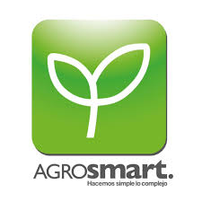
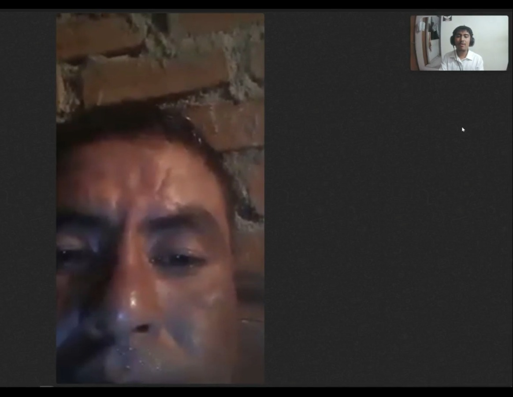
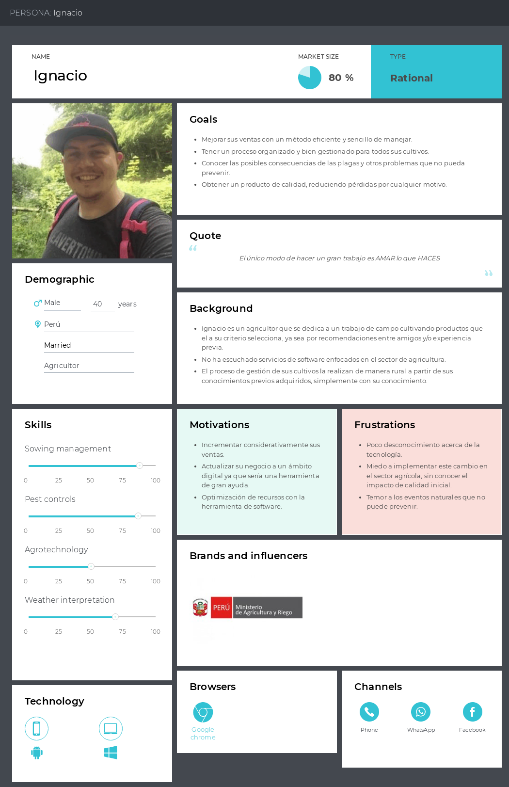
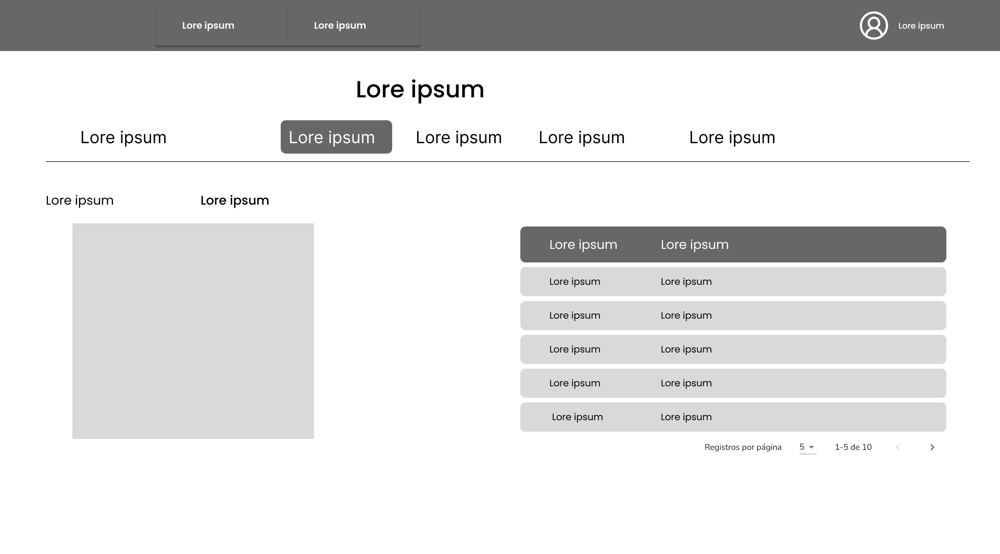
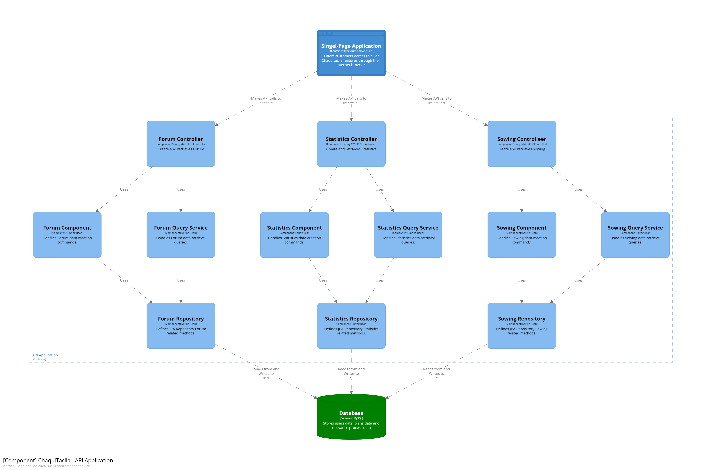

<h1 style="text-align: center;"> Informe del TB1  </h1>
<h2 style="text-align: center;"> Universidad Peruana de Ciencias Aplicadas </h2>

<h4 style="text-align: center;"> Ingeniería de Software </h4>
<h4 style="text-align: center;"> Aplicaciones Web </h4>
<h4 style="text-align: center;"> Ciclo 2024-01 </h4>
<h4 style="text-align: center;"> Sección: WS53 </h4>
<h4 style="text-align: center;"> Docente: Angel Augusto Velasquez Nuñez </h4>
<h4 style="text-align: center;"> Startup:  Error 404 </h4>
<h4 style="text-align: center;"> Producto: Chaquitaclla  </h4>

## Team Members
|             Nombre              | Código de alumno |
|:-------------------------------:|:----------------:|
|    Guillen Luna, Paolo César    |    U202124343    |
| Quispe Condori, Fernando Daniel |    U20221C628    |
|   Llamo Sánchez, Amner Levi     |    U20221C376    |
|  Cantoral Paredes, Diego André  |    U20201F568    |
|                                 |                  |

## Registro de versiones del informe
|   Fecha    | Versión |      Autor      |                                 Descripción de modificación                                 |
|:----------:|:-------:|:---------------:|:-------------------------------------------------------------------------------------------:|
| 28/03/2024 | 1.0     |  Guillen Paolo  | Creación del documento de trabajo en formato markdown junto al realizamiento de la carátula |
| 31/03/2024 | 1.1     | Quispe Fernando |                       Capitulo 2 - Formulacion Preguntas Entrevistas                        |
| 31/03/2024 | 1.2     | Diego Cantoral  |                             Desarrollo parcial del capítulo 1                               |
| 10/04/2024 | 1.3     | Guillen Paolo, Fernando Quispe, Diego Cantoral , Amner Llamo| Creación del figma para la creación de landing page y creación de los guidelines a seguir, análisis de las entrevistas realizadas y participación en la creación de la landing page en HTML| 

## Project Report Collaboration Insights

URL del repositorio del proyecto: 

**TB1**

|                       Integrante                       |                      Tareas Asignadas                       |
|:------------------------------------------------------:|:-----------------------------------------------------------:|
|               Guillen Luna, Paolo César                |                  Desarrollo de la carátula                  |
|            Quispe Condori, Fernando Daniel             | Elaboración Preguntas de Entrevitas - Artefactos Capítulo 2 |
|            Cantoral Paredes, Diego André               | Elaboración Antecedentes y problemáticas y descripción de startup|

***TB1 Github***

## Contenido 
1. [**Capítulo I: Introducción.**](#1.)  
1.1. [***Startup Profile***](#1.1.)  
1.1.1. [Descripción del startup](#1.1.1.) 
1.1.2.[Perfiles de los integrantes del equipo](#1.1.2.) 
1.2. [***Solution Profile***](#1.2.) 
1.2.1. [Antecedentes y Problemática](#1.2.1.) 
1.2.2. [Lean UX Process](#1.2.2.) 
1.2.3. [Lean UX Problem Statements](#1.2.3.) 
1.2.4. [Lean UX Assumptions](#1.2.4.) 
1.2.5. [Lean UX Hypothesis Statements](#1.2.5.) 
1.2.6. [Lean UX Canvas](#1.2.5.) 
1.3. [***Segmentos objetivo***](#1.2.6.) 
2. [**Capítulo II: Requirements Elicitation & Analysis**](#2.) 
2.1. [***Competidores***](#2.1.) 
2.1.1. [Análisis competitivo](#2.1.1.) 
2.1.2. [Estrategias y tácticas frente a competidores](#2.1.2.) 
2.2. [***Entrevistas***](#2.2.) 
2.2.1. [Diseño de entrevistas](#2.2.1.) 
2.2.2. [Registro de entrevistas](#2.2.2.) 
2.2.3. [Análisis de entrevistas](#2.2.3.) 
2.3. [***Needfinding***](#2.3.) 
2.3.1. [User Personas](#2.3.1.) 
2.3.2. [User Task Matrix](#2.3.2.) 
2.3.3. [User Journey Mapping](#2.3.3.) 
2.3.4. [Empathy Mapping](#2.3.4.) 
2.3.5. [As-is Scenario Mapping](#2.3.5.) 
2.4. [***Ubiquitous Language***](#2.4.) 
3. [**Capítulo III: Requirements Specification**](#3.) 
3.1. [***To-Be Scenario Mapping***](#3.1.) 
3.2. [***User Stories***](#3.2.) 
3.3. [***Impact Mapping***](#3.3.) 
3.4. [***Product Backlog***](#3.4.) 
4. [**Capítulo IV: Product Design.**](#4.) 
4.1. [***Style Guidelines***](#4.1.) 
4.1.1. [General Style Guidelines](#4.1.1.) 
4.1.2. [Web Style Guidelines](#4.1.2.) 
4.2. [***Information Architecture***](#4.2.) 
4.2.1. [Organization Systems](#4.2.1.) 
4.2.2. [Labeling Systems](#4.2.2.) 
4.2.3. [SEO Tags and Meta Tags](#4.2.3.) 
4.2.4. [Searching Systems](#4.2.4.) 
4.2.5. [Navigation Systems](#4.2.5.) 
4.3. [***Landing Page UI Design***](#4.3.) 
4.3.1. [Landing Page Wireframe](#4.3.1.) 
4.3.2. [Landing Page Mock-up](#4.3.2.) 
4.4. [***Web Applications UX/UI Design***](#4.4.) 
4.4.1. [Web Applications Wireframes](#4.4.1.) 
4.4.2. [Web Applications Wireflow Diagrams](#4.4.2.) 
4.4.3. [Web Applications Mock-ups](#4.4.3.) 
4.4.4. [Web Applications User Flow Diagrams](#4.4.4.) 
4.5. [***Web Applications Prototyping***](#4.5.) 
4.6. [***Domain-Driven Software Architecture***](#4.6.) 
4.6.1. [Software Architecture Context Diagram](#4.6.1.) 
4.6.2. [Software Architecture Container Diagrams](#4.6.2.) 
4.6.3. [Software Architecture Components Diagrams](#4.6.3.) 
4.7. [***Software Object-Oriented Design***](#4.7.) 
4.7.1. [Class Diagrams](#4.7.1.) 
4.7.2. [Class Dictionary](#4.7.2.) 
4.8. [***Database Design***](#4.8.) 
4.8.1. [Database Diagram](#4.8.1.) 
5. [**Capítulo V: Product Implementation, Validation & Deployment**](#5.) 

## Student Outcomes
El curso contribuye al cumplimiento del Student Outcome ABET:
<b>ABET – EAC - Student Outcome 5</b>

**Criterio:** La capacidad de funcionar efectivamente en un equipo cuyos miembros
juntos proporcionan liderazgo, crean un entorno de colaboración e inclusivo,
establecen objetivos, planifican tareas y cumplen objetivos.
En el siguiente cuadro se describe las acciones realizadas y enunciados de
conclusiones por parte del grupo, que permiten sustentar el haber alcanzado el logro
del ABET – EAC - Student Outcome 5.

|Criterio especifico|Acciones realizadas|Conclusiones|
|-|:-|-|
|Participa en equipos multidisciplinarios con eficacia, eficiencia y objetividad, en el marco de un proyecto en soluciones de ingeniería de software.|Quispe, Fernando: TB1:    Guillén, Paolo: TB1:    Quispe, Fernando: TB1:  Cantoral, Diego: TB1:    Llamo, Amner: TB1:|
|Conoce al menos un sector empresarial o dominio de aplicación de soluciones de software.|Quispe, Fernando: TB1:     Guillén, Paolo: TB1:    Quispe, Fernando: TB1:  Cantoral, Diego: TB1:    Llamo, Amner: TB1:|

<h2>Capítulo I: Introducción</h2>

<h3> 1.1 Startup Profile</h3>

En esta sección se presenta la descripción del startup y los perfiles de los miembros del equipo.

<h4> 1.1.1. Descripción del startup</h4>

Nuestra startup, Error 404 , tiene como misión ofrecer una solución integral de gestión agrícola. A diferencia de otras plataformas que se enfocan exclusivamente en el sector empresarial, nosotros también tenemos un fuerte enfoque en el público en general. Queremos ser la opción para todos: desde aquellos que se aventuran por primera vez en la agricultura hasta los más experimentados.

Para lograrlo, hemos desarrollado una plataforma que organiza y simplifica la gestión de cultivos para nuestros usuarios. Cada cultivo se sigue a lo largo de su ciclo fenológico, y además, mantenemos registros históricos para determinar las temporadas óptimas de siembra y cosecha de diferentes insumos. Esto permite una trazabilidad efectiva y ayuda a nuestros usuarios a alcanzar sus metas a largo plazo.

En resumen, nuestra misión es brindar una nueva opción en el mundo agrícola, democratizando el acceso a herramientas eficientes y fomentando el éxito de todos los involucrados.

**Misión:** Ofrecer una solución integral de gestión agrícola que trascienda los límites tradicionales y que se encuentre disponible para todo el público.

**Visión:** ChaquiTaclla se direcciona a ser la plataforma mayormente reconocida en lo que respecta a la gestión agrícola en los próximos años por su accesibilidad y facilidad de uso. 
Mientras que como startup, AgriCulture, busca ser reconocido como un equipo autosustentable y capaz de brindar soluciones innovadoras en el campo de la agricultura moderna.

##### Logotipo de la Startup:

  

##### Logotipo del producto

<h4> 1.1.2. Perfiles de los integrantes del equipo</h4>

|                                                                                                                                                                                                          Descripción de los perfiles de los integrantes del equipo                                                                                                                                                                                                           |                                                              Foto del integrante                                                              |
|:----------------------------------------------------------------------------------------------------------------------------------------------------------------------------------------------------------------------------------------------------------------------------------------------------------------------------------------------------------------------------------------------------------------------------------------------------------------------------:|:---------------------------------------------------------------------------------------------------------------------------------------------:|
| Mi nombre es **Paolo César Guillen Luna**, estudiante de la carrera de Ingeniería de Software, en la UPC y fanático de los videojuegos. Me considero alguien creativo y con determinación en alcanzar sus metas, dentro del campo del desarrollo de software, me gustaría especializarme en lo que es el testing de este, razón por la cual aparte de seguir la malla curricular de mi carrera también ando aprendiendo herramientas diversas como Playwright, Cypress, etc. |      |
| Mi nombre es Diego André Cantoral Paredes y soy estudiante de la carrera de Ingeniería de Software. Desde siempre me interesaron los temas tecnológicos y sobre todo las computadoras, por lo que desarrollé una afición a los videojuegos y luego a la programación. Me considero una persona responsable, creativa y siempre dispuesto a ayudar a mis compañeros.|      |
|Mi nombre es Fernando Quispe, soy una persona proactiva que puede aportar y liderar la colaboración en equipo con el objetivo de un logro común. Me gusta el desarrollo de software y poder contribuir a la sociedad con lo que me apasiona. Tengo como meta adquirir los conocimientos de una manera clara para poder aplicarlos en los distintos proyectos tal cuál como el proyecto actual. |  |
|Mi nombre es **Amner Levi Llamo Sánchez**, soy estudiante del quinto ciclo de ingeniería de software en la UPC. Me gusta jugar fútbol y videojuegos, por eso estoy constantemente investigando sobre nuevas tecnologías. Soy responsable con los trabajos que se me asignan; además soy tolerante y me adapto a las circunstancias del equipo.||

<h3> 1.2. Solution Profile</h3>

<h4> 1.2.1. Antecedentes y Problemática</h4>

##### What (Qué)
###### ¿Cuál es el problema?
El problema radica en la ausencia de alguna herramienta que permita gestionar, medir y seguir los cultivos para el público general; puesto que la mayoría de estas herramientas son software empresariales hechos a la medida. A pesar de la diversa información que pueda existir en internet sobre como gestionar adecuadamente un cultivo, buscar dicha información y que la fuente sea confiable es complicado, además que causa una pérdida del tiempo al usuario, puesto que debe indagar estos datos adecuadamente.

##### When (Cuando)
###### ¿Cuándo sucede el problema?
El reto se presenta cuando agricultores, tanto principiantes como profesionales, requieren una herramienta para gestionar sus cultivos de manera eficiente, teniendo en cuenta aspectos como el entorno, los procesos fenológicos de sus cultivos, los cambios climáticos y la temporada propicia para el cultivo. Lamentablemente, gran parte de las herramientas existentes en este campo están diseñadas para empresas y no están al alcance de todos. 

##### Where (Dónde)
###### ¿A dónde se dirige?
Nuestra solución esta dirigida a aquellos individuos ,que sin importar su experiencia en el sector agrícola, quieren incorporar una herramienta de gestión agrícola sencilla y moderna.

###### ¿Dónde surge el problema?
El problema surge durante el proceso de crecimiento de los cultivos, desde la germinación de la semilla hasta la cosecha, al haber una ausencia de gestión, el cultivo puede sufrir diversas consecuencias negativas.

##### Who (Quién)
###### ¿Quiénes están involucrados? ¿Quién lo utilizará?
Los involucrados serían los usuarios del sistema, los cuales se separarían en nuestros segmentos objetivos, profesionales del campo de agricultura y aquellos principiantes o que tienen un pequeño cultivo en su hogar. La solución la utilizará aquel que desee gestionar sus cultivos de una manera más eficaz, siguiendo sus procesos fenológicos y tener un fecha aproximada de cuando estaría listo para la cosecha; esto puedo ser utilizado tanto por profesionales como principiantes del sector agrícola.

##### Why (Por qué)
###### ¿Cuál es la causa del problema?
La principal dificultad de este problema radica en introducir una solución moderna en un campo que normalmente se maneja con herramientas más tradicionales. En el ámbito de la agricultura, aquellos que gestionan sus cultivos de manera personal, como los agricultores que viven en las provincias del Perú con sus “chacras” establecidas, están más familiarizados con las herramientas tradicionales. Implementar una solución moderna, como una aplicación web que reemplace estas herramientas por algo más sencillo, es complicado debido a la desconfianza que algunos todavía tienen hacia la tecnología.

Por otro lado, para nuestro segmento objetivo de principiantes en la agricultura, el desafío consiste en generar confianza en que nuestro producto es superior a las alternativas disponibles en el mercado.

#### 2H
##### How (Cómo)
###### ¿Cómo se utilizará el producto?

El producto será empleado para el registro de cultivos y seguimiento de sus procesos fenológicos. Desde la germinación de la semilla, hasta el momento de la cosecha de este, por esta razón nuestra aplicación estaría brindando consejos según el estado del cultivo para propiciar una cosecha próspera.

###### ¿Cómo se logrará una gestión adecuada de los cultivos dentro de la plataforma?

Los usuarios a partir de su acceso a nuestra aplicación mediante un navegador web, podrán empezar a registrar sus cultivos. Esto al ser un proceso manual, el usuario tendrá que categorizar el tipo de cultivo, en qué proceso fenológico se encuentra y descripción del área de donde se encuentra cultivado este. A partir de este registro manual, la aplicación brindará al usuario consejos y medidas que podría tomar con el fin de mejorar la calidad de este.

##### How much (Cuánto)
###### ¿Cuál es la magnitud del problema?

Según el Ministerio de Agricultura y Desarrollo Rural de Colombia (2022), solo el 15% del sector agro usa tecnología de última generación, este porcentaje presentó resultados positivos en lo que respecta a la mejora de la calidad de sus productos, a comparación del 85% restante. Además que según UNCTAD(Organización de las Naciones Unidas para la Agricultura y la Alimentación), los agricultores familiares al ser comunes en países en desarrollo, estos en su mayoría son pobres, sin embargos entre estos agricultores, aquellos que tuvieron la oportunidad de implementar herramientas digitales para el monitoreo de sus cultivos, se vio una mejora en la calidad de estos.

###### ¿Qué porcentaje de la industria agrícola se vería beneficiada por nuestro producto?

Si consideramos lo mencionado en el punto anterior y suponemos que nuestro producto tiene éxito, podríamos beneficiar al 80% de los agricultores, tanto principiantes como profesionales. Además que según datos proporcionados por un artículo publicado en Science en el año 2020, aquellos agricultores que recibieron asesoramiento para adoptar herramientas digitales lograron cambiar y mejorar sus prácticas lo que supone una mejora en la calidad de los productos que brindan.

<h4> 1.2.2. Lean UX Process</h4>

<h5> 1.2.2.1. Lean UX Problem Statements</h5>

##### **Problem Statement:** 

Chaquitaclla, nuestra solución, tiene como objetivo proporcionar a los agricultores, tanto principiantes como profesionales, una herramienta de gestión para sus cultivos. Esta herramienta se diseñó para ser ágil, sencilla de usar e implementar en sus labores, permitiendo que trabajen con ella de manera eficiente.

El problema surge al registrar las características de cada cultivo de forma individual. Los métodos tradicionales de gestión, como los registros en papel y las hojas de cálculo, pueden llevar a omitir detalles cruciales. Por ejemplo, no considerar el proceso fenológico en el que se encuentra un cultivo o evaluar si la temporada actual es la más adecuada para él.

A pesar de los prejuicios sobre la implementación de tecnología en la agricultura, los datos estadísticos demuestran que aquellos que han adoptado herramientas digitales, como sistemas de gestión de cultivos, han obtenido beneficios significativos. Estos sistemas proporcionan datos más precisos y evitan la pérdida de información relevante. Por lo tanto surge la pregunta de ¿Cómo podemos implementar una gestión automatizada de la información de los cultivos sin generar desconfianza en los agricultores y asegurando que tendrán una mejora de calidad en sus cultivos al hacer uso de esta?

<h5> 1.2.2.2. Lean UX Assumptions</h5>

##### **Business Assumptions:**
1. **Creemos que nuestros usuarios necesitan** una forma más eficiente de registrar y seguir los procesos de sus cultivos sin importar si es a nivel profesional o personal.
2. **Estas necesidades se pueden satisfacer con** el desarrollo de una plataforma web que les permita registrar los datos de sus cultivos de una manera segura y confiable, para hacerl seguimiento de los distintos procesos por el cual su cultivo pasa.
3. **Nuestros clientes iniciales serán** los agricultures que inician en este sector y los agricultores que buscan mejorar como gestionar sus cultivos con herramientas digitales.
4. **El valor más importante que quiere un cliente de nuestros servicios es** registrar los datos de sus cultivos y que estos estén seguros de que no se van a perder, además de poder visualizar sus registros a largo plazo.
5. **El cliente también va a obtener** gráficos estadísticos sobre cual ha sido lo que más ha a cultivado en alguna temporada del año y estadísticas de que es lo más cultivado en la temporada actual.
6. **Vamos a obtener la mayoría de los clientes mediante**  publicidad en foros de agricultura y participando en eventos relacionados a la agricultura. 
7. **Vamos a obtener ingresos mediante** un modelo de suscripción separado en tres niveles, siendo el más bajo un plan básico. 
8. **Nuestra competencia en el mercado serán** herramientas digitales que se dediquen a la gestión de productos agrícolas y que tengan una clientela fija.
9. **Vamos a tener ventaja frente a nuestra competencia debido a** nuestra accesibilidad, puesto que la mayoría de nuestra competencia solo provee sus productos a un sector empresarial.
10. **El mayor riesgo del producto es**  no captar suficiente atención en el sector agrícola debido a la desconfianza inherente hacia los nuevos productos en el mercado. Esta desconfianza se origina en la naturaleza conservadora del sector agrícola, que no suele adoptar cambios en su enfoque empresarial con facilidad.
11. **Lo resolveremos realizando** el desarrollo de una plataforma atractiva y de uso sencillo para el público en general. Además, realizaremos encuestas entre los interesados en nuestros productos para identificar qué aspectos específicos les resultan atractivos. Esta información nos permitirá implementar características específicas como herramientas de gestión para sus cultivos.

##### **User Assumptions:**
###### **¿Quién es el usuario?**   

El usuario de nuestro producto son agricultores tanto principiantes como profesionales que buscan registrar sus cultivos y hacerles un seguimiento de sus procesos fenológicos mediante el uso de herramientas digitales. En caso nuestro producto sea exitoso, este segmento se expandiría hasta las empresas agrícolas, las cuales para satisfacer sus necesidades tendríamos que implementar nuevas funciones.

###### **¿Qué problemas tiene nuestro producto? ¿Resolver?**

Nuestro desafío central radica en que todos los procesos de registro de cultivos deben realizarse de forma manual. Esto implica registrar detalles como la fecha, las acciones necesarias para el cuidado del cultivo y otros aspectos relevantes. Para abordar esta limitación, consideramos la implementación de soluciones basadas en el Internet de las Cosas (IoT). Estas soluciones podrían incluir rociadores automáticos específicos para cada cultivo y sensores que detecten el estado actual del proceso. Sin embargo, es importante destacar que solo podremos lograr esta automatización si nuestro producto tiene éxito desde sus primeras etapas de desarrollo.

###### **¿Qué características son importantes?**

Dentro de las características más relevantes de nuestros productos, destacan su accesibilidad. Esto es especialmente significativo, dado que, en la mayoría de los casos, las soluciones similares están dirigidas exclusivamente al ámbito empresarial. Además, nuestra plataforma se enfoca en el registro y monitoreo de las fases fenológicos de los cultivos. Estas etapas abarcan desde la germinación hasta el momento en que el cultivo está listo para la cosecha. Proporcionar un seguimiento detallado de estas fases permite a los agricultores tomar decisiones informadas sobre el manejo de sus cultivos, como la aplicación de fertilizantes, el riego adecuado y la prevención de enfermedades.

###### **¿Dónde encaja nuestro producto en su trabajo o vida?**

El producto encaja en la mejora de la gestión de cultivos, principalmente en qué cuidados se deben brindar según el proceso fenológico actual del cultivo, lo que radica en una mejora de la calidad y reducción de posibles gastos innecesarios.

###### **¿Cuándo y cómo es nuestro producto usado?**

Nuestro producto es utilizado por nuestros segmentos objetivos cuando existe la necesidad de tomar registros de cultivos nuevos y seguir su crecimiento de una forma adecuada, esto a partir de como nuestro producto le pide al usuario registrar el proceso actual del cultivo, estado y fase fonológica que se encuentre, todo esto con el fin de mejorar las posibilidades de obtener una mejor cosecha. 

###### **¿Cómo debe verse nuestro producto y cómo debe comportarse?**
El producto debe contar con una interfaz sencilla, dinámica e inclusiva. Debe ser de fácil uso con el fin de que aquellos nuevos utilizando una herramienta digital de este tipo, tengan la menor cantidad de incovenientes posibles. El comportamiento de nuestra aplicación debe ser dirigida en relación a guardar la integridad de los usuarios y evitar la pérdida de datos relevantes para ellos.

###### **Feature Assumptions:**

**Creemos que** una interfaz intuitiva y fácilmente accesible permitirá que tanto agricultores principiantes como profesionales adopten nuestra aplicación con mayor facilidad. Esto facilitará una rápida comprensión del funcionamiento de la aplicación y contribuirá a una adopción más amplia entre la comunidad agrícola.

**Creemos que**  al incluir herramientas estadísticas y opciones de visualización de datos, proporcionaremos a los agricultores profesionales la capacidad de tomar decisiones informadas sobre qué cultivos plantar en cada temporada. Esto favorecerá la aceptación de la aplicación y su utilidad en la toma de decisiones agrícolas estratégicas.

**Creemos que** al ofrecer notificaciones y avisos sobre la proximidad de la cosecha y los cambios en las fases fenológicas de los cultivos, ayudaremos a los agricultores a prepararse adecuadamente. Esto se traducirá en una mejora de la calidad de los productos agrícolas y una mayor eficiencia en la gestión de los cultivos.

**Creemos que**  la inclusión de encuestas permitirá a los usuarios proporcionar retroalimentación continua sobre la aplicación. Esta retroalimentación nos ayudará a corregir cualquier error rápidamente y a mejorar la experiencia del usuario, lo que a su vez fortalecerá la confianza en la aplicación y su utilidad a largo plazo.

<h5> 1.2.2.3. Lean UX Hypothesis Statements.</h5>

* **Hypothesis Statement 01:**
    
    **Creemos que** tanto los agricultores principiantes como los profesionales estarán dispuestos a adoptar nuestra aplicación de gestión de cultivos para llevar un registro más eficiente de sus procesos fenológicos y características de los cultivos
    
    **Sabremos** que hemos tenido éxito
    
    **Cuando** observemos que la tasa de usuarios activos de nuestra aplicación durante el primer año supera el 40% del total de agricultores en Perú. Esto indicará una adopción significativa y una respuesta positiva por parte de la comunidad agrícola.

* **Hypothesis Statement 02:**
    
    **Creemos que** al proporcionar datos históricos sobre qué cultivo prospera mejor en cada temporada específica y brindar información sobre los cuidados necesarios, nuestra aplicación permitirá a los agricultores profesionales tomar decisiones informadas sobre qué cultivar en la temporada actual
    
    **Sabremos** que hemos tenido éxito
    
    **Cuando** observemos en los registros que los cultivos más comunes durante la presente temporada son precisamente aquellos que nuestra aplicación recomendó. Esto indicará que estamos influyendo positivamente en las decisiones de cultivo y en la calidad de las cosechas.
  
* **Hypothesis Statement 03:**
    
    **Creemos que** al proporcionar consejos específicos a los agricultores sobre los cuidados necesarios para cada etapa fenológica de sus cultivos, lograremos mejorar significativamente la calidad de los productos agrícolas
    
    **Sabremos** que hemos tenido éxito
    
    **Cuando** encuestas a los agricultores profesionales y ellos reporten una percepción positiva de la mejora en la calidad de sus productos. Además, si observamos un aumento en las ventas como resultado directo de estas mejoras, consideraremos que estamos en el camino correcto.

* **Hypothesis Statement 04:**
    
    **Creemos que** nuestra aplicación reducirá significativamente la pérdida de datos y proporcionará información más precisa en comparación con los métodos de registro manuales
    
    **Sabremos** que hemos tenido éxito
    
    **Cuando** comencemos a recibir reseñas positivas de los usuarios. En particular, si destacan nuestra capacidad para mantener la información respaldada de manera efectiva, consideraremos que estamos en el camino correcto.
  

<h5> 1.2.2.4. Lean UX Canvas</h5>

El Lean UX Canvas es una herramienta que se utiliza en el campo del diseño centrado en el usuario (UX) y la metodología Lean para optimizar la creación y el desarrollo de productos. Su objetivo principal es proporcionar un marco estructurado para la colaboración entre equipos multidisciplinarios. A través de esta herramienta, los equipos pueden visualizar y analizar aspectos clave del diseño y la experiencia del usuario, lo que facilita la toma de decisiones informadas durante el proceso de desarrollo.

## ***Lean UX Canvas realizado en la aplicación web "Mural":*** 

Enlace para acceder al [Canvas](https://app.mural.co/t/aplicacionesweb8834/m/aplicacionesweb8834/1711846472456/3aafbeea2aa64e5c9fea104736a8e04377fc040d?sender=uab21ffc4c80101532b361326)

<h3> 1.3. Segmento objetivo</h3>

En el contexto de la agricultura y su relación con la tecnología, se presentan dos aspectos relevantes: la adopción de herramientas digitales por parte de los agricultores en países desarrollados y la creciente tendencia de aficionados a la agricultura. Según datos de la FAO, aproximadamente el 80% de los agricultores en países desarrollados utilizan internet para acceder a información agrícola, y se ha observado un incremento en la adopción de aplicaciones móviles agrícolas, con un crecimiento anual del 15-20%. Estos avances tecnológicos han contribuido a reducir las pérdidas poscosecha en un rango similar. En contraste, en países en desarrollo, menos del 20% de la población rural posee habilidades básicas para el manejo de tecnologías digitales, y la mayoría de los agricultores aún optan por métodos tradicionales, lo que resulta en una pérdida sustancial de ingresos y un subaprovechamiento del potencial productivo. Además, los aficionados a la agricultura muestran un creciente interés, pero muchos prefieren seguir prácticas tradicionales en lugar de adoptar herramientas digitales debido a la falta de aplicaciones específicas para su uso. Esto conlleva a una pérdida de tiempo al tener que buscar información individualmente en internet . Todo esto significaría que si logramos que nuestro producto sea más accesible para todos, cumpliría la necesidad básica para nuestro segmento de aficionados, mientras que al implementar una interfaz intutitiva con datos claros y sencillos de entender, nuestro segmeneto de agricultores profesionales y/o comerciales podrían brindar un vistazo a nuestra aplicación para aumentar la calidad de sus cultivos a partir de una gestión mucho más eficiente que los métodos tradicionales.

<h4> 1.3.1 Stakeholders</h4>

* **Stakelholder Internos:** Integrantes pertenecientes al equipo de desarrollo, además del equipo creador de la startup.
* **Stakelholder Externos:** Sector agrícola empresarial, vendedores de productos naturales y estudiantes de alguna relacionada con la agricultura.

[//]: #CAPITULO2

<h2> Capítulo II: Requirements Elicitation & Analysis</h2>

<h3> 2.1. Competidores</h3>

<h4> 2.1.Análisis Competitivo</h4>

||Chaquitaclla  |AgroSmart |Cropin |DKALB |
|:-:|:-:|:-:|:-:|:-:|
|Overview|Plataforma digital que organiza la gestión en el área de producción en cultivos agrícolas. |Software agricola de gestión como administración, producción, operación y finanzas en el ámbito agrícola.|SaaS que ofrece soluciones basadas digitalización del ecosistema agrícola.|Plataforma digital de Dekalb, esta plataforma brinda asesorías a los agricultores para optimizar los cultivos, especialmente de maíz.|
|Ventajas Competitivas|Registro avanzado y monitoreo de las fases fenológicos de los cultivos|Posee un monitoreo de datos en cada proceso del ambito agrícola.|Soluciones en la nube, implementación de IA.|Antigüedad en el mercado y desarrollada por la empresa BAYER, además de enfoque exclusivo sobre productos con base de maíz |
|Mercado Objetivo|Desde agricultores amateurs hasta empresas internacionales.|Empresas agrícolas dedicadas al sector Silvoagropecuario y a gobiernos o entidades gubernamentales.|Empresas agrícolas, agroindustriales e instituciones financieras.|Agricultores especalizados en la siembra de maíz.|
|Estrategias de Marketing|Enfoque en nuevos clientes iniciando en el mundo de la agricultura.|Enfoque en sostenibilidad y eficiencia de recursos como principales puntos de venta.|Impacto en la productividad mediante soluciones variadas proporcionadas al cliente.|Personalización y adaptabilidad de soluciones a necesidades específicas del cliente.|
|Productos & Servicios|Software de gestion agricula, asesoramiento económico.|Sensores de campo, análisis de datos climáticos, asesoramiento agronómico.|Software de gestión agrícola, análisis de datos, servicios de inteligencia de mercado.|Consultoría agrícola, software de gestión de recursos, análisis de rendimiento.|
|Precios & Costos|Precio basado en suscripción.|Basado en suscripción.|Basado en el tamaño de la operación, suscripción mensual|Precios personalizados a diferentes países.|
|Canales de distribución (WEB y/o Movil)|Plataforma web|Plataforma web y aplicación móvil.|Plataforma web y aplicación móvil.|Aplicación móvil.|
|Fortalezas|Monitoreo de ultima generacion para la gestión agrícola.|Abarca toda la cadena de cultivos agrícolas.|Análisis apoyadas con herramientas como la IA.|Personalización de las soluciones en maíz.|
|Debilidades|Enfoque solo en el proceso de producción.|Enfocado en los agricultores amateurs, precio elevado.|Capacitación para sacar el maximo provecho de la plataforma.|Centralización en un solo tipo de producto|
|Oportunidades|Captar a los agricultores amateurs y principiantes en el mundo de la agricultura.|Expansión de mercados emergentes con enfoque a la agricultura sostenible completa.|Auge actual de las tecnologías basadas en IA.|Crecimiento del comercio electronico en los países de Latinoamérica.|
|Amenazas|Aparición de soluciones más completas, aplicaciones son herramientas más actualizadas.|Aparición de soluciones más elaboradas.|Aparición de diversas soluciones de IA.|Cambios en las tendencias de consumo de los clientes.|

<h4> 2.1.2. Estrategias y tácticas frente a competidores</h4>

  
A partir del análisis competitivo realizado se logró identificar las fortalezas, debilidades, oportunidades y amenazas destacadas en los competidores. Esta información adquirida es esencial para trazar estrategias y tácticas para diferenciarnos de nuestros competidore. A continuación se brindará tanto estrategias como tácticas para alcanzar esta meta:

**Fortalezas de nuestros competidores**

 * Amplia variedad de cultivos con los que trabajar y gestionar adecuadamente.
 * Cálculos estables basadas en herramientas estadísticas.
 * Todos cuenta con un tiempo de más de dos años como mínimo en el mercado agrícola.

Teniendo en cuenta esto, ¿cuáles son nuestras fortalezas?

 * Registro y monitoreo de los cultivos de forma eficiente, siguiente cada fase fenológica independientemente del cultivo.
 * Accesibilidad, nuestros competidores se enfocan en brindar sus productos únicamente a empreas, nosotros a un público más general.

 Por lo tanto, podemos aplicar ciertas estrategias y tácticas:

**Estrategias**
  
  * Brindar al usuario las herramientas que necesita para el correcto cultivo de su cultivo.

**Tácticas**

  * Incluir herramientas de recomendaciones según el proceso fenológico por el cual el cultivo del usuario esté pasando.

**Debilidades de nuestros competidores**

 Nuestros competidores no ofrecen un producto perfecto, algunos se enfocan en solo un tipo de producto y otros tienen precios elevados.

  * Centralización de un solo producto.
  * Poca personalización para registrar los cultivos. 
  * Localización restringida únicamente a una región en el mundo.
  * Interfaz poco intuitiva

Teniendo en cuenta esto, ¿cuáles son nuestras debilidades?

 * Enfoque solo en el proceso de gestión de los cultivos

 Por lo tanto, podemos aplicar ciertas estrategias y tácticas:
 
**Estrategias**
 
  * Mantener actualizaciones de los cultivos a registrar de forma constante y brindar una personalización más amplia a los usuarios para sus registros.

  **Tácticas**

  * Implementar un sistema de reseñas donde el usuario pueda indicarnos si el cultivo que quiere registrar se encuentra o no en la plataforma. 
  * Proporcionar un video guía o una sucesión de imágenes para utilizar nuestro producto.

**Oportunidades de nuestros competidores**

* Implementación o mejora de su interfaz visual de la aplicación.
* Expandir su visión de producto a mercados emergentes.
* Implementar nuevas tecnologías como la IA al proceso de gestión. 

Teniendo en cuenta esto, ¿cuáles son nuestras oportunidades?

 * Captar a agricultores profesionales así como amateurs con nuestra aplicación que contiene las últimas tendencias agrícolas.

 Por lo tanto, podemos aplicar ciertas estrategias y tácticas:

**Estrategias**

* Captar tanto agricultores amateurs como profesionales con una interfaz amigable.

**Tácticas**

* Aprovechar nuestros conocimientos de la psicología del color para la creación de la interfaz.

**Amenazas de nuestros competidores**

* Aparición de soluciones más elaboradas. 
* Aparición de nuevas tecnologías y no conocer como implementarlas. 
* Cambios en la tendencia de la agricultura.

Teniendo en cuenta esto, ¿cuáles son nuestras amenazas?

 * Aparición de soluciones más completas y con herramientas más modernas y actualizadas.

 Por lo tanto, podemos aplicar ciertas estrategias y tácticas:

**Estrategias**

* Capacitarnos en las últimas tecnologías con las que trabaja nuestra aplicación.
* Implementar funciones que simplifiquen la experiencia de usuario.

**Tácticas**
 
 * Mantener la aplicación constantemente actualizada con las últimas versiones de las tecnologías utilizadas.
 * Preguntar a los usuarios mediante encuestas en la aplicación sobre que cambios en la tendencia de la agricultura han visto que le gustaría ver reflejado en la aplicación.
 
  
<h3> 2.2. Entrevistas</h3>

  
  
<h4> 2.2.1. Diseño de entrevistas</h4>

  
En esta sección se procederá a detallar las preguntas para el método de recoleccion de
  requisitos que son las entrevistas. Para la formulación se siguieron buenas prácicas tales como 
  formulación de preguntas abiertas, así mismo obtenemos características demográficas con las entrevistas
  

  <h4>PREGUNTAS GENERALES</h4>
  
Bienvenido gracias por brindarnos esta entrevista (empieza con las preguntas generales) 

  
  * Nos gustaría saber su nombre, edad y ocupación
  * ¿Qué tan acostumbrado está con el uso de tecnología en su vida diaria?
  * Dentro de su vida diaria, ¿tiene incovenientes utilizando dichas herramientas digitales?
  * Alguna vez tuvo que enfrentarse con una situación donde usted no entendía para nada como servía una aplicación, de ser así, ¿cómo sobrellevo ese problema?

  <h4>SECTOR AGRICULTORES PROFESIONALES: </h4>
  
  
1. ¿Cuál es el proceso que sigue para llevar un registro de sus cultivos?

  
2. ¿Utiliza alguna herramienta para llevar un registro de sus cultivos?

  
3. ¿Cuáles son los datos que considera más relevante al momento de gestionar sus cultivos?

  
4. ¿Qué dificultades ha encontrado al llevar un registro de sus cultivos?

  
5. Dentro de estas dificultades, ¿hubo alguna vez que tuvo algún tipo de pérdidas, sea económicas o de tiempo? 
  
6. (Comentar la propuesta) ¿Qué mejoras le gustaría ver en una herramienta de gestión de cultivos?

  
7. ¿Qué tan dispuesto estaría en adoptar una herramienta digital para la gestión de sus cultivos?

  
8. Teniendo en cuenta que usted estaría dispuesto en adoptar una herramienta digital para la gestión de sus cultivos ¿Cuánto pagaría por esta?

  
9. ¿Qué tan dispuesto estaría en pagar por una herramienta de gestión de cultivos?

  
10. ¿Qué tan importante considera la trazabilidad de sus cultivos?

  
11. ¿En qué medidas una herramienta de este tipo podría ser útil para sus necesidades como agriculor?

  

  <h4>SECTOR JARDINEROS EN CASA</h4>

  
Bienvenido gracias por brindarnos esta entrevista (empieza con las preguntas al segmento) 

  
Bienvenido gracias por brindarnos esta entrevista, primaremente nos gustaría conocer
  su nombre completo, edad, dónde reside, estado civil y su ocupación. 

  
1. ¿Cuál es el proceso que sigue para llevar un registro de sus cultivos en su hogar?

  
2. ¿Utiliza alguna herramienta para llevar un registro de sus cultivos?

  
3. ¿Cuál es su principal motivación para cultivar para usted mismo en casa?

  
3. ¿Cuáles son los datos que considera más relevante al momento de gestionar sus cultivos?

  
4. ¿Qué dificultades ha encontrado al llevar un registro de sus cultivos?

  
5. (Comentar la propuesta) ¿Qué mejoras le gustaría ver en una herramienta de gestión de cultivos?

  
6. ¿Qué tan dispuesto estaría en adoptar una herramienta digital para la gestión de sus cultivos?

  
7. ¿Qué tan importante considera la tecnología en la gestión de sus cultivos?

  
8. ¿Qué tan dispuesto estaría en pagar por una herramienta de gestión de cultivos?

  
9. ¿Qué tan importante considera la trazabilidad de sus cultivos?

  
10. ¿Qué tan importante considera la gestión de los procesos fenológicos de sus cultivos?

  
<h4> 2.2.2. Registro de entrevistas</h4>

  ***Entrevistas a agricultores profesionales***
  
|Nombre entrevistado|Clever Medina|
|-|-|
|Edad|42 años|
|Departamento|Tumbes|
||Clever Medina, un agricultor residente en el departamento de Tumbes, se especializa en los cultivos de cacao y limón. Aunque su ocupación actual es la agricultura, también posee conocimientos en mecatrónica. Clever gestiona sus cultivos basándose en su experiencia en el campo. Sin embargo, enfrenta dificultades cuando los cultivos no crecen como esperaría. En esos momentos, recurre a información encontrada en Google y sigue los pasos recomendados, en caso la información encontrada no sirva en la práctica, esto resulta en pérdidas económicas y de tiempo para Clever. Al mencionarle sobre la propuesta y preguntarle si él cree que les haría un beneficio a él y a sus compañeros agricultores dice lo siguiente: "Claro, pues como te mencione, como agricultor quiero mejorar la calidad de mis cultivos y si existiese una aplicación de ese tipo y las recomendaciones que brinda me aseguran que podría mejorar la calidad, no solo me ayudaría económicamente sino que también me ayudaría a ahorrar tiempo y así podría mejorar otros aspectos de mis cultivos"|
|Duración entrevista: 16:15  |URL: []|

|Nombre entrevistado|Paulino Guillen|
|-|-|
|Edad|78 años|
|Departamento|Lima|
||Paulino, agricultor profesional jubilado de la región de Ayacucho, menciona que en sus tiempos no hacían uso de registros manuales, ni siquiera en papel, principalmente por problemas de analfabetismo en su región. Al preguntarle por sobre como se encuentra sus cultivos y compañeros actualmente, menciona que lo más probable es que hayan adoptado tecnología, pero de la más simple, como celulares. Paulino habla sobre como sus colegas que siguen en la chacra usan el internet para resolver ciertas dudas que ellos tengan respecto a sus cultivos. Al hacerle saberle de la propuesta, Paulino menciona que seguramente sería muy útil, siempre y cuando se les asesore a los agricultores de forma correcta.|
|Duración entrevista:   ||

|Nombre entrevistado| Eloy Cantoral|
|-|-|
|Edad|65 años|
|Departamento|Lima|
||Eloy Cantoral es un agricultor de alta experiencia que se especializa en el cultivo de legumbres, frutas y verduras en la zona de Saisa, en Ayacucho. Durante la entrevista, indicó que el proceso de realizar la agricultura ha cambiado mucho a través del tiempo y que actualmente es necesario que se lleve de la mano con la tecnología. Enfatiza que contar con una aplicación que les ayude a gestionar más sus cultivos, por lo que está totalmente dispuesto a contar con una herramienta de software que añade capas de profundidad al análisis y mantenimiento de los sembríos.|
|Duración entrevista: 13 minutos|URL: []|

 ***Entrevistas a jardineros en casa***

|Nombre entrevistado| Daniel Valverde|
|-|-|
|Edad| 20 años|
|Departamento|Lima|
||Daniel Valverde es un jardinero aficionado que cuenta con un pequeño huerto en el ático de su casa y que en sus tiempos libres cuida de sus cultivos. No cuenta con herramientas tecnológicas o físicas tan sofisticadas o de gran uso, bastándose de una libreta para sus registros y de simples macetas para sus cultivos. Estaría muy dispuesto de contar con una aplicación que le ayuda profesionalizar un poco más los sembríos que tiene y manejar de manera más inteligente sus registros. |
|Duración entrevista: 6:52 minutos  | URL: []|

|Nombre entrevistado|Noe Sánchez|
|-|-|
|Edad|24|
|Departamento|Lima|
||Noe es un joven limeño de 24 años apasionado por la agricultura urbana, que reside en Lima. Cultiva en su hogar principalmente para tener acceso a alimentos frescos y saludables, y disfruta cada etapa del proceso, desde sembrar las semillas hasta cosechar los frutos de su esfuerzo. A pesar de su amor por la agricultura, Noe admite que a veces se enfrenta a dificultades debido a la falta de herramientas tecnológicas para gestionar sus cultivos. Esta carencia ocasionalmente resulta en olvidos o confusiones sobre los insumos necesarios para cada tipo de planta. Para monitorear el estado de sus cultivos, Noe confía en métodos tradicionales como la inspección visual de las hojas y los tallos, así como la evaluación de la humedad del suelo. Sin embargo, reconoce la importancia de la tecnología en la gestión agrícola y está dispuesto a invertir en herramientas digitales que puedan mejorar su eficiencia y aumentar la productividad de sus cultivos en el futuro.|
|Duración entrevista: 5:55 minutos  |URL:[]|

|Nombre entrevistado|Eligsela Luna|
|-|-|
|Edad|48 años|
|Departamento|Lima|
||Eligsela es una contadora que reside en Lima y que está muy familiarizada con la tecnología, entre sus pasatiempo principales se encuentra la jardinería, recientemente se incursionó a nuevos cultivos, como fresas y zanahorias. A pesar de tener conocimientos en jardinería, ella desconocía sobre como tratar correctamente estos nuevos cultivos, por lo tanto terminaron en un fracaso. Eligsela menciona que nunca tuvo la necesidad de gestionar sus cultivos puesto que al tener internet, buscando las soluciones a sus problemas respecto a los cultivos por este medio, sin embargo cabe recalcar que menciona que a veces se olvida de regar su jardín por su agenda tan agitada. Al mencionar la propuesta, menciona que si la adoptaría siempre y cuando esta le brinde la certeza que sus cultivos serán fructiferos. Dentro de lo que estaría a pagar menciona un precio de 500 soles anual o 50 soles a menos mensualmente.|
|Duración entrevista:|URL:[]|

<h4> 2.2.3. Análisis de entrevistas</h4>

**Análisis del segmento de agricultores profesionales**

De todos los entrevistados de este segmento vemos que el 100% ha tenido la agricultura como su ocupación principal, mencionan que la agricultura desde que empezaron ha cambiado mucho, entre esos cambios, el más significativo es como la tecnología ha ayudado a aprovechar ciertos procesos en los cuales ahora se pueden ahorrar recursos. Cuando a los entrevistados se les pregunta si han logrado trabajar con una herramienta digital, mencionan que normalmente este tipo de herramientas son las que suelen contar las empresas y que no estan a su alcance de su bolsillo. El 66% de los entrevistados mencionan en caso necesiten resolver  dudas sobre algunos temas, no solo recurren a la experiencia obtenida a lo largo de los años sino que usan navegadores como "Google" para solucionar sus consultas;sin embargo, mencionan que a veces la información brindada resulta perjudicial y terminan perdiendo recursos económicos. Finalmente, el 100% de los entrevistados mencionan que el hecho de que pueda existir una aplicación gestión enfocada en sus cultivos que cuente con características como mayor accesibilidad, una interfaz intuitiva y que les brinde la confianza que buscan para la calidad de sus cultivos, ellos estarían dispuestos a adoptar esta herramienta digital, después de todo, en sus propias palabras dicen que su objetivo principal como agricultores profesionales es sobresalir en el mercado con los mejores productos de calidad.

**Análisis del segmento de jardineros en casa**

De todos los entrevistados de este segmento, el 66% principalmente la hacen como hobby puesto que al tener un huerto pequeño no le tienen que dedicar tanto tiempo. Sin embargo el 33% restante menciona que el principal motivo de que empezó un huerto en su hogar es con el fin de obtener alimentos que sabe que son 100% frescos y saludables puesto que el lo ha cultivado. Del 100% de los entrevistados, el uso de herramientas digitales lo verían de buen uso siempre y cuando esta herramienta les asegure que su producto tendrá mejor calidad si sigue sus recomendaciones. El 66% de los entrevistados ha utilizado como mínimo una libreta digital para anotar los registros sus cultivos, sin embargo, mencionan que a veces se olvidaban de seguir estos registros lo que resultaba en un crecimiento inadecuado de sus cultivos. Finalmente, al ser aficionados estos desconocen a ciencia exacta que son los procesos fenológicos de un cultivo, esta información es valiosa, puesto que nos da a entender que nuestra aplicación web debe ser lo más sencilla y con un vocabulario simple.   
  
  
<h3> 2.3. Needfinding</h3>

    
<h4> 2.3.1. User Personas</h4>

    
En esta sección se presentan las personas que se han identificado como usuarios de la aplicación. Teniendo en cuenta
    nuestros segmentos predefinidos, AGRICULTORES y JARDINEROS. A continuación se presentan los User Persona.

 

   
IMAGEN USER PERSONA AGRICULTORES. En este artefacto para Agricultores, tenemos la representación de el segmento de AGRICULTORES.
  
    
   
IMAGEN USER PERSONA JARDINEROS. En este artefacto para Jardineros, tenemos la representación de el segmento de JARDINEROS.
  

<h4> 2.3.2. User Task Matrix</h4>

En esta sección se presentan las tareas que realizan los usuarios, teniendo en cuenta los segmentos de AGRICULTORES y JARDINEROS. A continuación se presentan las tareas de los usuarios con el artefacto de User Task Matrix.
Teniendo la escala de importancia y frecuencia, se presentan las tareas de los usuarios. Definides en un rango de Bajo, Medio y Alto.

SEGMENTO AGRICULTORES: 

|              Tareas              | Importancia | Frecuencia |
|:----------------:|:-----------:|:----------:|
|       Registro de cultivos       |    Alta     |    Alta    |
|      Monitoreo de cultivos       |    Alta     |    Alta    |
|   Revisión de recomendaciones    |    Alta     |    Alta    |
|     Revisión de estadísticas     |    Media    |   Media    |
|     Revisión de trazabilidad     |    Media    |   Media    |
| Revisión de procesos fenológicos |    Media    |   Media    |
| Revisión de cuidados necesarios  |    Media    |   Media    |
|       Revisión de calidad        |    Alta     |    Alta    |

SEGMENTO JARDINEROS:

|              Tareas              | Importancia | Frecuencia             |
|:----------------:|:-----------:|:---------------------------------:|
|       Registro de cultivos       |    Alta     | Alta|
|      Monitoreo de cultivos       |    Alta     | Alta|
|   Revisión de recomendaciones    |    Alta     | Alta|
|     Revisión de estadísticas     |    Media    | Media|
|     Revisión de trazabilidad     |    Media    | Media|
| Revisión de procesos fenológicos |    Media    | Media|
| Revisión de cuidados necesarios  |    Media    | Media|
|       Revisión de calidad        |    Alta     | Media|

<h4> 2.3.3. User Journey Mapping</h4>
A continuación se presentan los viajes de los usuarios con el artefacto de User Journey Mapping.

**SEGMENTO AGRICULTORES:**
Aquí para el segmento de agricultores se presenta el viaje del usuario con la aplicación Chaquitaclla.

**SEGMENTO JARDINEROS:**
Aquí para el segmento de jardineros se presenta el viaje del usuario con la aplicación Chaquitaclla.

<h4> 2.3.4. Empathy Mapping</h4>
En esta sección nosotros presentamos el artefacto de Empathy Mapping, donde se presentan las emociones, pensamientos y acciones de los usuarios.

**SEGMENTO AGRICULTORES:**
Aquí para el segmento de agricultores se presenta el Empathy Mapping.

**SEGMENTO JARDINEROS:**
Aquí para el segmento de jardineros se presenta el Empathy Mapping.

<h4> 2.3.5. As-is Scenario Mapping</h4>

   
En esta sección se presentan los escenarios actuales de los usuarios, teniendo en cuenta los segmentos de AGRICULTORES y JARDINEROS. A continuación se presentan los escenarios actuales de los usuarios con el artefacto de As-is.

    
  
La imagen nos muestra las fases que tiene nuestro agriculto antes de la solución, lo que hace, piensa y siente.

  
  
  
La imagen nos muestra las fases que tiene nuestro jardinero antes de la solución, lo que hace, piensa y siente.

  
<h3> 2.4. Ubiquituos Language</h3>

* **Hobby:** Este término hace referencia a una actividad recreativa o pasatiempo que una persona realiza por diversión o placer, sin una motivación necesaria de carácter profesional o económico.
* **Proceso Fenológico:** Eventos recurrentes en el ciclo de vida de las plantas y su interacción con el medio ambient que están estrechamente relacionados con factores climáticos y ambientales.

[//]: #CAPITULO3

<h2>Capítulo 3: Requirements Specification</h2>

<h3> 3.1. To-be scenario mapping</h3>

Se presenta el escenario ideal con nuestra solución de nuestro ususarios incluyendo nuestros 2 segmentos. 

La imagen muestra el escenario ideal de AGRICULTORES con los pasos y lo que hace, piensa y siente.

La imagen muestra el escenario ideal con los pasos de los JARDINEROS y lo que hace, piensa y siente.

<h3> 3.2. User Stories</h3>

**User Stories**

|User Story ID | Título | Descripción | Criterios de aceptación |Epic ID|
|-|-|:-|:-|:-|
|US01|Registro inicial de cultivos|**Como** usuario de la aplicación, **Quiero** poder registrar nuevos cultivos **Para** llevar un seguimiento detallado de cada uno de ellos. |
**Escenario 1: Registro de cultivo satisfactoriamente.** **Dado** que el usuario desea registrar una nueva siembra. **Cuando** ingrese los detalles del cultivo, incluyendo el tipo de cultivo, fecha, área sembrada y confirme su intención **Entonces** el id y fecha de creación del cultivo será almacenada en la base de datos de la aplicación **Escenario 2: Cancelación del registro de cultivo** **Dado** que el usuario haya intentado registrar un nuevo cultivo **Cuando** cancele la operación antes de confirmarla **Entonces** el sistema revertirá la operación y cancelará el registro del nuevo cultivo **Escenario 3: Sistema impide el registro de un nuevo cultivo debido a un error.** **Dado** que el usuario intente registrar una nueva siembra **Cuando** el sistema encuentre un error que impida el registro del cultivo **Entonces** el sistema cancelará la operación e indicará el error al usuario
|EPIC01: Gestión de cultivos|
|US02|Visualización de Registros|**Como** usuario de la aplicación, **Quiero** poder visualizar mis registros de cultivos **Para** evaluar su evolución.|
**Escenario 1: visualización de los registros de cultivos satisfactoriamente.** **Dado** que el usuario desea evaluar la evolución de sus cultivos **Cuando** acceda a la sección de registros de cultivos **Entonces** se mostrará una lista de todos los cultivos previamente registrados por el usuario **Escenario 2: No existen registros de cultivos.** **Dado** que el usuario acceda a la sección de registros de cultivos **Cuando** el usuario no tenga ningún cultivo registrado previamente **Entonces** se mostrará un mensaje indicando que no hay registros de cultivos disponibles **Escenario 3: Error al intentar visualizar sus registros de cultivos.** **Dado** que el usuario intenta acceder a la sección de registros de cultivos **Cuando** el sistema encuentre un error durante la recuperación o visualización de los registros de cultivos **Entonces** se mostrará un mensaje de error al usuario, indicando que no es posible mostrar los registros en este momento, y se proporcionará una opción para intentar nuevamente más tarde o contactar al soporte técnico.
 |EPIC01: Gestión de cultivos|
|US03|Editar registro de cultivo|**Como** usuario de la aplicación, **Quiero** poder editar mis registros de cultivos **Para** corregir errores.|
**Escenario 1: Registro editado satisfactoriamente.** **Dado** que el usuario desee editar un registro **Cuando** realice las modificaciones necesarias en los datos del registro **Entonces** el sistema actualizará el registro con la información editada **Escenario 2: Edición de registro cancelada** **Dado** que el usuario está editando un registro de cultivo **Cuando** el usuario decida cancelar la operación de edición antes de guardar los cambios **Entonces** se descartarán los cambios realizados en el formulario y se mantendrá la información original del cultivo sin ninguna modificación. **Escenario 3: Error al editar registro** **Dado** que el usuario desee editar un registro **Cuando** realice modificaciones en los datos del registro, pero el sistema entre en un estado de error **Entonces** se indicará que la información no pudo ser procesada y se mostrará un mensaje de error
|EPIC01: Gestión de cultivos|
|US04|Eliminar registro de cultivo|**Como** usuario de la aplicación, **Quiero** poder eliminar mis registros de cultivos **Para** mantener los registros relevantes.|
**Escenario 1: Usuario borra cultivo** **Dado** que el administrador desee eliminar un cultivo **Cuando** confirme su intención de borrar los datos **Entonces** el sistema eliminará de la base de datos toda la información almacenada por ese cultivo
|EPIC01: Gestión de cultivos|
|US05|Visualización de informes|**Como** usuario de la aplicación, **Quiero** poder generar informes basados en los datos registrados y visualizarlos **Para** tomar decisiones fundamentadas.|
**Escenario 1: Acceder a informes** **Dado** que el usuario desee ver informes estadísticos **Cuando** seleccione el informe deseado **Entonces** el sistema mostrará un informe estadístico detallado
||
|US06|Notificaciones sobre cosecha y cambios en fase fenológica de cultivos|**Como** usuario de la aplicación, **Quiero** recibir notificaciones y avisos cuando un cultivo se esté acercando a la cosecha o cuando su fase fenológica esté por cambiar, **Para** que pueda prepararme con los recursos necesarios de manera oportuna.|
**Escenario 1: Usuario recibe notificación sobre la proximidad de la cosecha.** **Dado** que el usuario ha registrado un cultivo en la aplicación **Cuando** el cultivo se acerca a su período de cosecha según los datos registrados y el sistema detecta esta situación **Entonces** el sistema enviará una notificación al usuario, informándole sobre la proximidad de la cosecha y recordándole que prepare los recursos necesarios para este evento. **Escenario 2: Usuario recibe notificación sobre cambio de fase fenológica del cultivo.** **Dado** que el usuario ha registrado un cultivo en la aplicación **Cuando** el cultivo se acerca a un cambio de fase fenológica significativo y el sistema detecta esta situación **Entonces** el sistema enviará una notificación al usuario, indicándole el cambio próximo en la fase fenológica del cultivo y sugiriendo las acciones necesarias para prepararse adecuadamente
|EPIC02: Notificaciones y alertas|
|US07|Ver perfil de usuario|**Como** usuario registrado en la aplicación, **Quiero** poder ver mi perfil **Para** acceder a información relevante sobre mi cuenta.|
**Escenario 1: Usuario accede a su perfil satisfactoriamente.** **Dado** que el usuario desea ver la información de su perfil **Cuando** ingrese al su perfil de usuario **Entonces** se mostrará la información relevante del usuario
|EPIC03: Gestión de usuario|
|US08|Editar perfil de usuario |**Como** usuario registrado en la aplicación, **Quiero** poder editar mi perfil **Para** mantener actualizada mi información personal.|
**Escenario 1: Usuario edita su perfil satisfactoriamente.** **Dado** que el usuario registrado desea actualizar su información personal **Cuando** el usuario realiza los cambios necesarios y confirma su intención de guardar los cambios< **Entonces** la información actualizada se guarda correctamente en la base de datos y se refleja en el perfil del usuario.
|EPIC03: Gestión de usuario|
|US09|**Registrarme como cliente**|**Como** cliente **quiero** registrarme como usuario **para** utilizar los servicios que brinda la aplicación web con mis datos personales para acceder a las funciones exclusivas de mi suscripción.|
**Escenario 1**: El cliente se registró exitosamente **Dado** que el cliente completó el registro en el aplicativo **Cuando** este inicie sesión correctamente con su usuario y contraseña **Entonces** el aplicativo muestra los diversos servicios y demás información sobre ellos
|**Registrar Usuario**|
|US10|**Buscar los servicios que deseo utilizar**|**Como** cliente **quiero** buscar los servicios que deseo utilizar colocando en el cuadro de texto de búsqueda el servicio **para** aceder a las funciones d emnera mas rapida|
**Escenario 1:** Cliente busca el servicio de gestión **Dado** que el usuario desea utilizar el servicio de gestión **Cuando** lo encuentra dentro de los servicios brindados **Entonces** lo selecciona y buscara la gestión de su huerto o la sección de esta especificando cual es esa sección de huerto y el estado de esta en la que se debería de encontrar.
|EPIC04: Funcionalidades de Búsqueda y comparación|
|US11|**Comparar progresos o estado de un mismo producto y seleccionarlo**|**Como** cliente **quiero** buscar la mejor opción según las necesidades que tenga y elegiré según el progreso o el estado del producto según me convenga **para** tomar menores decisiones|
**Escenario 1: Cliente busca el servicio de progreso** **Dado** que el cliente desee utilizar el servicio de progreso del huerto **Cuando** este se encuentre dentro de la aplicación **Entonces** se deberá de dirigir a este servicio y seleccionar los productos a comparar
|EPIC04:Funcionalidades de Búsqueda y comparación|
|US12|**Comparar el producto ya antes elegido para buscarlo entre el historial de progresos que tuvo ese producto tiempo atrás**|**Como** cliente **quiero** tener mi producto ya seleccionado y especificado para buscarlo y compararlo con otros productos similares de otros huertos o del mismo con fechas o historial de estas **para** una evaluacion de esta con otra y ver como mejoara el huerto|
**Escenario 1: Cliente ingresa el producto elegido** **Dado** que el cliente ingresa su producto en especifico **Cuando** ya lo haya elegido y presionado un clic **Entonces** el cliente podrá visualizar una lista de producto con su estados o progresos de otros huertos o del mismo donde haya existido ese producto
|EPIC04: Funcionalidades de Búsqueda y comparación|
|US13|**Guardar un historial de productos finalizados y redirigirlo a la opción de comparar**|**Como** cliente **quiero** guardar en un historial de búsqueda los productos que previamente he finalizado y buscarlo **para** poder compararlos con otros productos similares o simplemente tenerlo a la mano para una examinación profunda.|
**Escenario 1: Usuario accede a su historial de búsqueda** **Dado** que el cliente desee buscar un producto **Cuando** anteriormente lo haya inicializado y finalizado **Entonces** podrá dirigirse al menú de historial de búsqueda y encontrará su búsqueda ordenada de más reciente a menos reciente .
|EPIC04: Funcionalidades de Búsqueda y comparación|
|US14|**Visualizar el cambio en el estado del producto a lo largo de su cuidado en el huerto de acuerdo con los datos recopilados del usuario**|**Como** cliente **quiero** que pueda revisar el estado del producto elegido a lo largo del tiempo que inicio y finalice con el proyecto **para** así tener más criterio de tomar decisiones.|
**Escenario 1: Cliente mira la variación de estado ** **Dado** que el cliente desee ver la variación del estado de un producto **Cuando** desee supervisar el progreso en el estado de esta **Entonces** podrá ver la variación del estado en un cierto tiempo y podrá ver si es una buena o mala progresión del producto.
||
|US15|**Planificación de cultivos**|**Como** usuario **quiero** contar con herramientas en que me ayuden con la rotación de los cultivos y disposición de plantas en el huerto **para** mejorar la productividad de mis cultivos|
**Escenario 1: Cliente organiza su huerto** **Dado** que el cliente quiere un gestor que le ayude a gestionar su huerto **Cuando** este ya tenga el cultivo(s) listos para su siembra **Entonces** el usuario subirá el cultivo en el gestor y podrá acceder una variedad de herramientas que le ayuden a sobrellevarlo.
|EPIC01: Gestión de cultivos|
|US16|**Compatibilidad con otros dispositivos**|**Como** usuario **quiero** gestionar el huerto desde cualquier dispositivo **para** realizarlo en cualquier lugar y cuando quiera|
**Escenario 1: El usuario quiere actualizar su huerto desde su celular** **Dado** que el usuario desea utilizar la web desde su celular **Cuando** este en otro lugar donde no tenga acceso a una laptop o computadora **Entonces** el navegador le mostrar la web para acceder a actualizar los datos del huerto del usuario
|EPIC05:Compatibilidad e integración de socialización|
|US17|**Integración con redes sociales**|**Como** usuario **quiero** compartir fotos , consejos y logro de mi huerto con amigos o familiares en las redes sociales **para** que vean mis logros con el cultivo|
**Escenario 1: El usuario quiere compartir lo que a logrado con su huerto o cultivo** **Dado** que usuario quiere compartir sus logros **Cuando** finalice un cultivo **Entonces** se dirigirá a la opción de compartir en redes y seleccionara la red social en la cual quiera compartir su logro u otro
|EPIC05:Compatibilidad e integración de socialización|
|US18|**Comunidad y foros**|**Como** usuario **quiero** tener una comunidad o pertenecer a una donde pueda compartir mis experiencias y ver las experiencias de otros usuarios **para** que me ayude con mi cultivo|
**Escenario 1: El usuario quiere recibir consejos de otros usuarios** **Dado** que el usuario quiere tener más información **Cuando** ingrese al foro general o de su comunidad **Entonces** recopilará toda información que le sea útil para su huerto 
|EPIC05:Compatibilidad e integración de socialización|
|US19|Registro de nuevo usuario|Como visitante de la aplicación, Quiero poder registrarme como nuevo usuario Para acceder a las funciones exclusivas y personalizar mi experiencia en la plataforma.|
Escenario 1: Registro exitoso Dado que soy un nuevo visitante de la plataforma Cuando complete el formulario de registro con mis datos personales y seleccione un nombre de usuario y contraseña Entonces recibiré una confirmación de registro y podré acceder a las funciones exclusivas de la plataforma.
|EPIC03: Gestión de usuario|
|US20|Inicio de sesión de usuario existente|Como usuario registrado en la aplicación, Quiero poder iniciar sesión en mi cuenta con mi nombre de usuario y contraseña Para acceder a mis datos y continuar con mis actividades de gestión de mis cultivos en la plataforma.|
Escenario 1: Inicio de sesión exitoso Dado que soy un usuario registrado en la plataforma Cuando ingreso mi nombre de usuario y contraseña en el formulario de inicio de sesión Entonces accederé a mi cuenta y podré comenzar a utilizar la plataforma con mis datos previos.
|EPIC03: Gestión de usuario|
|US21|Recuperación de contraseña olvidada|Como usuario que ha olvidado su contraseña, Quiero tener la opción de restablecer mi contraseña Para poder acceder nuevamente a mi cuenta sin perder datos ni configuraciones.|
Escenario 1: Recuperación de contraseña exitosa Dado que soy un usuario que ha olvidado mi contraseña Cuando seleccione la opción de "¿Olvidaste tu contraseña?" e ingrese mi correo electrónico asociado a la cuenta Entonces recibiré un enlace para restablecer mi contraseña y podré acceder nuevamente a mi cuenta.
|EPIC03: Gestión de usuario|

**Technical Stories**

|Technical Story ID | Título | Descripción | Criterios de aceptación |
|-|-|:-:|:-:|
| TS01               | Post Horticulturist    | **Como** desarrollador de la aplicación de Chaquitaclla   **Quiero** registrar a un nuevo horticultor mediante una API   **Para** visualizar los horticultor afiliados a nuestra aplicación | **Escenario 1:**  Dado que tengo acceso a la API de registro de horticultor  Cuando envío una solicitud de registro de datos validados del usuario  Entonces el horticultor se registra exitosamente en la base de datos y recibo una confirmación.   **Escenario 2:**  Dado que tengo acceso a la API de registro de horticultores  Cuando envío una solicitud de registro de datos inválidos del horticultor  Entonces la solicitud es rechazada y recibo un mensaje de error al registrar datos.
| TS02               | Get Horticulturist     | **Como** desarrollador de la aplicación Chaquitaclla   **Quiero** obtener la información de un horticultor mediante una API   **Para** mostrarla en la aplicación cuando se solicite.          | **Escenario 1:**  Dado que tengo acceso a la API para obtener la información del horticultor registrado  Cuando solicito la información de un horticultor regitrado  Entonces recibo la información del horticultor registrado adecuadamente.   **Escenario 2:**  Dado que tengo acceso a la API para obtener la información del horticultor registrado  Cuando solicito la información de un horticultor no regitrado  Entonces recibo el mensaje de error correspondiente a la entra inválida.||
| TS03               | Post Farmer    | **Como** desarrollador de la aplicación de Chaquitaclla   **Quiero** registrar a un nuevo granjero mediante una API   **Para** visualizar los granjeros afiliados a nuestra aplicación | **Escenario 1:**  Dado que tengo acceso a la API de registro de granjero  Cuando envío una solicitud de registro de datos validados del granjero  Entonces el granjero se registra exitosamente en la base de datos y recibo una confirmación.   **Escenario 2:**  Dado que tengo acceso a la API de registro de granjero  Cuando envío una solicitud de registro de datos inválidos del granjero  Entonces la solicitud es rechazada y recibo un mensaje de error al registrar datos.
| TS04               | Get Farmer     | **Como** desarrollador de la aplicación Chaquitaclla   **Quiero** obtener la información de un granjero mediante una API   **Para** mostrarla en la aplicación cuando se solicite.          | **Escenario 1:**  Dado que tengo acceso a la API para obtener la información del granjero registrado  Cuando solicito la información de un granjero regitrado  Entonces recibo la información del granjero registrado adecuadamente.   **Escenario 2:**  Dado que tengo acceso a la API para obtener la información del granjero registrado  Cuando solicito la información de un granjero no regitrado  Entonces recibo el mensaje de error correspondiente a la entra inválida.||
| TS05               | Post Crops      | **Como** desarrollador de la aplicación de Chaquitaclla   **Quiero** registrar un nuevo cultivo mediante una API   **Para** mantener el registro de los cultivos| **Escenario 1:**  Dado que tengo acceso a la API de registro de cultivos  Cuando solicito información sobre el nuevo cultivo  Entonces el cultuivo se registra en la base de datos satisfactoriamente y recibo un mensaje de confirmación de registro.   **Escenario 2:**  Dado que tengo acceso a la API de registro de cultivos  Cuando solicito información del nuevo cultivo registrado con datos inválidos  Entonces el pedido de solicitud no procede y aparece el mensaje de error pertinente al pedido.   ||
| TS06               | Get Crops       |  **Como** desarrollador de la aplicación de Chaquitaclla   **Quiero** obtener información sobre un cultivo mediante una API   **Para** mostrar el cultivo en la aplicación al momento de ser solicitado. | **Escenario 1:**  Dado que tengo acceso a la API de registro de cultivos  Cuando solicito información sobre el nuevo cultivo  Entonces recibo los detalles del respectivo cultivo solicitado.   **Escenario 2:**   Dado que tengo acceso a la API de registro de cultivos  Cuando solicito información sobre el nuevo cultivo y no se encuentra ninguno registrado  Entonces recibo el mensaje pertinente al no contar con ningún cultivo registrado ||

<h3> 3.3. Impact Mapping. </h3>

**URL del Impact Mapping:** [https://miro.com/app/board/uXjVKUhuoEg=/?share_link_id=967568682514]

<h3> 3.4. Product Backlog.</h3>

Para una correcta calificacion de los story points, optamos por seguir la escala de Fibonacci

| Orden  | User Story ID| Título|Descripción |Story Points|
| ------------- |:--------:| ------------- |:-------------:|:-------------:|
| 1      | US01    |Registro inicial de cultivos|Como usuario de la aplicación, Quiero poder registrar nuevos cultivos Para llevar un seguimiento detallado de cada uno de ellos.	|4||
| 2      | US02     |Visualización de Registros|Como usuario de la aplicación, Quiero poder visualizar mis registros de cultivos Para evaluar su evolución. |5|	
| 3      | US03    |Editar registro de cultivo|Como usuario de la aplicación, Quiero poder editar mis registros de cultivos Para corregir errores.|3|
| 4      | US04    |Eliminar registro de cultivo|Como usuario de la aplicación, Quiero poder eliminar mis registros de cultivos Para mantener los registros relevantes. |1|	
| 5      | US05   |Visualización de informes|Como usuario de la aplicación, Quiero poder generar informes basados en los datos registrados y visualizarlos Para tomar decisiones fundamentadas|2|
| 6      | US06    |Notificaciones sobre cosecha y cambios en fase fenológica de cultivos|Como usuario de la aplicación, Quiero recibir notificaciones y avisos cuando un cultivo se esté acercando a la cosecha o cuando su fase fenológica esté por cambiar, Para que pueda prepararme con los recursos necesarios de manera oportuna.	|5|
| 7      | US07    |Ver perfil de usuario|Como usuario registrado en la aplicación, Quiero poder ver mi perfil Para acceder a información relevante sobre mi cuenta.|2|
| 8      | US08    |Editar perfil de usuario|Como usuario registrado en la aplicación, Quiero poder editar mi perfil Para mantener actualizada mi información personal. |1|
| 9      | US09   |Registrarme como cliente|Como cliente quiero registrarme como usuario para utilizar los servicios que brinda la aplicación web con mis datos personales para acceder a las funciones exclusivas de mi suscripción.	|3|
| 10      |US10     |Buscar los servicios que deseo utilizar|Como cliente quiero buscar los servicios que deseo utilizar colocando en el cuadro de texto de búsqueda el servicio para aceder a las funciones d emnera mas rapida	|3|
| 11     | US11     |Comparar progresos o estado de un mismo producto y seleccionarlo|Como cliente quiero buscar la mejor opción según las necesidades que tenga y elegiré según el progreso o el estado del producto según me convenga para tomar menores decisiones	|1|
| 12      | US12     |Comparar el producto ya antes elegido para buscarlo entre el historial de progresos que tuvo ese producto tiempo atrás|Como cliente quiero tener mi producto ya seleccionado y especificado para buscarlo y compararlo con otros productos similares de otros huertos o del mismo con fechas o historial de estas para una evaluacion de esta con otra y ver como mejoara el huerto	|2|
| 13     | US13  |Guardar un historial de productos finalizados y redirigirlo a la opción de comparar|Como cliente quiero guardar en un historial de búsqueda los productos que previamente he finalizado y buscarlo para poder compararlos con otros productos similares o simplemente tenerlo a la mano para una examinación profunda.	|1|
| 14      | US14     |Visualizar el cambio en el estado del producto a lo largo de su cuidado en el huerto de acuerdo con los datos recopilados del usuario|Como cliente quiero que pueda revisar el estado del producto elegido a lo largo del tiempo que inicio y finalice con el proyecto para así tener más criterio de tomar decisiones.	|5|
| 15      | US15    |Planificación de cultivos|Como usuario quiero contar con herramientas en que me ayuden con la rotación de los cultivos y disposición de plantas en el huerto para mejorar la productividad de mis cultivos	|3|
| 17      | US16   |Compatibilidad con otros dispositivos|Como usuario quiero gestionar el huerto desde cualquier dispositivo para realizarlo en cualquier lugar y cuando quiera	|4|
| 18      | US17    |Integración con redes sociales|Como usuario quiero compartir fotos , consejos y logro de mi huerto con amigos o familiares en las redes sociales para que vean mis logros con el cultivo	|1|
| 19      | US18    |Comunidad y foros|Como usuario quiero tener una comunidad o pertenecer a una donde pueda compartir mis experiencias y ver las experiencias de otros usuarios para que me ayude con mi cultivo	|2|
| 20      | US19    |Registro de nuevo usuario|Como visitante de la aplicación, Quiero poder registrarme como nuevo usuario Para acceder a las funciones exclusivas y personalizar mi experiencia en la plataforma.|2|
| 21      | US21    |Recuperación de contraseña olvidada|Como usuario que ha olvidado su contraseña, Quiero tener la opción de restablecer mi contraseña Para poder acceder nuevamente a mi cuenta sin perder datos ni configuraciones.|3|
| 22      | TS01    |Post Horticulturist|Como desarrollador de la aplicación de Chaquitaclla Quiero registrar a un nuevo horticultor mediante una API Para visualizar los horticultor afiliados a nuestra aplicación	|5|
| 23      | TS02    |Get Horticulturist|Como desarrollador de la aplicación Chaquitaclla Quiero obtener la información de un horticultor mediante una API Para mostrarla en la aplicación cuando se solicite.	|4|
| 24      | TS03    |Post Farmer|Como desarrollador de la aplicación de Chaquitaclla Quiero registrar a un nuevo granjero mediante una API Para visualizar los granjeros afiliados a nuestra aplicación	|4|
| 25      | TS04    |Get Farmer|Como desarrollador de la aplicación Chaquitaclla Quiero obtener la información de un granjero mediante una API Para mostrarla en la aplicación cuando se solicite.	|4|
| 26      | TS05    |Post Crops|Como desarrollador de la aplicación de Chaquitaclla Quiero registrar un nuevo cultivo mediante una API Para mantener el registro de los cultivos	|4|
| 27      | TS06    |Get Crops|Como desarrollador de la aplicación de Chaquitaclla Quiero obtener información sobre un cultivo mediante una API Para mostrar el cultivo en la aplicación al momento de ser solicitado.	|3|

<h2>Capítulo 4: Product Design</h2>

<h3> 4.1. Style Guidelines</h3>

Un "style guideline", también conocido como guía de estilo, funciona como un manual que define las normas y criterios para la creación de diversos tipos de contenido, desde documentos escritos hasta interfaces de software.  Su objetivo es asegurar la coherencia y la profesionalidad en el trabajo creativo, proporcionando directrices específicas sobre la estructura, el diseño y la presentación del mismo.
A continucción, se especificará los parametros implementados en el proyecto: 

**Branding:**

**Brand Overview:**

Nuestra startup, AgriCulture , tiene como misión ofrecer una solución integral de gestión agrícola. A diferencia de otras plataformas que se enfocan exclusivamente en el sector empresarial, nosotros también tenemos un fuerte enfoque en el público en general. Queremos ser la opción para todos: desde aquellos que se aventuran por primera vez en la agricultura hasta los más experimentados.

Para lograrlo, hemos desarrollado una plataforma que organiza y simplifica la gestión de cultivos para nuestros usuarios. Cada cultivo se sigue a lo largo de su ciclo fenológico, y además, mantenemos registros históricos para determinar las temporadas óptimas de siembra y cosecha de diferentes insumos. Esto permite una trazabilidad efectiva y ayuda a nuestros usuarios a alcanzar sus metas a largo plazo.

En resumen, nuestra misión es brindar una nueva opción en el mundo agrícola, democratizando el acceso a herramientas eficientes y fomentando el éxito de todos los involucrados.

**Misión:** Ofrecer una solución integral de gestión agrícola que trascienda los límites tradicionales y que se encuentre disponible para todo el público.

**Visión:** ChaquiTaclla se direcciona a ser la plataforma mayormente reconocida en lo que respecta a la gestión agrícola en los próximos años por su accesibilidad y facilidad de uso. 
Mientras que como startup, AgriCulture, busca ser reconocido como un equipo autosustentable y capaz de brindar soluciones innovadoras en el campo de la agricultura moderna.

<h4> 4.1.1. General Style Guidelines</h4>

***Brand Overview***
Nuestra startup, Error 404 , tiene como misión ofrecer una solución integral de gestión agrícola. A diferencia de otras plataformas que se enfocan exclusivamente en el sector empresarial, nosotros también tenemos un fuerte enfoque en el público en general. Queremos ser la opción para todos: desde aquellos que se aventuran por primera vez en la agricultura hasta los más experimentados.
Para lograrlo, hemos desarrollado una plataforma que organiza y simplifica la gestión de cultivos para nuestros usuarios. Cada cultivo se sigue a lo largo de su ciclo fenológico, y además, mantenemos registros históricos para determinar las temporadas óptimas de siembra y cosecha de diferentes insumos. Esto permite una trazabilidad efectiva y ayuda a nuestros usuarios a alcanzar sus metas a largo plazo.

En resumen, nuestra misión es brindar una nueva opción en el mundo agrícola, democratizando el acceso a herramientas eficientes y fomentando el éxito de todos los involucrados.

Misión: Ofrecer una solución integral de gestión agrícola que trascienda los límites tradicionales y que se encuentre disponible para todo el público.

Visión: ChaquiTaclla se direcciona a ser la plataforma mayormente reconocida en lo que respecta a la gestión agrícola en los próximos años por su accesibilidad y facilidad de uso. Mientras que como startup, AgriCulture, busca ser reconocido como un equipo autosustentable y capaz de brindar soluciones innovadoras en el campo de la agricultura moderna.

##### Logotipo de la Startup:

##### Logotipo del producto

***Brand Name:*** El nombre de nuestra propuesta de solución surge a partir de como se dice a la acción de arar la tierra con el pie en quechua, el cual "Chaquitaclla", si bien este nombre no suena como algo tecnológico, lo que más queremos transmitir a nuestros usuarios es una familiaridad y confianza. Brindando un nombre en quechua cuyo significado es simple de entender, da a los usuarios la confianza que sabemos sobre agricultura. Además que como nuestro producto es de origen peruano, confiamos que un nombre en quechua era lo más indicado para representar nuestro producto. 

***Colores:***
Los colores son lo primero que el usuario percibe al entrar a cualquier aplicación y estos tienen un efecto en en la percepción que el producto da a los usuario. Por esta razón, a partir de los principios de la psicología del color, colores como el verde y marrón son los que hemos elegido para ser implementados como los colores insignia de la plataforma. Ambos pigmentos tienen una relación con la agricultura y brinda esa familiaridad a nuestros usuarios. En lo que respecta a los wireframes, se trabajaron con tonos de gris para formular una vista preliminar de como debería estar estructurada la página web y aplicación.

***Tipografía:***

Escoger la tipografía adecuada puede ser un problema, esta no debe ser invasiva y debe ser coherente para el usuario, puesto que es lo que va a estar presente todo el tiempo para este. Siendo uno de nuestros objetivos que la aplicación tenga un estilo minimalista, el tipo de letra "Poppins" fue lo más indicado, en estilos Medium, Regular, SemiBold y Bold. 

**Spacing:**

Estaríamos estableciendo margenes y un espaciado uniforme a lo largo del desarrollo de la interfaz de la aplicación para garantizar una experiencia de usuario consistente y agradable. Además, este se ajustaría según al tamaño del dispositivo en el cual se estaría mostrando.

<h4> 4.1.2. Web Style Guidelines</h4>

La aplicación web de "Chaquitaclla" tiene un enfoque minimalista y sencillo para atrapar a nuestros segmentos objetivos sin importar el conocimiento que estos tengan en tecnología. 

**Imágenes:**

Dentro del diseño web, se estaría incluyendo imágenes que capturen la esencia de la pestaña en la que se encuentre el usuario, además que imágenes claves como la foto de perfil del usuario y nuestro logo, se buscaría que siempre estén visibles en la barra de navegación.

Las imágenes al ser percibidas en un ambiente web, es de suma importancia que cuenten con buena calidad, puesto que esto orientaría al usuario sobre que se debe hacer en cierta sección de la aplicación web. De igual forma se estaría planteando en emplear dentro de la aplicación web alguna sección con imágenes descriptivas que sirvan como guía para que el usuario tenga una idea general del funcionamiento de la aplicación web.

**Botones:**

Dentro de los botones a utilizar, se utilizarán botones comunes de interpretar lo que hacen, al ser una aplicación web, símbolos como un tacho de basura y una "X" se suelen asociar con deshacerse de algo. Esto queremos mantenerlo para nuestra aplicación web, manteniendo la consistencia externa de la vida real y nuestro producto.

**Pop-ups:**

Las ventanas emergente o elemento emergente, más conocidos como "Pop-ups" seguirán una estructura que no afecte la experiencia usuario, para lograr esto, estos deben ser de colores fuertes para indicar sobre algo importante. Asumiendo que estos aparecen en momentos donde el usuario esté por realizar un cambio importante, deben de acomodarse a la resolución del dispositivo y cuenten con tres elementos importantes, "Aceptar", "Rechazar" y un "X" para salir del pop-up.

<h4> 4.1.3. Mobile Style Guidelines</h4>

Dentro de la aplicación web mobile de "Chaquitaclla", se busca que siga los mismos guidelines que el estilo de Desktop, esto puesto que se busca transmitir la misma imagen del producto, sin embargo, al ser una versión mobile se deben de cambiar ciertos diseños para que esto no afecta a la experiencia de usuario.

**Imágenes:**

Dentro del diseño web mobile, se estaría incluyendo imágenes que capturen la esencia de la pestaña en la que se encuentre el usuario, además que imágenes claves como la foto de perfil del usuario y nuestro logo, se buscaría que siempre estén visibles en la barra de navegación.

Sin embargo, es importante considerar la resolución de las pantallas de los dispositivos móviles, por esta razón las imágnees deben ser concisas y precisas y que no afecta a la experiencia de usuario mientras hace uso de la aplicación desde su dispositivo móvil.

**Botones:**

Dentro de los botones a utilizar, se utilizarán botones comunes de interpretar lo que hacen, al ser una aplicación web, símbolos como un tacho de basura y una "X" se suelen asociar con deshacerse de algo. Esto queremos mantenerlo para nuestra aplicación web, manteniendo la consistencia externa de la vida real y nuestro producto.

**Pop-ups:**

Las ventanas emergente o elemento emergente, más conocidos como "Pop-ups" seguirán una estructura que no afecte la experiencia usuario, para lograr esto, estos deben ser de colores fuertes para indicar sobre algo importante. Asumiendo que estos aparecen en momentos donde el usuario esté por realizar un cambio importante, deben de acomodarse a la resolución del dispositivo y cuenten con tres elementos importantes, "Aceptar", "Rechazar" y un "X" para salir del pop-up. Para la versión mobile se considerarán elementos como el tamaño de estos pop-ups, al ser dispositivos más pequeños es importante que estos pop-ups no cubran información importante para el usuario.

<h3> 4.2. Information Architecture</h3>

La solución Chaquitaclla está diseñada para ofrecer a agricultores de todos los niveles una herramienta de gestión de cultivos que sea tanto fácil de usar como ágil. La información se organiza de manera secuencial, permitiendo a los usuarios seguir el progreso de sus cultivos a través de distintas etapas dentro de la aplicación web. A través del "Panel de Control", los usuarios tienen acceso a una visión general de las funcionalidades, lo que ayuda a distinguir claramente entre el registro de procesos. Este enfoque asegura que los agricultores puedan emplear la herramienta de manera eficiente en sus labores cotidianas, mejorando así la administración de sus cultivos.

<h4> 4.2.1. Organization Systems</h4>

En Chaquitaclla, los encabezados en las secciones no esenciales de la aplicación proporcionan un resumen claro del contenido de la vista actual para los usuarios. Las secciones del panel de control están etiquetadas, lo que facilita la navegación del usuario. Todas las tarjetas incluyen títulos para identificar su contenido, y la barra de navegación muestra etiquetas textuales para las vistas principales. Este enfoque en la etiquetación asegura que tanto agricultores principiantes como experimentados puedan utilizar la herramienta de manera eficiente en sus labores agrícolas.

<h4> 4.2.2. Labeling Systems</h4>

Las secciones del panel de control están etiquetadas, lo que facilita la navegación del usuario. Además, todas las tarjetas incluyen títulos para identificar su contenido, y la barra de navegación muestra etiquetas textuales para las vistas principales. Ademas, los encabezados en las secciones no esenciales de la aplicación proporcionan un resumen claro del contenido de la vista actual para los usuarios. Este enfoque en la etiquetación asegura que tanto agricultores principiantes como experimentados puedan utilizar la herramienta de manera eficiente en sus labores agrícolas.

<h4> 4.2.3. SEO Tags and Meta Tags</h4>

Las metas etiquetas nos ayudan a indicar información codificada y especificar los metadatos. Estas no son visualizadas en los sitios web, estos son leídos por los navegadores o rastreadores web. Estas metas etiquetas facilitan el análisis de archivos HTML. y facilita el mantenimiento del contenido del archivo. Además, estas etiquetas nos ayudan en el posicionamiento de nuestra página web en los buscadores.

Las metas etiquetas que usaremos:

**Título:**

Esta etiqueta es una de las más importantes y por lo general se pone antes que cualquier otra metaetiqueta. Esta etiqueta es utilizada o leida por todos los motores de búsqueda como encabezado en las páginas de resultados de los motores de búsqueda (SERP).

**Codificación de carácteres:**

Esta etiqueta ayudará a que muestre correctamente los caracteres especiales en la página.

**Descripción:**

Esta meta etiqueta nos sirve para proporcionar un resumen del contenido de la página web. Aquí debemos dar una breve información de lo que se puede visualizar en la página.

**Palabras clave:**

En esta etiqueta se pone las palabras claves relacionadas con el tema o contenido de la página web.

**Autor y Derechos de Autor:**

Se utiliza para registrar la información del autor de la página web y la propiedad y derechos de autor.

<h4> 4.2.4. Searching Systems</h4>

La funcionalidad de búsqueda desempeña un papel crucial al facilitar a los usuarios la distinción y filtrado de la información de los registros almacenados en la aplicación. El principal propósito del sistema es presentar de manera precisa y rápida la amplia cantidad de información producida por los usuarios que emplean la herramienta. Los usuarios tienen la capacidad de buscar cultivos registrados según su fecha de ingreso y la fase en la que se encuentran

<h4> 4.2.5. Navigation Systems</h4>

Los sistemas de navegación comprenden menús de navegación en la parte superior de la Landing Page, además de un sistema de labeling que orienta a los usuarios hacia las secciones que desean visitar. Dentro de la aplicación, los usuarios atraviesan el proceso de cultivo por diferentes secciones, utilizando botones que simplifican la navegación y permiten seguir el progreso. Esta disposición asegura una experiencia de usuario eficiente y sin contratiempos, beneficiando tanto a agricultores principiantes como a profesionales.

<h3> 4.3. Landing Page UI Design</h3>

<h4> 4.3.1. Landing Page Wireframe</h4>

**Landing Page Wireframe Desktop Web Browser** 
A continuación, se presenta nuestra landing page vista desde el desktop web browser. Esta cuenta con secciones de gran relevancia para el usuario, las cuales ofrecen información sobre los beneficios que obtendrá a través del producto, los diferentes planes de pago disponibles, los perfiles de los miembros del equipo y las opiniones de nuestros clientes. Además, en esta sección encontrarán un formulario mediante el cual los usuarios podrán ponerse en contacto con los desarrolladores de la aplicación a través de un mensaje por correo electrónico.

**Landing Page Wireframe Mobile** 
A continuación, se presenta la landing page vista desde el mobile web browser. Esta incluye los mismos contenidos que el diseño desktop web browser, pero adaptados a las dimensiones del dispositivo móvil.

<h4> 4.3.2. Landing Page Mock-up</h4>

**Landing Page Mock-up Desktop Web Browser** 
A continuación, les mostramos el mockup actualizado de nuestra página de inicio. Este diseño se ha creado utilizando los wireframes previamente desarrollados y siguiendo las General Style Guidelines, asegurándonos de mantener todas las secciones pertinentes y optimizando la experiencia del usuario.

**Landing Page Mock-up Mobile** 
El mock-up para la landing page en la vista del navegador web móvil incorpora la misma estructura de los wireframes y las mismas secciones mencionados anteriormente. 

<h3> 4.4. Web Applications UX/UI Design</h3>

<h4> 4.4.1. Web Applications Wireframes</h4>

**Inicar Sesión** 
En el siguiente wireframe se muestra la sección "Iniciar sesión", donde nuestros usuarios podrán ingresar los datos necesarios para acceder a la aplicación, siempre y cuando cuenten con una cuenta previamente creada.

**Crear Cuenta** 
El siguiente wireframe muestra la sección de "Registro de usuario", donde los agricultores u horticultores podrán proporcionar a la aplicación la información necesaria para crear una cuenta y así empezar a disfrutar de los beneficios ofrecidos por ChaquiTaclla.

**Elegir Suscripción** 
El siguiente wireframe presenta la sección “Elegir plan de pago”, la cual despliega las categorías de planes disponibles en la plataforma.

**Pasarela de Pagos** 
El siguiente wireframe corresponde a la sección “Pasarela de pagos” donde los agricultores u horticultores son dirigidas a un formulario para seleccionar y registrar su método de pago.

**Mi Perfil** 
El siguiente wireframe presenta la sección "Mi perfil", donde se muestran los datos que el usuario proporcionó al registrarse en Chaquitaclla. Además, el usuario tendrá la capacidad de modificar esta información según sea necesario.

**Panel de control** 
En la sección "Panel de control", los usuarios podrán visualizar estadísticas de sus cultivos. Además, dispondrán de enlaces que los llevarán directamente a otras secciones de la aplicación.

**Lista de Cultivos** 
En la sección "Lista de cultivos" los usuarios podran ver los cultivos que se encuntran en curso. Además, si seleciona un cultivo va a tener acceso a mas información del mismo y tambien podran añadir cultivos.

**Añadir Cultivo** 
En la sección "Añadir Cultivo" los usuarios tiene que llenar los parametros necesarios para poder añadir un cultivo.

**Información General** 
Esta sección forma parte de "Información del cultivo". Aquí se despliegan detalles como el nombre del cultivo, la fecha de inicio, el área plantada y una descripción del mismo.

**Cuidado de Cultivos** 
Esta sección forma parte de "Información del cultivo". Aquí se muestra la fase fenológica del cultivo, la fecha de cambio de fase fenológica, recomendaciones para el cuidado del cultivo y un calendario que facilita la visualización de las fechas de los cuidados.

**Controles o Isumos** 
Las secciones de Controles e Insumos son parte integral de "Información del cultivo". En la sección de Controles, el usuario puede realizar un controles del estado de su cultivo en determinada fase fenologica, mientras que en la sección de Insumos puede registrar los insumos utilizados en el cultivo.

**Añadir Controles o Insumos** 
En la sección "Añadir Controle o Insumo" los usuarios tiene que llenar los parametros necesarios para poder añadir un control o insumo.

**Enfermedades o Plagas** 
Esta sección es parte de  "Información del cultivo". Aquí, el usuario podrá buscar información sobre enfermedades o plagas que estén afectando a su cultivo.

**Historico de Cultivos** 
En esta sección, los usuarios podrán visualizar los registros de los cultivos que hayan realizado dentro de la aplicación.

**Reporte Estadístico** 
La siguiente sección muestra los informes estadísticos que proporciona la aplicación ChaquiTaclla, en particular, los insumos utilizados por cultivo y el número de controles realizados por cultivo.

**Foro de Consulta** 
En la sección "Foro de Consulta", los usuarios podrán publicar, ver y responder preguntas presentes en el foro. Además, tendrán la opción de filtrar las preguntas.

**Añadir consulta** 
En la sección "Añadir Controle o Insumo" los usuarios tiene que llenar los parametros necesarios para poder añadir una pregunta al foro.

**Respuestas de consultas** 
En esta sección los usuarios podran ver las respuestas a una pregunta.

<h4> 4.4.2. Web Applications Wireflow Diagrams</h4>

<h4> 4.4.3. Web Applications Mock-ups</h4>

**Iniciar sesión** 
En el siguiente wireframe se muestra la sección "Iniciar sesión", donde nuestros usuarios podrán ingresar los datos necesarios para acceder a la aplicación, siempre y cuando cuenten con una cuenta previamente creada.

**Crear cuenta** 
El siguiente wireframe muestra la sección de "Registro de usuario", donde los agricultores u horticultores podrán proporcionar a la aplicación la información necesaria para crear una cuenta y así empezar a disfrutar de los beneficios ofrecidos por ChaquiTaclla.

**Elegir suscripción** 
El siguiente wireframe presenta la sección “Elegir plan de pago”, la cual despliega las categorías de planes disponibles en la plataforma.

**Pasarela de pagos** 
El siguiente wireframe corresponde a la sección “Pasarela de pagos” donde los agricultores u horticultores son dirigidas a un formulario para seleccionar y registrar su método de pago.

**Mi Perfil** 
El siguiente wireframe presenta la sección "Mi perfil", donde se muestran los datos que el usuario proporcionó al registrarse en Chaquitaclla. Además, el usuario tendrá la capacidad de modificar esta información según sea necesario.

**Panel de control** 
En la sección "Panel de control", los usuarios podrán visualizar estadísticas de sus cultivos. Además, dispondrán de enlaces que los llevarán directamente a otras secciones de la aplicación.

**Lista de Cultivos** 
En la sección "Lista de cultivos" los usuarios podran ver los cultivos que se encuntran en curso. Además, si seleciona un cultivo va a tener acceso a mas información del mismo y tambien podran añadir cultivos.

**Añadir Cultivo** 
En la sección "Añadir Cultivo" los usuarios tiene que llenar los parametros necesarios para poder añadir un cultivo.

**Informacion General** 
Esta sección forma parte de "Información del cultivo". Aquí se despliegan detalles como el nombre del cultivo, la fecha de inicio, el área plantada y una descripción del mismo.

**Cuidado de cultivos** 
Esta sección forma parte de "Información del cultivo". Aquí se muestra la fase fenológica del cultivo, la fecha de cambio de fase fenológica, recomendaciones para el cuidado del cultivo y un calendario que facilita la visualización de las fechas de los cuidados.

**Controles e insumos** 
Las secciones de Controles e Insumos son parte integral de "Información del cultivo". En la sección de Controles, el usuario puede realizar un controles del estado de su cultivo en determinada fase fenologica, mientras que en la sección de Insumos puede registrar los insumos utilizados en el cultivo.

**Añadir Controles** 
En la sección "Añadir Controle o Insumo" los usuarios tiene que llenar los parametros necesarios para poder añadir un control o insumo.

**Enfermedades o Plagas** 
Esta sección es parte de  "Información del cultivo". Aquí, el usuario podrá buscar información sobre enfermedades o plagas que estén afectando a su cultivo.

**Productos Consumidos** 
Esta sección que se encuentra dentro de "Información de cultivo", muestra al usuario los detalles de los productos que se registró su uso durante el uso de la aplicación; detallando la fecha del consumo, el tipo de producto utilizado, el nombre científico del producto y la cantidad registrada de uso

**Añadir Producto** 
Esta sección que es parte de la sección "Productos consumidos" muestra la ventana de Add Product, el cual permite registrar el tipo, nombre y cantidad del producto que desee añadir dentro de sus productos consumidos. A la ves, se muestra los botones Add y Cancel; los cuáles confirman la adición del producto al registro de productos usados del usuario y la cancelación de añadir un nuevo producto; respectivamente.
exportracion de controles

**Historico de Cultivos** 
En esta sección, los usuarios podrán visualizar los registros de los cultivos que hayan realizado dentro de la aplicación.

**Exportacion Controles** 
En esta sección se muestra la opción de exportar los controles registrados del usuario a lo largo de su uso en la aplicación mediante el botón "Export"

**Exportacion Productos Consumidos** 
En esta sección se muestra la opción de exportar los productos registrados por el usuario mediante un botón "Export"

**Reporte estadístico** 
La siguiente sección muestra los informes estadísticos que proporciona la aplicación ChaquiTaclla, en particular, los insumos utilizados por cultivo y el número de controles realizados por cultivo.

**Foro de Consulta** 
En la sección "Foro de Consulta", los usuarios podrán publicar, ver y responder preguntas presentes en el foro. Además, tendrán la opción de filtrar las preguntas.

**Añadir consulta** 
En la sección "Añadir Controle o Insumo" los usuarios tiene que llenar los parametros necesarios para poder añadir una pregunta al foro.

**Mis Consultas** 
En esta sección se muestra todas las consultas que ha realizado cada usuario dentro de la aplicación, mostrando la información de la pregunta, la categoría asociada, el usuario que realizo la consulta y la fecha de publicación

**Respuestas de consultas** 
En esta sección los usuarios podran ver las respuestas a una pregunta.

<h3> 4.5. Web Applications Prototyping</h3>

<h3> 4.6. Domain-Driven Software Architecture</h3>

El  Domain Driven Design (DDD) es un enfoque de diseño de software que se centra en comprender y modelar el dominio de negocio de una aplicación. Se basa en la idea de que el éxito de un software radica en su capacidad para reflejar fielmente este dominio, utilizando un lenguaje común entre expertos y desarrolladores. A través del modelado del dominio y la separación de la lógica del dominio de la infraestructura técnica, este enfoque garantiza que el software sea más comprensible, adaptable y alineado con las necesidades del negocio.

<h4> 4.6.1. Software Architecture Context Diagram</h4>

El Diagrama de Contexto es una representación visual de alto nivel del sistema de software ChaquiTaclla. Muestra las interacciones del sistema con entidades externas, como otros sistemas y usuarios.

<h4> 4.6.2. Software Architecture Container Diagrams</h4>

El diagrama de contenedores ofrece una representación de alto nivel de cómo se relacionan entre sí las aplicaciones y las fuentes de datos que forman parte del sistema de software ChaquiTaclla durante su ejecución.

<h4> 4.6.3. Software Architecture Components Diagrams</h4>

Los diagramas de componentes proporcionan una visión de las relaciones entre los principales componentes del sistema de software. Estos componentes describen la implementación detallada de los respectivos módulos del programa.

**User Bounded Context**

**Managment Crop Bounded Context**

<h3> 4.7. Software Object-Oriented Design</h3>

<h4> 4.7.1. Class Diagrams</h4>

<h3> 4.8. Database Design</h3>

<h4> 4.8.1. Database Diagram</h4>

<h2>Capítulo 5: Product Implementation, Validation & Deployment</h2>

<h3> 5.1. Software Configuration Management</h3>

<h4> 5.1.1.Software Development Environment Configuration</h4>

**Project Management**

Para la organizacion del proyecto necesitabamos una planificación en cuanto a tareas asignadas, un punto de reunión y un repositorio donde trabajaramos en conjunto cada avance del proyecto, es por esto que elegimos las siguientes herramientas:

* Centro de organización de trabajo: Github
    
* Planificación de tareas: Trello
    
* Reuniones con el equipo: Google Meet
    
**Requirements Management**

Para realizar las actividades del proyecto necesitábamos designarlas a cada integrante del grupo en caso de revisión o cambios, esta lista de asignaciones fue realizada en Trello:

<table>
    <tbody>
        <tr>
            <td>Link de referencia: </td>
            <td>https://www.trello.com/</td>
        </tr>
    </tbody>
</table>

**Product UX/UI Design**

Para el diseño de los wireframe y mockups, además de un prototipo de Web App se utilizó Figma:

<table>
    <tbody>
        <tr>
            <td>Link de referencia: </td>
            <td>https://www.figma.com/</td>
        </tr>
    </tbody>
</table>

**Software Development**

La herramienta para la implementación del proyecto es IntelliJ de Jetbrains:

<table>
    <tbody>
        <tr>
            <td>Link de referencia: </td>
            <td>https://www.jetbrains.com/idea/</td>
        </tr>
    </tbody>
</table>

HTML: El lenguaje base de etiquetado para aplicaciones web sera empleado en este proyecto.

<table>
    <tbody>
        <tr>
            <td>Link de referencia: </td>
            <td>https://www.w3schools.com/html/html5_syntax.asp</td>
        </tr>
    </tbody>
</table>

CSS: Viene de la mano con HTML, Cascade Styles Sheet maneja el diseño de las aplicaciones web.

<table>
    <tbody>
        <tr>
            <td>Link de referencia: </td>
            <td>https://www.w3schools.com/css/css_intro.asp</td>
        </tr>
    </tbody>
</table>

Lenguaje empleado en la implementación del proyecto es TypeScript:

<table>
    <tbody>
        <tr>
            <td>Link de referencia: </td>
            <td>https://www.typescriptlang.org/</td>
        </tr>
    </tbody>
</table>

**Software Testing**

Gherkin es un sistema de etiquetado utilizado para detallar como se comporta el software de manera legible.

<table>
    <tbody>
        <tr>
            <td>Link de referencia: </td>
            <td>https://cucumber.io/docs/gherkin/</td>
        </tr>
    </tbody>
</table>

**Software Deployment**

Se ha utilizado Github para desplegar la landing page con Github Pages:

<table>
    <tbody>
        <tr>
            <td>Link de referencia: </td>
            <td>https://pages.github.com/</td>
        </tr>
    </tbody>
</table>

**Software Documentation**

Se ha utilizado Github para alojar los distintos repositorios creados por los miembros del equipo para la colaboración en tiempo real mientras se codifican distintas áreas del proyecto.

<table>
    <tbody>
        <tr>
            <td>Link de referencia: </td>
            <td>https://github.com/</td>
        </tr>
    </tbody>
</table>

<h4> 5.1.2.Source Code Management</h4>

<table>
    <tbody>
        <tr>
            <td>Link Landing Page:</td>
            <td>  </td>
        </tr>
        <tr>
            <td>Link Web Services: </td>
            <td> </td>
        </tr>
        <tr>
            <td>Link Front Web Applications: </td>
            <td> </td>
        </tr>
    </tbody>
</table>

**Flujo de trabajo GitFlow**

Usaremos el flujo de trabajo planteado por Vincent Driessen en "A successful Git branching model" con los siguientes parámetros:
 * Una rama de producción.
 * Una rama de pruebas.
 * Una rama en la que se solucionen los bugs rapidamente y vuelvan a producción.
 * Ramas de features a implementar.
 * Cada cambio en producción debe establecerse como una nueva versión.
 * Para este proyecto en concreto consideramos que los cambios en la rama de producción y de pruebas deben tener autorización de un compa­ñero de equipo.
   
Teniendo en cuenta la información anterior nos inclinamos por este tipo de organización en los branches:
* **Main branch:** Esta rama esta destinada a la producción de la aplicación, cada cambio deberá tener autorización de un compañero de equipo para evitar cambios sin verificar.
* **Hotfix branch:** En esta rama se incluirán todas las versiones que poseen errores identificados y que con cada arreglo de este se despliegue otra vez a Main Branch además de implementarla en lo que será Develop Branch.
* **Release branch:** Esta rama se utilizará para una previa a lo que será el Main Branch, aquí se seguirá de cerca a la aplicación en otros ambientes en busca de bugs.
* **Develop branch:** Esta rama está destinada a las constantes implementaciones en caliente de los features, 
* **Features branch:** Cada feature poseerá su respectiva rama, una vez que se encuentre correctamente implementada será fusionada con Develop branch.

Con cada deployment de la aplicación debe establecerse como una nueva versión.

<h4> 5.1.3.Source Code Style Guide & Conventions</h4>

Usaremos buenas prácticas en cuanto al código de manera que sea coherente y sostenible.

**HTML:**
* Cada etiqueta, id, nombre y clase será nombrada usando Lowercase.
* Utilizar UTF-8.
* Redacción en inglés.
* En cada referencia a un archivo, colocar el tipo de archivo (.css, .js).
* Terminar cada etiqueta con />.
    
**CSS:**
* Width del body al 100%.
* En cuanto a las imágenes, especificar el ancho (Width) de acuerdo a la etiqueta padre.
* Cada etiqueta, nombre y clase será nombrada de acuerdo al propósito y clasificación del elemento.
* Separación de palabras con un guion "-".
* Margin y padding en "*" con valor de 0.

<h4> 5.1.4.Software Deployment Configuration</h4>

### Lanzamiento del proyecto
Ademáas de control de versiones, Github posee GithubPages, que sirve para lanzar tu proyecto si se encuentra en un repositorio de Github.

Seleccionamos al branch "main", luego el directorio "/root" y finalmente guardamos la configuración.

Esperamos a que se lanze el proyecto, sabremos que esta listo cuando veamos el URL: 

### Creación de ramas
Para la creación de cada rama del proyecto seguiremos estos pasos:
1. Seleccionar "View all branches":
   

2. Click en "New Branch" y escribir el nombre de cada rama, luego crear nuevo branch:
   

<h3> 5.2.Landing Page, Services & Applications Implementation </h3>

<h4> 5.2.1.Sprint 1</h4>

<h5> 5.2.1.1.Sprint Planning 1</h5>

<table>
    <thead>
        <tr>
            <td>Sprint #</td>
            <td>Sprint 1</td>
        </tr>
        <tr>
            <td colspan="2">Sprint Planning Background</td>
        </tr>
    </thead>
    <tbody>
        <tr>
            <td>Date</td>
            <td>18/03/2024</td>
        </tr>
        <tr>
            <td>Time</td>
            <td>00:00 am</td>
        </tr>
        <tr>
            <td>Location</td>
            <td>Google Meet</td>
        </tr>
        <tr>
            <td>Prepared By</td>
            <td>Error 404 Team</td>
        </tr>
        <tr>
            <td>Attendees (to planning meeting)</td>
            <td>Guillen Luna, Paolo César / Llamo Sánchez, Amner Levi / Quispe, Fernando / Cantoral Paredes, Diego André</td>
        </tr>
        <tr>
            <td>Sprint n – 1 Review Summary</td>
            <td>Debido a que es el primer sprint, no hay reviews de un sprint anterior.</td>
        </tr>
        <tr>
            <td>Sprint n – 1 Retrospective Summary</td>
            <td>Siendo el primer sprint, se mencionará la expectativa de los miembros del equipo: Terminar las actividades antes de la crítica. </td>
        </tr>
        <tr>
            <td colspan="2">Sprint Goal & User Stories</td>
        </tr>
        <tr>
            <td>Sprint 1 Goal</td>
            <td>Diseñar e implementar una landing page, realizar el CRUD de cultivos.</td>
        </tr>
        <tr>
            <td>Sprint 1 Velocity</td>
            <td>0</td>
        </tr>
        <tr>
            <td>Sum of Story Points</td>
            <td>13</td>
        </tr>
    </tbody>
</table>

<h5> 5.2.1.2.Sprint Backlog 1</h5>

En este primer Sprint backlog el grupo se enfoco en realizar la landing page y el diseño del Front de la aplicación junto con del CRUD de cultivos. Para el registro de cada tarea utilizamos Trello.

<table>
    <thead>
            <tr>
            <td>Sprint #:</td>
            <td colspan="7">Sprint 1</td>
            </tr>
            <tr>
                <td colspan="2">User Story</td>
                <td colspan="6">Work-Item / Task</td>
            </tr>
            <tr>
                <td>ID</td>
                <td>Title</td>
                <td>ID</td>
                <td>Title</td>
                <td>Description</td>
                <td>Estimation (Hours)</td>
                <td>Assigned to</td>
                <td>Status (To-Do/In-Process/To-Review/Done)</td>
            </tr>
    </thead>
    <tbody>
            <tr>
                <td>ID</td>
                <td>Title</td>
                <td>ID</td>
                <td>Title</td>
                <td>Description</td>
                <td>Estimation (Hours)</td>
                <td>Assigned to</td>
                <td>Status (To-Do/In-Process/To-Review/Done)</td>
            </tr>
    </tbody>
</table>

<h5> 5.2.1.3.Development Evidence for Sprint Review</h5>

| Repository | Branch | CommitID | Commit Message | Commit Message Body | Commited on (Date) |
| :--: | :--: | :--: | :--:  |   :--: |  :--: |
||| 81d8d87 | cosados | cosados | 09/04/2024 |
||| 82a41a7 | Merge pull request #1 from PaoloGuillen/checking | Merge pull request #1 from PaoloGuillen/checking | 09/04/2024 |
||| 12104c4 | New images | New images | 09/04/2024 |

<h5> 5.2.1.4.Testing Suite Evidence for Sprint Review</h5>

| Repository | Branch | CommitID | Commit Message | Commit Message Body | Commited on (Date) |
| :--: | :--: | :--: | :--:  |   :--: |  :--: |
|||||||

<h5> 5.2.1.5.Execution Evidence for Sprint Review</h5>

Seccion LogIn :

Seccion Register:

Seccion Anadir Control:

Seccion Anadir Cultivo:

Seccion Anadir Producto:

Seccion Controles:

Seccion Cuidado :

Seccion Enfermedades y plagas :

Seccion Suscripcion:

<h5> 5.2.1.6.Services Documentation Evidence for Sprint Review</h5>

<h5> 5.2.1.7.Software Deployment Evidence for Sprint Review</h5>

<h5> 5.2.1.8.Team Collaboration Insights during Sprint</h5>

<h3> 5.3. Validation Interviews</h3>

<h4> 5.3.1.Diseño de Entrevistas</h4>

<h4> 5.3.2.Registro de Entrevistas</h4>

<h4> 5.3.3.Evaluaciones según heurísticas</h4>

<h3> 5.4. Video About-the-Product</h3>

<h2>Conclusiones</h2>

<h2>Anexos</h2>

