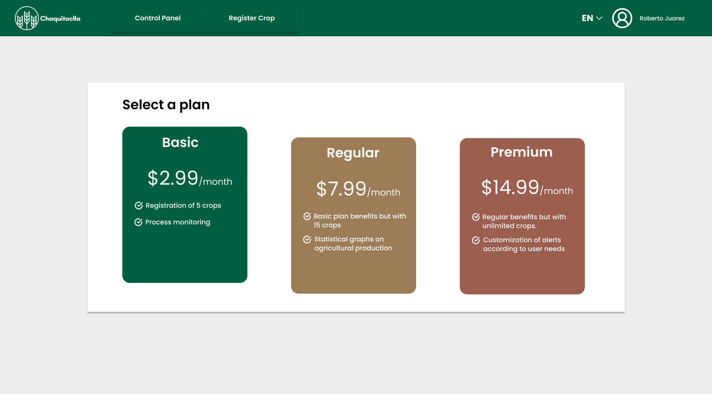

<h1 style="text-align: center;"> Informe del TB1  </h1>
<h2 style="text-align: center;"> Universidad Peruana de Ciencias Aplicadas </h2>

<h4 style="text-align: center;"> Ingeniería de Software </h4>
<h4 style="text-align: center;"> Aplicaciones Web </h4>
<h4 style="text-align: center;"> Ciclo 2024-01 </h4>
<h4 style="text-align: center;"> WS53 </h4>
<h4 style="text-align: center;"> Docente: Angel Augusto Velasquez Nuñez </h4>
<h4 style="text-align: center;"> Startup:  Error 404 </h4>
<h4 style="text-align: center;"> Producto: Chaquitaclla  </h4>

## Team Members
|             Nombre              | Código de alumno |
|:-------------------------------:|:----------------:|
|    Guillen Luna, Paolo César    |    U202124343    |
| Quispe Condori, Fernando Daniel |    U20221C628    |
|   Llamo Sánchez, Amner Levi     |    U20221C376    |
|  Cantoral Paredes, Diego André  |    U20201F568    |
|                                 |                  |

## Registro de versiones del informe
|   Fecha    | Versión |      Autor      |                                 Descripción de modificación                                 |
|:----------:|:-------:|:---------------:|:-------------------------------------------------------------------------------------------:|
| 28/03/2024 | 1.0     |  Guillen Paolo  | Creación del documento de trabajo en formato markdown junto al realizamiento de la carátula |
| 31/03/2024 | 1.1     | Quispe Fernando |                       Capitulo 2 - Formulacion Preguntas Entrevistas                        |
| 31/03/2024 | 1.2     | Diego Cantoral  |                             Desarrollo parcial del capítulo 1                               |
| 10/04/2024 | 1.3     | Guillen Paolo, Fernando Quispe, Diego Cantoral , Amner Llamo| Creación del figma para la creación de landing page y creación de los guidelines a seguir, análisis de las entrevistas realizadas y participación en la creación de la landing page en HTML| 

## Project Report Collaboration Insights

URL del repositorio del proyecto: 

**TB1**

|                       Integrante                       |                      Tareas Asignadas                       |
|:------------------------------------------------------:|:-----------------------------------------------------------:|
|               Guillen Luna, Paolo César                |                  Desarrollo de la carátula                  |
|            Quispe Condori, Fernando Daniel             | Elaboración Preguntas de Entrevitas - Artefactos Capítulo 2 |
|            Cantoral Paredes, Diego André               | Elaboración Antecedentes y problemáticas y descripción de startup|

***TB1 Github***

## Contenido 
1. [**Capítulo I: Introducción.**](#1.)  
1.1. [***Startup Profile***](#1.1.)  
1.1.1. [Descripción del startup](#1.1.1.) 
1.1.2.[Perfiles de los integrantes del equipo](#1.1.2.) 
1.2. [***Solution Profile***](#1.2.) 
1.2.1. [Antecedentes y Problemática](#1.2.1.) 
1.2.2. [Lean UX Process](#1.2.2.) 
1.2.3. [Lean UX Problem Statements](#1.2.3.) 
1.2.4. [Lean UX Assumptions](#1.2.4.) 
1.2.5. [Lean UX Hypothesis Statements](#1.2.5.) 
1.2.6. [Lean UX Canvas](#1.2.5.) 
1.3. [***Segmentos objetivo***](#1.2.6.) 
2. [**Capítulo II: Requirements Elicitation & Analysis**](#2.) 
2.1. [***Competidores***](#2.1.) 
2.1.1. [Análisis competitivo](#2.1.1.) 
2.1.2. [Estrategias y tácticas frente a competidores](#2.1.2.) 
2.2. [***Entrevistas***](#2.2.) 
2.2.1. [Diseño de entrevistas](#2.2.1.) 
2.2.2. [Registro de entrevistas](#2.2.2.) 
2.2.3. [Análisis de entrevistas](#2.2.3.) 
2.3. [***Needfinding***](#2.3.) 
2.3.1. [User Personas](#2.3.1.) 
2.3.2. [User Task Matrix](#2.3.2.) 
2.3.3. [User Journey Mapping](#2.3.3.) 
2.3.4. [Empathy Mapping](#2.3.4.) 
2.3.5. [As-is Scenario Mapping](#2.3.5.) 
2.4. [***Ubiquitous Language***](#2.4.) 
3. [**Capítulo III: Requirements Specification**](#3.) 
3.1. [***To-Be Scenario Mapping***](#3.1.) 
3.2. [***User Stories***](#3.2.) 
3.3. [***Impact Mapping***](#3.3.) 
3.4. [***Product Backlog***](#3.4.) 
4. [**Capítulo IV: Product Design.**](#4.) 
4.1. [***Style Guidelines***](#4.1.) 
4.1.1. [General Style Guidelines](#4.1.1.) 
4.1.2. [Web Style Guidelines](#4.1.2.) 
4.2. [***Information Architecture***](#4.2.) 
4.2.1. [Organization Systems](#4.2.1.) 
4.2.2. [Labeling Systems](#4.2.2.) 
4.2.3. [SEO Tags and Meta Tags](#4.2.3.) 
4.2.4. [Searching Systems](#4.2.4.) 
4.2.5. [Navigation Systems](#4.2.5.) 
4.3. [***Landing Page UI Design***](#4.3.) 
4.3.1. [Landing Page Wireframe](#4.3.1.) 
4.3.2. [Landing Page Mock-up](#4.3.2.) 
4.4. [***Web Applications UX/UI Design***](#4.4.) 
4.4.1. [Web Applications Wireframes](#4.4.1.) 
4.4.2. [Web Applications Wireflow Diagrams](#4.4.2.) 
4.4.3. [Web Applications Mock-ups](#4.4.3.) 
4.4.4. [Web Applications User Flow Diagrams](#4.4.4.) 
4.5. [***Web Applications Prototyping***](#4.5.) 
4.6. [***Domain-Driven Software Architecture***](#4.6.) 
4.6.1. [Software Architecture Context Diagram](#4.6.1.) 
4.6.2. [Software Architecture Container Diagrams](#4.6.2.) 
4.6.3. [Software Architecture Components Diagrams](#4.6.3.) 
4.7. [***Software Object-Oriented Design***](#4.7.) 
4.7.1. [Class Diagrams](#4.7.1.) 
4.7.2. [Class Dictionary](#4.7.2.) 
4.8. [***Database Design***](#4.8.) 
4.8.1. [Database Diagram](#4.8.1.) 
5. [**Capítulo V: Product Implementation, Validation & Deployment**](#5.) 

## Student Outcomes
|Criterio especifico|Acciones realizadas|Conclusiones|
|-|:-|-|
|||
|||

<h2>Capítulo I: Introducción</h2>

<h3> 1.1 Startup Profile</h3>

En esta sección se presenta la descripción del startup y los perfiles de los miembros del equipo.

<h4> 1.1.1. Descripción del startup</h4>

Nuestra startup, Error 404 , tiene como misión ofrecer una solución integral de gestión agrícola. A diferencia de otras plataformas que se enfocan exclusivamente en el sector empresarial, nosotros también tenemos un fuerte enfoque en el público en general. Queremos ser la opción para todos: desde aquellos que se aventuran por primera vez en la agricultura hasta los más experimentados.

Para lograrlo, hemos desarrollado una plataforma que organiza y simplifica la gestión de cultivos para nuestros usuarios. Cada cultivo se sigue a lo largo de su ciclo fenológico, y además, mantenemos registros históricos para determinar las temporadas óptimas de siembra y cosecha de diferentes insumos. Esto permite una trazabilidad efectiva y ayuda a nuestros usuarios a alcanzar sus metas a largo plazo.

En resumen, nuestra misión es brindar una nueva opción en el mundo agrícola, democratizando el acceso a herramientas eficientes y fomentando el éxito de todos los involucrados.

**Misión:** Ofrecer una solución integral de gestión agrícola que trascienda los límites tradicionales y que se encuentre disponible para todo el público.

**Visión:** ChaquiTaclla se direcciona a ser la plataforma mayormente reconocida en lo que respecta a la gestión agrícola en los próximos años por su accesibilidad y facilidad de uso. 
Mientras que como startup, AgriCulture, busca ser reconocido como un equipo autosustentable y capaz de brindar soluciones innovadoras en el campo de la agricultura moderna.

##### Logotipo de la Startup:

<h4> 1.1.2. Perfiles de los integrantes del equipo</h4>

|                                                                                                                                                                                                          Descripción de los perfiles de los integrantes del equipo                                                                                                                                                                                                           |                                                              Foto del integrante                                                              |
|:----------------------------------------------------------------------------------------------------------------------------------------------------------------------------------------------------------------------------------------------------------------------------------------------------------------------------------------------------------------------------------------------------------------------------------------------------------------------------:|:---------------------------------------------------------------------------------------------------------------------------------------------:|
| Mi nombre es **Paolo César Guillen Luna**, estudiante de la carrera de Ingeniería de Software, en la UPC y fanático de los videojuegos. Me considero alguien creativo y con determinación en alcanzar sus metas, dentro del campo del desarrollo de software, me gustaría especializarme en lo que es el testing de este, razón por la cual aparte de seguir la malla curricular de mi carrera también ando aprendiendo herramientas diversas como Playwright, Cypress, etc. |      |
| Mi nombre es Diego André Cantoral Paredes y soy estudiante de la carrera de Ingeniería de Software. Desde siempre me interesaron los temas tecnológicos y sobre todo las computadoras, por lo que desarrollé una afición a los videojuegos y luego a la programación. Me considero una persona responsable, creativa y siempre dispuesto a ayudar a mis compañeros.|      |
|Mi nombre es Fernando Quispe, soy una persona proactiva que puede aportar y liderar la colaboración en equipo con el objetivo de un logro común. Me gusta el desarrollo de software y poder contribuir a la sociedad con lo que me apasiona. Tengo como meta adquirir los conocimientos de una manera clara para poder aplicarlos en los distintos proyectos tal cuál como el proyecto actual. |  |
|Mi nombre es **Amner Levi Llamo Sánchez**, soy estudiante del quinto ciclo de ingeniería de software en la UPC. Me gusta jugar fútbol y videojuegos, por eso estoy constantemente investigando sobre nuevas tecnologías. Soy responsable con los trabajos que se me asignan; además soy tolerante y me adapto a las circunstancias del equipo.||

<h3> 1.2. Solution Profile</h3>

<h4> 1.2.1. Antecedentes y Problemática</h4>

##### What (Qué)
###### ¿Cuál es el problema?
El problema radica en la ausencia de alguna herramienta que permita gestionar, medir y seguir los cultivos para el público general; puesto que la mayoría de estas herramientas son software empresariales hechos a la medida. A pesar de la diversa información que pueda existir en internet sobre como gestionar adecuadamente un cultivo, buscar dicha información y que la fuente sea confiable es complicado, además que causa una pérdida del tiempo al usuario, puesto que debe indagar estos datos adecuadamente.

##### When (Cuando)
###### ¿Cuándo sucede el problema?
El reto se presenta cuando agricultores, tanto principiantes como profesionales, requieren una herramienta para gestionar sus cultivos de manera eficiente, teniendo en cuenta aspectos como el entorno, los procesos fenológicos de sus cultivos, los cambios climáticos y la temporada propicia para el cultivo. Lamentablemente, gran parte de las herramientas existentes en este campo están diseñadas para empresas y no están al alcance de todos. 

##### Where (Dónde)
###### ¿A dónde se dirige?
Nuestra solución esta dirigida a aquellos individuos ,que sin importar su experiencia en el sector agrícola, quieren incorporar una herramienta de gestión agrícola sencilla y moderna.

###### ¿Dónde surge el problema?
El problema surge durante el proceso de crecimiento de los cultivos, desde la germinación de la semilla hasta la cosecha, al haber una ausencia de gestión, el cultivo puede sufrir diversas consecuencias negativas.

##### Who (Quién)
###### ¿Quiénes están involucrados? ¿Quién lo utilizará?
Los involucrados serían los usuarios del sistema, los cuales se separarían en nuestros segmentos objetivos, profesionales del campo de agricultura y aquellos principiantes o que tienen un pequeño cultivo en su hogar. La solución la utilizará aquel que desee gestionar sus cultivos de una manera más eficaz, siguiendo sus procesos fenológicos y tener un fecha aproximada de cuando estaría listo para la cosecha; esto puedo ser utilizado tanto por profesionales como principiantes del sector agrícola.

##### Why (Por qué)
###### ¿Cuál es la causa del problema?
La principal dificultad de este problema radica en introducir una solución moderna en un campo que normalmente se maneja con herramientas más tradicionales. En el ámbito de la agricultura, aquellos que gestionan sus cultivos de manera personal, como los agricultores que viven en las provincias del Perú con sus “chacras” establecidas, están más familiarizados con las herramientas tradicionales. Implementar una solución moderna, como una aplicación web que reemplace estas herramientas por algo más sencillo, es complicado debido a la desconfianza que algunos todavía tienen hacia la tecnología.

Por otro lado, para nuestro segmento objetivo de principiantes en la agricultura, el desafío consiste en generar confianza en que nuestro producto es superior a las alternativas disponibles en el mercado.

#### 2H
##### How (Cómo)
###### ¿Cómo se utilizará el producto?

El producto será empleado para el registro de cultivos y seguimiento de sus procesos fenológicos. Desde la germinación de la semilla, hasta el momento de la cosecha de este, por esta razón nuestra aplicación estaría brindando consejos según el estado del cultivo para propiciar una cosecha próspera.

###### ¿Cómo se logrará una gestión adecuada de los cultivos dentro de la plataforma?

Los usuarios a partir de su acceso a nuestra aplicación mediante un navegador web, podrán empezar a registrar sus cultivos. Esto al ser un proceso manual, el usuario tendrá que categorizar el tipo de cultivo, en qué proceso fenológico se encuentra y descripción del área de donde se encuentra cultivado este. A partir de este registro manual, la aplicación brindará al usuario consejos y medidas que podría tomar con el fin de mejorar la calidad de este.

##### How much (Cuánto)
###### ¿Cuál es la magnitud del problema?

Según el Ministerio de Agricultura y Desarrollo Rural de Colombia (2022), solo el 15% del sector agro usa tecnología de última generación, este porcentaje presentó resultados positivos en lo que respecta a la mejora de la calidad de sus productos, a comparación del 85% restante. Además que según UNCTAD(Organización de las Naciones Unidas para la Agricultura y la Alimentación), los agricultores familiares al ser comunes en países en desarrollo, estos en su mayoría son pobres, sin embargos entre estos agricultores, aquellos que tuvieron la oportunidad de implementar herramientas digitales para el monitoreo de sus cultivos, se vio una mejora en la calidad de estos.

###### ¿Qué porcentaje de la industria agrícola se vería beneficiada por nuestro producto?

Si consideramos lo mencionado en el punto anterior y suponemos que nuestro producto tiene éxito, podríamos beneficiar al 80% de los agricultores, tanto principiantes como profesionales. Además que según datos proporcionados por un artículo publicado en Science en el año 2020, aquellos agricultores que recibieron asesoramiento para adoptar herramientas digitales lograron cambiar y mejorar sus prácticas lo que supone una mejora en la calidad de los productos que brindan.

<h4> 1.2.2. Lean UX Process</h4>

<h5> 1.2.2.1. Lean UX Problem Statements</h5>

##### **Problem Statement:** 

Chaquitaclla, nuestra solución, tiene como objetivo proporcionar a los agricultores, tanto principiantes como profesionales, una herramienta de gestión para sus cultivos. Esta herramienta se diseñó para ser ágil, sencilla de usar e implementar en sus labores, permitiendo que trabajen con ella de manera eficiente.

El problema surge al registrar las características de cada cultivo de forma individual. Los métodos tradicionales de gestión, como los registros en papel y las hojas de cálculo, pueden llevar a omitir detalles cruciales. Por ejemplo, no considerar el proceso fenológico en el que se encuentra un cultivo o evaluar si la temporada actual es la más adecuada para él.

A pesar de los prejuicios sobre la implementación de tecnología en la agricultura, los datos estadísticos demuestran que aquellos que han adoptado herramientas digitales, como sistemas de gestión de cultivos, han obtenido beneficios significativos. Estos sistemas proporcionan datos más precisos y evitan la pérdida de información relevante. Por lo tanto surge la pregunta de ¿Cómo podemos implementar una gestión automatizada de la información de los cultivos sin generar desconfianza en los agricultores y asegurando que tendrán una mejora de calidad en sus cultivos al hacer uso de esta?

<h5> 1.2.2.2. Lean UX Assumptions</h5>

##### **Business Assumptions:**
1. **Creemos que nuestros usuarios necesitan** una forma más eficiente de registrar y seguir los procesos de sus cultivos sin importar si es a nivel profesional o personal.
2. **Estas necesidades se pueden satisfacer con** el desarrollo de una plataforma web que les permita registrar los datos de sus cultivos de una manera segura y confiable, para hacerl seguimiento de los distintos procesos por el cual su cultivo pasa.
3. **Nuestros clientes iniciales serán** los agricultures que inician en este sector y los agricultores que buscan mejorar como gestionar sus cultivos con herramientas digitales.
4. **El valor más importante que quiere un cliente de nuestros servicios es** registrar los datos de sus cultivos y que estos estén seguros de que no se van a perder, además de poder visualizar sus registros a largo plazo.
5. **El cliente también va a obtener** gráficos estadísticos sobre cual ha sido lo que más ha a cultivado en alguna temporada del año y estadísticas de que es lo más cultivado en la temporada actual.
6. **Vamos a obtener la mayoría de los clientes mediante**  publicidad en foros de agricultura y participando en eventos relacionados a la agricultura. 
7. **Vamos a obtener ingresos mediante** un modelo de suscripción separado en tres niveles, siendo el más bajo un plan básico. 
8. **Nuestra competencia en el mercado serán** herramientas digitales que se dediquen a la gestión de productos agrícolas y que tengan una clientela fija.
9. **Vamos a tener ventaja frente a nuestra competencia debido a** nuestra accesibilidad, puesto que la mayoría de nuestra competencia solo provee sus productos a un sector empresarial.
10. **El mayor riesgo del producto es**  no captar suficiente atención en el sector agrícola debido a la desconfianza inherente hacia los nuevos productos en el mercado. Esta desconfianza se origina en la naturaleza conservadora del sector agrícola, que no suele adoptar cambios en su enfoque empresarial con facilidad.
11. **Lo resolveremos realizando** el desarrollo de una plataforma atractiva y de uso sencillo para el público en general. Además, realizaremos encuestas entre los interesados en nuestros productos para identificar qué aspectos específicos les resultan atractivos. Esta información nos permitirá implementar características específicas como herramientas de gestión para sus cultivos.

##### **User Assumptions:**
###### **¿Quién es el usuario?**   

El usuario de nuestro producto son agricultores tanto principiantes como profesionales que buscan registrar sus cultivos y hacerles un seguimiento de sus procesos fenológicos mediante el uso de herramientas digitales. En caso nuestro producto sea exitoso, este segmento se expandiría hasta las empresas agrícolas, las cuales para satisfacer sus necesidades tendríamos que implementar nuevas funciones.

###### **¿Qué problemas tiene nuestro producto? ¿Resolver?**

Nuestro desafío central radica en que todos los procesos de registro de cultivos deben realizarse de forma manual. Esto implica registrar detalles como la fecha, las acciones necesarias para el cuidado del cultivo y otros aspectos relevantes. Para abordar esta limitación, consideramos la implementación de soluciones basadas en el Internet de las Cosas (IoT). Estas soluciones podrían incluir rociadores automáticos específicos para cada cultivo y sensores que detecten el estado actual del proceso. Sin embargo, es importante destacar que solo podremos lograr esta automatización si nuestro producto tiene éxito desde sus primeras etapas de desarrollo.

###### **¿Qué características son importantes?**

Dentro de las características más relevantes de nuestros productos, destacan su accesibilidad. Esto es especialmente significativo, dado que, en la mayoría de los casos, las soluciones similares están dirigidas exclusivamente al ámbito empresarial. Además, nuestra plataforma se enfoca en el registro y monitoreo de las fases fenológicos de los cultivos. Estas etapas abarcan desde la germinación hasta el momento en que el cultivo está listo para la cosecha. Proporcionar un seguimiento detallado de estas fases permite a los agricultores tomar decisiones informadas sobre el manejo de sus cultivos, como la aplicación de fertilizantes, el riego adecuado y la prevención de enfermedades.

###### **¿Dónde encaja nuestro producto en su trabajo o vida?**

El producto encaja en la mejora de la gestión de cultivos, principalmente en qué cuidados se deben brindar según el proceso fenológico actual del cultivo, lo que radica en una mejora de la calidad y reducción de posibles gastos innecesarios.

###### **¿Cuándo y cómo es nuestro producto usado?**

Nuestro producto es utilizado por nuestros segmentos objetivos cuando existe la necesidad de tomar registros de cultivos nuevos y seguir su crecimiento de una forma adecuada, esto a partir de como nuestro producto le pide al usuario registrar el proceso actual del cultivo, estado y fase fonológica que se encuentre, todo esto con el fin de mejorar las posibilidades de obtener una mejor cosecha. 

###### **¿Cómo debe verse nuestro producto y cómo debe comportarse?**
El producto debe contar con una interfaz sencilla, dinámica e inclusiva. Debe ser de fácil uso con el fin de que aquellos nuevos utilizando una herramienta digital de este tipo, tengan la menor cantidad de incovenientes posibles. El comportamiento de nuestra aplicación debe ser dirigida en relación a guardar la integridad de los usuarios y evitar la pérdida de datos relevantes para ellos.

###### **Feature Assumptions:**

**Creemos que** una interfaz intuitiva y fácilmente accesible permitirá que tanto agricultores principiantes como profesionales adopten nuestra aplicación con mayor facilidad. Esto facilitará una rápida comprensión del funcionamiento de la aplicación y contribuirá a una adopción más amplia entre la comunidad agrícola.

**Creemos que**  al incluir herramientas estadísticas y opciones de visualización de datos, proporcionaremos a los agricultores profesionales la capacidad de tomar decisiones informadas sobre qué cultivos plantar en cada temporada. Esto favorecerá la aceptación de la aplicación y su utilidad en la toma de decisiones agrícolas estratégicas.

**Creemos que** al ofrecer notificaciones y avisos sobre la proximidad de la cosecha y los cambios en las fases fenológicas de los cultivos, ayudaremos a los agricultores a prepararse adecuadamente. Esto se traducirá en una mejora de la calidad de los productos agrícolas y una mayor eficiencia en la gestión de los cultivos.

**Creemos que**  la inclusión de encuestas permitirá a los usuarios proporcionar retroalimentación continua sobre la aplicación. Esta retroalimentación nos ayudará a corregir cualquier error rápidamente y a mejorar la experiencia del usuario, lo que a su vez fortalecerá la confianza en la aplicación y su utilidad a largo plazo.

<h5> 1.2.2.3. Lean UX Hypothesis Statements.</h5>

* **Hypothesis Statement 01:**
    
    **Creemos que** tanto los agricultores principiantes como los profesionales estarán dispuestos a adoptar nuestra aplicación de gestión de cultivos para llevar un registro más eficiente de sus procesos fenológicos y características de los cultivos
    
    **Sabremos** que hemos tenido éxito
    
    **Cuando** observemos que la tasa de usuarios activos de nuestra aplicación durante el primer año supera el 40% del total de agricultores en Perú. Esto indicará una adopción significativa y una respuesta positiva por parte de la comunidad agrícola.

* **Hypothesis Statement 02:**
    
    **Creemos que** al proporcionar datos históricos sobre qué cultivo prospera mejor en cada temporada específica y brindar información sobre los cuidados necesarios, nuestra aplicación permitirá a los agricultores profesionales tomar decisiones informadas sobre qué cultivar en la temporada actual
    
    **Sabremos** que hemos tenido éxito
    
    **Cuando** observemos en los registros que los cultivos más comunes durante la presente temporada son precisamente aquellos que nuestra aplicación recomendó. Esto indicará que estamos influyendo positivamente en las decisiones de cultivo y en la calidad de las cosechas.
  
* **Hypothesis Statement 03:**
    
    **Creemos que** al proporcionar consejos específicos a los agricultores sobre los cuidados necesarios para cada etapa fenológica de sus cultivos, lograremos mejorar significativamente la calidad de los productos agrícolas
    
    **Sabremos** que hemos tenido éxito
    
    **Cuando** encuestas a los agricultores profesionales y ellos reporten una percepción positiva de la mejora en la calidad de sus productos. Además, si observamos un aumento en las ventas como resultado directo de estas mejoras, consideraremos que estamos en el camino correcto.

* **Hypothesis Statement 04:**
    
    **Creemos que** nuestra aplicación reducirá significativamente la pérdida de datos y proporcionará información más precisa en comparación con los métodos de registro manuales
    
    **Sabremos** que hemos tenido éxito
    
    **Cuando** comencemos a recibir reseñas positivas de los usuarios. En particular, si destacan nuestra capacidad para mantener la información respaldada de manera efectiva, consideraremos que estamos en el camino correcto.
  

<h5> 1.2.2.4. Lean UX Canvas</h5>

El Lean UX Canvas es una herramienta que se utiliza en el campo del diseño centrado en el usuario (UX) y la metodología Lean para optimizar la creación y el desarrollo de productos. Su objetivo principal es proporcionar un marco estructurado para la colaboración entre equipos multidisciplinarios. A través de esta herramienta, los equipos pueden visualizar y analizar aspectos clave del diseño y la experiencia del usuario, lo que facilita la toma de decisiones informadas durante el proceso de desarrollo.

## ***Lean UX Canvas realizado en la aplicación web "Mural":*** 

Enlace para acceder al [Canvas](https://app.mural.co/t/aplicacionesweb8834/m/aplicacionesweb8834/1711846472456/3aafbeea2aa64e5c9fea104736a8e04377fc040d?sender=uab21ffc4c80101532b361326)

<h3> 1.3. Segmento objetivo</h3>

En el contexto de la agricultura y su relación con la tecnología, se presentan dos aspectos relevantes: la adopción de herramientas digitales por parte de los agricultores en países desarrollados y la creciente tendencia de aficionados a la agricultura. Según datos de la FAO, aproximadamente el 80% de los agricultores en países desarrollados utilizan internet para acceder a información agrícola, y se ha observado un incremento en la adopción de aplicaciones móviles agrícolas, con un crecimiento anual del 15-20%. Estos avances tecnológicos han contribuido a reducir las pérdidas poscosecha en un rango similar. En contraste, en países en desarrollo, menos del 20% de la población rural posee habilidades básicas para el manejo de tecnologías digitales, y la mayoría de los agricultores aún optan por métodos tradicionales, lo que resulta en una pérdida sustancial de ingresos y un subaprovechamiento del potencial productivo. Además, los aficionados a la agricultura muestran un creciente interés, pero muchos prefieren seguir prácticas tradicionales en lugar de adoptar herramientas digitales debido a la falta de aplicaciones específicas para su uso. Esto conlleva a una pérdida de tiempo al tener que buscar información individualmente en internet . Todo esto significaría que si logramos que nuestro producto sea más accesible para todos, cumpliría la necesidad básica para nuestro segmento de aficionados, mientras que al implementar una interfaz intutitiva con datos claros y sencillos de entender, nuestro segmeneto de agricultores profesionales y/o comerciales podrían brindar un vistazo a nuestra aplicación para aumentar la calidad de sus cultivos a partir de una gestión mucho más eficiente que los métodos tradicionales.

<h4> 1.3.1 Stakeholders</h4>

* **Stakelholder Internos:** Integrantes pertenecientes al equipo de desarrollo, además del equipo creador de la startup, [NombreStartup]
* **Stakelholder Externos:** Sector agrícola empresarial, vendedores de productos naturales y estudiantes de alguna relacionada con la agricultura.

[//]: #CAPITULO2

<h2> Capítulo II: Requirements Elicitation & Analysis</h2>

  
<h3> 2.1. Competidores</h3>

  
  
<h4> 2.1.1. Análisis competitivo</h4>

  
  ||Chaquitaclla  ||||
|:-:|:-:|:-:|:-:|:-:|
|Overview|Plataforma digital que organiza la gestión en el área de producción en cultivos agrícolas. ||||
|Ventajas Competitivas|Registro avanzado y monitoreo de las fases fenológicos de los cultivos||||
|Mercado Objetivo|Desde agricultores amateurs hasta agricultores profesionales|||
|Estrategias de Marketing|Enfoque en nuevos clientes iniciando en el mundo de la agricultura.||||
|Productos & Servicios|Software de gestion agricula, asesoramiento económico.||||
|Precios & Costos|Basado en suscripción||||
|Canales de distribución (WEB y/o Movil)|Plataforma web||||
|Fortalezas|Monitoreo de ultima generacion para la gestión agrícola.||||
|Debilidades|Enfoque solo en el proceso de producción.||||
|Oportunidades|Captar a los agricultores amateurs y principiantes en el mundo de la agricultura.||||
|Amenazas|Aparición de soluciones más completas, aplicaciones son herramientas más actualizadas.||||

  
<h4> 2.1.2. Estrategias y tácticas frente a competidores</h4>

  
  A partir del análisis competitivo realizado se logró identificar las fortalezas, debilidades, oportunidades y amenazas destacadas en los competidores. Esta información adquirida es esencial para trazar estrategias y tácticas para diferenciarnos de nuestros competidore. A continuación se brindará tanto estrategias como tácticas para alcanzar esta meta:

 **Fortalezas de nuestros competidores**

 * Amplia variedad de cultivos con los que trabajar y gestionar adecuadamente.
 * Cálculos estables basadas en herramientas estadísticas.
 * Todos cuenta con un tiempo de más de dos años como mínimo en el mercado agrícola.

Teniendo en cuenta esto, ¿cuáles son nuestras fortalezas?

 * Registro y monitoreo de los cultivos de forma eficiente, siguiente cada fase fenológica independientemente del cultivo.
 * Accesibilidad, nuestros competidores se enfocan en brindar sus productos únicamente a empreas, nosotros a un público más general.

 Por lo tanto, podemos aplicar ciertas estrategias y tácticas:

 **Estrategias**
  
  * Brindar al usuario las herramientas que necesita para el correcto cultivo de su cultivo.

  **Tácticas**

  * Incluir herramientas de recomendaciones según el proceso fenológico por el cual el cultivo del usuario esté pasando.

  **Debilidades de nuestros competidores**

  Nuestros competidores no ofrecen un producto perfecto, algunos se enfocan en solo un tipo de producto y otros tienen precios elevados.

  * Centralización de un solo producto.
  * Poca personalización para registrar los cultivos. 
  * Localización restringida únicamente a una región en el mundo.
  * Interfaz poco intuitiva

  **Estrategias**
 
  * Mantener actualizaciones de los cultivos a registrar de forma constante y brindar una personalización más amplia a los usuarios para sus registros.

  **Tácticas**

  * Implementar un sistema de reseñas donde el usuario pueda indicarnos si el cultivo que quiere registrar se encuentra o no en la plataforma. 
  * Proporcionar un video guía o una sucesión de imágenes para utilizar nuestro producto.

  **Oportunidades de nuestros competidores**

**Estrategias**

  **Tácticas**

  **Amenazas de nuestros competidores**

**Estrategias**

  **Tácticas**
 
  
<h3> 2.2. Entrevistas</h3>

  
  
<h4> 2.2.1. Diseño de entrevistas</h4>

  
En esta sección se procederá a detallar las preguntas para el método de recoleccion de
  requisitos que son las entrevistas. Para la formulación se siguieron buenas prácicas tales como 
  formulación de preguntas abiertas, así mismo obtenemos características demográficas con las entrevistas
  

  <h4>PREGUNTAS GENERALES</h4>
  
Bienvenido gracias por brindarnos esta entrevista (empieza con las preguntas generales) 

  
  * Nos gustaría saber su nombre, edad y ocupación
  * ¿Qué tan acostumbrado está con el uso de tecnología en su vida diaria?
  * Dentro de su vida diaria, ¿tiene incovenientes utilizando dichas herramientas digitales?
  * Alguna vez tuvo que enfrentarse con una situación donde usted no entendía para nada como servía una aplicación, de ser así, ¿cómo sobrellevo ese problema?

  <h4>SECTOR AGRICULTORES PROFESIONALES: </h4>
  
  
1. ¿Cuál es el proceso que sigue para llevar un registro de sus cultivos?

  
2. ¿Utiliza alguna herramienta para llevar un registro de sus cultivos?

  
3. ¿Cuáles son los datos que considera más relevante al momento de gestionar sus cultivos?

  
4. ¿Qué dificultades ha encontrado al llevar un registro de sus cultivos?

  
5. Dentro de estas dificultades, ¿hubo alguna vez que tuvo algún tipo de pérdidas, sea económicas o de tiempo? 
  
6. (Comentar la propuesta) ¿Qué mejoras le gustaría ver en una herramienta de gestión de cultivos?

  
7. ¿Qué tan dispuesto estaría en adoptar una herramienta digital para la gestión de sus cultivos?

  
8. Teniendo en cuenta que usted estaría dispuesto en adoptar una herramienta digital para la gestión de sus cultivos ¿Cuánto pagaría por esta?

  
9. ¿Qué tan dispuesto estaría en pagar por una herramienta de gestión de cultivos?

  
10. ¿Qué tan importante considera la trazabilidad de sus cultivos?

  
11. ¿En qué medidas una herramienta de este tipo podría ser útil para sus necesidades como agriculor?

  

  <h4>SECTOR JARDINEROS EN CASA</h4>

  
Bienvenido gracias por brindarnos esta entrevista (empieza con las preguntas al segmento) 

  
Bienvenido gracias por brindarnos esta entrevista, primaremente nos gustaría conocer
  su nombre completo, edad, dónde reside, estado civil y su ocupación. 

  
1. ¿Cuál es el proceso que sigue para llevar un registro de sus cultivos en su hogar?

  
2. ¿Utiliza alguna herramienta para llevar un registro de sus cultivos?

  
3. ¿Cuál es su principal motivación para cultivar para usted mismo en casa?

  
3. ¿Cuáles son los datos que considera más relevante al momento de gestionar sus cultivos?

  
4. ¿Qué dificultades ha encontrado al llevar un registro de sus cultivos?

  
5. (Comentar la propuesta) ¿Qué mejoras le gustaría ver en una herramienta de gestión de cultivos?

  
6. ¿Qué tan dispuesto estaría en adoptar una herramienta digital para la gestión de sus cultivos?

  
7. ¿Qué tan importante considera la tecnología en la gestión de sus cultivos?

  
8. ¿Qué tan dispuesto estaría en pagar por una herramienta de gestión de cultivos?

  
9. ¿Qué tan importante considera la trazabilidad de sus cultivos?

  
10. ¿Qué tan importante considera la gestión de los procesos fenológicos de sus cultivos?

  
<h4> 2.2.2. Registro de entrevistas</h4>

  ***Entrevistas a agricultores profesionales***
  
|Nombre entrevistado|Clever Medina|
|-|-|
|Edad|42 años|
|Departamento|Tumbes|
||Clever Medina, un agricultor residente en el departamento de Tumbes, se especializa en los cultivos de cacao y limón. Aunque su ocupación actual es la agricultura, también posee conocimientos en mecatrónica. Clever gestiona sus cultivos basándose en su experiencia en el campo. Sin embargo, enfrenta dificultades cuando los cultivos no crecen como esperaría. En esos momentos, recurre a información encontrada en Google y sigue los pasos recomendados, en caso la información encontrada no sirva en la práctica, esto resulta en pérdidas económicas y de tiempo para Clever. Al mencionarle sobre la propuesta y preguntarle si él cree que les haría un beneficio a él y a sus compañeros agricultores dice lo siguiente: "Claro, pues como te mencione, como agricultor quiero mejorar la calidad de mis cultivos y si existiese una aplicación de ese tipo y las recomendaciones que brinda me aseguran que podría mejorar la calidad, no solo me ayudaría económicamente sino que también me ayudaría a ahorrar tiempo y así podría mejorar otros aspectos de mis cultivos"|
|Duración entrevista: 16:15  |URL: [https://drive.google.com/file/d/1G1Q4E9hMcd82o3uekWFwiJWfr5Vp7D5P/view?usp=sharing]|

|Nombre entrevistado|Paulino Guillen|
|-|-|
|Edad||
|Departamento|Lima|
|||
|Duración entrevista:   ||

|Nombre entrevistado| Eloy Cantoral|
|-|-|
|Edad|65 años|
|Departamento|Lima|
||Eloy Cantoral es un agricultor de alta experiencia que se especializa en el cultivo de legumbres, frutas y verduras en la zona de Saisa, en Ayacucho. Durante la entrevista, indicó que el proceso de realizar la agricultura ha cambiado mucho a través del tiempo y que actualmente es necesario que se lleve de la mano con la tecnología. Enfatiza que contar con una aplicación que les ayude a gestionar más sus cultivos, por lo que está totalmente dispuesto a contar con una herramienta de software que añade capas de profundidad al análisis y mantenimiento de los sembríos.|
|Duración entrevista: 13 minutos   |URL: [https://youtu.be/Hr2IIXpANIU]|

 ***Entrevistas a jardineros en casa***

|Nombre entrevistado| Daniel Valverde|
|-|-|
|Edad| 20 años|
|Departamento|Lima|
||Daniel Valverde es un jardinero aficionado que cuenta con un pequeño huerto en el ático de su casa y que en sus tiempos libres cuida de sus cultivos. No cuenta con herramientas tecnológicas o físicas tan sofisticadas o de gran uso, bastándose de una libreta para sus registros y de simples macetas para sus cultivos. Estaría muy dispuesto de contar con una aplicación que le ayuda profesionalizar un poco más los sembríos que tiene y manejar de manera más inteligente sus registros. |
|Duración entrevista: 6:52 minutos  | URL: [https://youtu.be/Hr2IIXpANIU]|

|Nombre entrevistado|Noe Sánchez|
|-|-|
|Edad|24|
|Departamento|Lima|
||Noe es un joven limeño de 24 años apasionado por la agricultura urbana, que reside en Lima. Cultiva en su hogar principalmente para tener acceso a alimentos frescos y saludables, y disfruta cada etapa del proceso, desde sembrar las semillas hasta cosechar los frutos de su esfuerzo. A pesar de su amor por la agricultura, Noe admite que a veces se enfrenta a dificultades debido a la falta de herramientas tecnológicas para gestionar sus cultivos. Esta carencia ocasionalmente resulta en olvidos o confusiones sobre los insumos necesarios para cada tipo de planta. Para monitorear el estado de sus cultivos, Noe confía en métodos tradicionales como la inspección visual de las hojas y los tallos, así como la evaluación de la humedad del suelo. Sin embargo, reconoce la importancia de la tecnología en la gestión agrícola y está dispuesto a invertir en herramientas digitales que puedan mejorar su eficiencia y aumentar la productividad de sus cultivos en el futuro.|
|Duración entrevista: 5:55 minutos  |URL:[https://upcedupe-my.sharepoint.com/:v:/g/personal/u20221c376_upc_edu_pe/ETHX5fDWdptGi58hu9OR81oBVrKiTrjFId8kA5bOvgNC9w?e=caudII]|

|Nombre entrevistado||
|-|-|
|Edad||
|Departamento|Lima|
|||
|Duración entrevista:   ||

  
<h4> 2.2.3. Análisis de entrevistas</h4>

  
  
<h3> 2.3. Needfinding</h3>

    
<h4> 2.3.1. User Personas</h4>

    
En esta sección se presentan las personas que se han identificado como usuarios de la aplicación. Teniendo en cuenta
    nuestros segmentos predefinidos, AGRICULTORES y JARDINEROS. A continuación se presentan los User Persona.

 

   
IMAGEN USER PERSONA AGRICULTORES. En este artefacto para Agricultores, tenemos la representación de el segmento de AGRICULTORES.
  
    
   
IMAGEN USER PERSONA JARDINEROS. En este artefacto para Jardineros, tenemos la representación de el segmento de JARDINEROS.
  

<h4> 2.3.2. User Task Matrix</h4>

En esta sección se presentan las tareas que realizan los usuarios, teniendo en cuenta los segmentos de AGRICULTORES y JARDINEROS. A continuación se presentan las tareas de los usuarios con el artefacto de User Task Matrix.
Teniendo la escala de importancia y frecuencia, se presentan las tareas de los usuarios. Definides en un rango de Bajo, Medio y Alto.

SEGMENTO AGRICULTORES: 

|              Tareas              | Importancia | Frecuencia |
|:----------------:|:-----------:|:----------:|
|       Registro de cultivos       |    Alta     |    Alta    |
|      Monitoreo de cultivos       |    Alta     |    Alta    |
|   Revisión de recomendaciones    |    Alta     |    Alta    |
|     Revisión de estadísticas     |    Media    |   Media    |
|     Revisión de trazabilidad     |    Media    |   Media    |
| Revisión de procesos fenológicos |    Media    |   Media    |
| Revisión de cuidados necesarios  |    Media    |   Media    |
|       Revisión de calidad        |    Alta     |    Alta    |

SEGMENTO JARDINEROS:

|              Tareas              | Importancia | Frecuencia             |
|:----------------:|:-----------:|:---------------------------------:|
|       Registro de cultivos       |    Alta     | Alta|
|      Monitoreo de cultivos       |    Alta     | Alta|
|   Revisión de recomendaciones    |    Alta     | Alta|
|     Revisión de estadísticas     |    Media    | Media|
|     Revisión de trazabilidad     |    Media    | Media|
| Revisión de procesos fenológicos |    Media    | Media|
| Revisión de cuidados necesarios  |    Media    | Media|
|       Revisión de calidad        |    Alta     | Media|

<h4> 2.3.3. User Journey Mapping</h4>
A continuación se presentan los viajes de los usuarios con el artefacto de User Journey Mapping.

**SEGMENTO AGRICULTORES:**
Aquí para el segmento de agricultores se presenta el viaje del usuario con la aplicación Chaquitaclla.

**SEGMENTO JARDINEROS:**
Aquí para el segmento de jardineros se presenta el viaje del usuario con la aplicación Chaquitaclla.

<h4> 2.3.4. Empathy Mapping</h4>
En esta sección nosotros presentamos el artefacto de Empathy Mapping, donde se presentan las emociones, pensamientos y acciones de los usuarios.

**SEGMENTO AGRICULTORES:**
Aquí para el segmento de agricultores se presenta el Empathy Mapping.

**SEGMENTO JARDINEROS:**
Aquí para el segmento de jardineros se presenta el Empathy Mapping.

<h4> 2.3.5. As-is Scenario Mapping</h4>

   
En esta sección se presentan los escenarios actuales de los usuarios, teniendo en cuenta los segmentos de AGRICULTORES y JARDINEROS. A continuación se presentan los escenarios actuales de los usuarios con el artefacto de As-is.

    
  
La imagen nos muestra las fases que tiene nuestro agriculto antes de la solución, lo que hace, piensa y siente.

  
  
  
La imagen nos muestra las fases que tiene nuestro jardinero antes de la solución, lo que hace, piensa y siente.

  
<h3> 2.4. Ubiquituos Language</h3>

[//]: #CAPITULO3

<h2>Capítulo 3: Requirements Specification</h2>

<h3> 3.1. To-be scenario mapping</h3>

Se presenta el escenario ideal con nuestra solución de nuestro ususarios incluyendo nuestros 2 segmentos. 

La imagen muestra el escenario ideal de AGRICULTORES con los pasos y lo que hace, piensa y siente.

La imagen muestra el escenario ideal con los pasos de los JARDINEROS y lo que hace, piensa y siente.

<h2>Capítulo 4: Product Design</h2>

<h3> 4.1. Style Guidelines</h3>

<h3> 4.1.1. General Style Guidelines</h3>

***Brand Overview***
Nuestra startup, Error 404 , tiene como misión ofrecer una solución integral de gestión agrícola. A diferencia de otras plataformas que se enfocan exclusivamente en el sector empresarial, nosotros también tenemos un fuerte enfoque en el público en general. Queremos ser la opción para todos: desde aquellos que se aventuran por primera vez en la agricultura hasta los más experimentados.
Para lograrlo, hemos desarrollado una plataforma que organiza y simplifica la gestión de cultivos para nuestros usuarios. Cada cultivo se sigue a lo largo de su ciclo fenológico, y además, mantenemos registros históricos para determinar las temporadas óptimas de siembra y cosecha de diferentes insumos. Esto permite una trazabilidad efectiva y ayuda a nuestros usuarios a alcanzar sus metas a largo plazo.

En resumen, nuestra misión es brindar una nueva opción en el mundo agrícola, democratizando el acceso a herramientas eficientes y fomentando el éxito de todos los involucrados.

Misión: Ofrecer una solución integral de gestión agrícola que trascienda los límites tradicionales y que se encuentre disponible para todo el público.

Visión: ChaquiTaclla se direcciona a ser la plataforma mayormente reconocida en lo que respecta a la gestión agrícola en los próximos años por su accesibilidad y facilidad de uso. Mientras que como startup, AgriCulture, busca ser reconocido como un equipo autosustentable y capaz de brindar soluciones innovadoras en el campo de la agricultura moderna.

##### Logotipo de la Startup:

##### Logotipo del producto

***Brand Name:***

***Colores:***

***Tipografía:***

<h3> 4.2. Information Architecture</h3>

La solución Chaquitaclla está diseñada para ofrecer a agricultores de todos los niveles una herramienta de gestión de cultivos que sea tanto fácil de usar como ágil. La información se organiza de manera secuencial, permitiendo a los usuarios seguir el progreso de sus cultivos a través de distintas etapas dentro de la aplicación web. A través del "Panel de Control", los usuarios tienen acceso a una visión general de las funcionalidades, lo que ayuda a distinguir claramente entre el registro de procesos. Este enfoque asegura que los agricultores puedan emplear la herramienta de manera eficiente en sus labores cotidianas, mejorando así la administración de sus cultivos.

<h4> 4.2.1. Organization Systems</h4>

En Chaquitaclla, los encabezados en las secciones no esenciales de la aplicación proporcionan un resumen claro del contenido de la vista actual para los usuarios. Las secciones del panel de control están etiquetadas, lo que facilita la navegación del usuario. Todas las tarjetas incluyen títulos para identificar su contenido, y la barra de navegación muestra etiquetas textuales para las vistas principales. Este enfoque en la etiquetación asegura que tanto agricultores principiantes como experimentados puedan utilizar la herramienta de manera eficiente en sus labores agrícolas.

<h4> 4.2.2. Labeling Systems</h4>

Las secciones del panel de control están etiquetadas, lo que facilita la navegación del usuario. Además, todas las tarjetas incluyen títulos para identificar su contenido, y la barra de navegación muestra etiquetas textuales para las vistas principales. Ademas, los encabezados en las secciones no esenciales de la aplicación proporcionan un resumen claro del contenido de la vista actual para los usuarios. Este enfoque en la etiquetación asegura que tanto agricultores principiantes como experimentados puedan utilizar la herramienta de manera eficiente en sus labores agrícolas.

<h4> 4.2.3. SEO Tags and Meta Tags</h4>

Las metas etiquetas nos ayudan a indicar información codificada y especificar los metadatos. Estas no son visualizadas en los sitios web, estos son leídos por los navegadores o rastreadores web. Estas metas etiquetas facilitan el análisis de archivos HTML. y facilita el mantenimiento del contenido del archivo. Además, estas etiquetas nos ayudan en el posicionamiento de nuestra página web en los buscadores.

Las metas etiquetas que usaremos:

**Título:**

Esta etiqueta es una de las más importantes y por lo general se pone antes que cualquier otra metaetiqueta. Esta etiqueta es utilizada o leida por todos los motores de búsqueda como encabezado en las páginas de resultados de los motores de búsqueda (SERP).

**Codificación de carácteres:**

Esta etiqueta ayudará a que muestre correctamente los caracteres especiales en la página.

**Descripción:**

Esta meta etiqueta nos sirve para proporcionar un resumen del contenido de la página web. Aquí debemos dar una breve información de lo que se puede visualizar en la página.

**Palabras clave:**

En esta etiqueta se pone las palabras claves relacionadas con el tema o contenido de la página web.

**Autor y Derechos de Autor:**

Se utiliza para registrar la información del autor de la página web y la propiedad y derechos de autor.

<h4> 4.2.4. Searching Systems</h4>

La funcionalidad de búsqueda desempeña un papel crucial al facilitar a los usuarios la distinción y filtrado de la información de los registros almacenados en la aplicación. El principal propósito del sistema es presentar de manera precisa y rápida la amplia cantidad de información producida por los usuarios que emplean la herramienta. Los usuarios tienen la capacidad de buscar cultivos registrados según su fecha de ingreso y la fase en la que se encuentran

<h4> 4.2.5. Navigation Systems</h4>

Los sistemas de navegación comprenden menús de navegación en la parte superior de la Landing Page, además de un sistema de labeling que orienta a los usuarios hacia las secciones que desean visitar. Dentro de la aplicación, los usuarios atraviesan el proceso de cultivo por diferentes secciones, utilizando botones que simplifican la navegación y permiten seguir el progreso. Esta disposición asegura una experiencia de usuario eficiente y sin contratiempos, beneficiando tanto a agricultores principiantes como a profesionales.

<h3> 4.3. Landing Page UI Design</h3>

<h4> 4.3.1. Landing Page Wireframe</h4>

**Landing Page Wireframe Desktop Web Browser** 
A continuación, se presenta nuestra landing page vista desde el desktop web browser. Esta cuenta con secciones de gran relevancia para el usuario, las cuales ofrecen información sobre los beneficios que obtendrá a través del producto, los diferentes planes de pago disponibles, los perfiles de los miembros del equipo y las opiniones de nuestros clientes. Además, en esta sección encontrarán un formulario mediante el cual los usuarios podrán ponerse en contacto con los desarrolladores de la aplicación a través de un mensaje por correo electrónico.

**Landing Page Wireframe Mobile** 
A continuación, se presenta la landing page vista desde el mobile web browser. Esta incluye los mismos contenidos que el diseño desktop web browser, pero adaptados a las dimensiones del dispositivo móvil.

<h4> 4.3.2. Landing Page Mock-up</h4>

**Landing Page Mock-up Desktop Web Browser** 
A continuación, les mostramos el mockup actualizado de nuestra página de inicio. Este diseño se ha creado utilizando los wireframes previamente desarrollados y siguiendo las General Style Guidelines, asegurándonos de mantener todas las secciones pertinentes y optimizando la experiencia del usuario.

**Landing Page Mock-up Mobile** 
El mock-up para la landing page en la vista del navegador web móvil incorpora la misma estructura de los wireframes y las mismas secciones mencionados anteriormente. 

<h3> 4.4. Web Applications UX/UI Design</h3>

<h4> 4.4.1. Web Applications Wireframes</h4>

**Inicar Sesión** 
En el siguiente wireframe se muestra la sección "Iniciar sesión", donde nuestros usuarios podrán ingresar los datos necesarios para acceder a la aplicación, siempre y cuando cuenten con una cuenta previamente creada.

**Crear Cuenta** 
El siguiente wireframe muestra la sección de "Registro de usuario", donde los agricultores u horticultores podrán proporcionar a la aplicación la información necesaria para crear una cuenta y así empezar a disfrutar de los beneficios ofrecidos por ChaquiTaclla.

**Elegir Suscripción** 
El siguiente wireframe presenta la sección “Elegir plan de pago”, la cual despliega las categorías de planes disponibles en la plataforma.

**Pasarela de Pagos** 
El siguiente wireframe corresponde a la sección “Pasarela de pagos” donde los agricultores u horticultores son dirigidas a un formulario para seleccionar y registrar su método de pago.

**Mi Perfil** 
El siguiente wireframe presenta la sección "Mi perfil", donde se muestran los datos que el usuario proporcionó al registrarse en Chaquitaclla. Además, el usuario tendrá la capacidad de modificar esta información según sea necesario.

**Panel de control** 
En la sección "Panel de control", los usuarios podrán visualizar estadísticas de sus cultivos. Además, dispondrán de enlaces que los llevarán directamente a otras secciones de la aplicación.

**Lista de Cultivos** 
En la sección "Lista de cultivos" los usuarios podran ver los cultivos que se encuntran en curso. Además, si seleciona un cultivo va a tener acceso a mas información del mismo y tambien podran añadir cultivos.

**Añadir Cultivo** 
En la sección "Añadir Cultivo" los usuarios tiene que llenar los parametros necesarios para poder añadir un cultivo.

**Información General** 
Esta sección forma parte de "Información del cultivo". Aquí se despliegan detalles como el nombre del cultivo, la fecha de inicio, el área plantada y una descripción del mismo.

**Cuidado de Cultivos** 
Esta sección forma parte de "Información del cultivo". Aquí se muestra la fase fenológica del cultivo, la fecha de cambio de fase fenológica, recomendaciones para el cuidado del cultivo y un calendario que facilita la visualización de las fechas de los cuidados.

**Controles o Isumos** 
Las secciones de Controles e Insumos son parte integral de "Información del cultivo". En la sección de Controles, el usuario puede realizar un controles del estado de su cultivo en determinada fase fenologica, mientras que en la sección de Insumos puede registrar los insumos utilizados en el cultivo.

**Añadir Controles o Insumos** 
En la sección "Añadir Controle o Insumo" los usuarios tiene que llenar los parametros necesarios para poder añadir un control o insumo.

**Enfermedades o Plagas** 
Esta sección es parte de  "Información del cultivo". Aquí, el usuario podrá buscar información sobre enfermedades o plagas que estén afectando a su cultivo.

**Historico de Cultivos** 
En esta sección, los usuarios podrán visualizar los registros de los cultivos que hayan realizado dentro de la aplicación.

**Reporte Estadístico** 
La siguiente sección muestra los informes estadísticos que proporciona la aplicación ChaquiTaclla, en particular, los insumos utilizados por cultivo y el número de controles realizados por cultivo.

**Foro de Consulta** 
En la sección "Foro de Consulta", los usuarios podrán publicar, ver y responder preguntas presentes en el foro. Además, tendrán la opción de filtrar las preguntas.

**Añadir consulta** 
En la sección "Añadir Controle o Insumo" los usuarios tiene que llenar los parametros necesarios para poder añadir una pregunta al foro.

**Respuestas de consultas** 
En esta sección los usuarios podran ver las respuestas a una pregunta.

<h4> 4.4.2. Web Applications Wireflow Diagrams</h4>

<h4> 4.4.3. Web Applications Mock-ups</h4>

**Iniciar sesión**

**Crear cuenta**

**Elegir suscripción**

**Pasarela de pagos**

**Mi Perfil**

**Panel de control**

**Lista de Cultivos**

**Añadir Cultivo**

**Informacion General**

**Cuidado**

**Controles**

**Añadir Controles**

**Enfermedades o Plagas**

**Productos Consumidos**

**Añadir Producto**

**Historico de Cultivos**

**Exportacion Controles**

**Exportacion Productos Consumidos**

**Reporte estadístico**

**Foro de Consulta**

**Añadir consulta**

**Mis Consultas**

**Respuestas de consultas**

<h3> 4.6. Domain-Driven Software Architecture</h3>

<h4> 4.6.1. Software Architecture Context Diagram </h4> 

<h4> 4.6.2. Software Architecture Container Diagrams </h4> 

<h4> 4.6.3. Software Architecture Components Diagrams </h4> 

<h2>Capítulo 5: Product Implementation, Validation & Deployment</h2>

<h3> 5.1. Software Configuration Management</h3>

<h4> 5.1.1.Software Development Environment Configuration</h4>

**Project Management**

Para la organizacion del proyecto necesitabamos una planificación en cuanto a tareas asignadas, un punto de reunión y un repositorio donde trabajaramos en conjunto cada avance del proyecto, es por esto que elegimos las siguientes herramientas:

* Centro de organización de trabajo: Github
    
* Planificación de tareas: Trello
    
* Reuniones con el equipo: Google Meet
    
**Requirements Management**

Para realizar las actividades del proyecto necesitábamos designarlas a cada integrante del grupo en caso de revisión o cambios, esta lista de asignaciones fue realizada en Trello:

<table>
    <tbody>
        <tr>
            <td>Link de referencia: </td>
            <td>https://www.trello.com/</td>
        </tr>
    </tbody>
</table>

**Product UX/UI Design**

Para el diseño de los wireframe y mockups, además de un prototipo de Web App se utilizó Figma:

<table>
    <tbody>
        <tr>
            <td>Link de referencia: </td>
            <td>https://www.figma.com/</td>
        </tr>
    </tbody>
</table>

**Software Development**

La herramienta para la implementación del proyecto es IntelliJ de Jetbrains:

<table>
    <tbody>
        <tr>
            <td>Link de referencia: </td>
            <td>https://www.jetbrains.com/idea/</td>
        </tr>
    </tbody>
</table>

HTML: El lenguaje base de etiquetado para aplicaciones web sera empleado en este proyecto.

<table>
    <tbody>
        <tr>
            <td>Link de referencia: </td>
            <td>https://www.w3schools.com/html/html5_syntax.asp</td>
        </tr>
    </tbody>
</table>

CSS: Viene de la mano con HTML, Cascade Styles Sheet maneja el diseño de las aplicaciones web.

<table>
    <tbody>
        <tr>
            <td>Link de referencia: </td>
            <td>https://www.w3schools.com/css/css_intro.asp</td>
        </tr>
    </tbody>
</table>

Lenguaje empleado en la implementación del proyecto es TypeScript:

<table>
    <tbody>
        <tr>
            <td>Link de referencia: </td>
            <td>https://www.typescriptlang.org/</td>
        </tr>
    </tbody>
</table>

**Software Testing**

Gherkin es un sistema de etiquetado utilizado para detallar como se comporta el software de manera legible.

<table>
    <tbody>
        <tr>
            <td>Link de referencia: </td>
            <td>https://cucumber.io/docs/gherkin/</td>
        </tr>
    </tbody>
</table>

**Software Deployment**

Se ha utilizado Github para desplegar la landing page con Github Pages:

<table>
    <tbody>
        <tr>
            <td>Link de referencia: </td>
            <td>https://pages.github.com/</td>
        </tr>
    </tbody>
</table>

**Software Documentation**

Se ha utilizado Github para alojar los distintos repositorios creados por los miembros del equipo para la colaboración en tiempo real mientras se codifican distintas áreas del proyecto.

<table>
    <tbody>
        <tr>
            <td>Link de referencia: </td>
            <td>https://github.com/</td>
        </tr>
    </tbody>
</table>

<h4> 5.1.2.Source Code Management</h4>

<table>
    <tbody>
        <tr>
            <td>Link Landing Page:</td>
            <td>  </td>
        </tr>
        <tr>
            <td>Link Web Services: </td>
            <td> </td>
        </tr>
        <tr>
            <td>Link Front Web Applications: </td>
            <td> </td>
        </tr>
    </tbody>
</table>

**Flujo de trabajo GitFlow**

Usaremos el flujo de trabajo planteado por Vincent Driessen en "A successful Git branching model" con los siguientes parámetros:
 * Una rama de producción.
 * Una rama de pruebas.
 * Una rama en la que se solucionen los bugs rapidamente y vuelvan a producción.
 * Ramas de features a implementar.
 * Cada cambio en producción debe establecerse como una nueva versión.
 * Para este proyecto en concreto consideramos que los cambios en la rama de producción y de pruebas deben tener autorización de un compa­ñero de equipo.
   
Teniendo en cuenta la información anterior nos inclinamos por este tipo de organización en los branches:
* **Main branch:** Esta rama esta destinada a la producción de la aplicación, cada cambio deberá tener autorización de un compañero de equipo para evitar cambios sin verificar.
* **Hotfix branch:** En esta rama se incluirán todas las versiones que poseen errores identificados y que con cada arreglo de este se despliegue otra vez a Main Branch además de implementarla en lo que será Develop Branch.
* **Release branch:** Esta rama se utilizará para una previa a lo que será el Main Branch, aquí se seguirá de cerca a la aplicación en otros ambientes en busca de bugs.
* **Develop branch:** Esta rama está destinada a las constantes implementaciones en caliente de los features, 
* **Features branch:** Cada feature poseerá su respectiva rama, una vez que se encuentre correctamente implementada será fusionada con Develop branch.

Con cada deployment de la aplicación debe establecerse como una nueva versión.

<h4> 5.1.3.Source Code Style Guide & Conventions</h4>

Usaremos buenas prácticas en cuanto al código de manera que sea coherente y sostenible.

**HTML:**
* Cada etiqueta, id, nombre y clase será nombrada usando Lowercase.
* Utilizar UTF-8.
* Redacción en inglés.
* En cada referencia a un archivo, colocar el tipo de archivo (.css, .js).
* Terminar cada etiqueta con />.
    
**CSS:**
* Width del body al 100%.
* En cuanto a las imágenes, especificar el ancho (Width) de acuerdo a la etiqueta padre.
* Cada etiqueta, nombre y clase será nombrada de acuerdo al propósito y clasificación del elemento.
* Separación de palabras con un guion "-".
* Margin y padding en "*" con valor de 0.

<h4> 5.1.4.Software Deployment Configuration</h4>

### Lanzamiento del proyecto
Ademáas de control de versiones, Github posee GithubPages, que sirve para lanzar tu proyecto si se encuentra en un repositorio de Github.

Seleccionamos al branch "main", luego el directorio "/root" y finalmente guardamos la configuración.

Esperamos a que se lanze el proyecto, sabremos que esta listo cuando veamos el URL: 

### Creación de ramas
Para la creación de cada rama del proyecto seguiremos estos pasos:
1. Seleccionar "View all branches":
   

2. Click en "New Branch" y escribir el nombre de cada rama, luego crear nuevo branch:
   

<h3> 5.2.Landing Page, Services & Applications Implementation </h3>

<h4> 5.2.1.Sprint 1</h4>

<h5> 5.2.1.1.Sprint Planning 1</h5>

<table>
    <thead>
        <tr>
            <td>Sprint #</td>
            <td>Sprint 1</td>
        </tr>
        <tr>
            <td colspan="2">Sprint Planning Background</td>
        </tr>
    </thead>
    <tbody>
        <tr>
            <td>Date</td>
            <td>18/03/2024</td>
        </tr>
        <tr>
            <td>Time</td>
            <td>00:00 am</td>
        </tr>
        <tr>
            <td>Location</td>
            <td>Google Meet</td>
        </tr>
        <tr>
            <td>Prepared By</td>
            <td>Error 404 Team</td>
        </tr>
        <tr>
            <td>Attendees (to planning meeting)</td>
            <td>Guillen Luna, Paolo César / Llamo Sánchez, Amner Levi / Quispe, Fernando / Cantoral Paredes, Diego André</td>
        </tr>
        <tr>
            <td>Sprint n – 1 Review Summary</td>
            <td>Debido a que es el primer sprint, no hay reviews de un sprint anterior.</td>
        </tr>
        <tr>
            <td>Sprint n – 1 Retrospective Summary</td>
            <td>Siendo el primer sprint, se mencionará la expectativa de los miembros del equipo: Terminar las actividades antes de la crítica. </td>
        </tr>
        <tr>
            <td colspan="2">Sprint Goal & User Stories</td>
        </tr>
        <tr>
            <td>Sprint 1 Goal</td>
            <td>Diseñar e implementar una landing page, realizar el CRUD de cultivos.</td>
        </tr>
        <tr>
            <td>Sprint 1 Velocity</td>
            <td>0</td>
        </tr>
        <tr>
            <td>Sum of Story Points</td>
            <td>13</td>
        </tr>
    </tbody>
</table>

<h5> 5.2.1.2.Sprint Backlog 1</h5>

En este primer Sprint backlog el grupo se enfoco en realizar la landing page y el diseño del Front de la aplicación junto con del CRUD de cultivos. Para el registro de cada tarea utilizamos Trello.

<table>
    <thead>
            <tr>
            <td>Sprint #:</td>
            <td colspan="7">Sprint 1</td>
            </tr>
            <tr>
                <td colspan="2">User Story</td>
                <td colspan="6">Work-Item / Task</td>
            </tr>
            <tr>
                <td>ID</td>
                <td>Title</td>
                <td>ID</td>
                <td>Title</td>
                <td>Description</td>
                <td>Estimation (Hours)</td>
                <td>Assigned to</td>
                <td>Status (To-Do/In-Process/To-Review/Done)</td>
            </tr>
    </thead>
    <tbody>
            <tr>
                <td>ID</td>
                <td>Title</td>
                <td>ID</td>
                <td>Title</td>
                <td>Description</td>
                <td>Estimation (Hours)</td>
                <td>Assigned to</td>
                <td>Status (To-Do/In-Process/To-Review/Done)</td>
            </tr>
    </tbody>
</table>

<h5> 5.2.1.3.Development Evidence for Sprint Review</h5>

| Repository | Branch | CommitID | Commit Message | Commit Message Body | Commited on (Date) |
| :--: | :--: | :--: | :--:  |   :--: |  :--: |
||| 81d8d87 | cosados | cosados | 09/04/2024 |
||| 82a41a7 | Merge pull request #1 from PaoloGuillen/checking | Merge pull request #1 from PaoloGuillen/checking | 09/04/2024 |
||| 12104c4 | New images | New images | 09/04/2024 |

<h5> 5.2.1.4.Testing Suite Evidence for Sprint Review</h5>

| Repository | Branch | CommitID | Commit Message | Commit Message Body | Commited on (Date) |
| :--: | :--: | :--: | :--:  |   :--: |  :--: |
|||||||

<h5> 5.2.1.5.Execution Evidence for Sprint Review</h5>

Seccion LogIn :

Seccion Register:

Seccion Anadir Control:

Seccion Anadir Cultivo:

Seccion Anadir Producto:

Seccion Controles:

Seccion Cuidado :

Seccion Enfermedades y plagas :

Seccion Suscripcion:

<h5> 5.2.1.6.Services Documentation Evidence for Sprint Review</h5>

<h5> 5.2.1.7.Software Deployment Evidence for Sprint Review</h5>

<h5> 5.2.1.8.Team Collaboration Insights during Sprint</h5>

<h3> 5.3. Validation Interviews</h3>

<h4> 5.3.1.Diseño de Entrevistas</h4>

<h4> 5.3.2.Registro de Entrevistas</h4>

<h4> 5.3.3.Evaluaciones según heurísticas</h4>

<h3> 5.4. Video About-the-Product</h3>

<h2>Conclusiones</h2>

<h2>Anexos</h2>

